# 设计模式

 https://juejin.im/post/5cb534386fb9a0685727e1eb#heading-32 

## 创建型模式  

### 工厂模式

#### 优缺点

- 优点
  - 一个调用者想创建对象，只要知道其类名就可以了
  - 扩展性高，如果想增加一个产品，只要扩展一个工厂类就可以
  - 屏蔽产品的具体实现，调用者只关心产品的接口
- 缺点
  - 每次增加一个产品，都需要增加一个具体类和对象实现工厂，使得系统中类的个数成倍增加，在一定程度上增加了系统的复杂度，同时也增加了系统具体类的依赖。

### 抽象工厂模式

#### 优缺点

- 优点
  - 当一个产品族中的多个对象被设计成一起工作时，它能保证客户端始终只使用同一个产品族中的对象
- 缺点
  - 产品族扩展非常困难，要增加一个系列的某一产品，既要在抽象creator里加代码，又要在具体的里面加代码

#### 使用场景

- QQ换皮肤，一整套一起换
- 生成不同操作系统的程序

### 单例设计模式（singleton）

- 单：唯一
- 例：实例（对象）

  - （类名 对象名 = new 类名()-->Person p1 = new Person()）
- 单例设计模式，即某个类在整个系统中只能有一个实例对象可被获取和使用的代码模式。

  - 核心要点：
    - 某个类只有一个实例（对象）
      - 构造器私有化（-->private）（避免外部直接创建对象）
    - 必须自行创建这个实例
      - 含有一个该类私有的静态变量来保存这个唯一的实例（-->static final）
    - 必须提供一个访问该实例的全局访问点
      - 对外提供获取该实例对象的方式
        - 直接暴露
        - 用静态变量的get方法获取
- 应用场景
  - Windows的任务管理器
  - 网站的计数器 
  - 数据库连接池
  - 项目中，读取配置文件的类，一般也只有一个对象。
  - 在spring中，每个bean默认就是单例的，这样做的优点是spring容器可以关联
  - 在springmvc框架中，控制器对象也是单例

#### 饿汉式 

- 在类初始化的时候直接创建对象（不管你是否需要这个对象都会创建），（由于加载类时，天然的是线程安全）不存在线程安全问题（方法没有同步，调用效率高）

  - 直接实例化饿汉式

    - ```java
      package com.example.demo.singleton;

      /**
       * @author Administrator
       *	饿汉式：
       *	直接创建实例对象
       *	(初始化加载时会耗时)
       */
      public class Singleton1 {
      	
      	public static final Singleton1 INSTANCE = new Singleton1();

      	private Singleton1() {
      	}
      }
      ```

  - 枚举式

    - 线程安全，调用效率高，不能延时加载，并且可以天然的防止反射和反序列化漏洞

    - ```java
      package com.example.demo.singleton;

        public enum Singleton2 {
          //这个枚举元素，本身就是单例对象
        	INSTANCE
        }
      ```

    - ```java
      package com.example.demo.singleton;

        public enum Singleton2 {
        	INSTANCE;
        	private Singleton instance = null;
          //jvm保证这个方法绝对只调用一次
        	private Singleton2() {
        		instance = new Singleton();
        	}
        	public Singleton getSingleton2() {
        		return instance;
        	}
        }
      ```

    -  ```java
      public static void main(String[] args) {
        		Singleton1 s = Singleton1.INSTANCE;
        		System.out.println(s);
        		Singleton2 s2 = Singleton2.INSTANCE;
        		System.out.println(s2);
        		Singleton s3 = 		        Singleton2.INSTANCE.getSingleton2();
        		System.out.println(s3);
        	}/**
        com.example.demo.singleton.Singleton1@36aa7bc2
        INSTANCE
        com.example.demo.singleton.Singleton@26f0a63f
        */
      ```

  - 静态代码块饿汉式

    - ```java
      package com.example.demo.singleton;

      public class Singleton3 {
      	
      	public static final Singleton3 INSTANCE;
      	
      	static {
      		INSTANCE = new Singleton3();
      	}

      	private Singleton3() {
      	}
      	
      }
      ```

- 饿汉式缺点：

  - 性能问题：如果构造函数中存在过多的处理，会导致这个类加载的很慢
  - 资源浪费问题：创建好的这个类不一定被使用

#### 懒汉式 

- 延迟创建对象
  - 线程不安全（适用于单线程）

    - ```java
      /**
         * @author admin
         * 懒汉式
         * 延迟创建这个实例对象
         * 
         * 1.某个类只有一个实例--》构造器私有化
         * 2.必须自行创建这个实例--》含有个该类的静态变量来保存这个唯一的实例
         * 3.必须自行向整个系统提供这个实例-->对外提供获取该实例对象的方式
         */
      public class Singleton4 {

        private static Singleton4 instance;

        private Singleton4() {}
        public static Singleton4 getInstance() {
          if(instance == null) {//此处会出现线程安全问题，所以要加同步，synchronized实现线程同步，所以并发效率低
            instance =new Singleton4();
          }
          return instance;
        }
      }
      //改进：
      public class Singleton4 {
      	
      	private static Singleton4 instance;
      	
      	private Singleton4() {}
      	public synchronized static Singleton4 getInstance() {
      		if(instance == null) {
      			try {
      				Thread.sleep(1000);
      			} catch (InterruptedException e) {
      				e.printStackTrace();
      			}
      			instance =new Singleton4();
      			/**
      			 * com.zhangbin.cloud.controller.test.singleton.Singleton4@1ea9fc85
      			   com.zhangbin.cloud.controller.test.singleton.Singleton4@23433a84
      				所以要加锁，防止出现同步问题
      				加synchronized同步方法，效率低
      				com.zhangbin.cloud.controller.test.singleton.Singleton4@4241721e
      				com.zhangbin.cloud.controller.test.singleton.Singleton4@4241721e
      				所以要用双重检测锁实现
      				加
      				同步代码块方式，但不建议使用
      				会出现线程不安全问题：
      				jvm和CPU优化，发生了指令重排
      				1、memory =allocate()分配对象的内存空间
      				2、ctorInstance()初始化对象
      				3、instance = memory设置instance指向刚分配的内存
      				->
      				1、memory =allocate()分配对象的内存空间
      				3、instance = memory设置instance指向刚分配的内存
      				2、ctorInstance()初始化对象
      				->
      				所以用双重检测锁实现线程安全的，要加上volatile禁止重排序
      			 */
      		}
      		return instance;
      	}
      }

      ```

    - ```java
      public static void main(String[] args) {
        Singleton4 s4 = Singleton4.getInstance();
        Singleton4 s5 = Singleton4.getInstance();
        System.out.println(s4 == s5);
        System.out.println(s4);
        System.out.println(s5);
        /**
      		 * true
      			com.zhangbin.cloud.controller.test.singleton.Singleton4@762efe5d
      			com.zhangbin.cloud.controller.test.singleton.Singleton4@762efe5d
      		 */
        
        new Thread(new Runnable() {
      			
      			@Override
      			public void run() {
      				Singleton4 s4 = Singleton4.getInstance();
      				System.out.println("线程1"+Thread.currentThread().getName());
      				System.out.println(s4);
      			}
      		}).start();
      		new Thread(new Runnable() {
      			
      			@Override
      			public void run() {
      				System.out.println("线程2"+Thread.currentThread().getName());
      				Singleton4 s5 = Singleton4.getInstance();
      				System.out.println(s5);
      			}
      		}).start();
      }        
      ```

    - 线程安全（适用于多线程）

      - 双重检测锁实现形式：注意多重检查，避免出现线程不安全问题（但由于编译器优化原因和JVM底层内部模型原因，偶尔会出问题，不建议使用）

  - 静态内部类形式（适用于多线程）

    - 兼备了并发高效调用和延迟加载的优势

  - 在类初始化时，静态内部类不会马上被加载，只有真正调用getInstance()方法时，才会加载静态内部类

    - 类加载时是线程安全的，所以只能被赋值一次，保证了线程安全性

```java
  package com.zhangbin.cloud.controller.test.singleton;

  public class Singleton5 {
  	/**
  	 * 静态内部类
  	 * @author admin
  	 *
  	 */
  	private static class InnerClass{
  		private static final Singleton5 instance = new Singleton5() ;
  	}
  	
  	private Singleton5(){
  	}
  	
  	public static Singleton5 getInstance() {
  		return InnerClass.instance;
  	}
  	
  }
```

通过反射和反序列化可破解上面几种（不包含枚举方式）实现方式

- 反射
  - 枚举方式是天然的防止反射和反序列化漏洞

  - ```java
    package com.zhangbin.cloud.controller.test.singleton;

    import java.lang.reflect.Constructor;

    public class TestSingleton6 {

    	public static void main(String[] args) throws Exception{
    		Singleton6 s4 = Singleton6.getInstance();
    		Singleton6 s5 = Singleton6.getInstance();
    		System.out.println(s4 == s5);
    		System.out.println(s4);
    		System.out.println(s5);
    		
          //通过反射的方式直接调用私有构造器
    		Class<Singleton6> clazz = (Class<Singleton6>) Class.forName("com.zhangbin.cloud.controller.test.singleton.Singleton6");
    		Constructor<Singleton6> c = clazz.getDeclaredConstructor(null);
    		c.setAccessible(true);
    		Singleton6 s6 = c.newInstance();
    		Singleton6 s7= c.newInstance();
    		System.out.println(s6 == s7);
    		System.out.println(s6);
    		System.out.println(s7);
    		/**
    		 * true
    			com.zhangbin.cloud.controller.test.singleton.Singleton6@762efe5d
    			com.zhangbin.cloud.controller.test.singleton.Singleton6@762efe5d
    			false
    			com.zhangbin.cloud.controller.test.singleton.Singleton6@5d22bbb7
    			com.zhangbin.cloud.controller.test.singleton.Singleton6@41a4555e

    		 */
          
          //通过反序列化的方式构造多个对象
          FileOutputStream fos = new FileOutputStream("d:/a.txt");
    		ObjectOutputStream oos = new ObjectOutputStream(fos);
    		oos.writeObject(s4);
    		oos.close();
    		fos.close();
    		
    		 ObjectInputStream ois = new ObjectInputStream(new FileInputStream("d:/a.txt"));
    		 Singleton6 s3 = (Singleton6) ois.readObject();
    		 System.out.println(s3);
    		 /**
    		  * true
    com.zhangbin.cloud.controller.test.singleton.Singleton6@762efe5d
    com.zhangbin.cloud.controller.test.singleton.Singleton6@762efe5d
    com.zhangbin.cloud.controller.test.singleton.Singleton6@2aafb23c

    		  */
    	}

    }
    //出现这种反射导致的漏洞时如何防止？
    //在构造器中加判断，然后抛异常
    private Singleton6() {
    		if(instance !=null) {
    			throw new RuntimeException();
    		}
    	}
    ```


```java
//出现这种反序列化方式导致的漏洞时如何防止？
	/**
	 * 反序列化漏洞解决：
	 * 反序列化时，如果定义了readResolve()则直接返回此方法指定的对象。而不需要单独再创建新对象
	 * @return
	 */
	private Object readResolve(){
		return instance;
	}
```

- 反序列化

  - 可通过定义readResolve()防止获得不同对象
    - 反序列化时，如果对象所在类定义了readResolve()，（实际是一种回调），定义返回哪个对象

#### 测试多线程环境下两种创建单例模式的效率

- 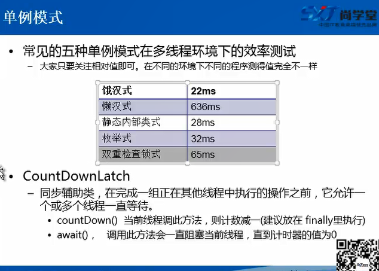

- ```java
  package com.zhangbin.cloud.controller.test.singleton;

  import java.util.concurrent.CountDownLatch;

  /**
   * 测试多线程环境下两种创建单例模式的效率
   * @author admin
   要加CountDownLatch，要不然main主线程还没有等其他线程执行完就停止了，所以要计算其他线程执行时间要加CountDownLatch
   *
   */
  public class TestSingletonSpeed {

  	public static void main(String[] args) throws Exception {
  		long start = System.currentTimeMillis();
  		int count = 10;
  		final CountDownLatch countDownLatch = new CountDownLatch(count);
  		for (int i = 0; i < count; i++) {
  			new Thread(new Runnable() {
  				
  				@Override
  				public void run() {
  					for (int i = 0; i < 100000; i++) {
  //						Object o = Singleton4.getInstance();//懒汉式：总耗时：1105
  						Object o = Singleton5.getInstance();//静态内部类：总耗时：15
  					}
  					countDownLatch.countDown();
  				}
  			}).start();
  		}
  		countDownLatch.await();//main线程阻塞，直到计数器变为0，才会继续往下执行
  		long end = System.currentTimeMillis();
  		System.out.println("总耗时："+(end - start));
  		
  	}

  }

  ```

#### 总结

- 如果是饿汉式，枚举形式最简单
- 如果是懒汉式，静态内部类形式最简单


#### 优缺点

- 优点
  - 在内存里只有一个实例，减少了内存的开销，尤其是频繁的创建和销毁实例
  - 避免对资源的多重占用（如果写文件操作）
- 缺点
  - 没有接口，不能继承，与单一职责原则冲突，一个类应该只关心内部逻辑，而不关心外面怎样来实例化

### 建造者模式

#### 优缺点

- 优点
  - 建造者独立，易扩展
  - 便于控制细节风险
- 缺点
  - 产品必须有共同点，范围有限制
  - 如内部变化复杂，会有很多的建造类

#### 使用场景 

- 需要生产的对象具有复杂的内部结构
- 需要生产的对象内部属性本身相互依赖

### 原型模式 

#### 优缺点

- 优点
  - 性能提高
  - 逃避构造函数的约束
- 缺点
  -  配备克隆方法需要对类的功能进行通盘考虑，这对于全新的类不是很难，但对于已有的类不一定很容易，特别当一个类引用不支持串行化的间接对象，或者引用含有循环结构的时候 
  -  必须实现 Cloneable 接口 

#### 使用场景

### 代理设计模式 （Proxy pattern）

- **核心作用**
  - 通过代理，控制对对象的访问
    - 可详细控制访问某个（某类）对象的方法，在调用这个方法前做前置处理，调用这个方法后做后置处理。（从而实现将统一流程代码放到代理类中处理）（即AOP的微观实现）
- AOP（面向切面编程）的核心实现机制
- 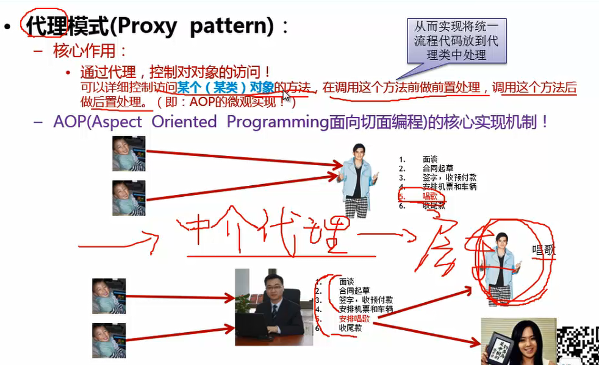
- **核心角色**
  - 抽象角色
    - 定义代理角色和真实角色的公共对外方法（二者共同实现的接口）
  - 真实角色
    - 实现抽象角色，定义真实角色所要实现的业务逻辑，供代理角色调用
    - **关注真正的业务逻辑**
  - 代理角色
    - 实现抽象角色，是真实角色的代理，通过真实角色的业务逻辑方法来实现抽象方法，并可附加自己的操作
    - **将统一的流程控制放到代理角色中处理**
- 应用场景
  - 安全代理：屏蔽对真实角色的直接访问
    - 拦截器
    - spring中AOP的实现
      - 日志拦截
      - 声明式事务处理
    - mybatis中实现拦截器插件
    - aspectj的实现
  - 远程代理：通过代理类处理远程方法调用（RMI）
    - 数据库连接池关闭处理
  - 延迟加载：先加载轻量级的代理对象，真正需要再加载真实对象
    - 比如，开发一个大文档查看软件，大文档中有大图片，可先显示压缩版图片，当性需要查看图片时，再用proxy来进行大图片的打开
    - hibernate中延时加载的实现

#### 静态代理（静态定义代理类）

- ```java
  package com.zhangbin.cloud.controller.test.thread;

  /**静态代理设计模式
   * @author admin
   *
   */
  public class StaticProxy {
  	
  	public static void main(String[] args) {
  		You you  = new You();
  		WeddingCompany con = new WeddingCompany(you);
  		con.marry();
  		He he  = new He();
  		WeddingCompany con1 = new WeddingCompany(he);
  		con1.marry();
   	}
  }

  /**
   * 抽象角色（二者角色共同实现的接口）
   * @author admin
   *
   */
  interface Marry{
  	
  	public abstract void marry();
  	
  }
  /**
   * 真实角色
   * @author admin
   *
   */
  class You  implements Marry{

  	@Override
  	public void marry() {
  		System.out.println("you and 嫦娥结婚了。。。。");
  	}
  }
  class He  implements Marry{
  	
  	@Override
  	public void marry() {
  		System.out.println("he and 嫦娥结婚了。。。。");
  	}
  }
  /**
   * 代理角色
   * @author admin
   *
   */
  class WeddingCompany implements Marry{
  	
  	private Marry you;
  	
  	public WeddingCompany() {
  		super();
  	}

  	public WeddingCompany(Marry you) {
  		this.you = you;
  	}

  	private void before() {
  		System.out.println("布置会场");
  	}
  	
  	private void after() {
  		System.out.println("收拾会场");
  	}
  	
  	@Override
  	public void marry() {
  		before();
  		you.marry();
  		after();
  	}
  	
  }
  ```

#### 动态代理 （动态生成代理类）

- 几种方式

  - **JDK 自带的动态代理**
    - java.lang.reflect.Proxy
      - 动态生成代理类和对象
    - java.lang.reflect.InvocationHandler（处理器接口）
      - 可通过invoke方法实现对真实角色的代理访问
      - 每次通过Proxy生成代理类对象对象时都要指定对应的处理器对象
  - Javaassist字节码操作库实现
  - CGHB
  - ASM（底层使用指令，可维护性较差）

- 优点

  - 抽象角色中（接口）声明的所以方法都被转移到调用处理器一个集中的方法中处理，这样，可更加灵活和统一的处理众多的方法

- ```java
  package com.zhangbin.cloud.controller.test.proxy;

  import java.lang.reflect.InvocationHandler;
  import java.lang.reflect.Method;
  import java.lang.reflect.Proxy;

  /**动态代理模式--》JDK 自带的动态代理
   * @author admin
   *
   */
  public class DynamicProxy implements InvocationHandler{
  	
  	private Marry you;
  	
  	
  	public DynamicProxy() {
  		super();
  	}

  	public DynamicProxy(Marry you) {
  		this.you = you;
  	}

  	@Override
  	public Object invoke(Object proxy, Method method, Object[] args) throws Throwable {
  		System.out.println("====布置会场====");
  		method.invoke(you, args);
  		System.out.println("====收拾会场====");
  		return null;
  	}
  	
  	public static void main(String[] args) {
  		You you = new You();
  		DynamicProxy p = new DynamicProxy(you);
  		
  		Marry proxy = (Marry) Proxy.newProxyInstance(ClassLoader.getSystemClassLoader(),new Class[] {Marry.class}, p);
  		proxy.marry();
  		
  		He he = new He();
  		DynamicProxy p2 = new DynamicProxy(he);
  		
  		Marry proxy2 = (Marry) Proxy.newProxyInstance(ClassLoader.getSystemClassLoader(),new Class[] {Marry.class}, p2);
  		proxy2.marry();
  	}
  }
  ```

- 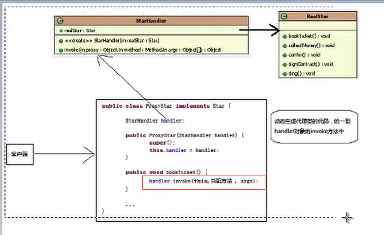

#### 优缺点 

- 优点
  - 职责清晰
  - 高扩展性
  - 智能化
- 缺点
  - 由于在客户端和真实主题之间增加了代理对象，因此有些类型的代理模式可能会造成请求的处理速度变慢
  - 实现代理模式需要额外的工作，有些代理模式的实现非常复杂

## 行为型模式

### 解释器模（不常用的设计模式）

### 访问者模式（不常用的设计模式）

## 结构型模式 

### 适配器模式 

- 将一个类的接口转换成客户希望的另外一个接口。Adapter模式使得原本由于接口不兼容而不能一起工作的那些类可以在一起工作。
- 模式中的角色：
  - 目标接口（Target）：客户所期待的接口/具体/抽象的类
  - 需要适配的类（Adapter）：需要适配的类或适配者类
  - 适配器（Adapter）：通过包装一个需要适配的对象，把原接口转换成目标接口。
- 应用场景：
  - 经常用来做旧系统改造和升级
  - InputStreamReader(InputStream);OutputStreamWriter(OutputStream)

### 桥接模式 

- 应用场景（多个变化维度）
  - 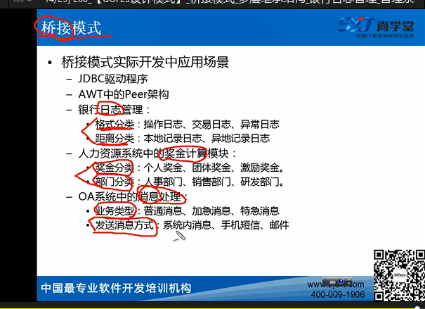
  - 


# 多线程 

## 程序 进程 线程 

- 程序
  - 指令集、静态概念

- 进程
  - 操作系统、调度程序、动态概念
  - 每个进程都是独立的，由3部分组成：CPU、data、code

- 线程

  - （轻量级进程）


  - 在进程内多条执行路径
  - 一个进程可拥有多个并行的线程
  - 一个进程中的线程共享相同的内存单元/内存地址空间
    - 可访问相同的变量和对象，而且它们从同一堆中分配对象
    - 通信、数据交换、同步操作
    - （main方法就是主线程）

## 线程的生命周期 

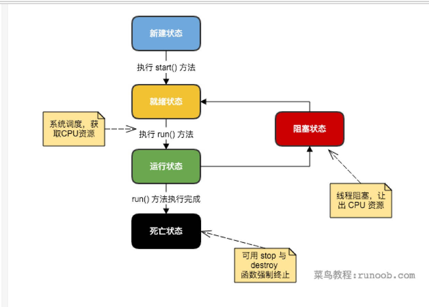


## 线程的创建和启动 

### 继承java.lang.Thread类，并重写run()方法

- 本质上也是实现了Runnable接口


- 线程启动：start()方法

  （线程启动不代表线程运行）

  - 新建的线程不会自动开始运行，必须通过父类的start()方法启动
  - 不能直接调用run()来启动线程，这样run()将作为一个普通方法立即执行，执行完毕前其他线程无法执行，所有必须通过start()方法，通过内部来执行run()方法

- ```java
  package com.zhangbin.cloud.controller.test.thread;

  /**
   * @author admin
   *继承Thread ，并重写run方法
   *启动：调用strat()方法
   */
  public class Thread1 extends Thread{

  	@Override
  	public void run() {//线程体
  		for (int i = 0; i < 10; i++) {
  			System.out.println(Thread.currentThread().getName()+"启动了，第"+i+"次");
  		}
  	}
  }
   class Thread2 extends Thread{

  	@Override
  	public void run() {
  		for (int i = 0; i < 10; i++) {
  			System.out.println(Thread.currentThread().getName()+"启动了，第"+i+"次");
  		}
  	}
  }
  ```

- ```java
  package com.zhangbin.cloud.controller.test.thread;

  public class TestThread1 {
  	
  	public static void main(String[] args) {
  		Thread1 t = new Thread1();
  		Thread2 t2 = new Thread2();
  //		t.run();
  		t.start();
  		t2.start();
  	} 
  }
  ```

- 继承Thread类方式的**缺点** 

  - java是单继承、多实现

### 实现java.lang.Runnable接口，并实现run()方法 

- 优点
  - 避免单继承的局限性
  - 便于共享资源
- 线程启动：使用静态代理
  - 创建真实角色
  - 创建代理角色Thread+真实角色引用
  - 代理角色调用start()启动线程


- ```java
  package com.zhangbin.cloud.controller.test.thread;

  public class Thread3 implements Runnable {

  	@Override
  	public void run() {
  		System.out.println("线程体");
  	}

  }
  ```

- ```java
  package com.zhangbin.cloud.controller.test.thread;

  /**
   * @author admin
   * 使用Runnable创建线程
   * 1、类实现Runnable接口 + 重写run() --》真实角色类
   * 2、启动多线程，使用静态代理
   * 1)创建真实角色
   * 2）创建代理角色+真实角色引用
   * 3）调用start()启动线程
   *
   */
  public class TestThread3 {

  	public static void main(String[] args) {
  		Thread3 t3 = new Thread3();//实例化线程任务类
  		Thread t = new Thread(t3);//创建线程对象，并将线程任务类作为构造方法参数传入
  		t.start();//启动线程
  	}

  }
  ```

### 实现Callable接口 

- 可以获取返回值，支持泛型的返回值

  - 借助Future接口来获取返回值

- 可以抛异常


   * ```java
        package com.zhangbin.cloud.controller.test.thread;

        import java.util.concurrent.Callable;
        import java.util.concurrent.ExecutorService;
        import java.util.concurrent.Executors;
        import java.util.concurrent.Future;
        ```


        /**实现Callable接口
         * @author admin
         *
         */
        public class Callable1 {
    
        	public static void main(String[] args) throws Exception, Exception {
        		//创建线程
        		ExecutorService ser = Executors.newFixedThreadPool(1);
        		Race tortoise = new Race();
        		//获取值
        		Future<Integer> result  = ser.submit(tortoise);
        		Integer num = result.get();
        		System.out.println(num);
        		ser.shutdown();
        	}
    
        }
        class Race implements Callable<Integer>{
    
        	@Override
        	public Integer call() throws Exception {
        		return 1000;
        	}
        	
        }
        ```

## 程的状态和方法 

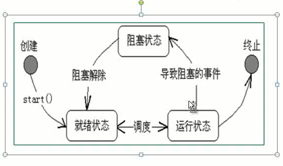

- 阻塞
  - join：合并线程
  - yield：暂停线程 static
  - sleep：休眠，不释放锁
    - 与时间相关：倒计时
    - 模拟网络延时

## 线程的基本信息和优先级

- isAlive()：判断线程是否还“活”着，即线程是否还未终止
- getPriority()：获得线程的优先级数值
- setPriority()：设置线程的优先级数值（代表了概率，不是绝对的优先级）
  - Thread.MIN_PRIORITY = 1;
  - NORM_PRIORITY = 5;
  - MAX_PRIORITY = 10;
- setName()：给线程一个名字
- getName()：取得线程的名字
- currentThread()：取得当前正在运行的线程对象，也就是取得自己本身
- void start()：调用run()方法启动线程，开始线程的执行
- void run()：存放线程体代码

## 线程的同步和死锁问题

- 同步：也称为并发，**多个线程访问同一份资源** ，等待资源访问结束，浪费时间，效率低，

  所以要确保资源安全--》加入同步，称为线程安全

  > 当多个线程访问某个类时，不管运行时环境采用**何种调度方式**或者这些进程将如何交替执行，并且在主调代码中**不需要任何额外的同步或协同**，这个类都能表现出**正确的行为**，那么就称为这个类是线程安全的

- 线程异步：访问资源时在空闲等待时同步访问其他资源，实现多线程机制

  - > 举个例子简单说明下两者的区别： 
    > 同步：火车站多个窗口卖火车票，假设A窗口当卖第288张时，在这个短暂的过程中，其他窗口都不能卖这张票，也不能继续往下卖，必须这张票处理完其他窗口才能继续卖票。直白点说就是当你看见程序里出现synchronized这个关键字，将任务锁起来，当某个线程进来时，不能让其他线程继续进来，那就代表是同步了。
    >
    > 异步：当我们用手机下载某个视频时，我们大多数人都不会一直等着这个视频下载完，而是在下载的过程看看手机里的其他东西，比如用qq或者是微信聊聊天，这种的就是异步，你执行你的，我执行我的，互不干扰。比如上面卖火车票，如果多个窗口之间互不影响，我行我素，A窗口卖到第288张了，B窗口不管A窗口，自己也卖第288张票，那显然会出错了。


### 线程安全性 

- 线程安全性体现方面

  - 原子性

    - 提供了互斥访问，同一时刻只能有一个线程来对它进行操作

    - Atomic包

      - 竞争激烈时能维持常态，比lock性能好；缺点：只能同步一个值
      - AtomicXXX：CAS、unsafe、compareAndSwapInt

#### Atomic原子类 

##### 基本类型 

- AtomicInteger：整型原子类
  - 线程安全原理：主要利用CAS（compare and swap）+volatile和native方法来保证原子操作，从而避免synchronized的高开销，执行效率大为提升
  - （CAS的原理是拿期望的值和原本的一个值作比较，如果相同则更新成新的值。unsafe类的objectFiledOffet()方法是一个本地方法，这个方法是拿到“原来的值”的内存地址，返回值是valueOffset。另外value是一个volatile变量，在内存中可见，因此jvm可保证任何时刻任何线程总能拿到该变量的最新值）
- AtomicLong：长整型原子类
- AtomicBoolean：布尔型原子类

##### 数组类型

- AtomicIntegerArray：整型数组原子类
- AtomicLongArray：长整型组原子类
- AtomicReferenceArray：引用类型数组原子类

##### 引用类型

- AtomicReference：引用类型原子类
- AtomicStampedRerference：原子更新引用类型里的字段原子类
- AtomicMarkableRerference：原子更新带有标记位的引用类型

##### 对象的属性修改类型

- AtomicIntegerFieldUpdater：原子更新整型字段的更新器
- AtomicLongFieldUpdater：原子更新长整型字段的更新器
- AtomicStampedeReference：原子更新带有版本号的引用类型（可用于解决原子的更新数据和数据的版本号，可以解决使用CAS进行原子更新时可能出现的ABA问题）


#### 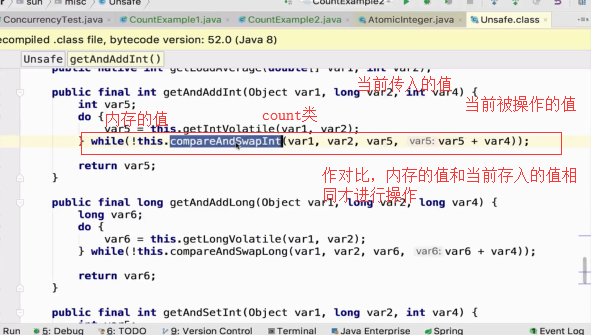


```java
package com.zhangbin.cloud.controller.test.thread;

    import java.util.concurrent.CountDownLatch;
    import java.util.concurrent.ExecutorService;
    import java.util.concurrent.Executors;
    import java.util.concurrent.Semaphore;
    import java.util.concurrent.atomic.AtomicInteger;

    import lombok.extern.slf4j.Slf4j;

    /**代码来模拟并发请求
     * @author Administrator
     * 线程安全
     * AomicInteger
     */
    @Slf4j
    public class ConcurrencyTest2 {
    	//请求总数
    	public static int clientTotal = 5000;
    	//同时并发执行的线程数
    	public static int threadTotal = 200;
    	//AtomicInteger
    	public static AtomicInteger count = new AtomicInteger(0);
      public static void main(String[] args) {
        ExecutorService executorService = Executors.newCachedThreadPool();
    		//信号量
    		Semaphore semaphore = new Semaphore(threadTotal);
    		//计数器必锁
    		CountDownLatch countDownLatch = new CountDownLatch(clientTotal);
    		for (int i = 0; i < clientTotal; i++) {
    			executorService.execute(()->{
    				try {
    					semaphore.acquire();
    					add();
    					semaphore.release();
    				} catch (InterruptedException e) {
    					e.printStackTrace();
    					log.error("exception",e);
    				}
    				countDownLatch.countDown();
    			});
    		}
    		try {
    			countDownLatch.await();
    			executorService.shutdown();
    			log.info("count:{}",count);
    		} catch (InterruptedException e) {
    			e.printStackTrace();
    		}
    		/**
    		 * count:5000
    		 * count:4999
    		 */
    	}
    	
    	public static void add() {
    		count.incrementAndGet();
    	}

    }
```

​    

 - LongAdder ：推荐，但缺点是，在统计时，并发更新，会导致统计数据有误差

  - AtomicReference ， 

  - ```java
    package com.zhangbin.cloud.controller.test.thread;

    import java.util.concurrent.atomic.AtomicReference;

    import lombok.extern.slf4j.Slf4j;
    @Slf4j
    public class TestAtomicReference {
    	
    	private static AtomicReference<Integer> count = new AtomicReference<Integer>(0);
    	
    	public static void main(String[] args) {
    		
    		count.compareAndSet(0, 2);
    		count.compareAndSet(0, 1);
    		count.compareAndSet(1, 3);
    		count.compareAndSet(2, 4);
    		count.compareAndSet(3, 5);
    		log.info("count:{}",count.get());
    		/**
    		 * count:4
    		 */
    	}

    }
    ```

  - ```java
    package com.zhangbin.cloud.controller.test.thread;

    import java.util.concurrent.atomic.AtomicIntegerFieldUpdater;

    import lombok.Getter;
    import lombok.extern.slf4j.Slf4j;

    @Slf4j
    public class TestAtomicIntegerFieldUpdater {
    	
    	private static AtomicIntegerFieldUpdater<TestAtomicIntegerFieldUpdater> updater = AtomicIntegerFieldUpdater.newUpdater(TestAtomicIntegerFieldUpdater.class, "count");
    	
    	@Getter
    	public volatile int count = 100;
    	
    	public static void main(String[] args) {
    		TestAtomicIntegerFieldUpdater t = new TestAtomicIntegerFieldUpdater();
    		
    		if(updater.compareAndSet(t, 100, 120)) {
    			log.info("update success 1,{}",t.getCount());
    		}
    		
    		if(updater.compareAndSet(t, 100, 120)) {
    			log.info("update success 2,{}",t.getCount());
    		}else {
    			log.info("update failed");
    		}
    		/**
    		 * update success 1,120
    		 * update failed
    		 */
    	}

    }

    ```

  - AtomicStampReference：CAS的ABA问题

    - 

  - ```java
    package com.zhangbin.cloud.controller.test.thread;

    import java.util.concurrent.CountDownLatch;
    import java.util.concurrent.ExecutorService;
    import java.util.concurrent.Executors;
    import java.util.concurrent.Semaphore;
    import java.util.concurrent.atomic.AtomicBoolean;

    import lombok.extern.slf4j.Slf4j;

    /**代码来模拟并发请求
     * @author Administrator
     * 线程安全
     */
    @Slf4j
    public class TestAtomicBoolean {
    	//请求总数
    	public static int clientTotal = 5000;
    	//同时并发执行的线程数
    	public static int threadTotal = 200;
    	
    	public static AtomicBoolean isHappened = new AtomicBoolean(false);	
      public static void main(String[] args) {
        ExecutorService executorService = Executors.newCachedThreadPool();
        		//信号量
        		Semaphore semaphore = new Semaphore(threadTotal);
        		//计数器必锁
        		CountDownLatch countDownLatch = new CountDownLatch(clientTotal);
        		for (int i = 0; i < clientTotal; i++) {
        			executorService.execute(()->{
        				try {
        					semaphore.acquire();
        					test();
        					semaphore.release();
        				} catch (InterruptedException e) {
        					e.printStackTrace();
        					log.error("exception",e);
        				}
        				countDownLatch.countDown();
        			});
        		}
        		try {
        			countDownLatch.await();
        			executorService.shutdown();
        			log.info("isHappened:{}",isHappened.get());
        		} catch (InterruptedException e) {
        			e.printStackTrace();
        		}
        		/**
        		 *  execue
         		*	isHappened:true
        		 */
        	}
        	
        	public static void test() {
        		if(isHappened.compareAndSet(false, true)) {
        			log.info("execue");
        		}
        	}

        }
    ```


  - 可见性

    - 一个线程对主内存的修改可以及时的被其它线程观察到

    - 导致共享变量在线程间不可见的原因

      - 线程交叉执行
      - 重排序结合线程交叉执行
      - 共享变量更新后的值没有在工作内存与主存间及时更新

    - volatile

      - （不具有原子性，保证不了线程安全，不适合计数类场景）
      - 适合场景：
        - 对变量的写操作不依赖当前值

        - 该变量没有包含在具有其他变量的不必的例子中

        - （适用于状态标识中）

        - 通过加入内存屏障和禁止重排序优化来实现

          - 对volatile变量写操作时，会在写操作后加入一条store屏障命令，将本地内存中的共享变量刷新到主内存
          - 对volatile变量读操作时，会在读操作前加入一条load屏障指令，从主内存中读取共享变量


            - volatile 、synchronized、


  - 有序性

    - java内存模型中，允许编译器和处理器对指令进行重排序，但是重排序过程不会影响到单线程程序的执行，却会影响到多线程并发执行的正确性
      - 一个线程观察其它线程中的指令执行顺序，由于指令重排序的存在，该观察结果一般杂乱无序
      - volatile 、synchronized、 lock
      - happens -before原则：8个

### 同步方法 

#### synchronized与reentrantLock 

- 原子性--》锁

  - synchronize：依赖jvm

    - 不可中断锁，适合竞争不激烈，可读性好

    - > - StringBuffer：线程安全
      > - StringBuild：线程不安全


  - lock：依赖特殊的CPU指令，代码实现，ReentrantLock

    - 可中断锁，多样化同步，竞争激烈时维持常态

- 同步块

  - synchronized同步块的实现原理：使用的是monitorenter和monitorexit指令，其中monitorenter指令指向同步代码块的开始位置，monitorexit指令指明同步代码块的结束位置

  - ```java
    synchronized(引用类型|this(对象本身)|类.class){
      
    }
    ```


  - 同步方法

    - synchronized修饰方法的实现原理：是ACC_SYNCHRONIZED标识，该标识指明了该方法是一个同步方法，jvm通过该ACC_SYNCHRONIZED访问标志来辨别一个方法是否声明为同步方法，从而执行相应的同步调用

    - ```java
      package com.zhangbin.cloud.controller.test.thread;

      public class TestSynch {

      	public static void main(String[] args) {
      		Web12306 web = new Web12306(20);
      		Thread t1 = new Thread(web, "黄牛1");
      		Thread t2 = new Thread(web, "黄牛2");
      		Thread t3 = new Thread(web, "黄牛3");
      		t1.start();
      		t2.start();
      		t3.start();
      	}

      }
      class Web12306 implements Runnable{
      	
      	private int num;
      	private boolean flag = true;
      	
      	public Web12306() {
      	}

      	public Web12306(int num) {
      		this.num = num;
      	}
      	@Override
      	public void run() {
      		while(flag) {
      			test2();
      //			test1();
      		}
      	}
        /**
      	 *同步块： 线程安全
      	 */
      	private void test3() {
      		synchronized (this) {
      			if(num <=0) {
      				flag = false;
      				return;
      			}
      			try {
      				Thread.sleep(200);
      			} catch (InterruptedException e) {
      				e.printStackTrace();
      			}
      			System.out.println(Thread.currentThread().getName()+"抢到了"+num--);
      		}
      	}
       	/**
      	 * 同步方法：线程安全
      	 */
      	private  synchronized void test2() {
      			if(num <=0) {
      				flag = false;
      				return;
      			}
      			try {
      				Thread.sleep(200);
      			} catch (InterruptedException e) {
      				e.printStackTrace();
      			}
      			System.out.println(Thread.currentThread().getName()+"抢到了"+num--);
      	}
      	/**
      	 * 线程不安全
      	 */
      	private void test1() {
      			if(num <=0) {
      				flag = false;
      				return;
      			}
      			try {
      				Thread.sleep(200);
      			} catch (InterruptedException e) {
      				e.printStackTrace();
      			}
      			System.out.println(Thread.currentThread().getName()+"抢到了"+num--);
            /**
      				黄牛2抢到了2
      				黄牛3抢到了2
      				黄牛1抢到了2
      				黄牛3抢到了1
      				黄牛2抢到了0
      				黄牛1抢到了1
      			 */
      	}
        /**
      	 *锁定范围不正确：线程不安全
      	 */
      	private void test4() {
      		//a b c
      		synchronized (this) {
      			//b
      			if(num <=0) {
      				flag = false;
      				return;
      			}
      		}
      		//a
      		try {
      			Thread.sleep(200);
      		} catch (InterruptedException e) {
      			e.printStackTrace();
      		}
      		System.out.println(Thread.currentThread().getName()+"抢到了"+num--);
      	}
        
        	/**
      	 * 锁定资源不正确：线程不安全
      	 */
      	private void test5() {
      		
      		synchronized ((Integer) num) {
      			// 未锁定flag
      			if (num <= 0) {
      				flag = false;
      				return;
      			}
      			try {
      				Thread.sleep(200);
      			} catch (InterruptedException e) {
      				e.printStackTrace();
      			}
      			System.out.println(Thread.currentThread().getName() + "抢到了" + num--);
      		}
      	}
      	
      }
      ```

  - 同步的难点:

    - 锁定范围不正确
    - 锁定资源不正确

  - 使用特殊域变量（volatile）实现线程同步

    - **（经测试好像不能完全达到线程同步问题）**

    - volatile关键字为域变量的访问提供了一种免锁机制

    - 使用volatile修饰域相当于告诉虚拟机该域可能会被其它线程更新

    - 因此每次使用该域就要重新计算而不是使用寄存器中的值

    - ```java
      private volatile int num;
      ```

  - 使用重入锁实现线程同步lock锁

    - （可重入锁：自己可再次获取自己的内部锁。比如一个线程获得了某个对象的锁，此时这个对象锁还没有释放，当其再次想要获取这个对象的锁的时候还是可以获取的，如果不可锁重入的话，就会造成死锁。同一个线程每次获取锁，锁的计数器都自增1，所以要等到锁的计数器下降为0时才能释放锁）

    - Lock和synchronized的区别

      - Lock是显式锁（手动开启和关闭锁，别忘记关闭锁），synchronized是隐式锁
      - Lock只有代码块锁，synchronized有代码块锁和方法锁
      - 使用lock锁，jvm将花费较少的时间来调度线程，性能更好。并且具有更好的扩展性
      - synchronized依赖于jvm实现的，reenTrantLock 依赖于jdk
      - reentrantLock增加了一些高级功能，等待可中断（正在等待的线程可以选择放弃等待，改为处理其它事情）；可实现公平锁（所谓的公平锁就是先等待的线程先获得锁），而synchronized只能是非公平锁；可实现选择性通知（线程对象可以注册在指定的condition中，从而可以有选择性的进行线程通知，在调度线程上更加灵活。在使用notify/notifyAll()方法进行通知时，被通知的线程是由jvm选择的，用reentrantLock类结合condition实例可实现“选择性通知”）

    - 优先使用顺序：

      - lock-->同步代码块-->同步方法

    - ```java
      package com.zhangbin.cloud.controller.test.thread;
      
      import java.util.concurrent.locks.Lock;
      import java.util.concurrent.locks.ReentrantLock;
      
      public class TestVolatile {
      
      	public static void main(String[] args) {
      		VolatileThread volatileThread = new VolatileThread(20);
      		Thread t1 = new Thread(volatileThread, "黄牛1");
      		Thread t2 = new Thread(volatileThread, "黄牛2");
      		Thread t3 = new Thread(volatileThread, "黄牛3");
      		Thread t4 = new Thread(volatileThread, "黄牛4");
      		t1.start();
      		t2.start();
      		t3.start();
      		t4.start();
      	}
      
      }
      
      class VolatileThread implements Runnable{
      	
      	private int num;
      //	private volatile int num;
      	
      	private boolean flag = true;
      	
      	private Lock lock = new ReentrantLock();
      	
      	public VolatileThread() {
      	}
      
      	public VolatileThread(int num) {
      		this.num = num;
      	}
      
      	@Override
      	public  void run() { //线程体
      		while(flag) {
      			processFlow2();
      //			processFlow();
      		}
      	}
      	/**
      	 * 线程安全
      	 */
      	private void processFlow2() {
      		lock.lock();
      		try {
      			if(!flag) {
      				return;
      			}
      			if(num > 0) {
      				try {
      					Thread.sleep(500);
      				} catch (InterruptedException e) {
      					e.printStackTrace();
      				}
      				System.out.println(Thread.currentThread().getName()+"抢到了"+num--);
      			}else {
      				flag = false;
      			}
      		} finally {
      			lock.unlock();
      		}
      	}
      	
      }
      ```

    - 

  - 

- 死锁

  - 过多的同步容易造成死锁

    - dang

    - ```java
      //例子
      package com.zhangbin.cloud.controller.test.thread;

      /**
       * 过多的同步容易造成死锁
       * （多个线程，t1 和 t2使用的是同样的资源，goods 和 money）
       * @author admin
       *
       */
      public class TestSynch2 {

      	public static void main(String[] args) {
      		Object goods = new Object();
      		Object money = new Object();
      		Test t1 = new Test(goods,money);
      		Test2 t2 = new Test2(goods,money);
      		Thread th1 = new Thread(t1);
      		Thread th2 = new Thread(t2);
      		th1.start();
      		th2.start();
      	}

      }

      class Test implements Runnable {

      	Object goods;
      	Object money;

      	public Test() {
      	}

      	public Test(Object goods, Object money) {
      		super();
      		this.goods = goods;
      		this.money = money;
      	}

      	@Override
      	public void run() {
      		while (true) {
      			test();
      		}
      //		test();
      	}

      	private void test() {
      		synchronized (goods) {
      			try {
      				Thread.sleep(100);
      			} catch (InterruptedException e) {
      				e.printStackTrace();
      			}

      			synchronized (money) {

      			}
      		}
      		System.out.println("一手给钱");
      	}

      }
      class Test2 implements Runnable {
      	
      	Object goods;
      	Object money;
      	
      	public Test2() {
      	}
      	
      	public Test2(Object goods, Object money) {
      		super();
      		this.goods = goods;
      		this.money = money;
      	}
      	
      	@Override
      	public void run() {
      		while (true) {
      			test2();
      		}
      //		test2();
      	}
      	
      	private void test2() {
      		synchronized (money) {
      			try {
      				Thread.sleep(500);
      			} catch (InterruptedException e) {
      				e.printStackTrace();
      			}
      			
      			synchronized (goods) {
      				
      			}
      		}
      		System.out.println("一手给货");
      	}
      	
      }
      ```


### 生产者消费者模式（死锁的解决办法）（线程间通信）

> 让生产者在缓冲区满时休眠，等到下次消费者消耗缓冲区中的数据的时候，生产者才能被唤醒，开始往缓冲区添加数据。同样，也可以让消费者在缓冲区空时进入休眠，等到生产者往缓冲区添加数据之后，再唤醒消费者。

> wait：等待
>
> notify：唤醒

- 信号灯法

  - 

      *信号灯
      	 *flag=true 生成生产，消费者等待，生产完成后通知消费
      	 *flag=flase 消费者消费，生产者等待，消费完成后通知生成
      	 *wait()：等待，释放锁，sleep ：不释放锁
      	 *notify()/notifyAll()：唤醒
      	 *与synchronized一起使用


  - ```java
    package com.zhangbin.cloud.controller.test.thread;

    /**
     * 测试死锁的解决方法之 信号灯法
     * @author admin
     *
     */
    public class TestSingleLamp {

    	public static void main(String[] args) {
    		//多线程对同一个资源的访问
    		Movie m = new Movie();
    		Player p = new Player(m);
    		Watcher w = new Watcher(m);
    		
    		Thread t1 = new Thread(p);
    		Thread t2 = new Thread(w);
    		t1.start();
    		t2.start();	
          /**
            生产了左青龙
            消费了左青龙
            生产了哟白虎
            消费了哟白虎
          */
    	}
    }

    ```

  - ```java
    package com.zhangbin.cloud.controller.test.thread;

    /**共同的资源
     * @author admin
     *死锁的解决办法：
     *生产者消费者模式--》信号灯法
     *
     */
    public class Movie {
    	
    	private String p;
    	/**
    	 *信号灯
    	 *flag=true 生成生产，消费者等待，生产完成后通知消费
    	 *flag=flase 消费者消费，生产者等待，消费完成后通知生成
    	 *wait()：等待，释放锁，sleep ：不释放锁
    	 *notify()/notifyAll()：唤醒
    	 *与synchronized一起使用
    	 */
    	private boolean flag = true;
    	
    	
    	//播放
    	public synchronized void play(String p) {
    		if(!flag) {//生产者等待
    			try {
    				this.wait();
    			} catch (InterruptedException e) {
    				e.printStackTrace();
    			}
    		}
    		//开始生产
    		try {
    			Thread.sleep(500);
    		} catch (InterruptedException e) {
    			e.printStackTrace();
    		}
    		//生成完成，
    		System.out.println("生产了"+p);
    		this.p = p;
    		//通知消费者
    		this.notify();
    		//停止生产
    		this.flag = false;
    	}
    	//查看
    	public synchronized void watch() {
    		if(flag) {//消费者等待
    			try {
    				this.wait();
    			} catch (InterruptedException e) {
    				e.printStackTrace();
    			}
    		}
    		//开始消费
    		try {
    			Thread.sleep(500);
    		} catch (InterruptedException e) {
    			e.printStackTrace();
    		}
    		//消费完成
    		System.out.println("消费了"+p);
    		//通知生产
    		this.notifyAll();
    		//消费停止
    		this.flag = true;
    	}
    }

    ```

  - ```java
    package com.zhangbin.cloud.controller.test.thread;

    /**生产者
     * @author admin
     *
     */
    public class Player implements Runnable {
    	private Movie movie;
    	
    	public Player() {
    	}

    	public Player(Movie movie) {
    		super();
    		this.movie = movie;
    	}
      @Override
    	public void run() {
    		for (int i = 0; i < 20; i++) {
    			if(i % 2 == 0) {
    				movie.play("左青龙");
    			}else {
    				movie.play("哟白虎");
    			}
    		}
    	}

    }

    ```


  - ```java
    package com.zhangbin.cloud.controller.test.thread;

    /**消费者
     * @author admin
     *
     */
    public class Watcher implements Runnable {
    	
    	private Movie movie;
    	
    	public Watcher() {
    	}

    	public Watcher(Movie movie) {
    		this.movie = movie;
    	}

    	@Override
    	public void run() {
    		for (int i = 0; i < 20; i++) {
    			movie.watch();
    		}
    	}

    }

    ```

- 管程

### 并发

- **并发**：多个线程操作相同资源，保证线程安全，合理使用资源

  - 同时拥有两个或者多个线程，如果程序在单核处理器上运行，多个线程将交替地换入或者换出内存，这些线程是同时“存在”的，每个线程都处于执行过程中的某个状态，如果运行在多核处理器上，此时，程序中的每个线程都将分配到一个处理器核上，因此，可以同时运行

- **高并发**：服务器能同时处理很多请求，提高程序性能

  - 通过设计保证系统能够同时并行处理很多请求

  - > 高并发导致降低体验度、请求时间变长、宕机、ORM异常、
    >
    > 高并发优化：
    >
    > 硬件、网络、系统架构、开发语言选取、数据结构的运用、数据库优化、算法优化、

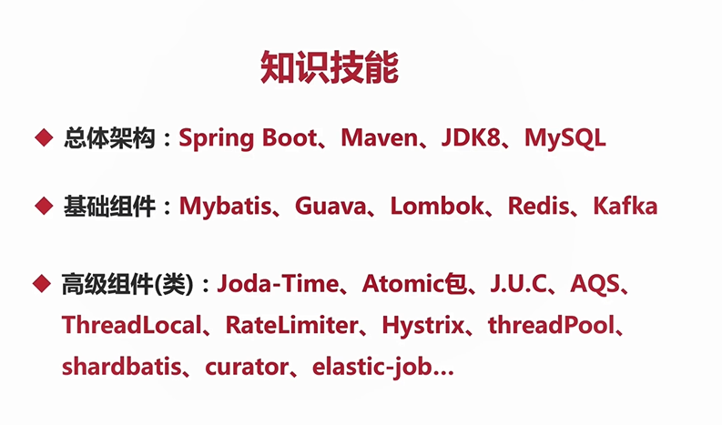

#### cpu 多级缓存 

- 为什么需要CPU cache：CPU的频率太快了，快到主存跟不上，这样在处理器时钟周期内，CPU常常需要等待主存，浪费资源。所以cache的出现，是为了缓解CPU和内存之间速度的不匹配问题（结构：cpu-->cache-->memory）
- cpu cache 意义：
  - 时间局部性：如果某个数据被访问，那么在不久的将来它很可能被再次访问
  - 空间局部性：如果某个数据被访问，那么与它相邻的数据很快也可能被访问


- 缓存一致性（MESI）
  - 用于保证多个CPU cache之间缓存共享数据的一致
- 乱序执行优化
  - 处理器为提高运算速度而做出违背代码原有顺序的优化
- java内存模型（JMM ）
  - 是一种规范，java虚拟机与计算机内存是如何协同工作的，规定了线程如何和何时看到其他线程修改过的变量。
- 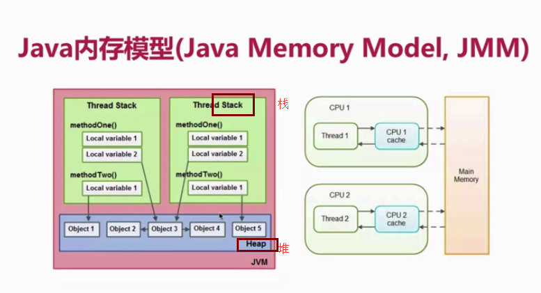
- 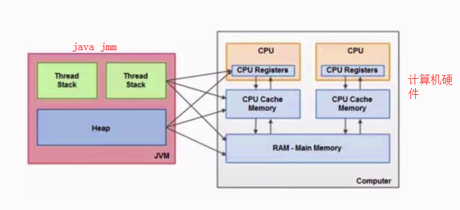
  - 栈（stack）：栈的数据可以共享的，（存放基本类型的变量）
  - 堆（heap）：运行时的数据区，由垃圾回收来负责的，动态分配内存大小


#### java 同步的8种操作

- lock（锁定）
- unlock（解锁）
- read（读取）
- load（载入）
- use（使用）
- assign（赋值）
- store（存储）
- write（写入）
- 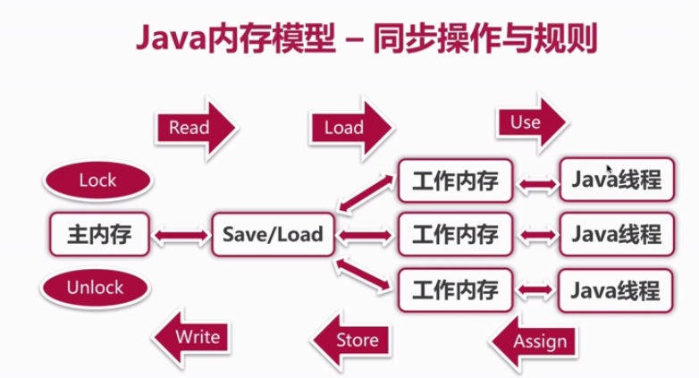

##### 通过代码来模拟并发 

```java
package com.zhangbin.cloud.controller.test.thread;

import java.util.concurrent.CountDownLatch;
import java.util.concurrent.ExecutorService;
import java.util.concurrent.Executors;
import java.util.concurrent.Semaphore;

import lombok.extern.slf4j.Slf4j;

/**代码来模拟并发请求
 * @author Administrator
 * 线程不安全
 */
@Slf4j
public class ConcurrencyTest {
	//请求总数
	public static int clientTotal = 5000;
	//同时并发执行的线程数
	public static int threadTotal = 200;
	
	public static int count = 0;
	

	public static void main(String[] args) {
		
		ExecutorService executorService = Executors.newCachedThreadPool();
		//信号量
		Semaphore semaphore = new Semaphore(threadTotal);
		//计数器必锁
		CountDownLatch countDownLatch = new CountDownLatch(clientTotal);
		for (int i = 0; i < clientTotal; i++) {
			executorService.execute(()->{
				try {
					semaphore.acquire();
					add();
					semaphore.release();
				} catch (InterruptedException e) {
					e.printStackTrace();
					log.error("exception",e);
				}
				countDownLatch.countDown();
			});
		}
		try {
			countDownLatch.await();
			executorService.shutdown();
			log.info("count:{}",count);
		} catch (InterruptedException e) {
			e.printStackTrace();
		}
	}
	
	public static void add() {
		count++;
	}

}

```


#### 并发的线程安全处理 


##### 安全发布对象 

- 发布对象：使一个对象能够被当前范围之外的代码所使用
- 对象逸出：一种错误的发布。当一个对象还没有构造完成时，就使它被其它线程所见
- 四种方法：
  - 在静态初始化函数中初始化一个对象引用
    - 单例模式
  - 将对象的引用保存到volatile类型域或者AtomicReference对象中
    - volatile+双重检测锁保证线程安全，禁止重排序
  - 将对象的引用保存到某个正确构造对象的final类型域中
    - 
  - 将对象的引用保存到一个由锁保护的域中
    - synchronized

##### 不可变对象 

- 需要满足的条件
  - 对象创建以后其状态就不能修改
  - 对象所有域都是final类型
  - 对象是正确创建的（在对象创建期间，this引用没有逸出）
- final关键字：类、方法、变量
  - 修饰类：不能被继承
  - 修饰方法：
    - 锁定方法不被继承类修改
    - 效率
  - 修饰变量：
    - 基本数据类型变量
    - 引用类型变量
    - （final Map：线程不安全）
- Collection.unmodifiableXXX：Collection、List、Set、Map（线程安全）
- Guava：ImmutableXXX：Collection、List、Set、Map（线程安全）

##### ThreadLocal线程封闭 

- Ad-hoc线程封闭：程序控制实现，最糟糕，忽略
- 堆栈封闭：局部变量，无并发问题
- ThreadLocal线程封闭：特别好的封闭方法

##### 线程不安全类与写法 

- StringBuilder（线程不安全）-->StringBuffer（线程安全）
- SimpleDateFormat（线程不安全）（可设置为局部变量就能达到线程安全） -->JodaTime-->jdk的DateTimeFormatter
- ArrayList（线程不安全），HashSet（线程不安全），HashMap（线程不安全）等Collections

##### 线程安全---同步容器 

- ArrayList-->Vector，Stack
  - （也会存在线程不安全的情况，例如：多个线程同时增加或删除操作时就会报错）
- HashMap-->HashTable（key、value不能为null）
- Collection.synchronizedXXX（List、Set、Map）

##### 并发容器J.U.C及安全共享策略 

- ArrayList-->CopyOnWriteArrayList
  - 读多写少的场景
- HashSet、TreeSet-->CopyOnWriteArraySet、ConcurrentSkipListSet
- HashMap、TreeMap-->ConcurrentHashMap、ConcurrentSkipListMap
- 安全共享对象策略
  - 线程限制：一个被线程限制的对象，由线程独占，并且只能被占有它的线程修改
  - 共享只读：一个共享只读的对象，在没有额外同步的情况下，可以被多个线程并发访问，但是任何线程都不能修改它
  - 线程安全对象：一个线程安全的对象或者容器，在内部通过同步机制来保证线程安全，所以其他线程无需额外的同步就可以通过公共接口随意访问它
  - 被守护对象：被守护对象只能通过获取特定的锁来访问

##### AQS（abstractQueuedSynchronizer） 

- 使用：
  - 使用node实现FIFO队列，可以用于构建锁或其他同步装置的基础框架
  - 利用了一个int类型表示状态
  - 使用方法是继承
  - 子类通过继承并通过实现它的方法管理其状态（acquire和release）的方法操纵状态
  - 可以同时实现排它锁和共享锁模式（独占、共享）
- AQS同步组件
  - CountDownLatch
    - 计数器必锁
  - Semaphore
    - 信号量
    - （控制并发访问的线程个数）
    - semaphore.tryAcquire()
  - CyclicBarrier
    - 各个线程相互等待，等所有就绪后再执行
    - cyclicBarrier.await()
  - ReentrantLock
    - 和synchronized区别
      - 可重入锁
      - 锁的实现（jdk实现的）
      - 性能的区别
      - 功能区别
    - 可指定是公平锁（先等待先获得锁）or非公平锁（synchronized是非公平锁）
    - 提供了一个condition类，可以分组唤醒需要唤醒的线程
    - 提供能中断等待锁的线程机制，lock.lockInterruptibly()
  - Condition
  - FutureTask
    - 实现Runnable接口和Future接口

#### 高并发处理的思路及手段 

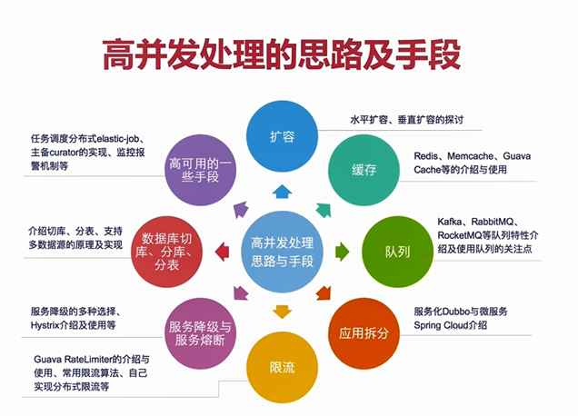


## 任务调度 

- Timer 定时器类

- TimeTask任务类

  - ```java
    package com.zhangbin.cloud.controller.test.thread;

    import java.util.Date;
    import java.util.Timer;
    import java.util.TimerTask;

    public class TestTimer {

    	public static void main(String[] args) {
    		Timer timer = new Timer();
    		timer.scheduleAtFixedRate(new TimerTask() {
    			
    			@Override
    			public void run() {
    				System.out.println("test so easy");
    			}
    		}, new Date(System.currentTimeMillis()+1000), 200);
    		
    	}

    }

    ```

## 线程组与线程池 

### 线程池

> 问题：创建和销毁对象是非常耗费时间的
>
> - 创建对象：需要分配内存等资源
> - 销毁对象：虽然不需要程序员操心，但是垃圾回收器会在后台一直跟踪并销毁
> - 所以对于经常创建和销毁、使用量特别大的资源，比如并发情况下的线程，对性能影响很大

- 思路：创建好多个线程，放入线程池中，使用时直接获取引用，不使用时放回池中。可以避免频繁创建销毁，实现重复利用

- 优点：

  - 提高响应速度（减少了创建新线程的时间）
  - 降低资源消耗（重复利用线程池中线程，不需要每次都创建）
  - 提高线程的可管理性：避免线程无限制创建、从而消耗系统资源，降低系统稳定性，甚至内存溢出或者CPU耗尽

- 线程池的应用场合

  - 需要大量线程，并且完成任务的时间端
  - 对性能要求苛刻
  - 接受突发性的大量请求

- ```java
  package com.zhangbin.cloud.controller.test.thread;

  import java.util.concurrent.ExecutorService;
  import java.util.concurrent.Executors;

  public class SellTickets {

  	static int tickets =10;
  	
  	public static void main(String[] args) {
  		ExecutorService service = Executors.newFixedThreadPool(6);
  		while(tickets >0) {
  			/*service.execute(()->{
  				if(tickets >0) {
  					System.out.println(Thread.currentThread().getName()+"卖出了第"+(tickets--)+"张票");
  					try {
  						Thread.sleep(500);
  					} catch (InterruptedException e) {
  						e.printStackTrace();
  					}
  				}
  			});*/
  			service.execute(new Runnable() {
  				
  				@Override
  				public void run() {
  					if(tickets >0) {
  						System.out.println(Thread.currentThread().getName()+"卖出了第"+(tickets--)+"张票");
  						try {
  							Thread.sleep(500);
  						} catch (InterruptedException e) {
  							e.printStackTrace();
  						}
  					}
  				}
  			});
  		}
  		//关闭线程池
  		service.shutdown();
  	}

  }
  /**
  pool-1-thread-2卖出了第9张票
  pool-1-thread-1卖出了第10张票
  pool-1-thread-4卖出了第8张票
  pool-1-thread-3卖出了第7张票
  pool-1-thread-6卖出了第5张票
  pool-1-thread-5卖出了第6张票
  pool-1-thread-6卖出了第4张票
  pool-1-thread-5卖出了第3张票
  pool-1-thread-3卖出了第2张票
  pool-1-thread-4卖出了第1张票
  */
  ```

  - 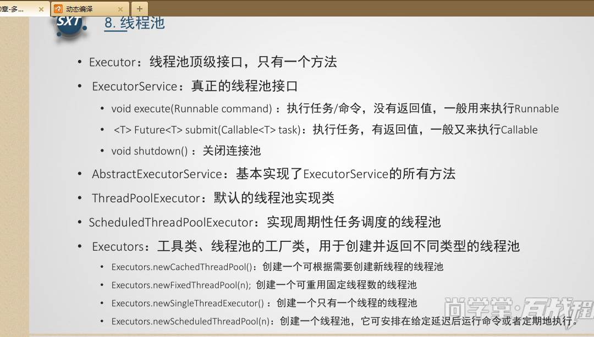
  - 
  - 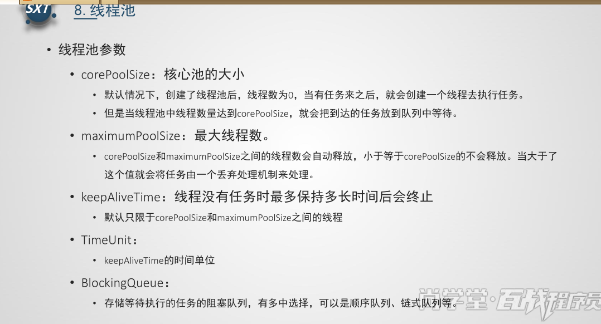
  - 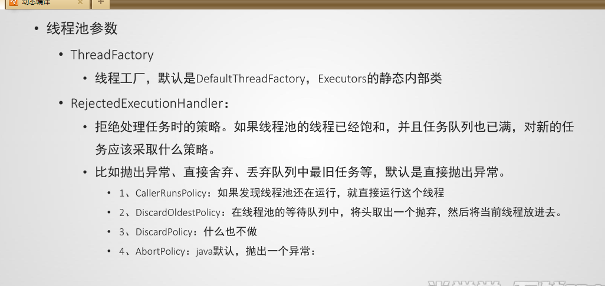

#### 线程池作用 

- 限制系统中执行线程的数量（因为创建和销毁对象是非常销毁时间的）
  - 根据系统的环境情况，可以自动或手动设置线程数量，达到运行的最佳效果；少了浪费了系统资源，多了会造成系统拥挤效率不高，用线程池控制线程数量，其他线程排队等候。一个任务执行完毕，再从队列的中取最前面的任务开始执行。若队列中没有等到进程，线程池的这一资源处于等待。当一个新任务需要运行时，如果线程池中有等待的工作线程，就可以开始运行了，否则进入等待队列。

#### 四种线程池newCachedThreadPool、newFixedThreadPool、newScheduledThreadPool、newSingleThreadExecutor 

- https://www.cnblogs.com/baizhanshi/p/5469948.html

##### newCachedThreadPool 

- 创建一个可缓存线程池，如果线程池长度超过处理需要，可灵活回收空闲线程，若无可回收，则新建线程

- ```java
  public class TestNewCachedThreadPool {
  	
  	static int tickets =10;
  	
  	public static void main(String[] args) {
  		ExecutorService newCachedThreadPool = Executors.newCachedThreadPool();
  		while (tickets>0) {
  			try {
  				Thread.sleep(1000);
  			} catch (InterruptedException e) {
  				e.printStackTrace();
  			}
  			newCachedThreadPool.execute(()->{
  				if(tickets>0)
  				System.out.println(Thread.currentThread().getName()+"卖出了第"+tickets--+"张票");
  			});
  		}
  	}
  }
  
  pool-1-thread-1卖出了第10张票
  pool-1-thread-1卖出了第9张票
  pool-1-thread-1卖出了第8张票
  pool-1-thread-1卖出了第7张票
  pool-1-thread-1卖出了第6张票
  pool-1-thread-1卖出了第5张票
  pool-1-thread-1卖出了第4张票
  pool-1-thread-1卖出了第3张票
  pool-1-thread-1卖出了第2张票
  pool-1-thread-1卖出了第1张票
  
  ```

- （线程池为无限大，当执行第二个任务时第一个任务已经完成，会复用执行第一个任务的线程，而不用每次新建线程）

##### newFixedThreadPool 

- 创建一个定长线程池，可控制线程最大并发数，超出的线程会在队列中等待

- ```java
  public class TestNewCachedThreadPool {
  	
  	static int tickets =10;
  	
  	public static void main(String[] args) {
  		ExecutorService newCachedThreadPool = Executors.newFixedThreadPool(3);
  		while (tickets>0) {
  			try {
  				Thread.sleep(1000);
  			} catch (InterruptedException e) {
  				e.printStackTrace();
  			}
  			newCachedThreadPool.execute(()->{
  				if(tickets>0)
  				System.out.println(Thread.currentThread().getName()+"卖出了第"+tickets--+"张票");
  			});
  		}
  	}
  }
  
  pool-1-thread-1卖出了第10张票
  pool-1-thread-2卖出了第9张票
  pool-1-thread-3卖出了第8张票
  pool-1-thread-1卖出了第7张票
  pool-1-thread-2卖出了第6张票
  pool-1-thread-3卖出了第5张票
  pool-1-thread-1卖出了第4张票
  pool-1-thread-2卖出了第3张票
  pool-1-thread-3卖出了第2张票
  pool-1-thread-1卖出了第1张票
  
  ```

- （定长线程池的大小）

##### newScheduledThreadPool 

- 创建一个定长线程池，支持定时及周期性任务执行

- ```java
  public class TestNewScheduledThreadPool {
  	
  	public static void main(String[] args) {
  		ScheduledExecutorService newScheduledThreadPool = Executors.newScheduledThreadPool(3);
  		newScheduledThreadPool.schedule(()->{
  			System.out.println("delay 3 seconds");
  		}, 3, TimeUnit.SECONDS);
  	}
  }
  ```

- （延迟3秒执行）

- ```java
  public static void main(String[] args) {
  		ScheduledExecutorService newScheduledThreadPool = Executors.newScheduledThreadPool(3);
  		/*newScheduledThreadPool.schedule(()->{
  			System.out.println("delay 3 seconds");
  		}, 3, TimeUnit.SECONDS);*/
  		
  		newScheduledThreadPool.scheduleAtFixedRate(new Runnable() {
  			  
  			@Override
  			public void run() {
  			System.out.println("delay 1 seconds, and excute every 3 seconds");
  			}
  			}, 1, 3, TimeUnit.SECONDS);
  	}
  
  delay 1 seconds, and excute every 3 seconds
  delay 1 seconds, and excute every 3 seconds
  ```

- 

##### newSingleThreadExecutor 

- 创建一个单线程化的线程池，它只会用唯一的工作线程来执行任务，保证所有任务按照指定顺序（FIFO、LIFO、优先级）执行（如果这个唯一的线程因为异常结束，那么会有一个新的线程来替代它，因此线程池保证所有任务的执行顺序按照任务的提交顺序执行）

- ```java
  public class TestNewSingleThreadExecutor {
  	
  	static  int tickets = 10;
  	
  	public static void main(String[] args) {
  		ExecutorService newSingleThreadExecutor = Executors.newSingleThreadExecutor();
  		while(tickets >0) {
  			try {
  				Thread.sleep(1000);
  			} catch (InterruptedException e) {
  				e.printStackTrace();
  			}
  			newSingleThreadExecutor.execute(()->{
  				if(tickets>0) {
  					System.out.println(Thread.currentThread().getName()+"卖出了第"+tickets--+"张票");
  				}
  			});
  		}
  	}
  }
  ```

- （依次输出，相当于顺序执行各个任务）

- - 


## 线程总结 

- 多线程run()中经常写while(true)的作用：run方法中的代码就是线程要运行的代码，运行完毕以后，就不会再次运行，其方法本身并不会无线循环的。而while(true)是为了让run方法中的代码不断循环的运行，也就是让线程不停的运行，以便于查看效果。如果去掉，run运行结束，线程也就结束了。
- jstack -l 22644：线上问题排查

# 基础

- 在规范的代码中，一般有10%~20%的注释，也就是每100行代码中包含10-20行注释的内容，另外，在实际的项目开发中，在修改代码后，一定要对应的修改注释的内容，保持代码和注释内容的同步。

## 基本类型 

- char < short <int <float <double不同类型运算结果类型向右边靠齐


## 数据类型转换 

### 自动类型转换

- 从存储范围小的类型到存储范围大的类型
  - byte→short(char)→int→long→float→double

### 强制类型转换

- 从存储范围小的类型到存储范围大的类型（会存在精度的损失）
  - double→float→long→int→short(char)→byte

## 自增变量 ++、--

- ```java
  public static void main(String[] args) {
  		int i = 1;
  		i = i++;
  		int j = i++;
  		int k = i+ ++i*i++;
  		System.out.println("i="+i);
  		System.out.println("j="+j);
  		System.out.println("k="+k);
  	}
  /**
  i=4
  j=1
  k=11
  */
  ```

  - 

- 赋值=，最后计算

- =右边的从左到右加载值依次压入操作数栈

- 实际先算哪个，看运算符优先级

- 自增、自减操作都是直接修改变量的值，不经过操作数栈

- 最后的赋值之前，临时结果也是存储在操作数栈中

- （建议：《JVM虚拟机规范》关于指令的部分）

## 运算符 

- 运算结果的类型和参与运算的类型中最高的类型一致。

### && 与 & 

- &&：（短路功能）当一个表达式的值为false时，则不会再计算第二个表达式

- &：两个表达式都会执行

  - 可作位运算符，当&两边的表达式不是Boolean类型时，&表示按位操作

- ```java
  int x = 1,y = 1;

  if(x++==2 & ++y==2) {
  x =7;
  }
  System.out.println("x="+x+",y="+y); 
  //
  ```

- ```java
  int x = 1,y = 1;

  if(x++==2 && ++y==2)
  {
  x =7;
  }
  System.out.println("x="+x+",y="+y);
  ```

### ||与| 

- ||：（短路功能）

- |：

- ```java
  private static void test4() {
  		int x = 1,y = 1;

  		if(x++==1 | ++y==1)
  		{
  		x =7;
  		}
  		System.out.println("x="+x+",y="+y); 
  	}
  //x=7,y=2
  ```

- ```java
  private static void test5() {
  		int x = 1,y = 1;
  		
  		if( ++y==1 || x++==1)
  		{
  			x =7;
  		}
  		System.out.println("x="+x+",y="+y); 
  	}
  //x=7,y=2
  private static void test3() {
  		int x = 1,y = 1;

  		if(x++==1 || ++y==1)
  		{
  		x =7;
  		}
  		System.out.println("x="+x+",y="+y); 
  	}
  //x=7,y=1
  ```

### 位运算符 

- &（位与）、|（位或）、^（异或）、~（按位取反）

- ```java
  int a = 4;
  int b = 10;
  int c = a & b;//0
  
  int a = 4;//0100
  int b = -10;//1010-->（取反）1111 0101
  int c = a | b;//-10
  
  int a = 4;
  int b = 10;
  int c = a ^ b;//14
  
  int a = 4;//0000 0100
  int c = ~a;//1111 1011 -->(取反)0000 0100 -->+1 -->0000 0101
  System.out.println(c);//-5
  ```

### 运算符优先级

> 优先级 运算符 结合性
> 1 () [] . 从左到右
> 2 ! +(正) -(负) ~ ++ -- 从右向左
> 3 * / % 从左向右
> 4 +(加) -(减) 从左向右
> 5 << >> >>> 从左向右
> 6 < <= > >= instanceof 从左向右
> 7 == != 从左向右
> 8 &(按位与) 从左向右
> 9 ^ 从左向右
> 10 | 从左向右
> 11 && 从左向右
> 12 || 从左向右
> 13 ?: 从右向左
> 14 = += -= *= /= %= &= |= ^= ~= <<= >>= >>>= 从右向左

- 例如 3+-4，则意义为 3 加-4

## break 和continue 

- break：语句的功能时结束所在的循环
- continue：跳过当次循环未执行的代码，直接执行下一次循环

## 内部类 

- 作用

  - 只能让外部类直接访问，不允许同一个包中的其它类直接访问
  - 内部类可直接访问外部类的私有属性，内部类被当成其外部类的成员。但外部类不能访问内部类的内部属性。

- 使用场合

  - 由于内部类提供了更好的封装特性，并且可很方便的访问外部类的属性所以，通常内部类在只为所在外部类提供服务的情况下优先使用。
    - 当某个类除了它的外部类，不再被其它类使用时
    - 解决一些非面向对象的语句块
    - 一些多算法场合
    - 适合使用内部类，使得代码更加灵活和富有扩展性

- 分类

  - 成员内部类

    - 非静态内部类

      - 非静态内部类不能有静态方法、静态属性、静态初始化块

      - ```java
        //内部类的创建必须要依赖外部类对象
        Face.Nose nose = new Face().new Nose();
        //内部类调用外部类的属性
        Face.this.type;
        ```

      - 

    - 静态内部类

      - ```java
        Face.TestStaticInner aInner = new Face().TestStaticInner();
        ```

      - 静态内部类不能使用外部非静态属性

    - 局部内部类

      - 定义在方法内部。作用域只限于本方法。

  - 匿名内部类

    - 适合那种只需要使用一次的类。

    - ```java
      new 父类构造器（实参类表）|实现接口（）{
        //匿名内部类类体
      }
      ```

    - 使用场景

      - 接口、抽象类使用：相当于不用特意去写一个类去实现这个接口的方法，直接在实例化的时候就写好这个方法（接口、抽象类不能实例化，所以采用匿名内部类的方式来写）

        - ```java
          public interface Animal {
          	
          	void jump();
          }
          ```

        - ```java
           public static void main(String[] args) {
           		Animal animal = new Animal() {
           			
           			@Override
           			public void jump() {
           				System.out.println("动物跳");
           			}
           		};
           		animal.jump();
                //动物跳
           	}
           ```
          ```

          ```

      - 当接口作为参数放在方法体里的时候，用new 接口()的方式来实例独享，则匿名内部类必须要实现这两个方法

        - ```java
          public interface Fruit {
          	
          	void plant();
          	
          	String getName();
          }

          public class Framer {
          	
          	public void plant(Fruit fruit) {
          		fruit.plant();
          	}
          }
          ```

        - ```java
          Fruit fruit = new Fruit() {
          			
          			@Override
          			public void plant() {
          				System.out.println("种植了"+this.getName());
          			}
          			
          			@Override
          			public String getName() {
          				return "玫瑰";
          			}
          		};
          //		fruit.getName();
          //		fruit.plant();
          		Framer framer = new Framer();
          		framer.plant(fruit);
          		
          		
          		Framer f = new Framer();
          		f.plant(new Fruit() {
          			
          			@Override
          			public void plant() {
          				System.out.println("准备开种:"+this.getName());
          			}
          			
          			@Override
          			public String getName() {
          				return "苹果";
          			}
          		});
          ```

## 数组 

- 概念
  - 数组是引用类型
    - （操作对象就是操作引用，即地址）
  - 数组是相同数据类型（数据类型可任意类型）的有序集合
  - 数组也属于对象。数组元素相当于对象的成员变量
  - 数组长度是确定的，不可变的

- 数组元素的三种初始化方式

  - ```java
    //默认初始化
    int[] a = new int[3];
    //动态初始化
    a[0] = 2;
    a[1] = 8;
    a[2] = 5;	
    //静态初始化
    int[] i =  {1,2,3};		System.out.println(i[2]);
    ```

  - 

## 容器 

### ArrayList 

- 数组

### LinkedList 

- 链表

### HashMap 

- hashcode+数组+链表
- 线程不安全

### ConcurrentHashMap

- 数组+链表 
- volatile
- 分段锁技术


- 线程安全且高效

### HashSet

- HashMap

## RestTemplate

### GET 

- 带请求头

  - ```java
    HttpHeaders headers = new HttpHeaders();
    		headers.set("Authorication", token);
    		HttpEntity<String> requestEntity = new HttpEntity<String>(null, headers);
    		ResponseEntity<JSONObject> forObject = restTemplate.exchange(url, HttpMethod.GET, requestEntity , JSONObject.class);
    ```

  - 


- 

### POST 

## HTTP 

https://blog.csdn.net/sheji105/article/details/82657708

- 无状态的协议

  - https://www.cnblogs.com/Jadie/p/6877392.html

    > 比喻：顾客逛商店，一次购买：一次http访问，每次的购买都是一次独立的新买卖，商店不区分新老顾客，这就是无状态

  - web = http协议+状态机制（cookie、session）+其他机制-->有状态

- http默认端口为80，https端口为443

- 状态码

  | 类别   | 原因       |
  | ---- | -------- |
  | 1XX  | 信息性状态码   |
  | 2XX  | 成功状态码    |
  | 3XX  | 重定向      |
  | 4XX  | 客户端错误状态码 |
  | 5XX  | 服务端状态码   |

- 开发过程中注意问题：
  - 上传文件只能用post方式
  - get方式只能支持ASCII字符，向服务器传中文字符可能会乱码
  - post支持标准字符集，可正确传递中文字符
  - （浏览器向DNS服务器请求解析该URL中的域名所对应的IP地址；解析IP地址后，根据该IP地址和默认端口80，和服务器建立TCP连接；浏览器发出读取文件（URL中域名后面部分对应的文件）的HTTP请求，该请求报文作为TCP三次握手的第三个报文的数据发送给服务器；服务器对浏览器请求作出响应，并把对应的HTML文本发送给浏览器；释放TCP连接；浏览器将该HTML文本并显示内容）

### 重定向和请求转发 

- 重定向：客户端行为
  - 客户可观察到地址的变化
  - （重定向行为浏览器做了至少两次的访问请求）
  - response.sendRedirect("index.jsp");
- 请求转发：服务器行为
  - 转发的路劲必须是同一个web容器下的url，其不能转向到其他web路径上去，中间传递的是自己容器内的request
  - 客户浏览器显示的是第一次访问的路径，客户无感知做了转发，浏览器只做了一次访问请求

### HTTPS 

## 事务 

通常观念：事务仅与数据库相关，从数据库角度说，就是一组SQL指令，要么全部执行成功，要么撤销不执行

> 举一个简单例子：比如银行转帐业务，账户A要将自己账户上的1000元转到B账 户下面，A账户余额首先要减去1000元，然后B账户要增加1000元。假如在中间网络出现了问题，A账户减去1000元已经结束，B因为网络中断而操作 失败，那么整个业务失败，必须做出控制，要求A账户转帐业务撤销。这才能保证业务的正确性，完成这个操作就需要事务，将A账户资金减少和B账户资金增加方 到一个事务里面，要么全部执行成功，要么操作全部撤销，这样就保持了数据的安全性。

### 事务必须服从的ACID原则 

#### 事务原子性 

- 表示事务执行过程中任何失败都将导致事务所做的任何修改失效

#### 事务一致性

- 表示事务执行失败时，所有被该事务影响的数据都应该恢复到事务执行前的状态

#### 事务隔离性

- 表示在事务执行过程中对数据的修改，在事务提交之前对其它事务不可见

##### 脏读与幻读与不可重复读

- 脏读：当一个事务读取另一个事务尚未提交的修改时，产生脏读
- 幻读：一个事务的操作导致另一个事务前后两次查询的结果数据量不同（例如：系统管理员将A数据库中所有学生的成绩从具体分数改为ABCDE等级，但是系统管理员B就在这个时候插入了一条具体分数的记录，当系统管理员A改提交后，发现还有一条记录没有改过来，就好像发生了幻觉一样，这就是幻读）
- 不可重复读：在一个事务的两次查询中数据不一致，这可能是两次查询过程中插入了一个事务更新原有的数据
- （小结）：不可重读和幻读很容易混淆，**不可重复读侧重于修改**，**幻读侧重于新增或删除**。**解决不可重复读需锁住满足条件的行，解决幻读需锁表**
  - 例子：https://www.cnblogs.com/huanongying/p/7021555.html

##### 隔离级别 

###### read uncommitted未提交读 

所有事务都可以看到没有提交事务的数据

###### read committed提交读 

成功提交后才可以被查询到（**Oracle默认隔离级别**）

- 不会出现脏读，但可能会出现幻读
- 写数据只会锁住响应的行

###### repeatable重复读 

同一个事务多个实例读取数据时，可能将未提交的记录查询出来，而出现幻读（**mysql默认级别**）

- 更新数据时会锁住整张表

###### serializable可串行化 (序列化)

强制的进行排序，在每个读数据行上添加共享锁。会导致大量超时现象和锁竞争

- 读写数据都会锁住整张表

| 隔离级别 | 脏读 | 不可重复读 | 幻读 |
| -------- | ---- | ---------- | ---- |
| 读未提交 | √    | √          | √    |
| 读已提交 | ×    | √          | √    |
| 可重复读 | ×    | ×          | √    |
| 可串行化 | ×    | ×          | ×    |

- 隔离级别越高，越能保证数据的完整性和一致性，但是对并发性能的影响也越大

##### 事务传播行为 

| 传播行为                   | 意义                                                         |
| -------------------------- | ------------------------------------------------------------ |
| PROPERGATION_MANDATORY     | 表示方法必须运行在一个事务中，如果当前事务不存在，就抛出异常 |
| PROPERGATION_NESTED        | 表示如果当前事务存在，则方法应该运行在一个嵌套事务中         |
| PROPERGATION_NEVER         | 表示方法不能运行在一个事务中，则抛出异常                     |
| PEOPERGATION_NOT_SUPPORTED | 表示方法不能运行在一个事务中，如果当前存在一个事务，则该方法将被挂起 |
| PEOPERGATION_REQUIRED      | 表示当前方法必须运行在一个事务中，如果当前存在一个事务，那么该方法运行在这个事务中，否则，将创建一个新的事务 |
| PEOPERGATION_REQUIRED_NEW  | 表示当前方法必须运行在自己的事务中，如果当前存在一个事务，那么这个事务在该方法运行期间被挂起 |
| PROPAGTION_SUPPORTS        | 表示当前方法不需要运行在一个事务中，但如果有一个事务已经存在，该方法也可以运行在这个事务中 |


#### 事务持久性

- 表示已提交的数据在事务执行失败时，数据的状态都应该正确

### 数据库各种锁 

#### 表锁与行锁 

- 表级锁：myisam和memory存储引擎
  - 开销小，加锁快，不会出现死锁；锁定粒度大，发生锁冲突的概率最高，并发度最低
- 行级锁：innodb存储引擎
  - 开销大，加锁慢，会出现死锁，锁定粒度最小，发生锁冲突的概率最低，并发度也最高
- 页面锁：bdb存储引擎
  - 开销和加锁时间介于表锁和行锁之间，会出现死锁；粒度介于行锁和表锁之间，并发度一般

#### 乐观锁与悲观锁 

- 乐观锁
  - （总是假设最好的情况，每次去拿数据的时候都认为别人不会修改，所以不会上锁，但是在更新的时候会判断一下在此期间别人有没有去更新这个数据，可以使用版本号机制和CAS算法实现。）**乐观锁适用于多读的应用类型，这样可提高吞吐量，**像数据库提供的类似于write_condition机制；在java中java.util.concurrent.atomic包下面的原子变量类使用了乐观锁的一种实现方式CAS实现的
  - 乐观锁常见的两种实现方式
    - 版本号机制
    - CAS算法
      - （compare and swap（比较与交换），是一种有名的无锁算法）
      - （无锁编程，即不使用锁的情况下实现多线程之间的变量同步，也就是在没有线程被阻塞的情况下实现变量的同步，也叫非阻塞同步）CAS算法涉及到三个操作数：
        - 需要读写的内存值V
        - 进行比较的值A
        - 拟写入的新值B
        - （当且仅当V的值等于A时，CAS通过原子方式用新值B来更新V值，否则不会执行任何操作（比较和替换是一个原子操作）一般情况下是一个自旋操作，即不断的重试）
  - 乐观锁缺点
    - ABA问题
    - 循环时间长开销大
    - 只能保证一个共享变量的原子操作
- 悲观锁
  - （总是假设最坏的情况，每次去拿数据的时候都认为别人会修改，所以每次在拿数据的时候都会上锁，这样别人想拿这个数据就会阻塞直到它拿到锁（共享资源每次只给一个线程使用，其它线程阻塞，用完后再把资源转让给其它线程））：数据库：行锁、表锁、读锁、写锁；java中的synchronize和reentrantLock等独占锁就是悲观锁思想的实现

#### 共享锁（读锁）与排它锁（写锁） 

#### 阻塞与死锁 

- 阻塞：一个事务中的锁要等另一个锁释放，就形成阻塞
- 死锁：指两个或两个以上的事务执行过程中相互占用了对方等待的资源而产生的异常

### 分布式事务  

> 分布式事务的典型例子--》用户下单过程
>
> 一个电商系统往往被拆分成如下几个子系统：商品系统、订单系统、支付系统、积分系统
>
> 1. 用户通过**商品系统**浏览商品，它看中了某项商品，点击下单
> 2. 此时**订单系统**会生成一条订单
> 3. 订单创建成功后，**支付系统**提供支付功能
> 4. 当支付完成后，由**积分系统**为该用户增加积分
>
> --》
>
> 上述步骤2、3、4需要在一个事务中完成。对于传统单体应用而言，实现事务非常简单，只需将这三个步骤放在一个方法A中，再用Spring的@Transactional注解标识该方法即可。Spring通过数据库的事务支持，保证这些步骤要么全都执行完成，要么全都不执行。但在这个微服务架构中，这三个步骤涉及三个系统，涉及三个数据库，此时我们必须在数据库和应用系统之间，通过某项黑科技，实现分布式事务的支持。

#### CAP 

- C：一致性，同一数据的多个副本是否实时相同
- A：可用性，一定时间内系统返回一个明确的结果（非故障的节点在合理时间内返回合理的响应（不是错误和超时的响应））
  - 合理的时间：指请求不能无限被阻塞，应该在合理的时间给出返回。
  - 合理的响应：指系统应该明确返回结果并且结果是正确的
- P：分区容错性，将同一服务分布在多个系统中，从而保证某个系统宕机，仍然有其他系统提供相同的服务

（分区容错性是分布式系统的根本）

> 实现分区容错性，单一节点或多个节点处于相同的网络环境下，那么会存在一定的风险，万一该机房断电，该地区发生自然灾害，那么业务系统就全面瘫痪了。为了防止这一问题，采用分布式系统，将多个子系统分布在不同的地域，不同的机房中，从而保证系统高可用性。
>
> 此外，可用性对业务系统也尤为重要，在大谈用户体验的今天，如果业务系统时常出现“系统异常”“响应时间过长”等情况，这使得用户对系统的好感度大打折扣，在互联网行业竞争激烈的今天，相同领域的竞争者不胜枚举，系统的间歇性不可用会立马导致用户流向竞争对手。因此，我们只能通过牺牲一致性来换取系统的可用性和分区容错性。

#### 分布式事务场景 

- 跨库事务
  - 一个应用某个功能需要操作多个库，不同的库中存储不同的业务数据。例如，一个业务中同时操作了9个库
- 分库分表
  - 通常一个库数据量比较大或预期未来的数据量比较大，都会进行水平拆分，也就是分库分表
- 服务化（SOA）
  - 

#### 分布式事务的解决方案 

https://juejin.im/post/5aa3c7736fb9a028bb189bca

##### 全局消息 

##### 基于可靠消息服务的分布式事务

##### TCC

##### 最大努力通知

## 分布式 

- 概念
  - 传统项目：一台机部署一个应用，一个应用就是一个系统
  - 分布式：多台机器多个应用，多个应用组成一个系统
- 原则
  - DID原则
    - design：按照10倍体量设计
    - implement：按照3倍体量实现
    - deploy：按照1.5倍部署
  - KISS 原则
    - 分层依赖：
      - 根据接口业务场景分包、分类、基础服务、公共通用服务、业务实现
      - 业务接口--》公共服务--》基础服务（约定俗成，不能反过来调用）
  - CAP原则
    
    - 一致性、可用性、分区容错性
    
    - C（一致性）
    
      - 在分布式系统中的所有数据备份，在同一时刻是否同样的值（所有节点在同一时间的数据完全一致，越多节点，数据同步越耗时）
    
      - 集群中所有机器的状态是一致的
    
    - A（可用性）
    
      - 负载过大后，集群整体是否还能响应客户端的读写请求（服务一直可用，而且是正常响应时间）
    
      - 客户端访问集群中任意一个节点，总能得到“处理成功”的结果
    
    - P（分区容错性）
    
      - 一个节点崩了，并不影响其它的节点
    
      - 对失败的容忍，系统应该能持续提供服务（即使系统内部有消息丢失）
      - 假设服务器开一年必宕机一次，则365台的集群必然天天宕机。数据分存这365台之上，则数据必然天天不完整。你设计的分布式系统能容忍吗？绝大多数是不能，不能则复制，是解决这一问题的标准做法。
    
    - **C A 满足的情况下，P不能满足的原因：**
      	数据同步(C)需要时间，也要正常的时间内响应(A)，那么机器数量就要少，所以P就不满足
    
      **CP 满足的情况下，A不能满足的原因：**
      	数据同步(C)需要时间, 机器数量也多(P)，但是同步数据需要时间，所以不能再正常时间内响应，所以A就不满足
    
      **AP 满足的情况下，C不能满足的原因：**
      	机器数量也多(P)，正常的时间内响应(A)，那么数据就不能及时同步到其他节点，所以C不满足
    
    - **使用场景 就是楼主的注册中心选择：**
      	**Zookeeper和Consul ：CP设计，保证了一致性，集群搭建的时候，某个节点失效，则会进行选举行的leader，或者半数以上节点不可用，则无法提供服务，因此可用性没法满足**
    
    
      	**Eureka：AP原则，无主从节点，一个节点挂了，自动切换其他节点可以使用，去中心化**
    
    
      **结论：分布式系统中P,肯定要满足，所以只能在CA中二选一**
      	**没有最好的选择，最好的选择是根据业务场景来进行架构设计**
      	**如果要求一致性，则选择zookeeper、Consul，如金融行业**			
              **如果要去可用性，则Eureka，如电商系统**
  - SMART原则
    
    - 明确性、衡量性、可实现性、相关性、时限性（一个接口一般都不能超过300毫秒）
  - 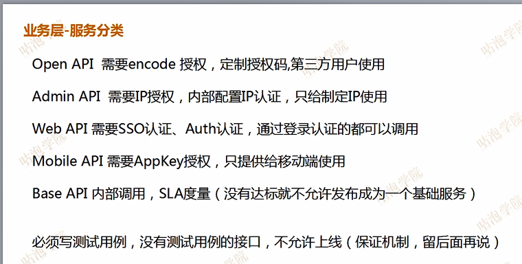
  - 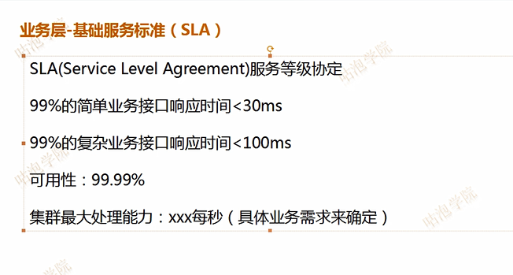
  - 

### 分布式架构原理 

### 分布式架构策略 

### 分布式架构中间件


- 常用组件
  - 分布式存储
  - 分布式锁
  - 分布式日志
  - 消息队列
  - 分布式文件存储
  - 断路器
  - 分布式数据库
  - CDN、ADN
  - 集中式配置
  - 反向代理

### 分布式系统带来的技术问题  

- 分布式服务框架

  - 如果要让不同的子系统或服务之间互相通信，首先必须有一套分布式服务框架；也就是各个服务可相互感知到对方在哪里，可以发送请求过去，可通过http或rpc方式：常见技术有dubbo、springcloud

- 分布式事务

  - TCC、最终一致性、2PC等分布式事务的实现方案和开源技术

- 分布式锁

  - 不同的系统之间如果需要再全局加锁获取某个资源的锁定，该如何做？

    - https://blog.csdn.net/weixin_41446894/article/details/86260854

    - 基于redis的分布式锁
      - redis官方推荐Redlock来实现分布式锁：可靠性比较高
    - 基于数据库的分布式锁
      - 乐观锁
      - 悲观锁（排他锁）
    - 基于Zookeeper的分布式锁
      - 

- 分布式缓存

- 分布式消息系统

- 分布式搜索系统

- 其他很多的技术

  - 分布式配置中心
  - 分布式日志中心
  - 分布式监控告警中心
  - 分布式会话
  - （通信、缓存、消息、事务、锁、配置、日志、监控、会话）

## IO与NIO 

### 同步与异步 

- 同步：同步就是发起一个调用后，被调用者未处理完请求之前，调用不返回
- 异步：异步就是发起一个调用后，立刻得到被调用者的回应表示已接收到请求，但是被调用者并没有返回结果，此时我们可以处理其它请求，被调用者通常依靠事件，回调等机制来通知调用者其返回结果。
- (同步和异常的区别最大在于异步的话调用者不需要等待处理结果，被调用者会通过回调等机制来通知调用者其返回结果)

### 阻塞与非阻塞

- 阻塞：阻塞就是发起一个请求，调用者一直等待请求结果返回，也就是当前线程会被挂起，无法从事其他任务，只有当条件就绪才能继续。
- 非阻塞：非阻塞就是发起一个请求，调用者不用一直等着结果返回，可以先去干其他事情

| IO （同步阻塞）            | NIO（同步非阻塞）                            |
| -------------------------- | -------------------------------------------- |
| 面向流（流的读写是单向的） | 面向缓冲（buffer）（NIO通过channel通道读写） |
| 阻塞IO                     | 非阻塞IO                                     |
| 无                         | 选择器                                       |

### NIO核心组件 

- channel（通道）
- buffer（缓冲区）
- selector（选择器）


- AIO -->NIO2（异步非阻塞的IO模型）

# JVM 

## JVM组成部分 

- 类加载器
- jvm内存模型主要指运行时数据区
  - 可分为：方法区、堆、栈、程序计数器、本地方法栈
  - 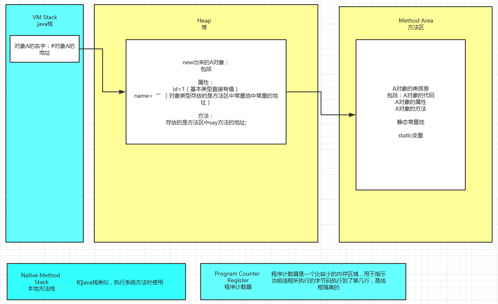
    - 栈：方法运行，每一个方法对应一个栈帧，每一个线程对应一个栈
      - 每个栈帧包括操作数、局部变量表，指向运行时常量池的引用，方法返回地址、附加位区，所以是**线程不共享**的
    - 堆：存放对象实例，几乎所有对象实例都在这里分配内存，**线程之间共享的**
    - 方法区（静态区）：被虚拟机加载的类信息、静态（static）变量、常量（final），即时编译器编译后的代码等数据。运行常量池是方法区的一部分，class文件除了有类的版本、字段、接口、方法等描述信息之外，还有一项信息常量池保存编译期生成的字面量和符号引用。**线程之间共享的**
    - 程序计数器：指出某个时候执行某一个指令、执行完毕之后要返回的位置，当执行的java方法的时候，这里保存的当前执行的地址，如果执行的是本地方法的时候，那么程序计数器为空。**线程不共享** 
    - 本地方法栈：与栈类似，不过则为虚拟机使用到的native方法服务。
- 执行引擎
- 本地库接口
- 组件的作用：（程序在执行之前先要把java代码转换成字节码（class文件），jvm首先需要把字节码通过一定的方式**类加载器（classLoader）**把文件加载到内存中**运行时数据区（Runtime Data Area）**，而字节码文件是jvm的一套指令集规范，并不能直接交给底层操作系统去执行，因此需要特定的命令解析器**执行引擎**，将字节码翻译成底层系统指令，再交由CPU去执行，而这个过程中需要调用其它语言的接口**本地库接口（native interface）**来实现整个程序的功能）

## jvm编译过程

-  .java文件时由java源码编译器（上述所说的javac.exe）来完成
-  java源码编译由以下三个过程组成：
  - 分析和输入到符号表
  - 注解处理
  - 语义分析和生成class文件
-  （jvm是运行在操作系统之上的，每个操作系统的指令是不同的。而JDK是区分操作系统的，只要你的本地系统装了JDK，这个JDK就是能够和当前系统兼容的）
-  

## 虚拟机类加载机制 

> 虚拟机把描述类的数据从class文件加载到内存，并对数据进行校验、转换解析和初始化，最终形成可以被虚拟机直接使用的java类型

> 缓存机制，缓存机制将会保证所有加载过的class都会被缓存，当程序中需要使用某个class时，类加载器先从缓存区寻找该class，只有缓冲区不存在，系统才会读取该类对应的二进制数据，并将其转换成class对象，存入缓存区。这就是为什么修改了class后，必须重启jvm，程序的修改才会生效。

### 类的生命周期 

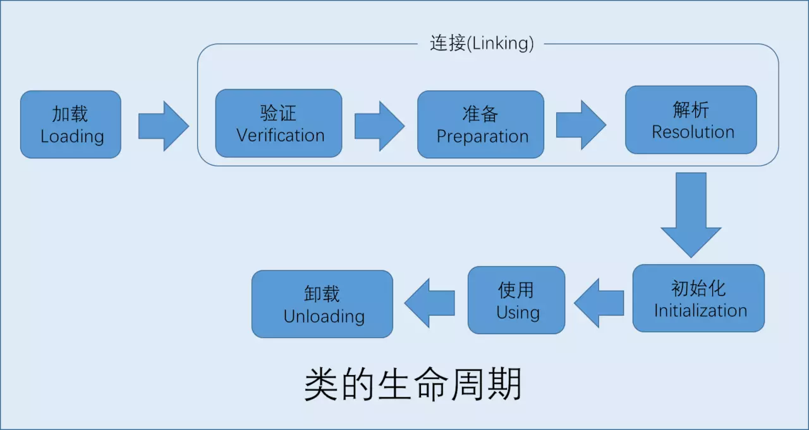


## class文件和jvm的恩怨情仇 

https://juejin.im/post/5b45ef49f265da0f5140489c#heading-4

- java类的加载时动态的，它并不会一次性将所有类全部加载后再运行，而是保证程序运行的基础类（像是基类）完全加载到jvm中，至于其他类，**则在需要的时候才加载。**这当然是为了节省内存开销

- > 虚拟机规定5种情况必须立即对类进行“初始化”（class文件加载到jvm中）：
  >
  > - 创建类的实例（new 的方式）。访问某个类或接口的静态变量，或者对该静态变量赋值，调用类的静态方法
  > - 反射的方式
  > - 初始化某个类的子类，则其父类也会被初始化
  > - java虚拟机启动时被标明为启动类的类，直接使用java.exe命令来运行某个主类（包含main方法的某个类）
  > - 当使用jdk1.7的动态语言支持时

### java默认有三种类加载器

- 启动类加载器（bootstrap classloader）

  - 加载java home中lib目录下的类，或者被-Xbootclasspath参数所指定的路径中并且被虚拟机识别的类库

- 扩展类加载器（extclassloader）

  - 加载ext目录下的类

- 应用类加载器（appclassloader）<--自定义类加载器（user classloader）

  - 加载classpath指定目录下的类

- 工作过程：（双亲委派机制）

  - 当AppClassLoader加载一个class时，它首先不会自己去尝试加载这个类，而是把类加载请求委派给父类加载器ExtClassLoader去完成
  - 当ExtClassLoader加载一个class时，它首先也不会自己去尝试加载这个类，而是把类加载请求委派给BootstrapClassLoader去完成。
  - 如果BootStrapClassLoader加载失败（例如在$JAVA_HOME/jre/lib里未查找到该class），会使用ExtClassLoader来尝试加载
  - 若ExtClassLoader也加载失败，则会使用APPClassLoader来加载
  - 如果APPClassLoader也加载失败，则会报出异常ClassNotFoundException

  ---》

  - 这就是**双亲委派模型**。简单来说，如果一个类加载器收到了类加载的请求，它首先不会自己去尝试加载这个类，而是把**请求委托给父加载器去完成，依次向上**。

    - 好处：防止内存中出现多份同样的字节码（安全性角度）（保证使用不同类加载器最终得到的都是同一个对象，这样就可以保证Java核心库的类型安全）

      （一个可以避免类的重复加载，另外也避免了java的核心API被篡改）

### 类加载完成后jvm干了啥 

- 类加载检查通过后，接下来虚拟机将为新生对象分配内存

## JVM内存模型 

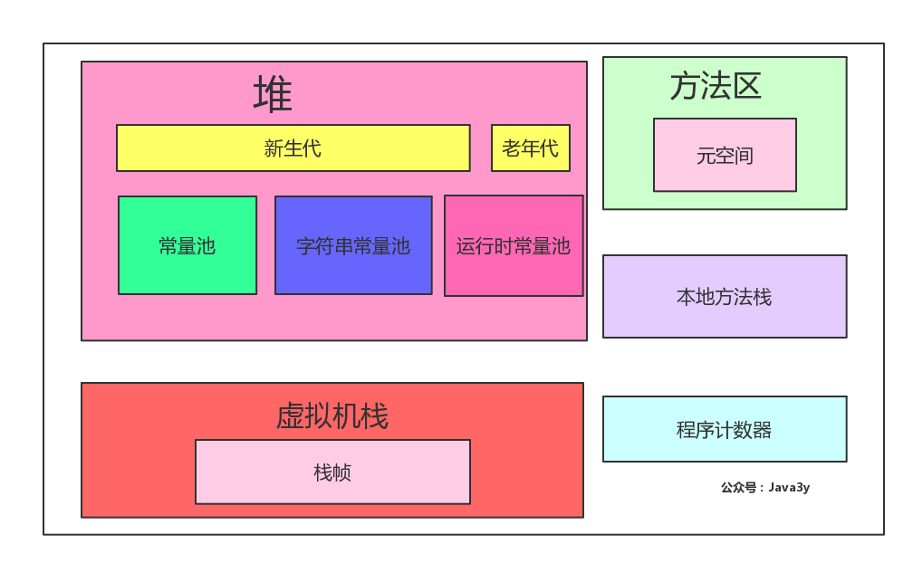

- 虚拟机栈：虚拟机栈描述的是java方法执行的内存模型：每个方法被执行的时候都会同时创建一个栈帧用于存储局部变量表、操作栈、动态链接、方法出口等信息
- 堆：存放对象实例，几乎所有的对象实例都在这里分配内存
- 方法区：存储已被虚拟机加载的类元数据信息（元空间：元空间存储着类的信息（包括类的名称、方法信息、字段信息））
- 程序计数器：当前线程所执行的字节码的行号指示器
- 本地方法栈：本地方法栈则是为虚拟机使用到的Native方法服务

## jvm线上监控工具 

> https://juejin.im/post/5b7044fe6fb9a009c249047e#heading-3
>
> jvm遇到的问题：
>
> - 内存泄露
> - 某个进程突然CPU飙升
> - 线程死锁
> - 响应变慢
>
> 数据收集来定位问题，离不开监控工具的处理，比如：运行日志、异常堆栈、GC日志、线程快照、堆内存快照
>
> 常用jvm性能调优监控工具有：
>
> jps、jstat、jstack、jmap、jhat、hprof、jinfo

### jps进程监控工具 

- jps：用于查看有权访问的hotspot虚拟机的进程。当未指定hostid时，默认查看本机jvm进程，否则查看指定的hostid机器上的jvm进程，此时hostid所指机器必须开启jstatd服务。
- jps可列出jvm进程lvmid，主类类名，main函数参数，jvm参数，jar名称等信息。

### jinfo配置信息查看工具

- jinfo这个命令作用是实时查看和调整虚拟机运行参数。之前的jps -v命令只能查看显示指定的参数，如果想要查看未显示的参数的值就要使用jinfo命令

### jstat信息统计监控工具 

- 用于识别虚拟机各种运行状态信息的命令行工具。它可以显示本地或远程虚拟机进程中的类转载、内存、垃圾收集、jit编译等运行数据，它是线上定位jvm性能的首选工具
- jstat工具提供如下的jvm监控功能：
  - 类的加载及卸载的情况
  - 查看新生代、老生代及元空间的容量及使用情况
  - 查看新生代、老生代及元空间的垃圾回收情况，包括垃圾回收的次数，垃圾回收所占用时间；
  - 查看新生代中Eden区及survior区中容量及分配情况等

### jmap堆内存统计工具 

- jmap命令用来查看堆内存使用状况，一般结合jhat使用，用于生产heap dump文件。jmap不仅能生产dump文件，还可以查询finalize执行队列，java堆和元空间metaspace的详细信息，如当前使用率、当前使用的是哪种收集器等等

  - > 堆转储（heap dump）是一个用来检查java内存中的对象和数据的内存文件。该文件可以通过执行JDK的jmap命令来创建。在创建文件的过程中，所有java程序将暂停，因此，不要在系统执行过程中创建该文件。

### jhat 堆快照分析工具 

- jhat命令通常与jmap搭配使用，用来分析jmap生产的dump。jhat内置了一个微型的http/html服务器，生产dump的分析结果后，可以在浏览器中查看

### jstack堆栈跟踪工具 

- jstack用于生产java虚拟机当前时刻的线程快照。线程快照是当前java虚拟机内每一条线程正在执行的方法堆栈的集合。生成线程快照的主要目的是定位线程出现长时间停顿的原因，如线程间死锁、死循环、请求外部资源导致的长时间等待等待。
- 线程出现停顿的时候，通过jstack来查看各个线程的调用堆栈，就可以知道没有响应的线程到底在后台做什么事情，或者等待什么资源。如果java程序崩溃生成core文件，jstack工具可通过core文件获取java stack和native stack 的信息，从而定位程序崩溃的原因。
- jstack 输出文件里，值得关注的线程状态（java.lang.Thread.State）有：
  - 死锁，Deadlock（重点关注）
  - 执行中，Runnable
  - 等待资源，Waiting on condition（重点关注）
  - 等待获取监视器，waiting on monitor entry（重点关注）
  - 暂停，Suspended
  - 对象等待中，Object.wait()或TIMED_WAITING
  - 阻塞，Blocked（重点关注，只有synchronized这种方式的锁（monitor锁）才会让线程出现BLOCKED状态，等待ReentrantLock则不会）
  - 停止，Parked（LockSupport两组方法park/pardNanos/parkUntil，使用带参数Object blocker的，jstack输出中会显示更详细的线程信息）

## 调优工具 

> jdk 自带监控工具：jconsole和jvisualvm，第三方有MAT
>
> jconsole：jdk中自带的java监控和管理控制台，用于对jvm中内存，线程和类等的监控
>
> MAT：一个基于eclipse的内存分析工具，是一个快速、功能丰富的java heap分析工具，它可以帮助我们查找内存泄露和减少内存消耗

## 什么情况会造成内存泄露 


> - 内存泄露：一个不再被程序使用的对象或变量还在内存中占有存储空间
> - （一次内存泄露似乎不会有大的影响，但内存泄露堆积后的后果就是内存溢出）
> - out of memory内存溢出：指程序申请内存时，没有足够的内存供申请者使用，或者说，给了你一块存储int类型数据的存储空间，但是你却存储long类型的数据，那么结果就是内存不够用，此时就会报错OOM，即所谓的内存溢出。

> - 一个原因是内存不够（如递归的层数太多等）
>   - https://blog.csdn.net/lixld/article/details/80101972
>   - 解决办法：
>     - -Xms3062m
>     - -Xmx3062m
>     - 
>     - 
> - 一个原因是程序中有死循环
>   - 

## 分代回收 

> java的堆内存被分代管理，分代管理主要是为了方便垃圾回收，这样做基于2个事实，第一、大部分对象很快就不再使用，第二，还有一部分不会立即无用，但也不会持续很长时间

- 虚拟机中划分为年轻代、老年代、和永久代

### 年轻代 

- 主要用来存放新创建的对象，年轻代分为Eden区和两个survivor区。大部分对象在Eden区中生成。当Eden区满时，还存活的对象会在两个survivor区交替保存，达到一定次数的对象会晋升到老年代

### 老年代 

- 用来存放从年轻代晋升而来的，存活时间较长的对象

### 永久代 

- 主要保存类信息等内容，这里的永久代是指对象划分方式，不是专指1.7的permGen，或者1.8后的metaspace

根据年轻代与老年代的特点，jvm提供了不同的垃圾回收算法。垃圾回收算法按类型可以分为引用计数法、复制法和标记清除法

- 引用计数法
  - 通过对象被引用的次数来确定对象是否被使用，缺点是无法解决循环引用的问题

- 复制法
  - 复制算法需要from和to两块相同大小的内存空间，对象分配时只在from块中进行，回收时把存活对象复制到to块中，并清空from块，然后交换两块的分工，即把from块作为to块，把to块作为from块。缺点是内存使用率较低
- 标记清除法
  - 分为标记对象和清除不在使用的对象两个阶段，标记清除算法的缺点是会产生内存碎片

## jvm 必考知识点 

- 内存模型部分：程序计数器、方法区、堆、栈、本地方法栈的作用，保存哪些数据√
- 类加载部分：双亲委派的加载机制以及常用类加载器分别加载哪种类型的类√
- GC部分：分代回收的思想和依据，以及不同垃圾回收算法实现的思路、适合的场景
- 性能调优部分：常用的jvm 优化参数的作用，参数调优的依据，要了解常用的jvm分析工具能分析哪类问题，以及使用方法√
- 执行模式部分：解释、编译、混合模式的优缺点，了解java7提供的分层编译技术。需要知道JIT即时编译技术和OSR也就是栈上替换，知道C1、C2编译器针对的场景，其中C2 针对server模式，优化更激进。在新技术方面可了解一下java10提供的由java实现的graal编译器
- 编译优化部分：前端编译器javac的编译过程、AST抽象语法树、编译期优化和运行期优化。编译优化的常用技术，包括公共子表达式的消除、方法内联、逃逸分析、栈上分配、同步消除等。

# java数据结构与算法基础 

# JAVA常用工具类库 

 https://blog.csdn.net/zzti_erlie/article/details/103102151 

## Apache Commons 

### BeanUtils

```java
//map 和 bean的互相转换
bean -->map
map = BeanUtils.describe(user);
map-->bean
BeanUtils.populate(user,map);
```

### Codec

```java
//Base64
Base64.encodeBase64String(byte[] binaryData)
Base64.decodeBase64(String base64String)
//MD5
DigestUtils.md5Hex(String data)
//URL
URLCodec.decodeUrl(byte[] bytes);
URLCodec.encodeUrl(BitSet urlsafe, byte[] bytes);    
```

### Collections 

```java
//判空
CollectionUtils.isEmpty(collA);
//交集
CollectionUtils.retainAll(collA, collB);
//并集
CollectionUtils.union(collA, collB);
//差集
CollectionUtils.subtract(collA, collB);
//判等
CollectionUtils.isEqualCollection(collA, collB);
```

### StringUtils

```java
// 10位英字  
System.out.println(RandomStringUtils.randomAlphabetic(10));    
// 10位英数  
System.out.println(RandomStringUtils.randomAlphanumeric(10));    
// 10位ASCII码  
System.out.println(RandomStringUtils.randomAscii(10));   
// 指定文字10位  
System.out.println(RandomStringUtils.random(10, "abcde"));  
```

