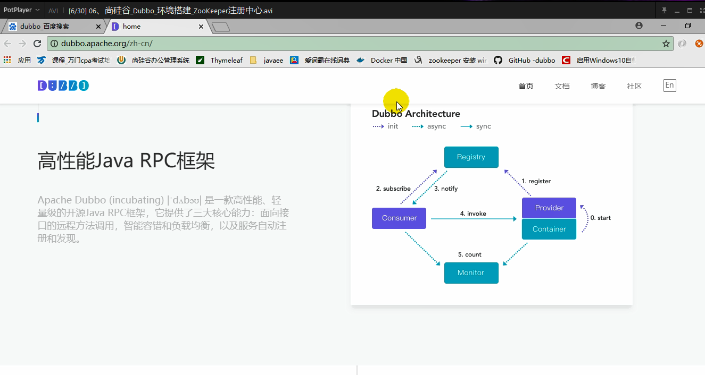

分布式服务架构

- 难点：
  - 如何进行远程过程调用
    - RPC：远程过程调用
  - 如何拆分业务
- 流动计算架构
  - 调度、治理中心
    - 基于访问压力实时管理集群容量，提高集群利用率

# 基础知识

## RPC 

- 两个核心模块：通讯、序列化

## dubbo框架



**官方文档**  

http://dubbo.apache.org/zh-cn/docs/admin/install/admin-console.html

## 注册中心 Zookeeper

- 下载、解压、启动：zkService.cmd
  - 需注意要有zoo.cfg文件

### zookeeper原理 

> ```text
> zookeeper也可以作为注册中心，用于服务治理（zookeeper还有其他用途，例如：分布式事务锁等）   
> 每启动一个微服务，就会去zk中注册一个临时子节点，
> 例如：5台订单服务，4台商品服务
> （5台订单服务在zk中的订单目录下创建的5个临时节点）
> （4台商品服务在zk中的商品目录下创建的4个临时接点）
> 
> 每当有一个服务down机，由于是临时接点，此节点会立即被删除，并通知订阅该服务的微服务更新服务列表
> （zk上有watch，每当有节点更新，都会通知订阅该服务的微服务更新服务列表）
> 
> 每当有一个新的微服务注册进来，就会在对应的目录下创建临时子节点，并通知订阅该服务的微服务更新服务列表
> （zk上有watch，每当有节点更新，都会通知订阅该服务的微服务更新服务列表）
> 
> 每个微服务30s向zk获取新的服务列表
> ```

## 监控中心 dubbo-ops

- GitHub下载dubbo-ops项目、打成jar包、启动jar包、访问localhost:7001可看到可视化界面的监控平台

  用户名/密码：root、root

- 管理控制台

  - dubbo-admin

- 简单的监控中心

  - dubbo-monitor-simple
    - 更改配置、启动start.bat、访问8080端口、配置监控中心（dubbo:monitor）

# dubbo配置

- 将服务提供者注册到注册中心（暴露服务）
  - 引入dubbo依赖（2.6.2）
  - 引入操作zookeeper的客户端（curator-framework、curator-client）
  - 配置服务提供者
  - @Service：暴露服务
- 服务消费者去注册中心订阅服务提供者的服务地址
  - @Reference：消费服务
- dubbo.properties配置参数运行顺序
  - -Ddubbo.protocol.port=20880
  - application.properties/xml
  - dubbo.properties
- 启动时检查
  - check=true
- 超时
  - timeout=3000（毫秒）
  - 配置覆盖关系：
    - 方法级优先，接口次之，全局配置再次之
    - 如果级别一样，则消费方优先，提供方次之
- 重试次数
  - retries=3（调用一次失败，再重新调用3次）
  - 幂等（设置重试次数）：查询、删除、修改
  - 非幂等（不能设置重试次数）（retries=0）：新增
- 多版本
  - version
- 本地存根
  - stub= true
- springboot与dubbo整合的三种方式
  - 导入dubbo-starter包、在application.properties配置，开启@EnableDubbo注解使用，使用@Service暴露服务，使用@Reference调用服务
  - 保留dubbo xml配置：导入dubbo-starter包、使用@ImportResource导入dubbo.xml配置文件
  - 使用注解API方式：将每一个组件手动创建到容器中，让dubbo来扫描其他的组件

# 高可用

- 通过设计，减少系统不能提供服务的时间

## zookeeper宕机与dubbo直连

- 注册中心全部宕机后，服务提供者和服务消费者仍能通过本地缓存
- 没有注册中心，可用dubbo直连：@Reference（url=“127.0.0.1:8080”）

## 负载均衡机制

- random LoadBalance：随机
- roundRobin LoadBalance：轮询
- LeastActive LoadBalance：最小活跃调用数
- ConsistentHash LoadBalance：一致性hash
- 在zookeeper中设置倍权、半权

## 服务降级

- 当服务器压力剧增情况下，根据实际业务情况及流量，对一些服务和页面有策略的不处理或换种简单的方式处理，从而释放服务器资源以保证核心交易正常运作或高效运作
- zookeeper中的禁止、屏蔽

## 集群容错

- failover cluster：失败自动切换
- failfast cluster：快速失败
- failsafe cluster：失败安全
- failback cluster：失败自动恢复
- forKing cluster：并行调用多个服务器
- broadcast cluster：广播调用所有提供者

### 整合hystrix

- 导入依赖包、@EnableHystrix开启、写hystrix处理方法

# dubbo原理

## RPC原理 

## netty通信原理 

- 基于NIO的多路复用

## dubbo原理 

- 框架设计
- 启动解析、加载配置信息
- 服务暴露
- 服务引用
- 服务调用