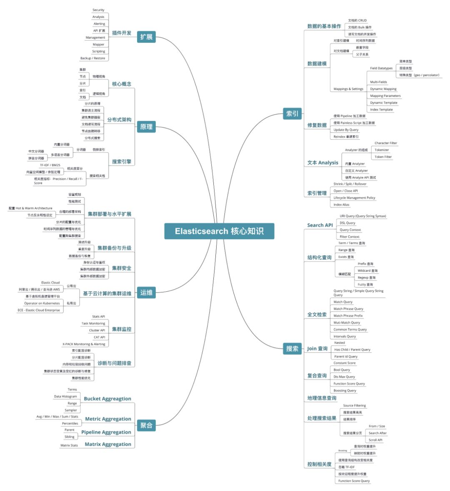
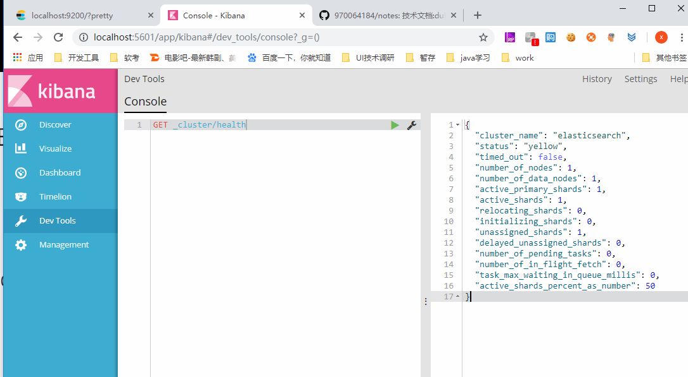
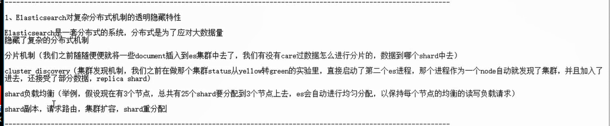
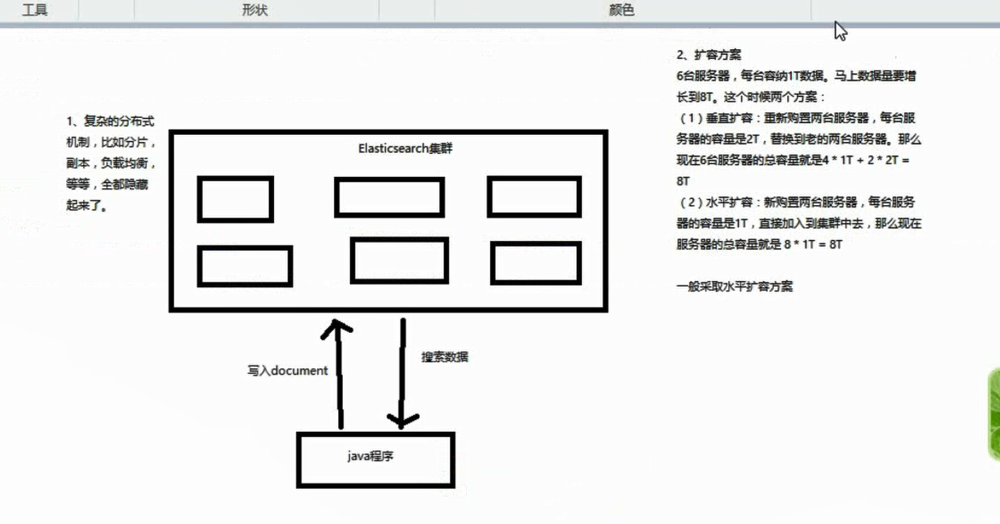
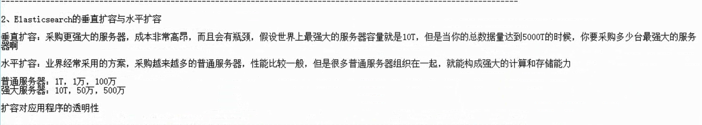
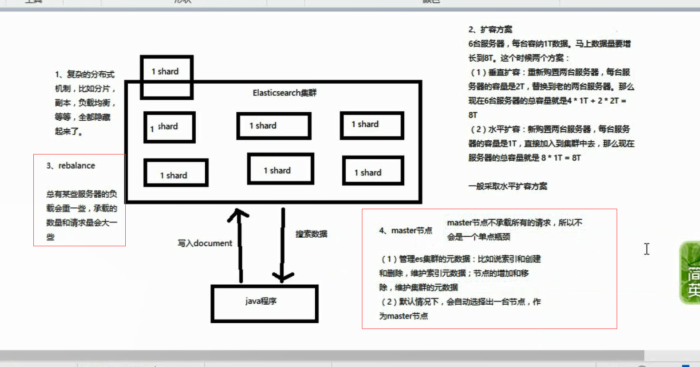

# 概念 

> - es亿级数据查询毫秒级返回
> - 

## 全文检索：倒排索引

- 

## lucene

- 就是一个jar包，里面包含了封装好的各种建立倒排索引，以及进行搜索的代码，包括各种算法。我们就用java开发的时候，引入Lucene jar，然后基于Lucene api进行开发就可。用Lucene，我们就可以去将已有的数据建立索引，Lucene会在本地磁盘上面，给我们组织索引的数据结构。另外的话，我们也可用Lucene提供的一些功能和api来针对磁盘上的索引数据，进行搜索

- > DB：数据库--》表--》行--》列
  >
  > ES：索引--》类型--》文档--》字段

## elasticsearch

- 
- 功能
  - 分布式的搜索引擎和数据分析引擎
    - 数据分析：电商网站：分析最近7天某种商品销量排名前10的商家有哪些
  - 全文检索、结构化检索、数据分析
    - 结构化检索：搜索商品分类为某用品的商品有哪些
  - 对海量数据进行近实时的处理


- 适用场景

  - 电商、招聘、OA、数据分析、ERP等

- 特点

  - 传统数据库的补充
  - 分布式集群技术。处理PB级数据
  - 简单，开箱即用

- | elasticsearch | 数据库  |
  | ------------- | ---- |
  | document      | 行    |
  | type          | 表    |
  | index         | 数据库  |

  


# 快速入门 

- 启动elasticsearch：elaticsearch.bat
  - localhost:9200/?pretty

- 启动kibana：kibana.bat

  - 可视化工具


  - localhost:5601

- 

- document数据格式
  - 用json数据格式来表达
  - es面向文档的，文档中存储的数据结构，与面向对象的数据结构是一样的，基于这种文档数据结构，es可以提供复杂的索引，全文检索，分析聚合等功能

- 简单是集群管理
  - 快速检查集群的健康情况
    - GET /_cat/health?v
  - 快速了解集群的监控状况
    - green：每个索引的primary shard和replica shard都是active状态的
    - yellow：每个索引的primary shard都是active状态的，但是部分replica shard不是active状态，处于不可用的状态
    - red：不是所有索引的primary shard 都是active状态的，部分索引有数据丢失了
  - 快速查看集群中有哪些索引
    - GET /_cat/indices?v
  - 简单的索引操作
    - 创建索引：PUT /test_index?pretty
    - 删除索引：DELETE /test_index?pretty

## 新增

- PUT /index/type/id

- ```java
  PUT /ecommerce/product/1
  {
      "name" : "gaolujie yagao",
      "desc" :  "gaoxiao meibai",
      "price" :  30,
      "producer" :      "gaolujie producer",
      "tags": [ "meibai", "fangzhu" ]
  }

  ```

- ```java
  {
    "_index": "ecommerce",
    "_type": "product",
    "_id": "1",
    "_version": 1,
    "result": "created",
    "_shards": {
      "total": 2,
      "successful": 1,
      "failed": 0
    },
    "created": true
  }
  ```

## 查询

- GET /index/type/id

## 修改

- 替换文档：PUT /index/type/id

- 更新文档：POST /index/type/id/_update

- ```java
  POST /ecommerce/product/1/_update
  {
      "doc": {
        "name":"jiaqiangban gaolujie yagao"
      }
  }

  ```

## 删除

- DELETE /index/type/id

## query string search 

- GET /index/type/_search
- GET /ecommerce/product/_search?sort=price:desc&q=name:yagao

## query DSL 

- DSL：domain specified language

- ```java
  GET /index/type/_search
  {
  "query":{
  	"match_all":{}
  }
  }
  //查询所有
  GET ecommerce/product/_search
  {
    "query":{
      "match_all": {}
    }
  }
  ```

- ```java
  //按条件查询，并按升序排序
  GET ecommerce/product/_search
  {
    "query":{
      "match": {
        "name": "yagao"
      }
    },
    "sort": [
      {
        "price": {
          "order": "asc"
        }
      }
    ]
  }
  ```

- ```java
  //分页查询
  GET ecommerce/product/_search
  {
    "query": {
      "match_all": {
        
      }
    },
    "from": 2,
    "size": 1
  }

  ```

- ```java
  //指定要查询出来的字段
  GET ecommerce/product/_search
  {
    "query": {
      "match_all": {}
    },
    "_source": ["name","price","desc"]
  }
  ```

## query filter

- ```java
  GET index/type/_search
  {
    "query": {
      "bool": {
        "must": [
          {
            "match": {
              "FIELD": "TEXT"
            }
          }
        ],"filter": {
          "range": {
            "FIELD": {
              "gte": 10,
              "lte": 20
            }
          }
        }
      }
    }
  }
  ```

- ```java
  GET ecommerce/product/_search
  {
    "query": {
      "bool": {
        "must": [
          {
            "match": {
              "name": "yagao"
            }
          }
        ],"filter": {
          "range": {
            "price": {
              "gte": 10,
              "lte": 25
            }
          }
        }
      }
    }
  }
  ```

## full-text search(全文检索)

- ```java
  GET ecommerce/product/_search
  {
    "query": {
      "match": {
        
      }
    }
  }

  ```

- ```java
  GET ecommerce/product/_search
  {
    "query": {
      "match": {
        "producer": "yagao producer"
      }
    }
  }
  //speci:4
  //yagao:4
  //producer:1,2,3,4
  //gaolujie:1
  //zhonghua:3
  //jiajieshi:2

  -->
  //yagao producer -->yagao 和producer
  --->
  {
    "took": 2,
    "timed_out": false,
    "_shards": {
      "total": 5,
      "successful": 5,
      "failed": 0
    },
    "hits": {
      "total": 4,
      "max_score": 0.70293105,
      "hits": [
        {
          "_index": "ecommerce",
          "_type": "product",
          "_id": "4",
          "_score": 0.70293105,
          "_source": {
            "name": "speci yagao",
            "desc": "speci yagao miaoshu",
            "price": 35,
            "producer": "spec yagao producer",
            "tags": [
              "meibai"
            ]
          }
        },
        {
          "_index": "ecommerce",
          "_type": "product",
          "_id": "1",
          "_score": 0.25811607,
          "_source": {
            "name": "jiaqiangban gaolujie yagao",
            "desc": "gaoxiao meibai",
            "price": 30,
            "producer": "gaolujie producer",
            "tags": [
              "meibai",
              "fangzhu"
            ]
          }
        },
        {
          "_index": "ecommerce",
          "_type": "product",
          "_id": "3",
          "_score": 0.25811607,
          "_source": {
            "name": "zhonghua yagao",
            "desc": "caoben zhiwu",
            "price": 40,
            "producer": "zhonghua producer",
            "tags": [
              "qingxin"
            ]
          }
        },
        {
          "_index": "ecommerce",
          "_type": "product",
          "_id": "2",
          "_score": 0.1805489,
          "_source": {
            "name": "jiajieshi yagao",
            "desc": "youxiao fangzhu",
            "price": 25,
            "producer": "jiajieshi producer",
            "tags": [
              "fangzhu"
            ]
          }
        }
      ]
    }
  }
  ```

## phrase search(短语搜索)

- ```java
  //短语搜索：指定字段搜索，要包含的一模一样才查的出来
  //全文检索：拆分匹配，包含其中一个都可以查到
  GET ecommerce/product/_search
  {
    "query": {
      "match_phrase": {
        "FIELD": "PHRASE"
      }
    }
  }
  ```

- ```java
  {
    "took": 1,
    "timed_out": false,
    "_shards": {
      "total": 5,
      "successful": 5,
      "failed": 0
    },
    "hits": {
      "total": 1,
      "max_score": 0.70293105,
      "hits": [
        {
          "_index": "ecommerce",
          "_type": "product",
          "_id": "4",
          "_score": 0.70293105,
          "_source": {
            "name": "speci yagao",
            "desc": "speci yagao miaoshu",
            "price": 35,
            "producer": "spec yagao producer",
            "tags": [
              "meibai"
            ]
          }
        }
      ]
    }
  }
  ```

## highlight search（高亮搜索结果）

- ```java
  GET ecommerce/product/_search
  {
    "query": {
      "match_phrase": {
        "producer": "yagao producer"
      }
    },
    "highlight": {
      "fields": {
        "producer": {}
      }
    }
  }
  ```


  //
  {
    "took": 2,
    "timed_out": false,
    "_shards": {
      "total": 5,
      "successful": 5,
      "failed": 0
    },
    "hits": {
      "total": 1,
      "max_score": 0.70293105,
      "hits": [
        {
          "_index": "ecommerce",
          "_type": "product",
          "_id": "4",
          "_score": 0.70293105,
          "_source": {
            "name": "speci yagao",
            "desc": "speci yagao miaoshu",
            "price": 35,
            "producer": "spec yagao producer",
            "tags": [
              "meibai"
            ]
          },
          "highlight": {
            "producer": [
              "spec <em>yagao</em> <em>producer</em>"
            ]
          }
        }
      ]
    }
  }
  ```

- 

## 嵌套聚合 

### 分组 

- ```java
  GET ecommerce/product/_search
  {
    "aggs": {
      "group_by_tags": {
        "terms": {
          "field": "tags"
        }
      }
    }
  }


  --->
  //报错
  {
    "error": {
      "root_cause": [
        {
          "type": "illegal_argument_exception",
          "reason": "Fielddata is disabled on text fields by default. Set fielddata=true on [tags] in order to load fielddata in memory by uninverting the inverted index. Note that this can however use significant memory."
        }
      ],
      "type": "search_phase_execution_exception",
      "reason": "all shards failed",
      "phase": "query",
      "grouped": true,
      "failed_shards": [
        {
          "shard": 0,
          "index": "ecommerce",
          "node": "UMFCqYmfSemfEdmlfU_P1g",
          "reason": {
            "type": "illegal_argument_exception",
            "reason": "Fielddata is disabled on text fields by default. Set fielddata=true on [tags] in order to load fielddata in memory by uninverting the inverted index. Note that this can however use significant memory."
          }
        }
      ],
      "caused_by": {
        "type": "illegal_argument_exception",
        "reason": "Fielddata is disabled on text fields by default. Set fielddata=true on [tags] in order to load fielddata in memory by uninverting the inverted index. Note that this can however use significant memory."
      }
    },
    "status": 400
  }
  ```

- ```java
  //上述问题解决办法
  PUT ecommerce/_mapping/product
  {
    "properties": {
      "tags":{
        "type": "text",
        "fielddata": true
      }
    }
  }
  ```

- ```java
  {
    "took": 113,
    "timed_out": false,
    "_shards": {
      "total": 5,
      "successful": 5,
      "failed": 0
    },
    "hits": {
      "total": 4,
      "max_score": 1,
      "hits": [
        {
          "_index": "ecommerce",
          "_type": "product",
          "_id": "2",
          "_score": 1,
          "_source": {
            "name": "jiajieshi yagao",
            "desc": "youxiao fangzhu",
            "price": 25,
            "producer": "jiajieshi producer",
            "tags": [
              "fangzhu"
            ]
          }
        },
        {
          "_index": "ecommerce",
          "_type": "product",
          "_id": "4",
          "_score": 1,
          "_source": {
            "name": "speci yagao",
            "desc": "speci yagao miaoshu",
            "price": 35,
            "producer": "spec yagao producer",
            "tags": [
              "meibai"
            ]
          }
        },
        {
          "_index": "ecommerce",
          "_type": "product",
          "_id": "1",
          "_score": 1,
          "_source": {
            "name": "jiaqiangban gaolujie yagao",
            "desc": "gaoxiao meibai",
            "price": 30,
            "producer": "gaolujie producer",
            "tags": [
              "meibai",
              "fangzhu"
            ]
          }
        },
        {
          "_index": "ecommerce",
          "_type": "product",
          "_id": "3",
          "_score": 1,
          "_source": {
            "name": "zhonghua yagao",
            "desc": "caoben zhiwu",
            "price": 40,
            "producer": "zhonghua producer",
            "tags": [
              "qingxin"
            ]
          }
        }
      ]
    },
    "aggregations": {
      "group_by_tags": {
        "doc_count_error_upper_bound": 0,
        "sum_other_doc_count": 0,
        "buckets": [
          {
            "key": "fangzhu",
            "doc_count": 2
          },
          {
            "key": "meibai",
            "doc_count": 2
          },
          {
            "key": "qingxin",
            "doc_count": 1
          }
        ]
      }
    }
  }
  ```

### 查询并分组

- ```java
  GET ecommerce/product/_search
  {
    "query": {
      "match": {
        "name": "yagao"
      }
    },
    "aggs": {
      "query_by_name_groud_by_tags": {
        "terms": {
          "field": "tags"
        }
      }
    }
  }
  ```

### 分组并算平均值 

- ```java
  GET ecommerce/product/_search
  {
    "aggs": {
      "group_by_tags": {
        "terms": {
          "field": "tags"
        },"aggs": {
          "avg_price": {
            "avg": {
              "field": "price"
            }
          }
        }
      }
    }
  }
  ```

- ```java
  {
    "took": 5,
    "timed_out": false,
    "_shards": {
      "total": 5,
      "successful": 5,
      "failed": 0
    },
    "hits": {
      "total": 4,
      "max_score": 1,
      "hits": [
        {
          "_index": "ecommerce",
          "_type": "product",
          "_id": "2",
          "_score": 1,
          "_source": {
            "name": "jiajieshi yagao",
            "desc": "youxiao fangzhu",
            "price": 25,
            "producer": "jiajieshi producer",
            "tags": [
              "fangzhu"
            ]
          }
        },
        {
          "_index": "ecommerce",
          "_type": "product",
          "_id": "4",
          "_score": 1,
          "_source": {
            "name": "speci yagao",
            "desc": "speci yagao miaoshu",
            "price": 35,
            "producer": "spec yagao producer",
            "tags": [
              "meibai"
            ]
          }
        },
        {
          "_index": "ecommerce",
          "_type": "product",
          "_id": "1",
          "_score": 1,
          "_source": {
            "name": "jiaqiangban gaolujie yagao",
            "desc": "gaoxiao meibai",
            "price": 30,
            "producer": "gaolujie producer",
            "tags": [
              "meibai",
              "fangzhu"
            ]
          }
        },
        {
          "_index": "ecommerce",
          "_type": "product",
          "_id": "3",
          "_score": 1,
          "_source": {
            "name": "zhonghua yagao",
            "desc": "caoben zhiwu",
            "price": 40,
            "producer": "zhonghua producer",
            "tags": [
              "qingxin"
            ]
          }
        }
      ]
    },
    "aggregations": {
      "group_by_tags": {
        "doc_count_error_upper_bound": 0,
        "sum_other_doc_count": 0,
        "buckets": [
          {
            "key": "fangzhu",
            "doc_count": 2,
            "avg_price": {
              "value": 27.5
            }
          },
          {
            "key": "meibai",
            "doc_count": 2,
            "avg_price": {
              "value": 32.5
            }
          },
          {
            "key": "qingxin",
            "doc_count": 1,
            "avg_price": {
              "value": 40
            }
          }
        ]
      }
    }
  }
  ```

### 分组并算平均值并排序 

- ```java
  GET ecommerce/product/_search
  {
    "size": 0, 
    "aggs": {
      "group_by_tags": {
        "terms": {
          "field": "tags",
          "order": {
            "avg_price": "desc"
          }
        },"aggs": {
          "avg_price": {
            "avg": {
              "field": "price"
            }
          }
        }
      }
    }
  }
  ```

- ```java
  {
    "took": 55,
    "timed_out": false,
    "_shards": {
      "total": 5,
      "successful": 5,
      "failed": 0
    },
    "hits": {
      "total": 4,
      "max_score": 0,
      "hits": []
    },
    "aggregations": {
      "group_by_tags": {
        "doc_count_error_upper_bound": 0,
        "sum_other_doc_count": 0,
        "buckets": [
          {
            "key": "qingxin",
            "doc_count": 1,
            "avg_price": {
              "value": 40
            }
          },
          {
            "key": "meibai",
            "doc_count": 2,
            "avg_price": {
              "value": 32.5
            }
          },
          {
            "key": "fangzhu",
            "doc_count": 2,
            "avg_price": {
              "value": 27.5
            }
          }
        ]
      }
    }
  }
  ```

### 分组内再分组 并算平均值

- ```java
  GET ecommerce/product/_search
  {
    "size": 0, 
    "aggs": {
      "group_by_price": {
        "range": {
          "field": "price",
          "ranges": [
            {
              "from": 0,
              "to": 20
            },
            {
              "from": 20,
              "to": 40
            },
            {
              "from": 40,
              "to": 50
            }
          ]
        },"aggs": {
          "group_by_tags": {
            "terms": {
              "field": "tags"
            },
            "aggs": {
              "avg_price": {
                "avg": {
                  "field": "price"
                }
              }
            }
          }
        }
      }
    }
  }
  ```

- ```java
  {
    "took": 3,
    "timed_out": false,
    "_shards": {
      "total": 5,
      "successful": 5,
      "failed": 0
    },
    "hits": {
      "total": 4,
      "max_score": 0,
      "hits": []
    },
    "aggregations": {
      "group_by_price": {
        "buckets": [
          {
            "key": "0.0-20.0",
            "from": 0,
            "to": 20,
            "doc_count": 0,
            "group_by_tags": {
              "doc_count_error_upper_bound": 0,
              "sum_other_doc_count": 0,
              "buckets": []
            }
          },
          {
            "key": "20.0-40.0",
            "from": 20,
            "to": 40,
            "doc_count": 3,
            "group_by_tags": {
              "doc_count_error_upper_bound": 0,
              "sum_other_doc_count": 0,
              "buckets": [
                {
                  "key": "fangzhu",
                  "doc_count": 2,
                  "avg_price": {
                    "value": 27.5
                  }
                },
                {
                  "key": "meibai",
                  "doc_count": 2,
                  "avg_price": {
                    "value": 32.5
                  }
                }
              ]
            }
          },
          {
            "key": "40.0-50.0",
            "from": 40,
            "to": 50,
            "doc_count": 1,
            "group_by_tags": {
              "doc_count_error_upper_bound": 0,
              "sum_other_doc_count": 0,
              "buckets": [
                {
                  "key": "qingxin",
                  "doc_count": 1,
                  "avg_price": {
                    "value": 40
                  }
                }
              ]
            }
          }
        ]
      }
    }
  }
  ```

# 基础分布式架构 

## elasticsearch 对复制分布式机制的透明隐藏特性 

 


## elasticsearch的垂直扩容与水平扩容 





## 减少或增加节点时的数据rebalance 

- 总有些服务器的负载会重一些，承载的数量和请求量会大一些，增加节点时，会自动把重负载的节点分配到新增加的节点上
-  
- 

## master 节点 


## 节点平等的分布式架构 

- 节点对等，每个节点都能接收所有的请求
- 自动请求路由
- 响应收集