* [JDK8新特性](#jdk8%E6%96%B0%E7%89%B9%E6%80%A7)
  * [Stream](#stream)
    * [Stream的操作三个步骤](#stream%E7%9A%84%E6%93%8D%E4%BD%9C%E4%B8%89%E4%B8%AA%E6%AD%A5%E9%AA%A4)
      * [创建Stream](#%E5%88%9B%E5%BB%BAstream)
      * [中间操作](#%E4%B8%AD%E9%97%B4%E6%93%8D%E4%BD%9C)
        * [筛选与切片](#%E7%AD%9B%E9%80%89%E4%B8%8E%E5%88%87%E7%89%87)
        * [映射](#%E6%98%A0%E5%B0%84)
        * [ 排序](#%E6%8E%92%E5%BA%8F)
      * [终止操作（终端操作）](#%E7%BB%88%E6%AD%A2%E6%93%8D%E4%BD%9C%E7%BB%88%E7%AB%AF%E6%93%8D%E4%BD%9C)
        * [查找与匹配](#%E6%9F%A5%E6%89%BE%E4%B8%8E%E5%8C%B9%E9%85%8D)
        * [归约reduce](#%E5%BD%92%E7%BA%A6reduce)
        * [收集collect](#%E6%94%B6%E9%9B%86collect)
    * [其它](#%E5%85%B6%E5%AE%83)
  * [Lambda表达式](#lambda%E8%A1%A8%E8%BE%BE%E5%BC%8F)
    * [基础语法](#%E5%9F%BA%E7%A1%80%E8%AF%AD%E6%B3%95)
      * [操作符：“\-&gt;”](#%E6%93%8D%E4%BD%9C%E7%AC%A6-)
      * [语法](#%E8%AF%AD%E6%B3%95)
        * [格式一：无参数，无返回值](#%E6%A0%BC%E5%BC%8F%E4%B8%80%E6%97%A0%E5%8F%82%E6%95%B0%E6%97%A0%E8%BF%94%E5%9B%9E%E5%80%BC)
        * [格式二：有一个参数，无返回值](#%E6%A0%BC%E5%BC%8F%E4%BA%8C%E6%9C%89%E4%B8%80%E4%B8%AA%E5%8F%82%E6%95%B0%E6%97%A0%E8%BF%94%E5%9B%9E%E5%80%BC)
        * [格式三：只有一个参数，小括号可省略不写](#%E6%A0%BC%E5%BC%8F%E4%B8%89%E5%8F%AA%E6%9C%89%E4%B8%80%E4%B8%AA%E5%8F%82%E6%95%B0%E5%B0%8F%E6%8B%AC%E5%8F%B7%E5%8F%AF%E7%9C%81%E7%95%A5%E4%B8%8D%E5%86%99)
        * [格式四：有两个以上的参数，有返回值，并且lambda体中有多条语句](#%E6%A0%BC%E5%BC%8F%E5%9B%9B%E6%9C%89%E4%B8%A4%E4%B8%AA%E4%BB%A5%E4%B8%8A%E7%9A%84%E5%8F%82%E6%95%B0%E6%9C%89%E8%BF%94%E5%9B%9E%E5%80%BC%E5%B9%B6%E4%B8%94lambda%E4%BD%93%E4%B8%AD%E6%9C%89%E5%A4%9A%E6%9D%A1%E8%AF%AD%E5%8F%A5)
        * [格式五：若lambda体中只有一条语句，有返回值，return和大括号都可以省略不写](#%E6%A0%BC%E5%BC%8F%E4%BA%94%E8%8B%A5lambda%E4%BD%93%E4%B8%AD%E5%8F%AA%E6%9C%89%E4%B8%80%E6%9D%A1%E8%AF%AD%E5%8F%A5%E6%9C%89%E8%BF%94%E5%9B%9E%E5%80%BCreturn%E5%92%8C%E5%A4%A7%E6%8B%AC%E5%8F%B7%E9%83%BD%E5%8F%AF%E4%BB%A5%E7%9C%81%E7%95%A5%E4%B8%8D%E5%86%99)
        * [格式六：Lambda表达式的参数列表的数据类型可以省略不写，因为JVM编译器通过上下文推断出，数据类型，即“类型推断”](#%E6%A0%BC%E5%BC%8F%E5%85%ADlambda%E8%A1%A8%E8%BE%BE%E5%BC%8F%E7%9A%84%E5%8F%82%E6%95%B0%E5%88%97%E8%A1%A8%E7%9A%84%E6%95%B0%E6%8D%AE%E7%B1%BB%E5%9E%8B%E5%8F%AF%E4%BB%A5%E7%9C%81%E7%95%A5%E4%B8%8D%E5%86%99%E5%9B%A0%E4%B8%BAjvm%E7%BC%96%E8%AF%91%E5%99%A8%E9%80%9A%E8%BF%87%E4%B8%8A%E4%B8%8B%E6%96%87%E6%8E%A8%E6%96%AD%E5%87%BA%E6%95%B0%E6%8D%AE%E7%B1%BB%E5%9E%8B%E5%8D%B3%E7%B1%BB%E5%9E%8B%E6%8E%A8%E6%96%AD)
  * [函数式接口](#%E5%87%BD%E6%95%B0%E5%BC%8F%E6%8E%A5%E5%8F%A3)
    * [java 内置四大核心函数式接口](#java-%E5%86%85%E7%BD%AE%E5%9B%9B%E5%A4%A7%E6%A0%B8%E5%BF%83%E5%87%BD%E6%95%B0%E5%BC%8F%E6%8E%A5%E5%8F%A3)
      * [消费型接口Consumer：一个参数，无返回值](#%E6%B6%88%E8%B4%B9%E5%9E%8B%E6%8E%A5%E5%8F%A3consumer%E4%B8%80%E4%B8%AA%E5%8F%82%E6%95%B0%E6%97%A0%E8%BF%94%E5%9B%9E%E5%80%BC)
      * [供给型接口Supplier ：无参数，有返回值](#%E4%BE%9B%E7%BB%99%E5%9E%8B%E6%8E%A5%E5%8F%A3supplier-%E6%97%A0%E5%8F%82%E6%95%B0%E6%9C%89%E8%BF%94%E5%9B%9E%E5%80%BC)
      * [函数型接口Function&lt;T,R&gt;：有参数，有返回值](#%E5%87%BD%E6%95%B0%E5%9E%8B%E6%8E%A5%E5%8F%A3functiontr%E6%9C%89%E5%8F%82%E6%95%B0%E6%9C%89%E8%BF%94%E5%9B%9E%E5%80%BC)
      * [断定型接口Predicate：有参数，返回boolean值](#%E6%96%AD%E5%AE%9A%E5%9E%8B%E6%8E%A5%E5%8F%A3predicate%E6%9C%89%E5%8F%82%E6%95%B0%E8%BF%94%E5%9B%9Eboolean%E5%80%BC)
      * [其他接口](#%E5%85%B6%E4%BB%96%E6%8E%A5%E5%8F%A3)
  * [方法引用与构造器引用](#%E6%96%B9%E6%B3%95%E5%BC%95%E7%94%A8%E4%B8%8E%E6%9E%84%E9%80%A0%E5%99%A8%E5%BC%95%E7%94%A8)
    * [方法引用](#%E6%96%B9%E6%B3%95%E5%BC%95%E7%94%A8)
      * [对象：：实例方法名](#%E5%AF%B9%E8%B1%A1%E5%AE%9E%E4%BE%8B%E6%96%B9%E6%B3%95%E5%90%8D)
      * [类：：静态方法名](#%E7%B1%BB%E9%9D%99%E6%80%81%E6%96%B9%E6%B3%95%E5%90%8D)
      * [类：：实例方法名](#%E7%B1%BB%E5%AE%9E%E4%BE%8B%E6%96%B9%E6%B3%95%E5%90%8D)
    * [构造器引用](#%E6%9E%84%E9%80%A0%E5%99%A8%E5%BC%95%E7%94%A8)
    * [数组引用](#%E6%95%B0%E7%BB%84%E5%BC%95%E7%94%A8)
  * [接口中的默认方法与静态方法](#%E6%8E%A5%E5%8F%A3%E4%B8%AD%E7%9A%84%E9%BB%98%E8%AE%A4%E6%96%B9%E6%B3%95%E4%B8%8E%E9%9D%99%E6%80%81%E6%96%B9%E6%B3%95)
    * [默认方法：](#%E9%BB%98%E8%AE%A4%E6%96%B9%E6%B3%95)
    * [静态方法：](#%E9%9D%99%E6%80%81%E6%96%B9%E6%B3%95)
  * [新时间日期API](#%E6%96%B0%E6%97%B6%E9%97%B4%E6%97%A5%E6%9C%9Fapi)
    * [日期LocalDate 时间LocalTime 日期\+时间LocalDateTime](#%E6%97%A5%E6%9C%9Flocaldate-%E6%97%B6%E9%97%B4localtime-%E6%97%A5%E6%9C%9F%E6%97%B6%E9%97%B4localdatetime)
    * [Instand：时间戳（以Unix 元年：1970年1月1日 00:00:00之间的毫秒值）](#instand%E6%97%B6%E9%97%B4%E6%88%B3%E4%BB%A5unix-%E5%85%83%E5%B9%B41970%E5%B9%B41%E6%9C%881%E6%97%A5-000000%E4%B9%8B%E9%97%B4%E7%9A%84%E6%AF%AB%E7%A7%92%E5%80%BC)
    * [Duration：计算两个时间之间的间隔 Period：计算两个日期之间的间隔](#duration%E8%AE%A1%E7%AE%97%E4%B8%A4%E4%B8%AA%E6%97%B6%E9%97%B4%E4%B9%8B%E9%97%B4%E7%9A%84%E9%97%B4%E9%9A%94-period%E8%AE%A1%E7%AE%97%E4%B8%A4%E4%B8%AA%E6%97%A5%E6%9C%9F%E4%B9%8B%E9%97%B4%E7%9A%84%E9%97%B4%E9%9A%94)
    * [TemporalAdjuster：时间校正器](#temporaladjuster%E6%97%B6%E9%97%B4%E6%A0%A1%E6%AD%A3%E5%99%A8)
    * [DateTimeFormatter：格式化时间/日期](#datetimeformatter%E6%A0%BC%E5%BC%8F%E5%8C%96%E6%97%B6%E9%97%B4%E6%97%A5%E6%9C%9F)
    * [ZonedDate   ZonedTime   ZonedDateTime 时区的处理](#zoneddate---zonedtime---zoneddatetime-%E6%97%B6%E5%8C%BA%E7%9A%84%E5%A4%84%E7%90%86)
  * [其他新特性](#%E5%85%B6%E4%BB%96%E6%96%B0%E7%89%B9%E6%80%A7)
    * [并行流与串行流？（听不懂）](#%E5%B9%B6%E8%A1%8C%E6%B5%81%E4%B8%8E%E4%B8%B2%E8%A1%8C%E6%B5%81%E5%90%AC%E4%B8%8D%E6%87%82)
    * [Optional类（容器类）](#optional%E7%B1%BB%E5%AE%B9%E5%99%A8%E7%B1%BB)
    * [重复注解与类型注解（实际应用想不到<g\-emoji class="g\-emoji" alias="cry" fallback\-src="https://assets\-cdn\.github\.com/images/icons/emoji/unicode/1f622\.png">😢</g\-emoji>)](#%E9%87%8D%E5%A4%8D%E6%B3%A8%E8%A7%A3%E4%B8%8E%E7%B1%BB%E5%9E%8B%E6%B3%A8%E8%A7%A3%E5%AE%9E%E9%99%85%E5%BA%94%E7%94%A8%E6%83%B3%E4%B8%8D%E5%88%B0cry)

#  JDK8新特性

1. 速度更快（HashMap的升级：由原来的数组+链表的形式升级成数组+链表+红黑树的形式，用的是CAS算法，一个基于底层的算法）
2. 代码更少（增加了lambda表达式）
3. 强大的stream API
4. 便于并行
5. 最大化减少空指针异常Optional（容器类）


- > filter(筛选)
  >
  > map（转换）
  >
  > distinct（去重）
  >
  > sorted（排序）
  >
  > limit（限制返回个数）
  >
  > skip（删除元素）
  >
  > reduce（聚合）
  >
  > min（求最小值）
  >
  > anyMatch/allMatch/noneMatch（匹配）

## Stream


流：数据渠道，用于操作数据源（集合、数组等）所生成的元素序列。

“集合讲的是数据，流讲的是计算”

**注意：**

1. Stream自己不会存储元素
2. Stream不会改变源对象。相反，他们会返回一个持有结果的新Stream
3. Stream操作是延迟执行的。这意味着他们会等到需要结果都是时候才执行

### Stream的操作三个步骤


1. 创建Stream

   一个数据源（如：集合、数组），获取一个流

2. 中间操作

   一个中间操作链，对数据源的数据进行处理

3. 终止操作（终端操作）

   一个终止操作，执行中间操作链，并产生结果

#### 创建Stream


#### 中间操作

##### 筛选与切片


```java
/**
 * 测试stream API
 * 
 * @author zb
 * @date 2018年8月22日 下午3:58:47
 */
public class TestStream {
	List<Employee> list = Arrays.asList(new Employee("张三", 45, 8888), new Employee("李四", 5, 777),
			new Employee("王五", 25, 6666), new Employee("赵六", 25, 8888), new Employee("田七", 65, 9999));
  
	//没有终止操作，中间操作是不会执行任何操作的（这就是“惰性求值”）
  //只有终止操作时，会一次性执行全部内容，即惰性求值
	@Test
	public void test1() {
		list.stream()//创建Stream操作
          .filter((x) -> x.getAge() > 35)// 中间操作
				.forEach(System.out::println);// 终止操作
	}
}

```

内部迭代与外部迭代


##### 映射


map-->接收lambda，将元素转换成其他形式或提取信息。接收一个函数作为参数，该函数会被应用到每个元素上，并将其映射成一个新的元素。

```java
@Test
public void test2() {
  List<String> list = Arrays.asList("ddd", "aaa", "sss", "vvv", "ddddd", "www");
  list.stream().map((str) -> str.toUpperCase()).forEach(System.out::println);
  // 打印结果：
  // DDD
  // AAA
  // SSS
  // VVV
  // DDDDD
  // WWW

  System.out.println("-------------------------");
  employees.stream().map((e) -> e.getAge()).forEach(System.out::println);
  // -------------------------
  // 45
  // 5
  // 25
  // 25
  // 65
}
```


##### 排序


sorted()--》自然排序（Comparable）

sorted(Comparator com)-->定制排序（Comparator）

```java
@Test
public void test3() {
  List<String> list = Arrays.asList("ddd", "aaa", "sss", "vvv", "ddddd", "www");
  list.stream().sorted().forEach(System.out::println);
  // aaa
  // ddd
  // ddddd
  // sss
  // vvv
  // www
  System.out.println("----------------------");
  employees.stream().sorted((x, y) -> {
    if (x.getAge() == y.getAge()) {
      return x.getName().compareTo(y.getName());
    } else {
      return Integer.compare(x.getAge(), y.getAge());
    }
  }).forEach(System.out::println);
  // ----------------------
  // Employee(name=李四, age=5, salary=777.0)
  // Employee(name=王五, age=25, salary=6666.0)
  // Employee(name=赵六, age=25, salary=8888.0)
  // Employee(name=张三, age=45, salary=8888.0)
  // Employee(name=田七, age=65, salary=9999.0)
}
```

 

#### 终止操作（终端操作）

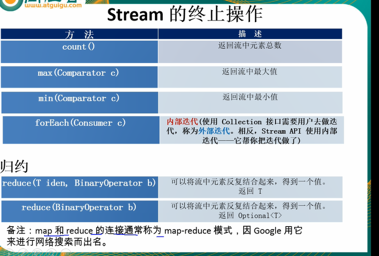


##### 查找与匹配


   


##### 归约reduce

Optional<T> reduce(BinaryOperator<T> accumulator);

T reduce(T identity, BinaryOperator<T> accumulator);

//identity 起始值

 可以将流中元素反复结合起来，得到一个值


  

##### 收集collect

collect ：将流转换为其它形式，接收一个collector接口的实现，用于给stream中元素做汇总的方法

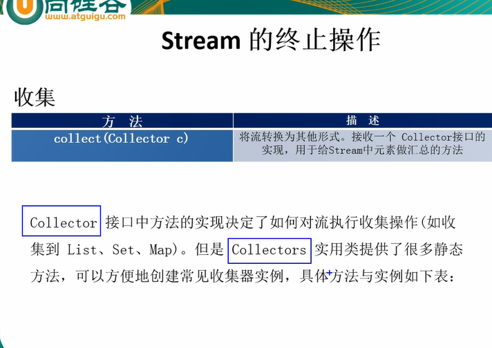


```java
@Test
public void test4() {
  List<Employee> collect = employees.stream().collect(Collectors.toList());
  System.out.println(collect);
  List<String> collect2 = employees.stream().map((e) -> e.getName()).collect(Collectors.toList());
  System.out.println(collect2);
  List<String> collect3 = employees.stream().map(Employee::getName).collect(  Collectors .toList());
  System.out.println(collect3);
  // [Employee(name=张三, age=45, salary=8888.0), Employee(name=李四, age=5,
  // salary=777.0), Employee(name=王五, age=25, salary=6666.0), Employee(name=赵六,
  // age=25, salary=8888.0), Employee(name=田七, age=65, salary=9999.0)]
  // [张三, 李四, 王五, 赵六, 田七]
  // [张三, 李四, 王五, 赵六, 田七]
}
```

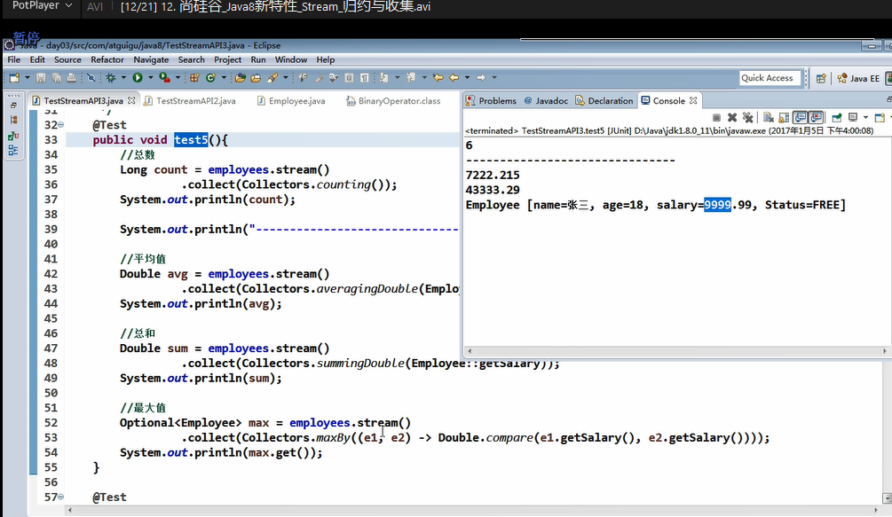

```java
//分组
@Test
public void test5() {
  Map<Integer, List<Employee>> collect = employees.stream().collect(Collectors.groupingBy(Employee::getAge));
  System.out.println(collect);
}
/**
	 * 多级分组
	 */
@Test
public void test6() {
  Map<Double, Map<Integer, List<Employee>>> collect = employees.stream()
    .collect(Collectors.groupingBy(Employee::getSalary, Collectors.groupingBy(Employee::getAge)));
  System.out.println(collect);
}
```

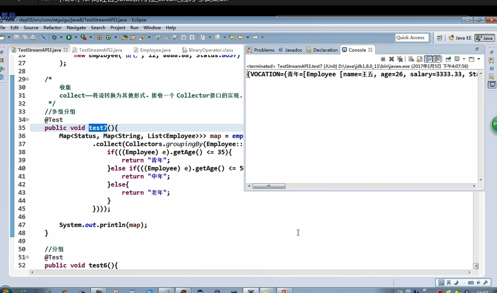

 ```java
/**
	 * 分区
	 */
@Test
public void test7() {
  Map<Boolean, List<Employee>> collect = employees.stream()
    .collect(Collectors.partitioningBy((e) -> e.getSalary() > 8000));
  System.out.println(collect);
  // {false=[Employee(name=李四, age=5, salary=777.0), Employee(name=王五, age=25,
  // salary=6666.0)], true=[Employee(name=张三, age=45, salary=8888.0),
  // Employee(name=赵六, age=25, salary=8888.0), Employee(name=田七, age=65,
  // salary=9999.0), Employee(name=赵8, age=25, salary=8888.0)]}
}
 ```

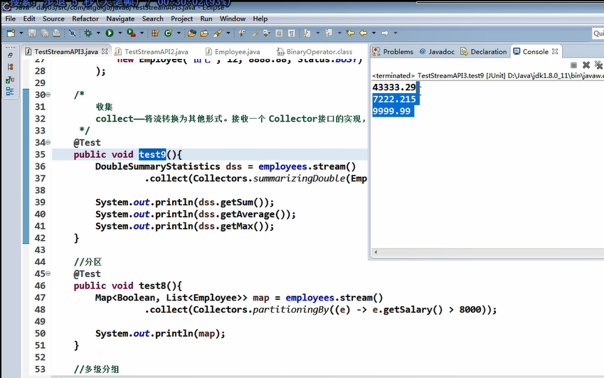

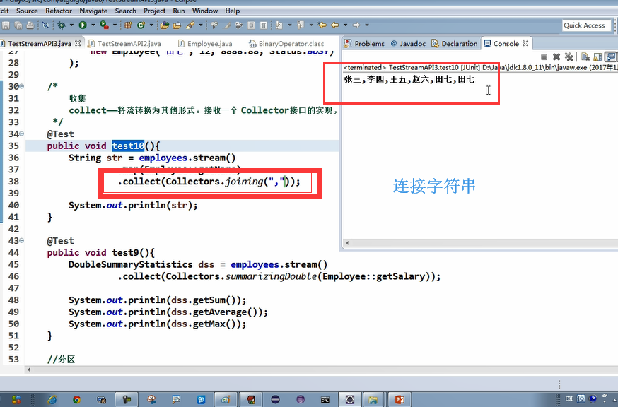


### 其它

```java
List<Person> list = Arrays.asList(Person.builder().age(15).build(),
				Person.builder().age(20).gender(1).height(155).build(), Person.builder().age(33).height(160).build());
		System.out.println(list);

		// 获取所有Person的年龄段

		// 测试jdk新特性--》Stream
		//对象列表--》字符串列表 
		List<Integer> aList = list.stream().map(person -> person.getAge()).collect(Collectors.toList());
		System.out.println(aList);

		// for增强版
		List<Integer> ageList = new ArrayList<>();
		list.forEach(l -> ageList.add(l.getAge()));
		System.out.println(ageList);
//[15, 20, 33]
```

Stream不是集合，可以看成是操作集合的一个容器或一个数据处理工厂，我们无需知道工厂如何处理，只要获取想要的数据就行。在这个容器中可以对集合中的数据完成转换的聚合操作并且能同时获取操作的结果。

在Stream有两种操作类型：

1. Intermdiate：一个Stream后面可以调用任意多个Intermdiate操作方法，其目的主要是打开流，做出某种程度的数据映射/过滤，然后返回一个新的流交给下一步操作，但是这一系列的操作是lazy的，并不是每个操作一一调用。
2. terminal：顾名思义，terminal操作就是将Stream关闭，一个Stream最多只能有一个terminal操作。

Stream 的Intermdiate的操作有：

map(mapToInt、flatMap等)、filter、distinct、sorted、peek、limit、skip、parallel、sequential、unordered、

Stream的terminal的操作有：

forEach、forEachOrdered、toArray、reduce、collect、min、max、count、anyMacth、allMatch、noneMatch、findFirst、findAny、iterator

## Lambda表达式

```java
/**
 * 需求1：获取当前公司中员工工资大于5000 需求 2：获取当前公司中员工年龄大于35
 * 
 * @author zb
 * @date 2018年8月21日 下午4:57:45
 */
public class Demo {

	public static void main(String[] args) {
		List<Employee> list = Arrays.asList(new Employee("张三", 45, 8888), new Employee("李四", 5, 777),
				new Employee("王五", 25, 6666), new Employee("赵六", 55, 8888), new Employee("田七", 65, 9999));
		// 需求1
		filterEmployees1(list);
		// 需求2
		filterEmployees2(list);

		// 需求1和需求2 代码重复冗余
		// 所以优化方式如下：
		// 优化方式1：策略设计模式（定义一个接口，然后实现接口）
		filterEmployees3(list, new FilterEmployeeByAge());
		filterEmployees3(list, new FilterEmployeeBySalary());
		// 优化方式2：匿名内部类
		List<Employee> emps =filterEmployees3(list,new MyPredicate<Employee>() {
			
			@Override
			public boolean test(Employee t) {
				
				return t.getSalary()>5000;
			}
		});
		System.out.println(emps);
		// 优化方式3：lambda表达式
		List<Employee> emps1 = filterEmployees3(list, t -> t.getSalary() > 5000);
		emps1.forEach(System.out::println);
		// 优化方式4：stream API
		list.stream().filter(t->t.getSalary()>5000)
		.forEach(System.out::println);
	}

	private static void filterEmployees1(List<Employee> list) {
		List<Employee> emps = new ArrayList<>();
		list.forEach(l -> {
			if (l.getSalary() > 5000) {
				emps.add(l);
			}
		});
		System.out.println(emps);
	}

	private static void filterEmployees2(List<Employee> list) {
		List<Employee> emps = new ArrayList<>();
		list.forEach(l -> {
			if (l.getAge() > 35) {
				emps.add(l);
			}
		});
		System.out.println(emps);
	}

	private static List<Employee> filterEmployees3(List<Employee> list, MyPredicate<Employee> mp) {
		List<Employee> emps = new ArrayList<>();
		for (Employee employee : list) {
			if (mp.test(employee)) {
				emps.add(employee);
			}
		}
		System.out.println(emps);
		return emps;
	}

}
```


### 基础语法

#### 操作符：“->”

该操作符称为箭头操作符或lambda操作符，箭头操作符将lambda表达式拆分成两部分：

**左侧：lambda表达式的参数列表（抽象方法中的参数）**

**右侧：lambda表达式中所需执行的功能，即lambda体（抽象方法的实现）**

#### 语法

左右遇一括号省

左侧推断类型省

#####  格式一：无参数，无返回值

```java
()->System.out.println("hello world");
```

```java
/**
 * 测试lambda表达式的语法
 * 
 * @author zb
 * @date 2018年8月21日 下午5:39:11
 */
public class TestLambda {

	@Test
	public void test1() {
		Runnable r = new Runnable() {
			
			@Override
			public void run() {
				System.out.println("hello 已启动");
			}
		};
		r.run();
	}
  //lambda表达式
      Runnable r1 = () -> System.out.println("hello 已启动");
		r1.run();
}


```

##### 格式二：有一个参数，无返回值

```java
（x）->System.out.println(x);
```

```java
@Test
public void test2() {
  Consumer<String> con = (x) -> System.out.println(x);
  con.accept("hello world !");
}
```

##### 格式三：只有一个参数，小括号可省略不写

```java
x->System.out.println(x);
```

##### 格式四：有两个以上的参数，有返回值，并且lambda体中有多条语句

```java
@Test
public void test3() {
  Comparator<Integer> c = (x, y) -> {
    System.out.println("函数接口");
    return Integer.compare(x, y);
  };
  int compare = c.compare(5, 3);
  System.out.println(compare);
}
```

##### 格式五：若lambda体中只有一条语句，有返回值，return和大括号都可以省略不写

```java
@Test
public void test4() {
  Comparator<Integer> c = (x, y) -> Integer.compare(x, y);
  int compare = c.compare(5, 3);
  System.out.println(compare);
}
```

##### 格式六：Lambda表达式的参数列表的数据类型可以省略不写，因为JVM编译器通过上下文推断出，数据类型，即“类型推断”

```java
(Integer x,Integer y)->Integer.compare(x,y);
```

```java
//练习：
/**
	 * 需求：调用Collections.sort()方法，通过定制排序比较两个Employee（先按年龄比，年龄相同按姓名比），使用Lambda作为参数传递
	 */
@Test
public void test7() {
  Collections.sort(list, (x, y) -> {
    if (x.getAge() == y.getAge()) {
      return x.getName().compareTo(y.getName());
    } else {
      return -Integer.compare(x.getAge(), y.getAge());
    }
  });
  System.out.println(list);
}
```


Lambda表达式需要“函数式接口”的支持

## 函数式接口

接口中只有一个抽象方法的接口，称为函数式接口。可以使用注解**@FunctionalInterface**修饰，可以检查是否是函数式接口

```java
package com.example.demo.service;

/**
 * 对一个数的运算
 * 
 * @author zb
 * @date 2018年8月21日 下午6:31:01
 */
@FunctionalInterface
public interface MyFun {
	Integer getValue(Integer num);
}

```


```java
@Test
public void test5() {
  Integer operation = operation(400, (x) -> x + 3);
  System.out.println(operation);
}

public Integer operation(Integer num, MyFun mf) {
  return mf.getValue(num);
}
```

### java 内置四大核心函数式接口


#### 消费型接口Consumer<T>：一个参数，无返回值

```java
@Test
public void test8() {
  happy(888L, (m) -> System.out.println("消费了：" + m + "元"));
}
public void happy(double money, Consumer<Double> con) {
  con.accept(money);
}
```

#### 供给型接口Supplier<T> ：无参数，有返回值

```java
@Test
public void test9() {
  List<Integer> numList = getNumList(10, () -> (int) (Math.random() * 100));
  System.out.println(numList);
}
/**
	 * 产生指定个数的整数，并放入集合中
	 * 
	 * @param num
	 * @param sup
	 * @return
	 */
public List<Integer> getNumList(int num, Supplier<Integer> sup) {
  List<Integer> list = new ArrayList<>();
  for (int i = 0; i < num; i++) {
    Integer a = sup.get();
    list.add(a);
  }
  return list;
}
```

#### 函数型接口Function<T,R>：有参数，有返回值

```java
@Test
public void test10() {
  String strHandle = strHandle("xiaozhang", (x) -> "hello " + x);
  System.out.println(strHandle);

  String strHandle2 = strHandle("\t\t\t\t  我的测试    sdsdd ", (x) -> {
    System.out.println(x);
    return x.trim();
  });
  System.out.println(strHandle2);
} 

/**
	 * 函数型接口 需求：用于处理字符串
	 */
public String strHandle(String str, Function<String, String> fun) {
  return fun.apply(str);
}
```

#### 断定型接口Predicate<T>：有参数，返回boolean值

```java
@Test
public void test11() {
  boolean judge = judge(10, (n) -> n > 5);
  System.out.println(judge);
}
public boolean judge(Integer num, Predicate<Integer> pre) {
  return pre.test(num);
}
@Test
public void test12() {
  List<String> list = Arrays.asList("sdsd", "dsdsd00", "we", "dsdfs");
  List<String> filterStr = filterStr(list, (s) -> s.length() > 4);
  System.out.println(filterStr);
}
/**
	 * 需求：将满足条件的字符串，放入集合中
	 */
public List<String> filterStr(List<String> list, Predicate<String> pre) {
  List<String> strList = new ArrayList<>();
  for (String str : list) {
    if (pre.test(str)) {
      strList.add(str);
    }
  }
  return strList;
}
```

#### 其他接口


  

## 方法引用与构造器引用

### 方法引用

方法引用：若lambda体中的内容又方法已经实现了，我们可以使用“方法引用”（可以理解为方法引用是lambda表达式的另外一种表现形式）

主要有三种语法格式：

对象：：实例方法名

类：：静态方法名

类：：实例方法名

**注意：**1. lambda体中调用方法的参数列表与返回值类型，要与函数式接口中抽象方法的函数列表和返回值类型保持一致

2. 若lambda参数列表中的第一参数是实例方法的调用者，而第二个参数是实例方法的参数时，可使用ClassName：：method

#### 对象：：实例方法名

```java
//前提是：实现接口的抽象方法（accept）的参数列表和调用的（println）参数列表和返回类型保持一致
@Test
public void test1() {
  Consumer<String> con = (x) -> System.out.println(x);
  con.accept("helloworld");
  Consumer<String> con1 = System.out::println;
  con1.accept("ceshi");
}
```

#### 类：：静态方法名

```java
@Test
public void test3() {
  Comparator<Integer> com = (x, y) -> Integer.compare(x, y);
  int compare = com.compare(3, 5);
  System.out.println(compare);

  Comparator<Integer> com1 = Integer::compare;
  int compare2 = com1.compare(8, 7);
  System.out.println(compare2);
}
```

#### 类：：实例方法名

```java
@Test
public void test4() {
  // 类：：实例方法名
  // 规则：x,y x为实例方法的调用者，y为实例方法的参数实例
  BiPredicate<String, String> bp = (x, y) -> x.equals(y);
  boolean test = bp.test("abc", "abc");
  System.out.println(test);
  BiPredicate<String, String> bp1 = String::equals;
  boolean test2 = bp1.test("ddd", "d1dd");
  System.out.println(test2);
} 
```


### 构造器引用

ClassName：：new

**注意：**需要调用的构造器的参数列表要与函数式接口中抽象方法的参数列表保持一致。

```java
@Test
public void test5() {
  Supplier<Employee> sup = () -> new Employee();
  Employee employee = sup.get();
  System.out.println(employee);

  Supplier<Employee> sup1 = Employee::new;
  Employee employee2 = sup1.get();
  System.out.println(employee2);

  BiFunction<String, Integer, Employee> bf = (x, y) -> new Employee(x, y);
  Employee apply = bf.apply("www", 12);
  System.out.println(apply);

  BiFunction<String, Integer, Employee> bf1 = Employee::new;
  Employee apply2 = bf1.apply("dddd", 88);
  System.out.println(apply2);
}
```

### 数组引用 

```java
@Test
public void test6() {
  Function<Integer, String[]> fun = (x) -> new String[x];
  String[] apply = fun.apply(2);
  System.out.println(apply.length);

  Function<Integer, String[]> fun1 = String[]::new;
  String[] apply2 = fun1.apply(5);
  System.out.println(apply2.length);
}
```


## 接口中的默认方法与静态方法

###  默认方法：

jdk8中允许写具有实现类的接口的方法就是默认方法

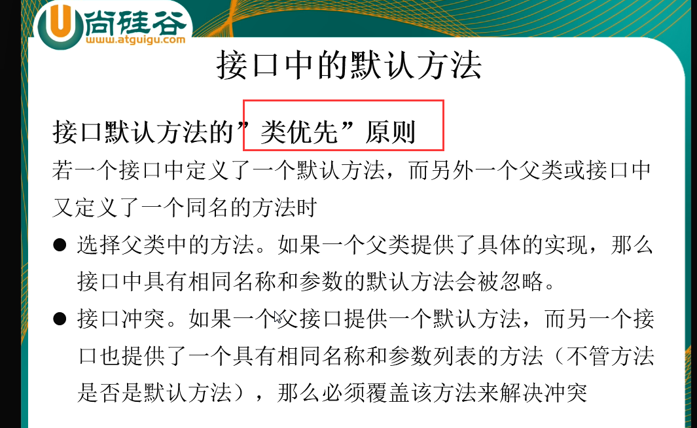


```java
package com.example.demo.test;

public interface MyFun {
	//接口中写实现类（jdk8新特性）
	default String getName() {
		return "默认方法返回值";
	}
}

```

### 静态方法：

```java
package com.example.demo.test;

public interface MyFun {

	default String getName() {
		return "默认方法返回值";
	}

	public static void show() {
		System.out.println("静态方法！");
	}
}
//使用例子
package com.example.demo.test;

public class Test {

	public static void main(String[] args) {
		MyFun.show();
	}

}
```


## 新时间日期API

  旧api有多线程安全问题

 ```java
package com.example.demo.test;

import java.text.SimpleDateFormat;
import java.util.ArrayList;
import java.util.Date;
import java.util.List;
import java.util.concurrent.Callable;
import java.util.concurrent.ExecutorService;
import java.util.concurrent.Executors;
import java.util.concurrent.Future;

public class TestSimpleDateFormat {
	public static void main(String[] args) throws Exception {
		SimpleDateFormat sdf = new SimpleDateFormat("yyyyMMdd");

		Callable<Date> task = () -> sdf.parse("20180828");

		// 写一个长度为10的线程池
		ExecutorService pool = Executors.newFixedThreadPool(10);

		List<Future<Date>> results = new ArrayList<>();
		for (int i = 0; i < 10; i++) {
			results.add(pool.submit(task));
		}
		for (Future<Date> future : results) {
			System.out.println(future.get());
		}

	}
}
//出现线程安全问题，报错
 ```

```java
Exception in thread "main" java.util.concurrent.ExecutionException: java.lang.NumberFormatException: For input string: ".E28018E44"
	at java.util.concurrent.FutureTask.report(FutureTask.java:122)
	at java.util.concurrent.FutureTask.get(FutureTask.java:192)
	at com.example.demo.test.TestSimpleDateFormat.main(TestSimpleDateFormat.java:26)
Caused by: java.lang.NumberFormatException: For input string: ".E28018E44"
	at sun.misc.FloatingDecimal.readJavaFormatString(FloatingDecimal.java:2043)
	at sun.misc.FloatingDecimal.parseDouble(FloatingDecimal.java:110)
	at java.lang.Double.parseDouble(Double.java:538)
	at java.text.DigitList.getDouble(DigitList.java:169)
	at java.text.DecimalFormat.parse(DecimalFormat.java:2056)
	at java.text.SimpleDateFormat.subParse(SimpleDateFormat.java:1867)
	at java.text.SimpleDateFormat.parse(SimpleDateFormat.java:1514)
	at java.text.DateFormat.parse(DateFormat.java:364)
	at com.example.demo.test.TestSimpleDateFormat.lambda$0(TestSimpleDateFormat.java:16)
	at java.util.concurrent.FutureTask.run(FutureTask.java:266)
	at java.util.concurrent.ThreadPoolExecutor.runWorker(ThreadPoolExecutor.java:1142)
	at java.util.concurrent.ThreadPoolExecutor$Worker.run(ThreadPoolExecutor.java:617)
	at java.lang.Thread.run(Thread.java:748)

```

解决办法：用ThreadLocal解决

```java
package com.example.demo.test;

import java.text.DateFormat;
import java.text.SimpleDateFormat;

public class DateFormatThreadLocal {

	public static final ThreadLocal<DateFormat> df = new ThreadLocal<DateFormat>() {
		@Override
		protected DateFormat initialValue() {
			return new SimpleDateFormat("yyyyMMdd");
		}
	};
}
//使用例子
package com.example.demo.test;

import java.util.ArrayList;
import java.util.Date;
import java.util.List;
import java.util.concurrent.Callable;
import java.util.concurrent.ExecutorService;
import java.util.concurrent.Executors;
import java.util.concurrent.Future;

public class TestSimpleDateFormat {
	public static void main(String[] args) throws Exception {

		Callable<Date> task = () -> DateFormatThreadLocal.convert("20180828");

		// 写一个长度为10的线程池
		ExecutorService pool = Executors.newFixedThreadPool(10);

		List<Future<Date>> results = new ArrayList<>();
		for (int i = 0; i < 10; i++) {
			results.add(pool.submit(task));
		}
		for (Future<Date> future : results) {
			System.out.println(future.get());
		}
		pool.shutdown();
	}
}

```

另一个解决办法：jdk8新时间日期API

```java
package com.example.demo.test;

import java.time.LocalDate;
import java.time.format.DateTimeFormatter;
import java.util.ArrayList;
import java.util.List;
import java.util.concurrent.Callable;
import java.util.concurrent.ExecutorService;
import java.util.concurrent.Executors;
import java.util.concurrent.Future;

public class TestSimpleDateFormat {

	public static void main(String[] args) throws Exception {

		DateTimeFormatter dtf = DateTimeFormatter.ofPattern("yyyyMMdd");

		Callable<LocalDate> task = () -> LocalDate.parse("20180826", dtf);

		// 写一个长度为10的线程池
		ExecutorService pool = Executors.newFixedThreadPool(10);

		List<Future<LocalDate>> results = new ArrayList<>();
		for (int i = 0; i < 10; i++) {
			results.add(pool.submit(task));
		}
		for (Future<LocalDate> future : results) {
			System.out.println(future.get());
		}
		pool.shutdown();
	}
}
//2018-08-26
```

### 日期LocalDate 时间LocalTime 日期+时间LocalDateTime

```java
package com.example.demo.test;

import java.time.LocalDateTime;
import java.time.Month;

import org.junit.Test;

public class TestLocalDateTime {

	// 日期LocalDate 时间LocalTime 日期+时间LocalDateTime

	@Test
	public void test() {
		LocalDateTime ldt = LocalDateTime.now();// 2018-08-28T15:50:40.134
		System.out.println(ldt);

		LocalDateTime of = LocalDateTime.of(2018, 8, 23, 13, 15);// 2018-08-23T13:15
		System.out.println(of);

		LocalDateTime plusYears = ldt.plusYears(2);// +2年
		System.out.println(plusYears);// 2020-08-28T15:50:40.134

		LocalDateTime minusYears = ldt.minusYears(2);// -2年
		System.out.println(minusYears);// 2016-08-28T15:52:14.815

		Month month = ldt.getMonth();
		System.out.println(month);// AUGUST
		int monthValue = ldt.getMonthValue();// 8
		System.out.println(monthValue);
	}
}
```


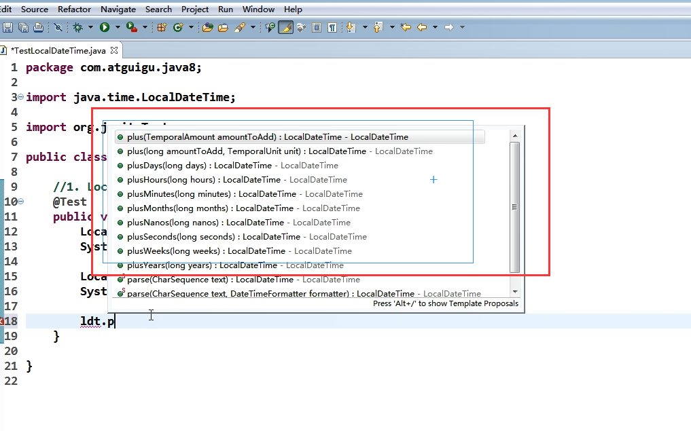

### Instand：时间戳（以Unix 元年：1970年1月1日 00:00:00之间的毫秒值）

```java
/**
	 * Instand：时间戳（以Unix 元年：1970年1月1日 00:00:00之间的毫秒值）
	 */
@Test
public void test1() {
  Instant ins = Instant.now();// 默认获取UTC时区（时间协调时间）（和实际时间相处8个钟）
  System.out.println(ins);// 2018-08-28T07:58:09.313Z
  OffsetDateTime atOffset = ins.atOffset(ZoneOffset.ofHours(8));
  System.out.println(atOffset);// 2018-08-28T16:01:14.762+08:00
  System.out.println(ins.toEpochMilli());// 转换成时间戳 1535443394357
}
```

### Duration：计算两个时间之间的间隔 Period：计算两个日期之间的间隔

```java
/**
	 * Duration：计算两个时间之间的间隔 Period：计算两个日期之间的间隔
	 */
	@Test
	public void test2() {
		LocalDateTime ldt = LocalDateTime.now();

		try {
			Thread.sleep(1000);
		} catch (InterruptedException e) {
			e.printStackTrace();
		}

		LocalDateTime ldt2 = LocalDateTime.now();
		// LocalDateTime ldt2 = LocalDateTime.of(2018, 8, 26, 15, 56);
		Duration between = Duration.between(ldt, ldt2);
		System.out.println(between);// PT1S
		System.out.println(between.toMillis());// 1000
	}
```

```java
/**
Period：计算两个日期之间的间隔
*/
@Test
	public void test3() {
		LocalDate ld = LocalDate.now();// 2018-08-28
		LocalDate ld2 = ld.minusDays(1);// 2018-08-27
		System.out.println(ld2);
		Period between = Period.between(ld, ld2);
		System.out.println(between);
		System.out.println(between.getDays());
	}
```


日期的操纵

### TemporalAdjuster：时间校正器

TemporalAdjusters：

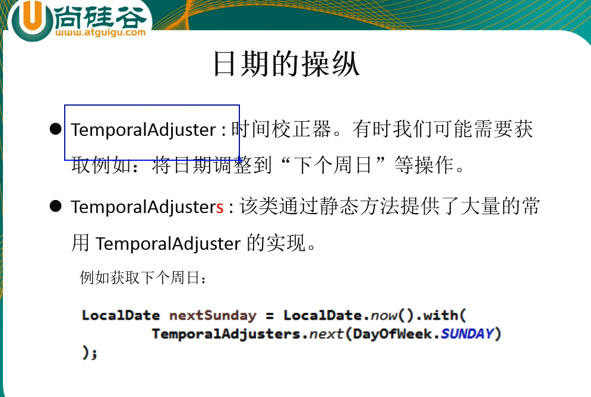


```java
@Test
	public void test4() {
		LocalDateTime ldt = LocalDateTime.now();
		System.out.println(ldt);// 2018-08-28T17:12:00.164
		LocalDateTime ldt2 = ldt.withDayOfMonth(10);// 2018-08-10T17:12:00.164
		System.out.println(ldt2);

		LocalDateTime ldt3 = ldt.with(TemporalAdjusters.next(DayOfWeek.SUNDAY));
		System.out.println(ldt3);// 2018-09-02T17:13:30.630

		// 自定义：下一个工作日
		LocalDateTime ldt5 = ldt.with((l) -> {
			LocalDateTime ldt4 = (LocalDateTime) l;
			DayOfWeek dayOfWeek = ldt4.getDayOfWeek();
			if (dayOfWeek.equals(DayOfWeek.FRIDAY)) {
				return ldt4.plusDays(3);
			} else if (dayOfWeek.equals(DayOfWeek.SATURDAY)) {
				return ldt4.plusDays(2);
			} else {
				return ldt4.plusDays(1);
			}
		});
		System.out.println(ldt5);// 2018-08-29T17:20:29.391
	}
```

### DateTimeFormatter：格式化时间/日期

```html
    	String s1="<tr><th>用户网络类型</th><th>适用<br/>等级</th><th colspan=\"3\">可兑换额度<br/>（单位M）</th><th>每月兑换<br/>次数</th></tr><tr><td rowspan=\"5\">2、3、4G用户</td><td>lv1</td><td>100</td><td></td><td></td><td></td><td>1</td></tr><tr><td>lv2</td><td>100</td><td>200</td><td></td><td></td><td>1</td></tr><tr><td>lv3</td><td>100</td><td>200</td><td>300</td><td></td><td>1</td></tr><tr><td>lv4</td><td>100</td><td>200</td><td>300</td><td></td><td>1</td></tr><tr><td>lv5</td><td>100</td><td>200</td><td>300</td><td></td><td>1</td></tr>";

```


```java
	@Test
	public void test5() {
		DateTimeFormatter dtf = DateTimeFormatter.ISO_DATE_TIME;
		LocalDateTime ldt = LocalDateTime.now();
		String format = ldt.format(dtf);
		System.out.println(format);// 2018-08-28T17:27:29.07

		DateTimeFormatter dtf2 = DateTimeFormatter.ofPattern("yyyy年MM月dd日 HH:mm:ss");
		String format2 = dtf2.format(ldt);
		System.out.println(format2);// 2018年08月28日 17:31:19
		LocalDateTime parse = ldt.parse(format2, dtf2);
		System.out.println(parse);// 2018-08-28T17:36:34
	} 
```

### ZonedDate   ZonedTime   ZonedDateTime 时区的处理

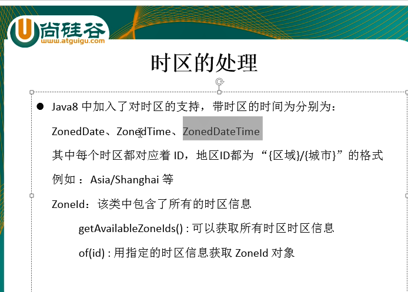

```java
@Test
	public void test6() {
		Set<String> availableZoneIds = ZoneId.getAvailableZoneIds();
		availableZoneIds.forEach(System.out::println);
	}

	@Test
	public void test7() {
		LocalDateTime now = LocalDateTime.now(ZoneId.of("Japan"));
		System.out.println(now);// 2018-08-28T18:49:47.049
	}
```


## 其他新特性

### 并行流与串行流？（听不懂）

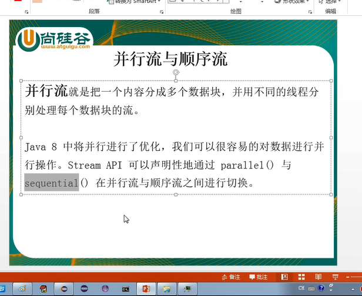


### Optional类（容器类）

代表一个值存在或不存在，原来用null表示一个值不存在，现在optional可以更好的表达这个概念，并且可以避免空指针异常。

常用方法：

Optional.of(T t)：创建一个optional实例

Optional.empty():创建一个空的Optional实例

Optional.ofNullable(T t):若t不为null，创建optional实例，否则创建空实例

isPresent()：判断是否包含值

orElse(T t)：如果调用对象包含值，返回该值，否则返回t

orElseGet(Supplier s)：如果调用对象包含值，返回该值，否则返回s获取的值

map(Function of)：如果有值对其处理，并返回处理后的optional，否则返回Optional.empty() 

flatMap(Fu nction mapper)：与map类似，要求返回值必须是Optional

```java
package com.example.demo.test;

import java.util.Optional;

import org.junit.Test;

import com.example.demo.domain.Employee;

public class TestOptional {

	@Test
	public void test() {
		// 创建一个Optional实例
		// Optional<Employee> op = Optional.of(new Employee());//Employee(name=null,
		// age=0, salary=0.0)
		Optional<Employee> op = Optional.of(null);// java.lang.NullPointerException
		Employee employee = op.get();
		System.out.println(employee);
	}

	@Test
	public void test1() {
		// 创建一个Optional实例
		Optional<Employee> op = Optional.empty();// java.util.NoSuchElementException: No value present
		Employee employee = op.get();
		System.out.println(employee);
	}

	@Test
	public void test2() {
		// 创建一个Optional实例
		Optional<Employee> op = Optional.ofNullable(new Employee());// java.util.NoSuchElementException: No value
		if (op.isPresent()) {// 有值
		}
		Employee emp = op.orElse(new Employee("默认值", 0));//Employee(name=默认值, age=0, salary=0.0)
		System.out.println(emp);//Employee(name=null, age=0, salary=0.0)
	}
  @Test
	public void test3() {
		Optional<Employee> op = Optional.of(new Employee("zhangs", 2));// zhangs
		Optional<String> map = op.map((e) -> e.getName());
		String str = map.get();
		System.out.println(str);
	}
}

```

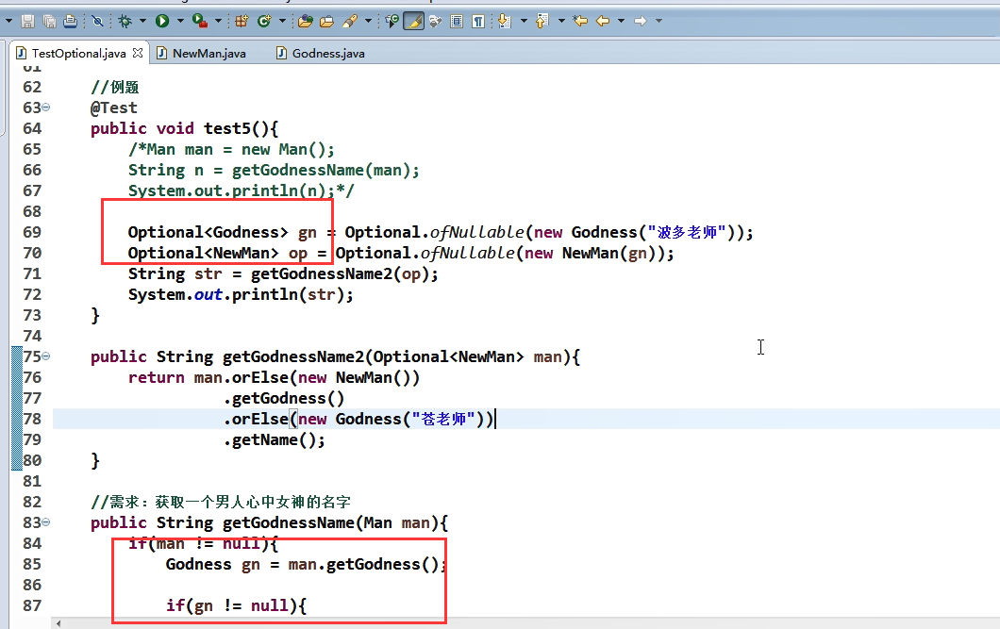


### 重复注解与类型注解（实际应用想不到:cry:)

