# NoSql入门和概述

单机mysql：一个网站的访问量一般都不大，用单个数据库完全可以轻松应付。并且更多的都是静态网页，动态交互类型的网站不多。

这种架构的数据存储的瓶颈是：

1. 数据量的总大小一个机器放不下
2. 数据的索引（B+Tree）一个机器的内存放不下
3. 访问量（读写混合）一个实例不能承受

NoSql（NoSql=Not Only SQL）:非关系型数据库

特点：

1. 易扩展
2. 大数据量高性能
3. 多样灵活的数据模型
4. 传统RDBMS 关系型数据库  VS NOSQL非关系型数据库

> 面试时，谈谈对redis的理解：
>
> 回答：redis是什么，redis主要能干什么：KV（键值）、Cache（缓存）、Persistence（持久化）

> 为什么需要用NOSQL数据库?
>
> - 主要是由于互联网发展，数据量越来越大，对性能要求越来越高，传统的关系型数据库mysql、Oracle存在着一些不足，就是难以扩展，自然无法满足海量的要求，而NOSQL就刚好解决了这些问题，易扩展，大数据量，读写性能非常高


3V+3高：大数据时代的3V：海量、多样、实时；互联网需求的3高：高并发、高可扩、高性能

（ 阿里的UDSL：统一数据服务平台）

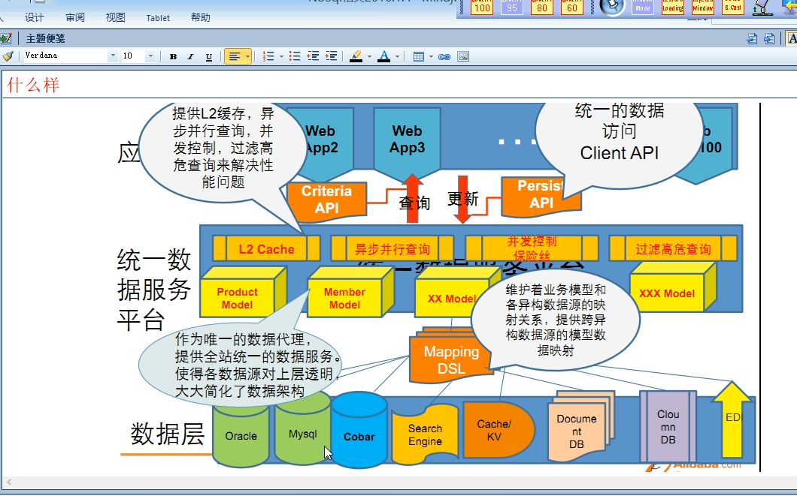

> 例子：
>
> 
>
> 商品基本信息：关系型数据库（mysql/oracle）
>
> 商品描述、详情、评价信息（多文字类）：文档数据库MongoDB
>
> 商品的图片：分布式的文件系统中（淘宝自己的TFS、google的GFS、Hadoop的HDFS）
>
> 商品的关键字：（搜索框地方）搜索引擎，淘宝内用、ISearch
>
> 商品的波段性的热点高频信息：（例如七夕过节热搜词）（内存数据库）redis、memcache、tair
>
> 商品的交易、价格计算、积分累计：外部第三方支付接口
>
> 解决方案：阿里的UDSL：统一数据服务平台


>BSON 是一种类json的一种二进制形式的存储格式，简称Binary JSON
>
>它和json一样，支持内嵌的文档对象和数组对象
>
>
>
>（高并发的操作是不太建议有关联查询的；
>
>互联网公司用冗余数据来避免关联查询；
>
>分布式事务是支持不了太多的并发的）


## NOSQL数据模型简介

聚合模型：

- KV键值

- Bson

- 列族：按列存储数据。

  最大的特点是方便存储结构化和半结构化数据，方便做数据压缩，对针对某一列或者某几列的查询有非常大的IO优势。

  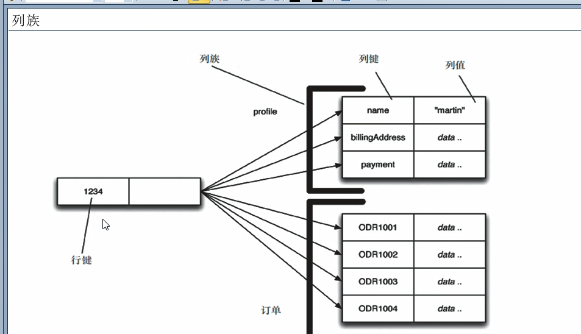

  

- 图形

## NOSQL数据库的四大分类

- KV键值：（内容缓存，主要用于处理大量数据的高访问负载，也用于一些日志系统等）redis

- 文档型数据库（bson格式比较多）：MongoDB、CouchDB

  MongoDB是一个基于分布式文件存储的数据库。

- 列存储数据库：（分布式文件系统）HBase、Cassandra

- 图关系数据库：（它不是放图形的，放的是关系比如：朋友圈社交网络、广告推荐系统、社交网络、推荐系统等。专注于构建关系图谱）Neo4J、InfoGrid


 

## 在分布式数据库中CAP原理CAP+BASE（不懂？）


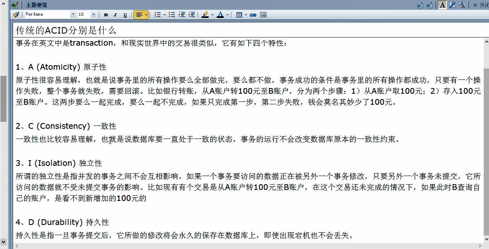 


CAP :

- C :Consistency（强一致性）
- A：Availability（可用性）
- P：Partition tolerance（分区容错性）（分区容错性是必须需要实现的）

CAP理论的核心是：一个分布式系统不可能同时很好的满足一致性，可用性和分区容错性这三个需求，最多只能同时较好的满足两个。

**大多数网站架构的选择：AP** 

CA：传统的oracle数据库

CP：redis、MongoDB 


BASE：

（为了解决关系数据库强一致性引起的问题而引起的可用性降低而提出的解决方案）

- 基本可用
- 软状态
- 最终一致

>分布式：不同的多台服务器上面部署不同的服务模块（工程），他们之间通过Rpc/Rmi之间通信和调用，对外提供服务和组内协作
>
>集群：不同的多台服务器上面部署相同的服务模块，通过分布式调度软件进行统一的调度，对外提供服务和访问


# Redis

## 为什么redis是单线程的 

- 因为redis是基于内存的操作，CPU不是redis的瓶颈，redis的瓶颈最有可能是机器内存的大小或者网络带宽。既然单线程容易实现，而且CPU不会成为瓶颈，那就顺理成章的采用单线程的方案

- redis：是一个基于内存的高性能key-value数据库

  （整个数据库加载在内存当中进行操作，定期通过异步操作把数据库数据flush到硬盘上保存。因为是纯内存操作，redis性能非常出色，每秒可以处理超过10万次读写操作）

  - 缺点：
    - 数据库容量受到物理内存的限制，不能用作海量数据的高性能读写，因此redis适合的场景主要局限在较小数据量的高性能操作和运算上

redis与其他key-value缓存产品有以下三个特点：

- redis支持数据的持久化，可以将内存中的数据保存在磁盘中重启时可再次加载进行使用
- redis不仅仅支持简单的key-value 类型的数据，同时还提供list、set、zset、hash等数据结构的存储
- redis支持数据的备份，即master-slave模式的数据备份


> redis 线程模型：
>
> 单进程（redis实际处理速度完全依靠主进程的执行效率）（redis利用队列技术将并发访问变为串行访问）
>
> redis默认16个数据库（默认index从0开始，初始默认使用0号库）
>
> redis索引都是从0开始

## 相关命令

### 安装相关命令

查看redis状态：ps -ef|grep redis

启动：redis-server ./redis.conf  	(redis-server /usr/local/redis/redis.conf)

进入命令行模式：redis-cli

关闭redis：shutdown save --》exit

认证：auth 123456

查看redis是否开机启动：chkconfig --list |grep redis

启动：chkconfig redis on

关闭：chkconfig redis off

查看服务状态：service redis status

启动服务：service redis start

停止服务：service redis stop

重启服务：service redis restart

切换数据：select index  	(select 0)


清空当前库的数据：flushdb

清空所有库的数据：flushall


查看redis使用情况及状态信息：info


### 日常开发常用命令

http://www.redis.net.cn/order/

https://redis.io/commands/strlen

#### key命令 

查看key的总数：dbsize

查看所有key：keys *

判断某个key是否存在：EXISTS key1

当前库没有了，被移除到1号库中： MOVE k1 1

为给定的key设置过期时间：expire key 秒钟

查看还有多少秒过期，-1表示永不过期，-2表示已过期（从缓存（内存）中移除）：ttl key

查看key的类型：type key

删除key ：del key

追加：append

返回key的String类型value的长度：strlen（如果key对应的非String类型，就返回错误）

对数字的加减：incr、decr、incrby、decrby

（incr k3 每次增加1）（INCRBY k3 6 每次增加6）

获取指定区间范围内的值：getrange（从0~-1表示全部）

```java
127.0.0.1:6379> GETRANGE k1 0 -1
"hello"
127.0.0.1:6379> GETRANGE k1 0 2
"hel"
```

设置指定区间范围内的值：SETRANGE key offset value

```java
127.0.0.1:6379> get k1
"hello"
127.0.0.1:6379> GETRANGE k1 0 2
"hel"
127.0.0.1:6379> SETRANGE k1 0 666
(integer) 5
127.0.0.1:6379> get k1
"666lo"
```

将值value关联到key，并将key的生存时间设为seconds（以秒为单位）：setex(set with expire)键秒值（**SETEX key seconds value**）

将key的值设为value，当且仅当key不存在：setnx(set if not exist) **SETNX key value**

同时设置一个或多个key -value 值：mset 、msetnx

返回所有（一个或多个）给定key的值：mget

```java
127.0.0.1:6379> mset k1 v1 k2 v2 k3 v3
OK
127.0.0.1:6379> mget k1 k2 k3
1) "v1"
2) "v2"
3) "v3"
127.0.0.1:6379> get k1
"v1"
127.0.0.1:6379> keys *
1) "key2"
2) "k3"
3) "k2"
4) "k1"
5) "UseKey:idkey1"
6) "mylist"
127.0.0.1:6379> mget k1 k2 key2 k3
1) "v1"
2) "v2"
3) "125hello"
4) "v3"
127.0.0.1:6379> 
```

将给定key的值设为value，并返回key的旧值（先get再set）：GETSET k1 hi

#### list命令

将一个或多个值value插入到列表key的表头：lpush

将一个或多个值value插入到列表key的表尾（最右边）：rpush

返回列表key中指定区间内的元素，区间以偏移量start和stop指定：lrange

移除并返回列表key的头元素：lpop

移除并返回列表key的尾元素：rpop

返回列表中，下标为index的元素：lindex key index

返回列表key的长度：llen

删N个value：lrem key  count value

```java
127.0.0.1:6379> llen k5
(integer) 16
127.0.0.1:6379> lrange k5 0 -1
 1) "2"
 2) "2"
 3) "2"
 4) "2"
 5) "2"
 6) "3"
 7) "3"
 8) "3"
 9) "8"
10) "8"
11) "8"
12) "9"
13) "9"
14) "9"
15) "4"
16) "4"
127.0.0.1:6379> LREM k5 3 4
(integer) 2
127.0.0.1:6379> lrange k5 0 -1
 1) "2"
 2) "2"
 3) "2"
 4) "2"
 5) "2"
 6) "3"
 7) "3"
 8) "3"
 9) "8"
10) "8"
11) "8"
12) "9"
13) "9"
14) "9"
127.0.0.1:6379> llen k5
(integer) 14
127.0.0.1:6379> 
```

开始index 结束index，截取指定范围的值后再赋值给key：ltrim key start stop

```java
127.0.0.1:6379> lrange k5 0 -1
 1) "2"
 2) "2"
 3) "2"
 4) "2"
 5) "2"
 6) "3"
 7) "3"
 8) "3"
 9) "8"
10) "8"
11) "8"
12) "9"
13) "9"
14) "9"
127.0.0.1:6379> LTRIM k5 9 14
OK
127.0.0.1:6379> lrange k5 0 -1
1) "8"
2) "8"
3) "9"
4) "9"
5) "9"
127.0.0.1:6379> 
```

**RPOPLPUSH source destination** （源列表 目的列表）

命令 [RPOPLPUSH](http://redisdoc.com/list/rpoplpush.html#rpoplpush) 在一个原子时间内，执行以下两个动作：

- 将列表 `source` 中的最后一个元素(尾元素)弹出，并返回给客户端。
- 将 `source` 弹出的元素插入到列表 `destination` ，作为 `destination` 列表的的头元素。

```java
127.0.0.1:6379> lrange k11 0 -1
1) "1"
2) "2"
3) "3"
127.0.0.1:6379> lrange k10 0 -1
1) "3"
2) "2"
3) "1"
127.0.0.1:6379> RPOPLPUSH k10 k11
"1"
127.0.0.1:6379> lrange k11 0 -1
1) "1"
2) "1"
3) "2"
4) "3"
127.0.0.1:6379> lrange k10 0 -1
1) "3"
2) "2"
```

将列表key下标为index的元素的值设置为value：lset key index value

```java
127.0.0.1:6379> lrange k11 0 -1
1) "1"
2) "1"
3) "2"
4) "3"
127.0.0.1:6379> LSET k11 1 5
OK
127.0.0.1:6379> lrange k11 0 -1
1) "1"
2) "5"
3) "2"
4) "3"
127.0.0.1:6379> 
```

将值value插入到列表key当中，位于值pivot之前或之后：LINSERT key BEFORE|AFTER pivot value

```java
127.0.0.1:6379> lrange k11 0 -1
1) "1"
2) "5"
3) "2"
4) "3"
127.0.0.1:6379> LINSERT k11 before 5 java 
(integer) 5
127.0.0.1:6379> lrange k11 0 -1
1) "1"
2) "java"
3) "5"
4) "2"
5) "3"
127.0.0.1:6379> LINSERT k11 after 5 oracle
(integer) 6
127.0.0.1:6379> lrange k11 0 -1
1) "1"
2) "java"
3) "5"
4) "oracle"
5) "2"
6) "3"
127.0.0.1:6379> 
```

#### Set 命令

将一个或多个member元素加入到集合key当中，已经存在于集合的member元素将被忽略：sadd key member（自动排重）

返回集合key中的所有成员：SMEMBERS key

判断member元素是否集合key的成员：SISMEMBER key  member

```java
127.0.0.1:6379> SMEMBERS s0
1) "1"
2) "2"
3) "3"
4) "4"
5) "5"
127.0.0.1:6379> SMEMBERS s1
(empty list or set)
127.0.0.1:6379> SISMEMBER s0 8
(integer) 0
127.0.0.1:6379> SISMEMBER s0 5
(integer) 1
127.0.0.1:6379> 
```

获取集合里面的元素个数：scard key

删除集合中元素：srem key value

某个整数（随机出几个数）：

```java
127.0.0.1:6379> SMEMBERS s0
1) "1"
2) "2"
3) "3"
4) "5"
5) "6"
6) "7"
7) "8"
8) "9"
127.0.0.1:6379> SCARD s0
(integer) 8
127.0.0.1:6379> SRANDMEMBER s0 3
1) "1"
2) "3"
3) "8"
127.0.0.1:6379> SRANDMEMBER s0 3
1) "9"
2) "3"
3) "6"
```

随机出栈：spop key

```java
127.0.0.1:6379> SMEMBERS s0
1) "1"
2) "2"
3) "3"
4) "5"
5) "6"
6) "7"
7) "8"
8) "9"
127.0.0.1:6379> spop s0 2
1) "1"
2) "3"
127.0.0.1:6379> SMEMBERS s0
1) "2"
2) "5"
3) "6"
4) "7"
5) "8"
6) "9"
127.0.0.1:6379> spop s0 
"2"
127.0.0.1:6379> SMEMBERS s0
1) "5"
2) "6"
3) "7"
4) "8"
5) "9"
```

将key1里的某个值赋给key2：smove key1 key2

```java
127.0.0.1:6379> SMEMBERS s1
1) "5"
2) "7"
3) "8"
4) "9"
127.0.0.1:6379> SMEMBERS s0
1) "7"
2) "8"
3) "9"
127.0.0.1:6379> sadd s0 x
(integer) 1
127.0.0.1:6379> SMEMBERS s0
1) "x"
2) "8"
3) "7"
4) "9"
127.0.0.1:6379> SMOVE s0 s1 x
(integer) 1
127.0.0.1:6379> SMEMBERS s0
1) "8"
2) "7"
3) "9"
127.0.0.1:6379> SMEMBERS s1
1) "8"
2) "7"
3) "5"
4) "9"
5) "x"
127.0.0.1:6379> 
```

差集：sdiff（在第一个set里面而不在后面任何一个set里面的项）

交集：sinter

并集：sunion

```java
127.0.0.1:6379> SMEMBERS s0
1) "8"
2) "7"
3) "9"
127.0.0.1:6379> SMEMBERS s1
1) "8"
2) "7"
3) "5"
4) "9"
5) "x"
127.0.0.1:6379> SDIFF s0 s1
(empty list or set)
127.0.0.1:6379> SDIFF s1 s0
1) "x"
2) "5"
127.0.0.1:6379> SINTER s0 s1
1) "8"
2) "7"
3) "9"
127.0.0.1:6379> SUNION s0 s1
1) "x"
2) "9"
3) "8"
4) "5"
5) "7"
127.0.0.1:6379> 

```

#### Hash命令 

| [Redis Hdel 命令](http://www.redis.net.cn/order/3564.html) | 删除一个或多个哈希表字段                          |
| ---------------------------------------- | ------------------------------------- |
| [Redis Hexists 命令](http://www.redis.net.cn/order/3565.html) | 查看哈希表 key 中，指定的字段是否存在。                |
| [Redis Hget 命令](http://www.redis.net.cn/order/3566.html) | 获取存储在哈希表中指定字段的值/td>                   |
| [Redis Hgetall 命令](http://www.redis.net.cn/order/3567.html) | 获取在哈希表中指定 key 的所有字段和值                 |
| [Redis Hincrby 命令](http://www.redis.net.cn/order/3568.html) | 为哈希表 key 中的指定字段的整数值加上增量 increment 。   |
| [Redis Hincrbyfloat 命令](http://www.redis.net.cn/order/3569.html) | 为哈希表 key 中的指定字段的浮点数值加上增量 increment 。  |
| [Redis Hkeys 命令](http://www.redis.net.cn/order/3570.html) | 获取所有哈希表中的字段                           |
| [Redis Hlen 命令](http://www.redis.net.cn/order/3571.html) | 获取哈希表中字段的数量                           |
| [Redis Hmget 命令](http://www.redis.net.cn/order/3572.html) | 获取所有给定字段的值                            |
| [Redis Hmset 命令](http://www.redis.net.cn/order/3573.html) | 同时将多个 field-value (域-值)对设置到哈希表 key 中。 |
| [Redis Hset 命令](http://www.redis.net.cn/order/3574.html) | 将哈希表 key 中的字段 field 的值设为 value 。      |
| [Redis Hsetnx 命令](http://www.redis.net.cn/order/3575.html) | 只有在字段 field 不存在时，设置哈希表字段的值。           |
| [Redis Hvals 命令](http://www.redis.net.cn/order/3576.html) | 获取哈希表中所有值                             |

```java
127.0.0.1:6379> hset user id h1
(integer) 1
127.0.0.1:6379> type user
hash
127.0.0.1:6379> hkeys user
1) "id"
127.0.0.1:6379> hset user name zhangsan
(integer) 1
127.0.0.1:6379> hget user name
"zhangsan"
127.0.0.1:6379> hget user id
"h1"
127.0.0.1:6379> hkeys user
1) "id"
2) "name"
127.0.0.1:6379> hexists user idd
(integer) 0
127.0.0.1:6379> hexists user id
(integer) 1
127.0.0.1:6379> HGETALL user
1) "id"
2) "h1"
3) "name"
4) "zhangsan"
127.0.0.1:6379> hlen user
(integer) 2
127.0.0.1:6379> hmget user id
1) "h1"
127.0.0.1:6379> hset user id h2
(integer) 0
127.0.0.1:6379> HVALS user
1) "h2"
2) "zhangsan"
127.0.0.1:6379> 
```

#### Zset命令 

（在set基础上，加一个score值。之前set是k1 v1 v2，现在Zset是k1 score1 v1 score2）

| 命令                                       | 描述                                   |
| ---------------------------------------- | ------------------------------------ |
| [Redis Zadd 命令](http://www.redis.net.cn/order/3609.html) | 向有序集合添加一个或多个成员，或者更新已存在成员的分数          |
| [Redis Zcard 命令](http://www.redis.net.cn/order/3610.html) | 获取有序集合的成员数                           |
| [Redis Zcount 命令](http://www.redis.net.cn/order/3611.html) | 计算在有序集合中指定区间分数的成员数                   |
| [Redis Zincrby 命令](http://www.redis.net.cn/order/3612.html) | 有序集合中对指定成员的分数加上增量 increment          |
| [Redis Zinterstore 命令](http://www.redis.net.cn/order/3613.html) | 计算给定的一个或多个有序集的交集并将结果集存储在新的有序集合 key 中 |
| [Redis Zlexcount 命令](http://www.redis.net.cn/order/3614.html) | 在有序集合中计算指定字典区间内成员数量                  |
| [Redis Zrange 命令](http://www.redis.net.cn/order/3615.html) | 通过索引区间返回有序集合成指定区间内的成员                |
| [Redis Zrangebylex 命令](http://www.redis.net.cn/order/3616.html) | 通过字典区间返回有序集合的成员                      |
| [Redis Zrangebyscore 命令](http://www.redis.net.cn/order/3617.html) | 通过分数返回有序集合指定区间内的成员                   |
| [Redis Zrank 命令](http://www.redis.net.cn/order/3618.html) | 返回有序集合中指定成员的索引                       |
| [Redis Zrem 命令](http://www.redis.net.cn/order/3619.html) | 移除有序集合中的一个或多个成员                      |
| [Redis Zremrangebylex 命令](http://www.redis.net.cn/order/3620.html) | 移除有序集合中给定的字典区间的所有成员                  |
| [Redis Zremrangebyrank 命令](http://www.redis.net.cn/order/3621.html) | 移除有序集合中给定的排名区间的所有成员                  |
| [Redis Zremrangebyscore 命令](http://www.redis.net.cn/order/3622.html) | 移除有序集合中给定的分数区间的所有成员                  |
| [Redis Zrevrange 命令](http://www.redis.net.cn/order/3623.html) | 返回有序集中指定区间内的成员，通过索引，分数从高到底           |
| [Redis Zrevrangebyscore 命令](http://www.redis.net.cn/order/3624.html) | 返回有序集中指定分数区间内的成员，分数从高到低排序            |
| [Redis Zrevrank 命令](http://www.redis.net.cn/order/3625.html) | 返回有序集合中指定成员的排名，有序集成员按分数值递减(从大到小)排序   |
| [Redis Zscore 命令](http://www.redis.net.cn/order/3626.html) | 返回有序集中，成员的分数值                        |
| [Redis Zunionstore 命令](http://www.redis.net.cn/order/3627.html) | 计算给定的一个或多个有序集的并集，并存储在新的 key 中        |
| [Redis Zscan 命令](http://www.redis.net.cn/order/3628.html) | 迭代有序集合中的元素（包括元素成员和元素分值）              |

```java
127.0.0.1:6379> zadd zset01 60 v1 70 v2 80 v3 90 v4
(integer) 4
127.0.0.1:6379> ZRANGE zset01 0 -1
1) "v1"
2) "v2"
3) "v3"
4) "v4"
127.0.0.1:6379> ZRANGE zset01 0 -1 withscores
1) "v1"
2) "60"
3) "v2"
4) "70"
5) "v3"
6) "80"
7) "v4"
8) "90"
127.0.0.1:6379> ZRANGEBYSCORE zset01 50 80
1) "v1"
2) "v2"
3) "v3"
127.0.0.1:6379> ZRANGEBYSCORE zset01 50 (80
1) "v1"
2) "v2"
127.0.0.1:6379> ZRANGEBYSCORE zset01 (50 (80
1) "v1"
2) "v2"
127.0.0.1:6379> ZRANGEBYSCORE zset01 (60 (80
1) "v2"
127.0.0.1:6379> ZRANGEBYSCORE zset01 60 80 
1) "v1"
2) "v2"
3) "v3"
127.0.0.1:6379> ZRANGEBYSCORE zset01 60 80  limit 2 2
1) "v3"
127.0.0.1:6379> ZRANGEBYSCORE zset01 60 80  limit 0 2
1) "v1"
2) "v2"
127.0.0.1:6379> ZRANGEBYSCORE zset01 60 80  limit 1 2
1) "v2"
2) "v3"
127.0.0.1:6379> zrem zset01 v4
(integer) 1
127.0.0.1:6379> ZRANGE zset01 0 -1
1) "v1"
2) "v2"
3) "v3"
127.0.0.1:6379> ZCARD zset01
(integer) 3
127.0.0.1:6379> zcount zset01 60 80
(integer) 3
127.0.0.1:6379> ZRANk zset01 v3
(integer) 2
127.0.0.1:6379> ZSCORE zset01 v2
"70"
127.0.0.1:6379> ZREVRANk zset01 v2
(integer) 1
127.0.0.1:6379> ZREVRANk zset01 v4
(nil)
127.0.0.1:6379> ZREVRANk zset01 v3
(integer) 0
127.0.0.1:6379> ZREVRANGE zset01 0 -1
1) "v3"
2) "v2"
3) "v1"
127.0.0.1:6379> ZREVRANGEBYLEX zset01 60 80
(error) ERR min or max not valid string range item
127.0.0.1:6379> ZREVRANGEBYLEX zset01 80 60
(error) ERR min or max not valid string range item
127.0.0.1:6379> ZREVRANGEBYLEX zset01 70 60
(error) ERR min or max not valid string range item
127.0.0.1:6379> ZREVRANGEBYSCORE zset01 80 60
1) "v3"
2) "v2"
3) "v1"
127.0.0.1:6379> 
```


## redis数据类型

### Redis五大数据类型

- String（字符串）

  String类型是二进制安全的。（意思是redis的String可以包含任何数据，比如jpg图片或者序列化的对象）

  String类型是redis最基本数据类型，一个redis中字符串value最多可以是512M

- Hash（哈希，类似java里的Map）

  键值对集合

  是一个String类型的field和value的映射表，hash特别适应于存储对象

  （类似java里面的Map<String ,Object>）

- List（列表）

  简单的字符串列表，可添加一个元素到列表的头部（左边）或者尾部（右边）

  它的底层实际上是个链表

  字符串链表，left、right都可以插入添加

  如果键不存在，创建新的链表

  如果键已存在，新增内容

  如果全移除，对应的键也就消失了

  链表的操作无论是头和尾效率都极高，但假如是对中间元素进行操作，效率就很惨淡了

- Set（集合）

  无序、无重复集合

  它是通过HashTable实现的

- Zset（sorted set：有序集合）

  redis Zset和set 一样也是String类型元素的集合，且不允许重复的成员

  不同的是每个元素都会关联一个double类型的分数

  redis正是通过分数来为集合中的成员进行从小到大的排序。Zset的成员是唯一的，但分数（score）却可以重复


### 应用场景 

| 数据类型   |                                          |
| ------ | ---------------------------------------- |
| String | 比如说，想知道什么时候封锁一个IP地址                      |
| Hash   | 存储用户信息【id,name,age】hset user id h1       |
| List   | 实现最新消息的排行，还可以利用List的push命令，将任务存在List集合，同时使用pop命令，将任务从集合中取出。模拟消息队列：例如，电商中的秒杀就可以采用这种方式来完成一个秒杀活动 |
| Set    | 特殊之处：可以自动排重。比如说微博中将每个人的好友存在集合set中，这样求两个人的共同好友的操作，只需要求交集即可 |
| Zset   | 以某一个条件为权重，进行排序。例如：京东，商品详情的时候，都会有一个综合排名，还可以按价格排名 |


## redis配置文件 

- units单位 

  - 配置大小单位，只支持bytes，不支持bit
  - 对大小写不敏感

- includes

  和Struts配置文件类似，可以通过includes包含，redis.conf作为总闸，包含其他

- general

  tcp-backlog（连接队列）

  Tcp-keepalive：单位为秒，如果设置为0，则不会进行keepalive检测，建议设置成60

- snapshotting快照

- security

  config get requirepass

  ```java
  127.0.0.1:6379> ping
  (error) NOAUTH Authentication required.
  127.0.0.1:6379> auth 123456
  OK
  127.0.0.1:6379> ping
  PONG
  127.0.0.1:6379> config set requirepass ""
  OK
  127.0.0.1:6379> config get requirepass
  1) "requirepass"
  2) ""
  127.0.0.1:6379> ping
  ```

- limits限制

  maxclients maxmemory 

  config get maxmemory-policy 缓存清除策略

  ```java
  10.123.211.186(10.123.211.186:7000)>config get maxmemory-policy
   1)  "maxmemory-policy"
   2)  "noeviction"
  ```

  （生产环境不会设置这种，一般是前五种其中一种）

  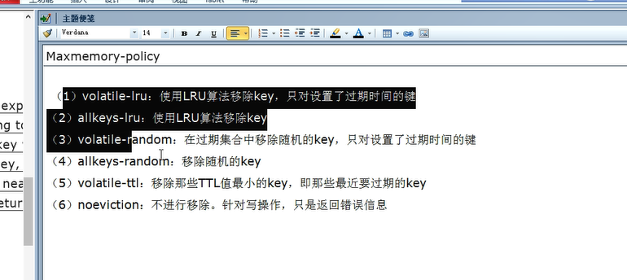

  

  

- append only mode追加


## redis持久化

### RDB （redis database）

**RDB 是整个内存的压缩过的snapshot，RDB的数据结构，可以配置复合的快照触发条件**

**默认：**

**是1分钟内改了一万次**

**或5分钟内改了10次**

**或15分钟内改了1次**

（如果想禁用RDB持久化的策略，只要不设置任何save指令，或者给savage传入一个空字符串参数也可以）

shapshotting快照命令：

- save：只管保存，其它不管，全部阻塞
- bgsave：redis会在后台异步进行快照操作。可以通过lastsave命令获取最后一次成功执行快照的时间
- 执行flushall命令，也会产生dump.rdb文件，但里面是空的，无意义

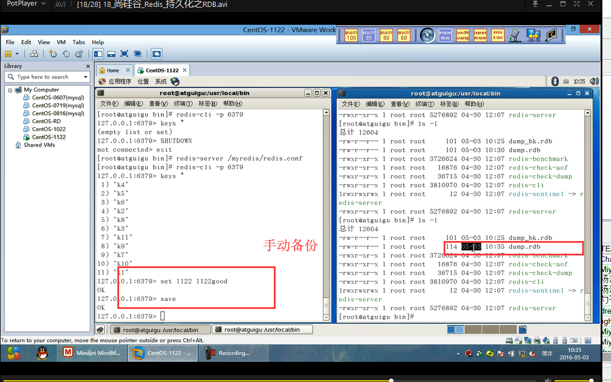

- stop-writes-on-bgsave-error：（如果配置成no，标识你不在乎数据不一致或者有其他的手段发现和控制）
- rdbcompression yes：对于存储到磁盘中的快照，可以设置是否进行压缩存储。如果是的话，redis会采用LZF算法进行压缩。如果你不想消耗CPU来进行压缩的话，你可以设置为关闭此功能
- rdbchecksum：在存储快照后，还可以让redis使用CRC64算法来进行数据校验，但是这样做会增加大约10%的性能消耗，如果希望获取到最大的性能提升，可以关闭此功能
- dbfilename
- dir：config get dir获取目录
- 如何恢复：将备份文件(dump.rdb)移动到redis安装目录并启动服务即可

是在指定的时间内将内存中的数据集快照写入本地磁盘，也就是行话讲的snapshot快照，它恢复时是将快照文件直接读到内存里

redis会单独创建（fork）一个子进程来进行持久化，会将数据写入到一个临时文件中，待持久化过程都结束了，再用这个临时文件替换上次持久化好的文件。整个过程中，主进程是不进行任何IO操作的，这就确保 了极高的性能

fork的作用是：复制一个与当前进程一样的进程。新进程的所有数据（变量、环境变量、程序计数器等）数值都和原进程一致，但是是一个全新的进程，并作为原进程的子进程

如果需要进行大规模数据的恢复，且对于数据恢复的完整性不是非常敏感，那RDB方式要比AOF方式更加的高效。ROB的缺点是最后一次持久化后的数据可能丢失

**RDB保存的是dump.rdb文件**

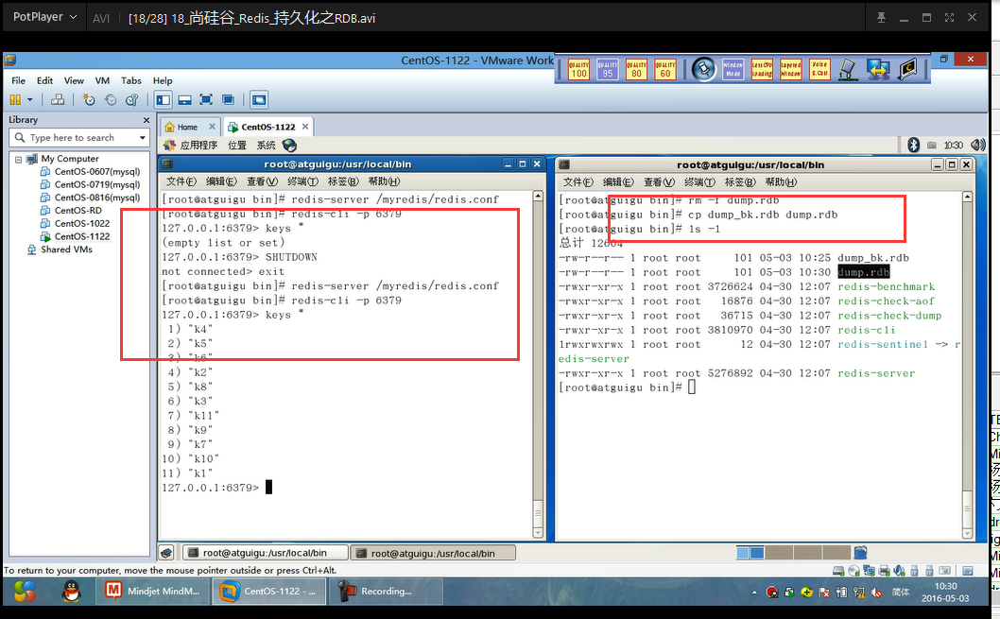

- 优势： 

  - 适合大规模的数据恢复
  - 对数据完整性和一致性要求不高

- 劣势：

  - 会丢失最后一次快照后的所有修改
  - fork的时候，内存中的数据被克隆了一份，大致2被的膨胀性需要考虑

- 如何停止快照

  动态所有停止RDB保存规则的方法：redis-cli config set save ""

  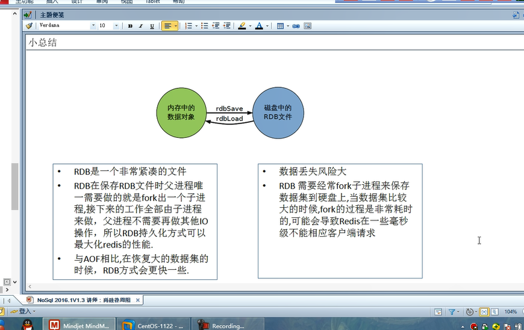

  

### AOF（append only file） 

**以日志的形式来记录每个写操作**，将redis执行过的所有写指令记录下来（读操作不记录），只许追加文件但不可以改写文件，redis启动之初会读取该文件重新构建数据，换言之redis重启的话就根据日志文件的内容将写指令从前到后执行一次以完成数据的恢复工作。

**AOF保存的是appendonly.aof文件**

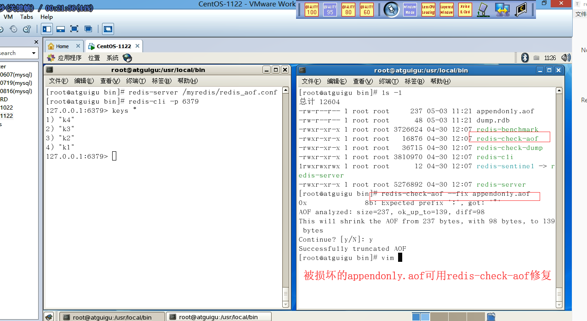

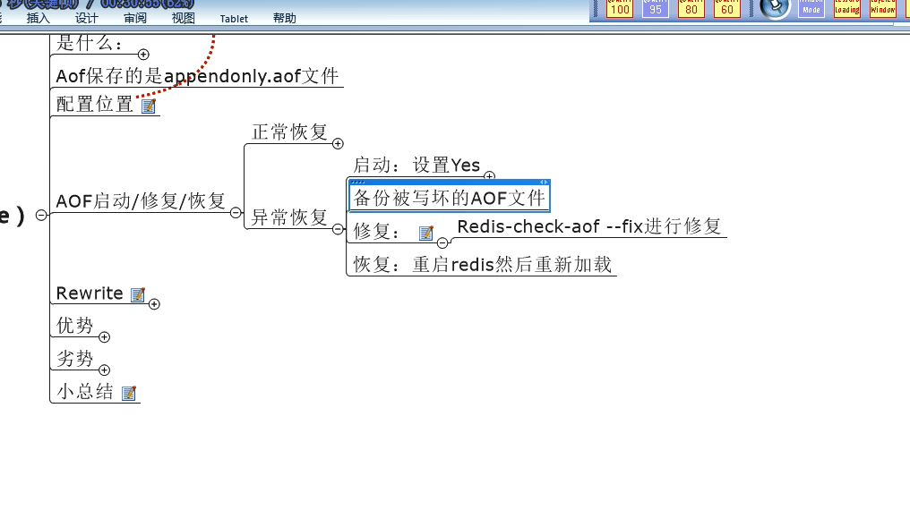


#### 相关配置： 

appendonly :yes（默认是no）

appendfilename：appendonly.aof

appendfsync：

- always：同步持久化每次发生数据变更会被立即记录到磁盘，性能较差但数据完整性比较好
- everysec：出厂默认推荐，异步操作，每秒记录，如果一秒内宕机，有数据丢失
- no

no-appendfync-on-rewrite：重写时是否可以运用appendfsync，用默认no即可，保证数据安全性

auto-aof-rewrite-min-size：设置重写的基准值

auto-aof-rewrite-percentage：设置重写的基准值

rewrite:

- AOF 采用文件追加方式，文件会越来越大为避免出现此种情况，新增了重写机制，当AOF文件的大小超过所设定的阈值时，redis就会启动aof文件的内容压缩，只保留可以恢复数据的最小指令集。可以使用bgrewriteaof
- 触发机制：redis会记录上次重写时aof大小，默认配置是当aof文件大小是上次rewrite后大小的一倍且大小大于64M时触发
- 重写原理：aof文件持续增长而过大时，会fork出一条新进程来将文件重写（也是先写临时文件最后再rename），遍历新进程的内存中数据，每条记录有一条的set语句。重写aof文件的操作，并没有读取旧的aof文件，而是将整个内存中的数据库内容用命令的方式重写了一个新的aof文件，这点和快照有点类似。


- 优势
  - 每秒同步：appendfsync always 同步持久化，每次发生数据变更会被立即记录到磁盘，性能较差但数据完整性比较
  - 每修改同步：appendfsync everysec异步操作，每秒记录。如果一秒内宕机，有数据丢失
  - 不同步：appendfsync no 从不同步
- 劣势
  - 相同数据集的数据而言aof文件要远大于rdb，恢复速度慢于rdb
  - aof运行效率要慢于rdb，每秒同步策略效率较好，不同步效率和rdb相同

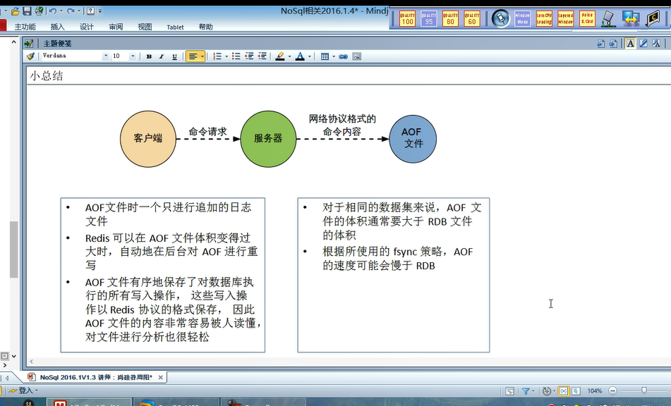

### 两种备份恢复方式的选择建议：

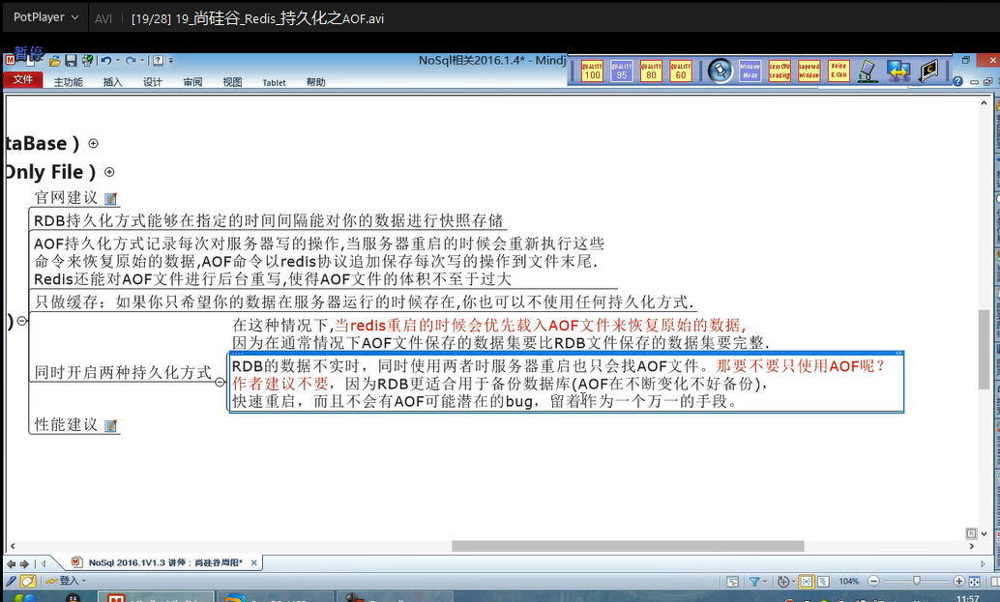

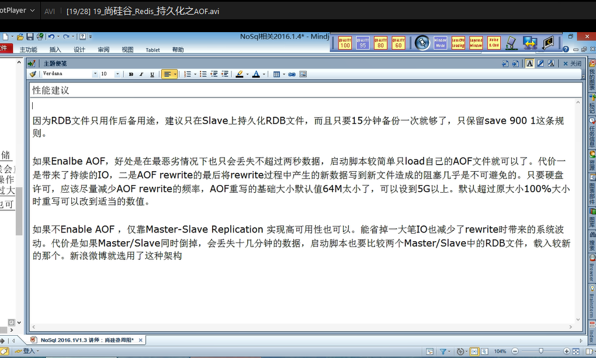

## redis 事务 

可以一次执行多个命令，本质是一组命令的集合。一个事务中的所有命令都会序列化，按顺序地串行化执行执行而不会被其它命令插入，不许加塞

一个队列中，一次性、顺序性、排他性的执行一系列命令

（redis支持部分事务）

###  常用命令：

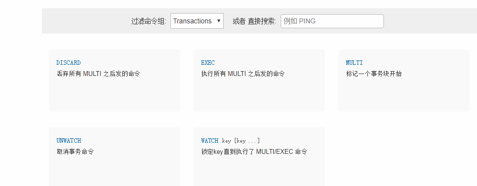


- Case1：正常执行：multi -->exec

- Case2：放弃事务：multi-->discard

- Case3：全体连坐：multi-->exec（有报错时全部回退，还没有加入队列就报错）

- Case4：冤头债主：multi-->exec（加入队列，但运行时报错时，只有报错的无效，其它都有效）

- Case5：watch监控

  - 悲观锁/乐观锁/CAS（check and set）

    - 悲观锁：（表锁）

    - 乐观锁：顾名思义就是很乐观，每次去拿数据的时候都认为别人不会修改，**所以不会上锁**，但是在更新的时候会判断一下在此期间别人有没有去更新这个数据，可以使用版本号等机制。乐观锁适用于多读的应用类型，这样可提高吞吐量

      **乐观锁策略：提交版本必须大于记录当前版本才能执行更新**

    - CAS：

  - 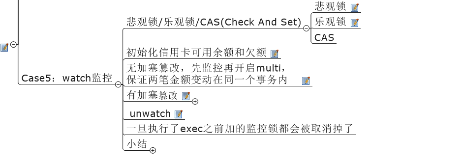

  - watch指令，类似乐观锁，事务提交时，如果key的值已被别的客户端改变，比如某个list已被别的客户端push/pop过了，整个事务队列都不会被执行

  - 通过watch命令在事务执行之前监控了多个keys，倘若在watch之后有任何key发生了变化，exec命令执行的事务都将被放弃，同时返回Nullmulti-bulk应答以通知调用者事务执行失败


redis事务的3阶段：

- 开启：以multi开始一个事务
- 入队：将多个命令入队到事务中，接到这些命令并不会立即执行，而是放到等待执行的事务队列里面
- 执行：由EXEC命令触发事务

redis事务的3特性：

- 单独的隔离操作：事务中所有命令都会序列化、按顺序地执行。事务在执行的过程中，不会被其它客户端发送来的命令请求所打断
- 没有隔离级别的概念：队列中的命令没有提交之前都不会实际的被执行，因为事务提交前任何指令都不会被实际执行，也就不存在“事务内的查询要看到事务里的更新，在事务外查询不能看到”这问题
- 不保证原子性：redis同一个事务中如果有一条命令执行失败，其后的命令仍然会被执行，没有回滚（redis部分事务）


## redis的发布订阅 

进程间的一种消息通信模式：发送者（pub）发送消息，订阅者（sub）接收消息

先订阅后发布才能收到消息

- 可以一次性订阅多个，subscribe c1 c2 c3
- 消息发布，publish c2 hello-redis
- 订阅多个，通配符*，psubscribe new *
- 收取消息，publish new1 redis2018

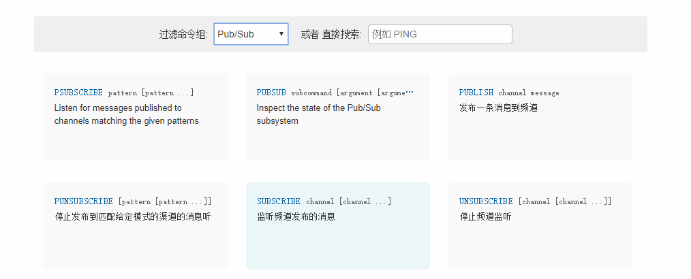

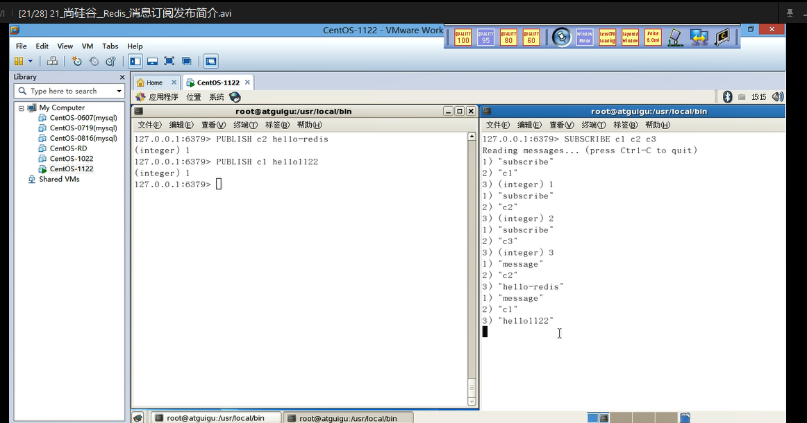


## redis的主从复制 (master/stave)

主机数据更新后根据配置和策略，自动同步到备机的master/slave机制，master以写为主，slave以读为主

（slave不能写）

（master挂机，slave仍然是slave）

功能：

- 读写分离
- 容灾恢复 

### 如何使用：

- 配从（库）不配主（库）

- 从库配置：slaveof主库ip主库端口

  （每次与master断开之后，都需要重新连接，除非你配置进redis.conf文件）

  （info replication）

  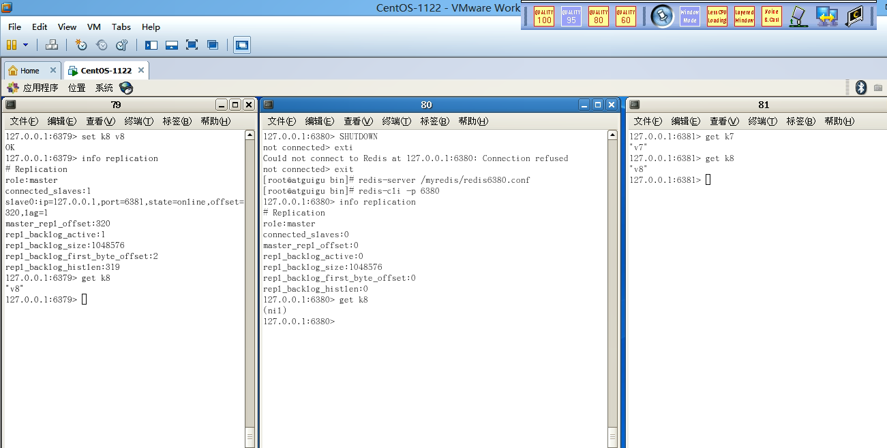

  

- 修改配置文件细节操作

  - 拷贝多个redis.conf文件
  - 开启daemonize yes
  - pid文件名字
  - 指定端口
  - log文件名字
  - dump.rdb名字

  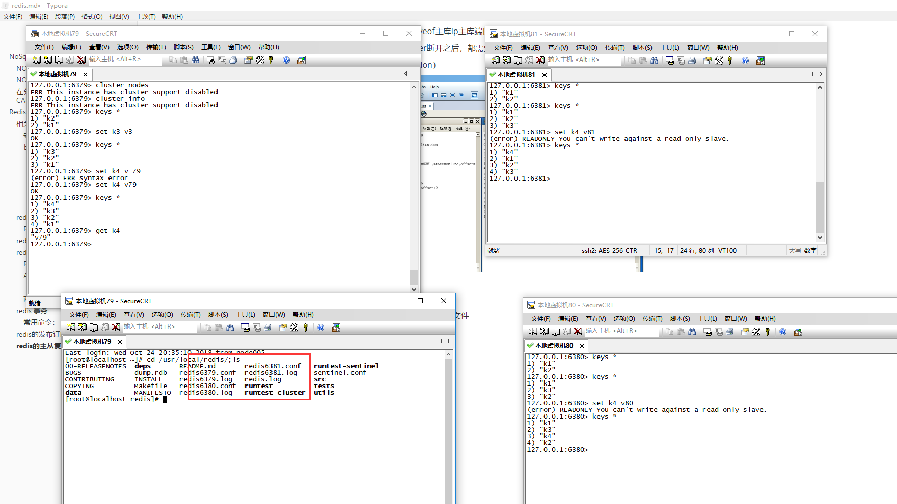

  

- 常用3招

  - 一主二仆

  - 薪火相传

    

    - 上一个slave可以是下一个slave的master，slave同样可以接收其他slaves的连接和同步请求，那么该slave作为了链条中下一个master，可以有效减轻master的写压力

    - 中途变更转向：会清除之前的数据，重新建立拷贝最新的

    - slaveof 新主库IP 新主库端口

      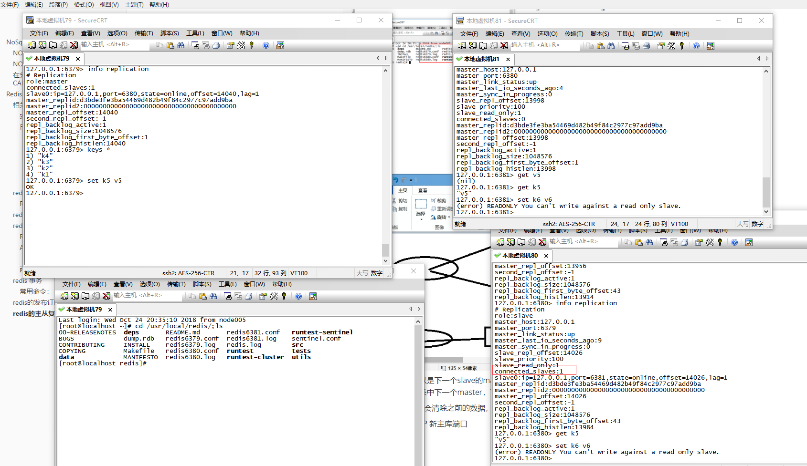

      

  - 反客为主

    slaveof no one：使当前数据库停止与其他数据库的同步，转成主数据库

    slaveof 新主库IP 新主库端口 

复制原理：

- slave启动成功连接到master后会发送一个sync命令
- master接到命令启动后台的存盘进程，同时收集所有接收到的用于修改数据集命令，在后台进程执行完毕之后，master将传送正式数据文件到slave，以完成一次完全同步
- 全量复制：而slave服务在接收到数据库文件数据后，将其存盘并加载到内存中
- 增量复制：master继续讲新的所有收集到的修改命令依次传给slave，完成同步
- 但是只要是重新连接master，一次完全同步（全量复制）将被自动执行

### 哨兵模式 

 反客为主的自动版，能够后台监控主机是否故障，如果故障了根据投票数自动将从库转换为主库

使用步骤：

- 调整结构，6379带着80、81

- 自定义的目录下新建sentinel.conf文件，名字绝不能错

- 配置哨兵，填写内容：

  sentinel monitor被监控数据库名字（自己起名字）127.0.0.1 6379  1

  上面最后一个数字 1 ，表示主机挂掉后slave投票看让谁接替成为主机，得票数多

- 启动哨兵

  redis-sentinel sentinel.conf

  上述目录按照各自的实际情况配置，可能目录不同

- 正常主从演示

- 原有的master挂了

- 投票新选

- 重新主从继续开工，info replication 查查看

- 问题：如果之前的master重启回来，会不会双master冲突？

  不会，重启回来就是slave

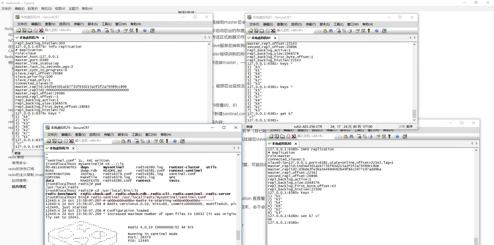


一组sentinel能同时监控多个master

复制的缺点：

- 复制延时

  由于所有的写操作都是先在master上操作，然后同步更新到slave上，所以从master同步到slave机器有一定的延迟，当系统很繁忙时，延迟问题会更加严重，slave机器数量的增加也会使这个问题更加严重

## Jedis

```java
@Test
public void test() {
  Jedis jedis = new Jedis("192.168.230.129", 6380);
  System.out.println(jedis.ping());
  jedis.set("k8", "v8");
  System.out.println(jedis.get("k8"));
  Set<String> keys = jedis.keys("*");
  System.out.println(keys.size());
}
```

### jedis 事务提交 

```java
@Test
	public void test2() throws Exception {
	  Jedis jedis = new Jedis("192.168.230.129", 6380);
      int balance = 0;
		int debt = 0;
		int amtToSubtract = 10;
//		jedis.watch("balance");
		balance = Integer.parseInt(jedis.get("balance"));
		Thread.sleep(7000);
		if(balance < amtToSubtract) {
//			jedis.unwatch();
			System.out.println("modify");
		}else {
			System.out.println("--------transaction");
			Transaction multi = jedis.multi();
			multi.decrBy("balance", amtToSubtract);
			multi.incrBy("debt", amtToSubtract);
			multi.exec();
			balance = Integer.parseInt(jedis.get("balance"));
			debt = Integer.parseInt(jedis.get("debt"));
			System.out.println("剩余额度："+balance);
			System.out.println("花费金额："+debt);
		}
	}
```


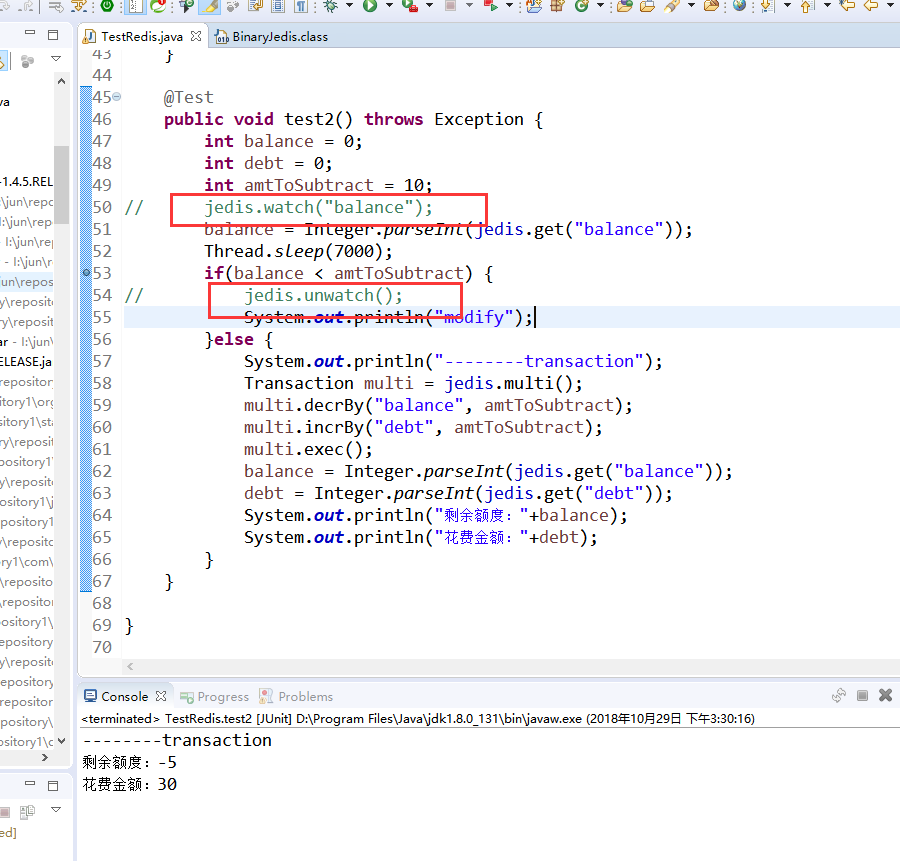

### JedisPool

> 连接池：程序启动就初始化好你设置好的几十个连接，使用的时候，就直接拿初始化好的链接使用，使用完了就丢回连接池
> 没有用连接池的，每次使用都需要建立链接-》使用-》断开链接
> 速度会比连接池慢超级多
> 建立链接是非常消耗时间的

```java
@Test
	public void test4() {
		JedisPool jedisPool = new JedisPool("192.168.230.129", 6380);
		Jedis resource = jedisPool.getResource();
		resource.set("aa", "bb");
	}
```

```java
@Test
	public void test7() throws Exception  {
		LocalDateTime currentTimeMillis = LocalDateTime.now();
		for (int i = 0; i < 100; i++) {
			Jedis jedis1 = new Jedis("192.168.230.129", 6380);
			jedis1.set("nopool2", "nopool");
		}
		LocalDateTime endTimeMillis = LocalDateTime.now();
		System.out.println(Duration.between(currentTimeMillis, endTimeMillis).toMillis());//170:非连接池
	}
	
	@Test
	public void test8() throws Exception {
		JedisPool jedisPool = new JedisPool("192.168.230.129", 6380);
		LocalDateTime currentTimeMillis = LocalDateTime.now();
		for (int i = 0; i < 100; i++) {
			Jedis resource = jedisPool.getResource();
			resource.set("pool2", "bb");
			resource.close();
		}
		LocalDateTime endTimeMillis = LocalDateTime.now();
		System.out.println(Duration.between(currentTimeMillis, endTimeMillis).toMillis());//59：连接池
	}
```

## 其它 

http://blog.51cto.com/13961945/2174326（面试题）

- 缓存穿透
  - 缓存穿透：使用不存在的key进行大量的高并发查询，这导致缓存无法命中，每次请求都要穿透到后端数据库系统进行查询，造成数据库压力过大
  - 解决方案：
    - 将空值缓存起来
    - 使用布隆过滤器崩

- 缓存雪崩：指缓存服务器重启或者大量缓存集中在某一个时间段失效

  - <https://blog.csdn.net/qq_35190492/article/details/102889333?depth_1-utm_source=distribute.pc_relevant.none-task&utm_source=distribute.pc_relevant.none-task> 

  - 解决方案：
    - 对不同的数据使用不同的失效时间，甚至对相同的数据、不同的请求使用不同的失效时间

- https://juejin.im/post/5ca8905ef265da30ba5b18bc

- mysql里有2000W数据，redis只存20W数据，如何保证redis中的数据都是热点数据
  - redis内存数据集大小上升到一定大小的时候，就会施行数据淘汰策略（回收策略）（redis提供6种数据淘汰策略：）
    - volatile-lru：从已设置过期时间的数据集中挑选最近最少使用的数据淘汰
    - volatile-ttl：从已设置过期时间的数据集中挑选将要过期的数据淘汰
    - volatile-random：从已设置过期时间的数据集中任意选择数据淘汰
    - allkeys-lru：从数据集中挑选最近最少使用的数据淘汰
    - allkeys-random：从数据集中任意选择数据淘汰
    - no-enviction（驱逐）：禁止驱逐数据


- redis并发竞争问题
  - 主要发生在并发写竞争
  - 解决方案：
    - 利用redis自带的incr命令
    - 利用独立锁的方式
      - SETNX lock.关键字 <current Unix time + lock timeout + 1> 
      - （如果 SETNX 返回 1 ，说明客户端已经获得了锁， key 设置的unix时间则指定了锁失效的时间。之后客户端可以通过 DEL lock.foo 来释放锁）
      - https://blog.csdn.net/black_ox/article/details/48972085
    - 使用乐观锁的方式
      - 成本较低，非阻塞，性能较高
      - watch指令（事务）
    - 针对客户端，操作前可加锁
      - （应用程序处理资源的同步）synchronized或lock等方式


- redis的内存用完了会发生什么？
  - 如果达到设置的上限，redis的写命令会返回错误信息（但是读命令还可以正常返回）或者你可以将redis当缓存来使用配置淘汰机制，当redis达到内存上限时会冲刷掉旧的内容


- 过期策略
  - 定时
    - 指定在多少时间之后过期
    - redis.conf配置文件设置hz，1s刷新的频率，删除过期key操作
    - java实现的话，就是起个定时任务
  - 惰性
    - key过期的时候不删除，每次从数据库获取key的时候去检查是否过期，若过期，则删除，返回null
  - 定期

## redis的应用场景 

https://blog.csdn.net/qq_34337272/article/details/80012284

- 计数：微博数、粉丝数等
  - String：decr、incr
- 商品的波段性的热点高频信息
  - 如，七夕过节热搜词

- 会话缓存（session cache）
- 消息队列
  - 排行榜：list：lpush、rpush
- 发布、订阅消息（消息通知）
- 商品列表、评论列表
  - hash：hset、hget：存储对象
- 共同关注、共同喜欢
  - set：sadd（自动排重）
- 在直播系统中，实时排行信息包含直播间在线用户列表，各种礼物排行榜，弹幕消息（可以理解为按消息纬度的消息排行榜）
  - zset：zadd

## redis 性能测试 

- 自带相关测试工具

  - redis -benchmark --help

  - redis -benchmard -n 1000000 -q

    (同时执行100万的请求)

# redis 如何利用多核CPU机器的性能 （关于redis是单线程，所以6核以上的机器部署redis是中浪费cpu的说法的思考）

> 首先看CPU频率，如果CPU频率低，并且访问redis的并发很大，那么大个redis线程分摊到每个CPU上的压力也是非常可观的（一个线程并不是一直都bind到一个固定的核上面的）

- redis的读取和处理性能非常强大，一般服务器的cpu都不会是性能瓶颈。redis的性能瓶颈主要集中在内存和网络方面。所以，如果使用的redis命令多为O(N)、O(log(N))时间复杂度，那么基本上不会出现cpu瓶颈的情况。
  但是如果你确实需要充分使用多核cpu的能力，那么需要在单台服务器上运行多个redis实例(主从部署/集群化部署)，并将每个redis实例和cpu内核进行绑定(使用 taskset命令，百度：<https://www.baidu.com/s?wd=taskset&tn=84053098_3_dg&ie=utf-8>)。
  如果需要进行集群化部署，你需要对redis进行分片存储，可以参考<https://redis.io/topics/partitioning>

