> 
>
> 应用架构的发展：单体架构-->分布式架构-->SOA架构-->微服务架构
>
> - 单体架构：java web应用程序，包含表现层、业务层、数据访问层
> - 分布式架构：按业务垂直切分，每个应用都是单体架构，通过API相互调用
> - SOA：其应用程序的不同组件通过网络上的通信协议向其他组件提供服务或消费服务。（阿里开源的Dubbo）
>   - 把模块拆分，使用接口通信，降低模块之间的耦合度
>   - 增加功能时只需要增加一个子项目，调用其他系统的接口即可
> - 微服务：

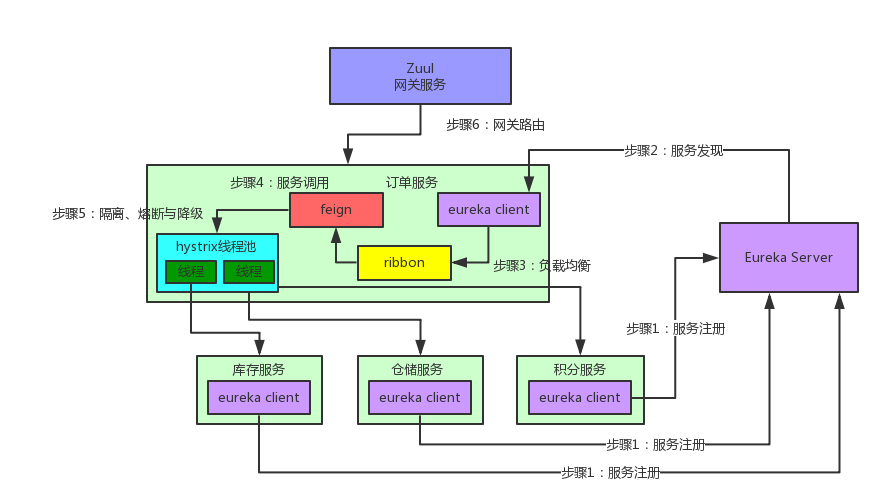

https://blog.csdn.net/weixin_40834464/article/details/88850523

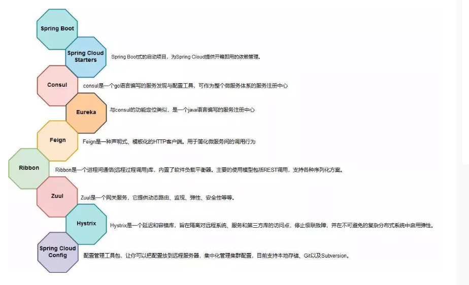

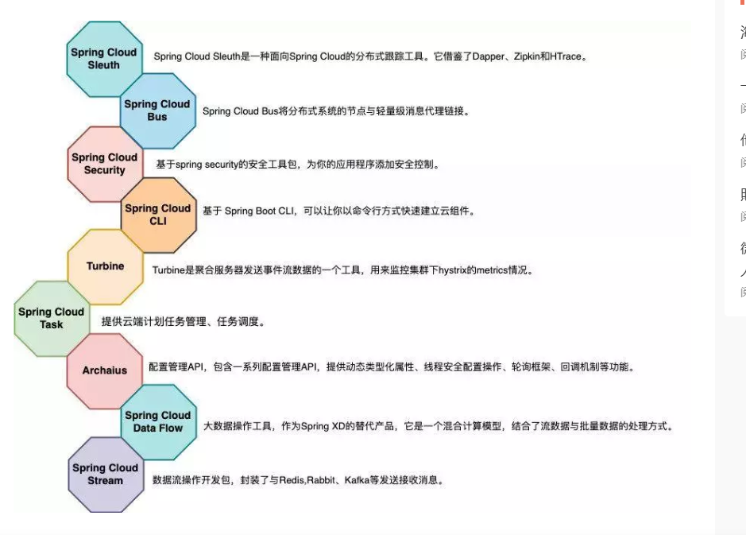


# spring-boot-actuator 

| HTTP方法 | 路径            | 描述                       | 鉴权  |
| -------- | --------------- | -------------------------- | ----- |
| GET      | /autoconfig     | 查看自动配置的使用情况     | true  |
| GET      | /configprops    | 查看配置属性，包括默认配置 | true  |
| GET      | /beans          | 查看bean及其关系列表       | true  |
| GET      | /dump           | 打印线程栈                 | true  |
| GET      | /env            | 查看所有环境变量           | true  |
| GET      | /env/{name}     | 查看具体变量值             | true  |
| GET      | /health         | 查看应用健康指标           | false |
| GET      | /info           | 查看应用信息               | false |
| GET      | /mappings       | 查看所有url映射            | true  |
| GET      | /metrics        | 查看应用基本指标           | true  |
| GET      | /metrics/{name} | 查看具体指标               | true  |
| POST     | /shutdown       | 关闭应用                   | true  |
|          | /trace          | 查看基本追踪信息           | true  |


# spring-cloud-config 

# spring-cloud-bus 

# spring-cloud-stream 

# spring-cloud-sleuth 

# spring-cloud-CLI


# 集群、分布式、微服务、SOA概念 

https://juejin.im/post/5b83466b6fb9a019b421cecc

- 集群：同一个业务，部署在多个服务器上（不同的服务器运行同样的代码，干同一件事）

- 分布式：一个业务分拆多个子业务，部署在不同的服务器上（不同的服务器，运行不同的代码，为了同一个目的）

  - > 有些模块的访问很低的（比如后台管理），那么可以：将每个模块抽取独立出来，访问量大的模块用好的服务器装着，没啥人访问的模块用差的服务器装着。这样的好处是：一、资源合理利用了（没人访问的模块用性能差的服务器，访问量大的模块单独提升性能就好了）二、耦合度降低了：每个模块独立出来，各干各的事（专业的人做专业的事），便于扩展

  - 特点：将系统功能拆分，模块之间独立，在使用的时候再将这些独立的模块组合起来就是一个系统了。

# 为什么需要springcloud 

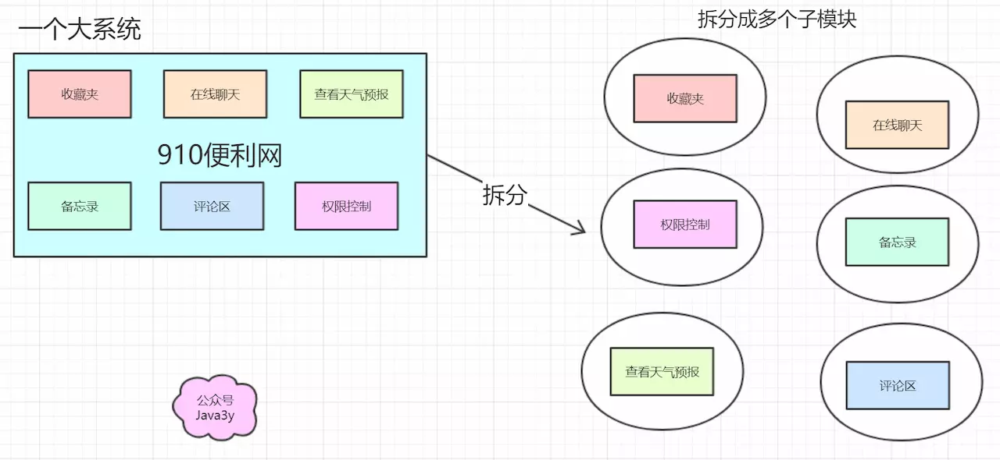

- 拆分出多个模块以后，就会出现各种各样的问题，而springcloud提供了一整套的解决方案（这些模块是独立成一个子系统的（不同主机））
- springcloud的基础功能
  - 服务治理：springcloud eureka
  - 客户端负载均衡：spingcloud ribbon
  - 服务容错保护：springcloud hystrix
  - 声明式服务调用：springcloud feign
  - API网关服务：springcloud zuul
  - 分布式配置中心：springcloud config

# 引出Eureka 

> 核心设计类、设计思想、参数调优及故障演练

- 子系统之间的通讯问题。（子系统与子系统之间不是在同一个环境下，那就需要远程调用，远程调用可能就会想到httpclient、webservice等等技术来实现）
- 那么代码中就显示通过IP地址调用，万一，调用IP地址变了，就需要手动更新调用IP地址了

## Eureka和zookeeper 区别 

- Zookeeper保证的是CP（一致性、容错性）；Eureka保证的是AP（可用性、容错性）
  - Eureka可以很好的应对因网络故障导致部分节点失去联系的情况，而不会像Zookeeper一样使得整个注册系统瘫痪
- Zookeeper有Leader和Follower角色，Eureka各个节点平等
- Zookeeper采用过半数存活原则，Eureka采用自我保护机制解决分区问题
- Eureka本质上是一个工程，而Zookeeper只是一个进程

## Eureka流程 

- 被调用服务Eureka Client组件：负责将这个服务的信息注册到Eureka Server中。即告诉Eureka server，自己在哪台机器上，监听着哪个端口。而Eureka Server是一个注册中心，里面有一个注册表，保存了各服务所在的机器和端口号。

- 调用服务也有Eureka Client组件，这个Eureka Client组件会找Eureka server问一下，被调用服务在哪台机器啊？监听着哪个端口啊？然后就可以把这些相关信息从Eureka Server的注册表中拉取到自己本地缓存起来。这时，调用服务就可以直接找自己本地的Eureka Client问一下被调用服务在哪台机器？监听哪个端口？收到响应后，紧接着就可以发送一个请求过去，调用被调用服务的那个接口。
  - Eureka Server：注册中心，里面有一个注册表，保存了各个服务所在的机器和端口号
  - Eureka Client：负责将这个服务的信息注册到Eureka Server中

## Eureka 的自我保护模式 

> ```java
> //Eureka 自我保护模式，即如果真实服务已经down掉，但在注册中心界面服务却一直存在，且显示为UP状态
> EMERGENCY! EUREKA MAY BE INCORRECTLY CLAIMING INSTANCES ARE 
>  UP WHEN THEY'RE NOT. RENEWALS ARE LESSER THAN THRESHOLD AND 
>  HENCE THE INSTANCES ARE NOT BEING EXPIRED JUST TO BE SAFE.
> ```

- 产生原因
  
- Eureka server在运行期间，会统计心跳失败的比例在15分钟之内是否低于85%，如果出现低于的情（在单机调试时很容易满足，实际在生成环境上通常是由于网络不稳定导致），Eureka server会将当前的实例注册信息保护起来，同时提示这个警告。保护模式主要用于一组客户端和Eureka server之间存在网络分区场景下的保护。一旦进入保护模式，Eureka Server将会尝试保护其服务注册表中的信息，不再删除服务注册表中的数据（也就是不会注销任何微服务）
  
- 解决这种情况的解决方式

  - 等待Eureka Server自动恢复

    - 正常的情况下，等待网络恢复（或者没有频繁的启动与关闭实例）后，等待一段时间Eureka Server会自动关闭自我保护模式，但是如果它迟迟没有关闭该模式，那么便可以尝试手动关闭，例如：重启Eureka Server

  - 重启Eureka Server

    - 通常，PRD环境建议对Eureka Server做负载均衡，这样在依次关闭并开启Eureka Server后，无效的实例会被清除，并且不会对正常的使用造成影响

  - 关闭Eureka的自我保护模式

    - 在Eureka Server yml配置文件中新增如下配置：

      ```yml
      eureka:
        server:
          enable-self-preservation: false #禁用自我保护模式
          eviction-interval-timer-in-ms: 4000 # This is not required
      ```

    - >  Eureka Client端：配置开启健康检查，并按需要配置续约更新时间和到期时间
      >
      > ```yml
      > eureka.client.healthcheck.enabled # 开启健康检查（需要spring-boot-starter-actuator依赖）true 
      > eureka.instance.lease-renewal-interval-in-seconds # 续约更新时间间隔（默认30秒） 10
      > eureka.instance.lease-expiration-duration-in-seconds # 续约到期时间（默认90秒） 30
      > #更改Eureka更新频率将打破服务器的自我保护功能，生产环境下不建议自定义这些配置。 
      > ```

- 开发环境的Eureka Server

  - 对于开发环境的Eureka Server，个人更建议关闭它的自我保护模式，因为它可能需要不断的开启与关闭实例，如果并未关闭自我保护模式，那么很容易就会触发自我保护模式，此时对调试会相对比较麻烦

    但是关闭自我保护模式，会有另外一个可能的问题，即隔一段时间后，可能会发生实例并未关闭，却无法通过网关访问了，此时很可能是由于网络问题，导致实例（或网关）与Eureka Server断开了连接，Eureka Server已经将其注销（网络恢复后，实例并不会再次注册），此时重启Eureka Server节点或实例，并等待一小段时间即可。

    综上，自我保护模式是一种应对网络异常的安全保护措施，它的架构哲学是宁可同时保留所有微服务（健康的微服务和不健康的微服务都会保留），也不盲目注销任何健康的微服务。使用自我保护模式。使用自我保护模式，可以让Eureka集群更加的健壮、稳定。
    
    （如果开启了自我保护模式，客户端就可能会拿到已经挂掉的服务实例，这就要求客户端必须要有容错机制（请求重试、断路器等））

## Eureka的核心类

### InstanceInfo(注册的服务实例)

### LeaseInfo（应用实例的租约信息） 

### InstanceStatus（服务实例的状态）

### ServiceInstance（服务发现的实例应用有哪些通用的信息）

## 原理

 https://juejin.im/post/5ce796fe6fb9a07ecb0b82cc 

### 服务端 

- EurekaBootStrap-->contextInitialized()-->initEurekaServerContext()-->PeerAwareInstanceRegistry()-->register()
- 保存的数据时ConcurrentHashMap，key是registrant.getId()实例Id，value是Lease(里面存着服务实例和过期时间。。)

### 客户端 

- DiscoveryClient -->initScheduledTasks()（两个定时器，一个定时拉取服务名单，一个定时发送注册中心一个心跳）

# 引出RestTemplate和Ribbon

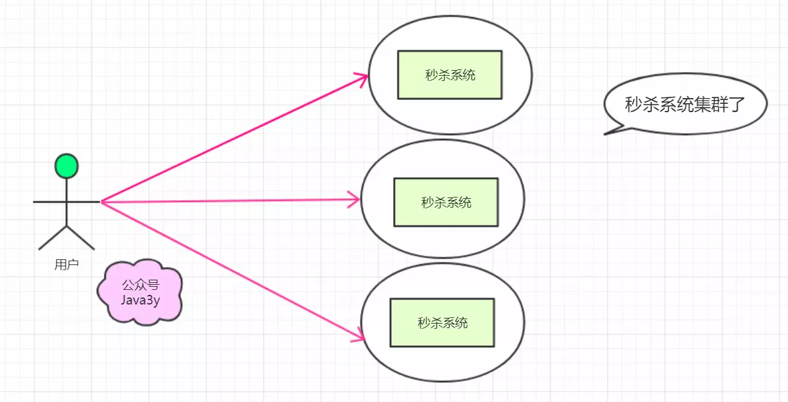

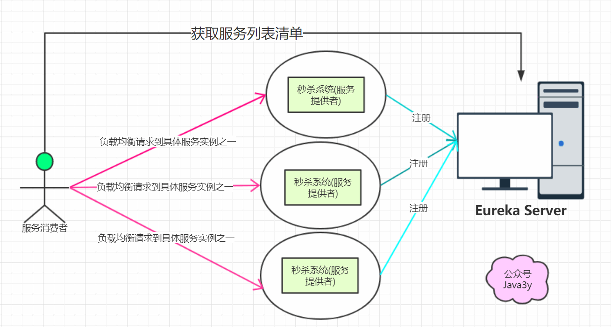

- > 三个秒杀系统合理摊分用户的请求（负载均衡），可能会想到nginx。
  >
  > 而springcloud 也支持负载均衡功能，只不过它是客户端的负载均衡，这个功能实现就是ribbon

- 负载均衡区分两种类型：

  - 客户端负载均衡：ribbon

    - 服务实例的清单在客户端，客户端进行负载均衡算法分配

      （客户端可以从eureka server中得到一份服务清单，在发送请求时通过负载均衡算法，在多个服务器之间选择一个进行访问）

  - 服务端负载均衡：nginx

    - 服务实例的清单在服务端，服务器进行负载均衡算法分配

## Ribbon是和Feign及Eureka紧密协作，流程如下

- > 被调用服务部署在多个机器上，Feign如何知道该请求哪台机器？
  >
  > Ribbon就是专门解决这个问题的。它的作用是负载均衡，会在每次请求时选择一台机器，均匀的把请求分发到各个机器上。
  >
  > Ribbon的负载均衡默认使用的最经典的Round Robin轮询算法。简单来说，就是如果调用服务对被调用服务发起10次请求，那就先让请求第一台机器，然后是第2台机器，第3台机器，第4台机器。。。接着再来一个循环，以此类推。

具体流程 ：

- 首先Ribbon会从Eureka Client里获取对应的服务注册表，也就知道了所有的服务都部署在哪台机器上，在监听哪些端口号
- 然后Ribbon就可以使用默认的Round Robin算法，从中选择一台机器
- Feign就会针对这台机器，构造并发起请求。

# 引出hystrix 

- > - 如果系统处于高并发的场景下，大量请求涌过来的时候，调用方服务的100个线程都会卡在请求的被调用方服务这块。导致调用方服务没有一个线程可以处理请求。
  > - 然后就会导致别人请求调用方服务的时候，发现调用方服务也挂了，不响应任何请求了。
  > - --》 这就是微服务架构中恐怖的服务雪崩问题。
  > - 多服务相互调用，要是不做任何保护的话，某一个服务挂了，就会引起连锁反应，导致别的服务也挂。比如积分服务挂了，会导致订单服务的线程全部卡在请求积分服务这里，没有一个线程可以工作，瞬间导致订单服务也挂了，别人请求订单服务全部会卡住，无法响应。

- > 在高并发的情况下，由于单个服务的延迟，可能导致所有的请求都处于延迟状态，甚至在几秒钟就使服务处于负载饱和的状态，资源耗尽，直到不可用，最终导致这个分布式系统都不可用，这就是“雪崩”。

- hystrix主要用于服务熔断/降级/隔离处理，hystrix配置在调用方，当被调用方服务不可用时，触发hystrix熔断，会执行指定的Fallback方法，进行特殊处理。

- springcloud hystrix实现了断路器、线程隔离等一系列服务保护功能

  - 比如在5分钟内请求积分服务直接就返回，不要去走网络请求卡住几秒钟，这个过程，就是所谓的熔断。
  - 降级：每次调用积分服务，就在数据库里记录一条消息，说给某某用户增加了多少积分，因为积分服务挂了，导致没增加成功，这样等积分服务恢复了，你可以根据这些记录手工加一下积分，这个过程就是所谓的降级。


# 引出feign 

- > feign是一种声明式、模板块的http客户端。在springcloud中使用feign，我们可以做到使用http请求远程服务时能与调用本地方法一样的编码体验，开发者完全感知不到这是远程方法，更感知不到这是个http请求。

- @FeignClient，客户端，其中value为调用其它服务的名称

## Feign流程 

https://blog.csdn.net/weixin_40834464/article/details/88850523

- feign的一个关键机制就是使用了动态代理
  - 首先，如果你对某个接口定义了@FeignClient注解，Feign就会针对这个接口创建一个动态代理
  - 接着你要是调用那个接口，本质就是会调用Feign创建的动态代理（Feign动态代理实现InventoryService接口），这是核心中的核心
  - Feign的动态代理会根据你在接口上的@RequestMapping等注解，来动态构造出你要请求的服务地址
  - 最后针对这个地址，发起请求、解析响应

## 大坑 

- @EnableFeignClients("com.zhangbin.cloud.feign")要带上包路径，否则会报错


# 引出zuul 

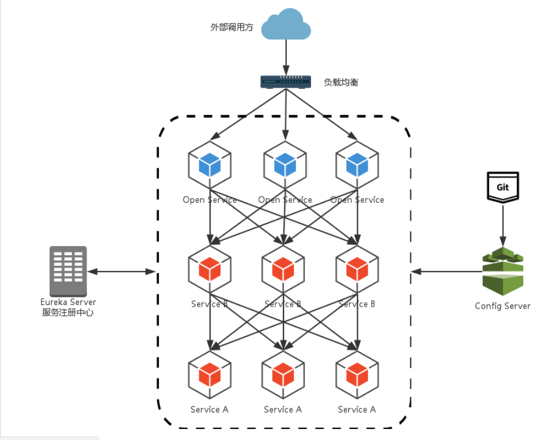

- > 这样的架构会有两个比较麻烦的问题：
  >
  > - 路由规则与服务实例的维护问题：外层的负载均衡nginx需要维护所有的服务实例清单
  > - 签名校验、登录校验冗余问题：为了保证对外服务的安全性，我们在服务端实现的微服务接口，往往都会有一定的权限校验机制，但我们的服务是独立的，我们不得不在这些应用中都实现这样一套校验逻辑，这就会造成校验逻辑的冗余。

- Zuul，微服务网关：这个组件是负责网络路由的。如果前端、移动端要调用后端系统，统一从Zuul网关进入，由Zuul网关转发请求给对应的服务。

  > 可做处理：
  >
  > 协议适配、安全策略、连接管理、流量管控、熔断机制、降级容错、智能路由、监控/日志

# 阿里分布式事务框架GTS 

## 什么是FESCAR 

- FESCAR是一种分布式事务解决方案，具有高性能和易用性的微服务框架

## FESCAR是怎么解决微服务中的分布式事务问题

- 在FESCAR项目中有3个基本组件
  - 事务协调员（TC）：维护全局和分支事务的状态，推动全局提交或回滚
  - 事务管理者（TM）：定义全局事务的范围：开始全局事务，提交或回滚全局事务
  - 资源管理器（RM）：管理分支事务处理的资源，与TC通信以注册分支事务和报告分支事务的状态，并驱动分支事务提交或回滚

- FESCAR管理分布式事务的典型生命周期
  - TM要求TC开始新的全局事务。TC生成表示全局事务的XID
  - XID通过微服务的调用链传播
  - RM将本地事务注册为XID到TC的相应全局事务的分支
  - TM要求TC提交或回滚XID的相应全局事务
  - TC在XID的相应全局事务下驱动所有分支事务以完成分支提交或rollbaking


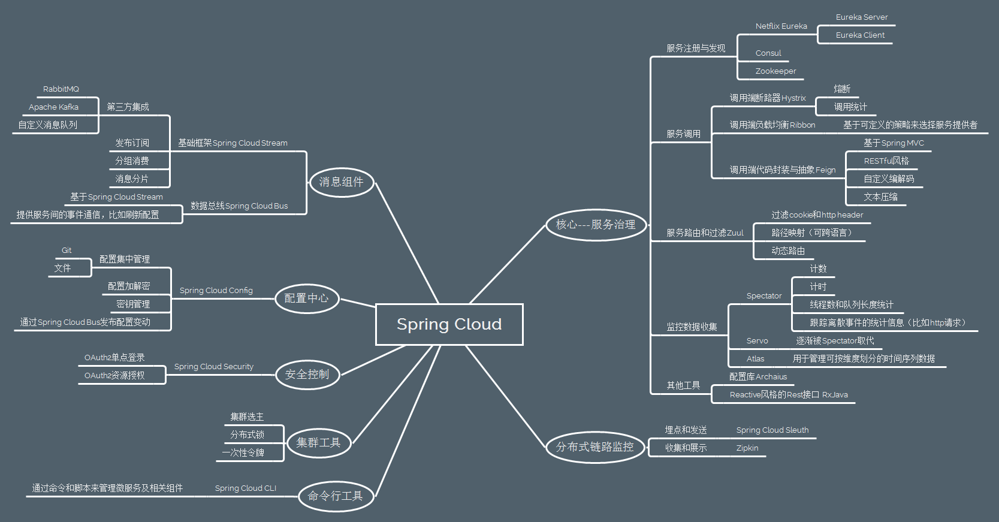


# Spring Cloud Gateway

> 包括协议适配、协议转发、安全策略（WAF）、防刷、流量、监控日志
>
> 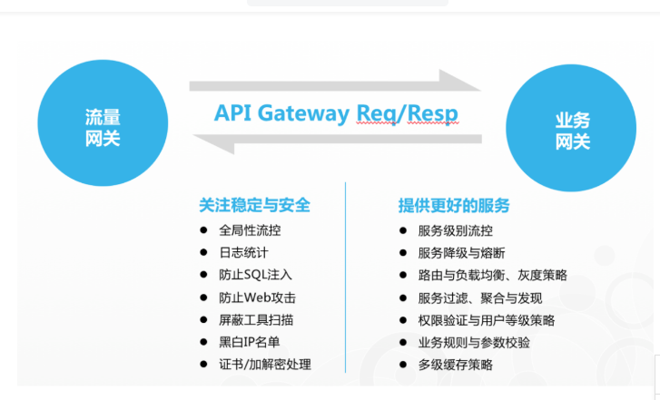
>
> 

## 坑

-  webflux与mvc不兼容，如类路径中引用了webmvc会导致项目启动不起来 

  ```java
  org.springframework.context.ApplicationContextException: Unable to start web server; nested exception is org.springframework.context.ApplicationContextException: Unable to start ServletWebServerApplicationContext due to missing ServletWebServerFactory bean.
  ```

  - 不能同时引入（Web Flux(Netty)跟Web MVC(Servlet)），找了好久找不到办法，所以旧代码得重写罗

# spring cloud consul 

> spring cloud eureka 2.0之后不再更新了。consul是一个springcloud中集成好的开源的分布式的服务注册发现中心。由Go预约编写。支持健康检查，多数据中心还支持K-V存储，采用RAFT一致性算法（RAFT算法使consul在有一半以上的节点注册成功时才证明服务注册成功），保证强一致性，可用性。并且和docker。并且和docker完美兼容。

## springcloud Consul与springcloud Eureka的区别

- Eureka 保证AP（可用性，容错性），consul保证CP（一致性，容错性）
- consul 下载即可，和Eureka不同的是它不用使用idea启动


## Zookeeper 、Eureka、consul 

|          | Zookeeper | Eureka | consul        | nacos |
| -------- | --------- | ------ | ------------- | ----- |
| CAP      | CP        | AP     | CP            | CAP   |
| 语言     | java      | java   | go            |       |
| 一致性   |           |        | raft          |       |
| 使用语言 |           | HTTP   | 支持HTTP和dns |       |

## consul使用 

- 下载：https://www.consul.io/downloads.html 

- windows：在解压路径下cmd-->./consul agent -dev -client 127.0.0.1 -ui

  Linux：

- 访问： http://localhost:8500/ui/dc1/services 

- 注册：

  - ```xml
     <dependency>
                <groupId>org.springframework.boot</groupId>
                <artifactId>spring-boot-starter-actuator</artifactId>
            </dependency>
            <dependency>
                <groupId>org.springframework.cloud</groupId>
                <artifactId>spring-cloud-starter-consul-discovery</artifactId>
            </dependency>
    ```

  - 注意：

    -  一个是版本号要对应，spring boot 2.1.x以上版本要使用Greenwich版本的spring cloud 不然无法兼容 
    -  第二个是注册consul要有两个依赖，之前看了一个资料写只需要spring-cloud-starter-consul-discovery。其实是不行的 

- yml配置

  - ```yaml
    spring: 
        cloud:
            consul:
              host: 127.0.0.1 #consul的IP
              port: 8500 #consul启动端口默认8500
              discovery:
                healthCheckPath: /actuator/health  #健康检查路径
                healthCheckInterval: 15s #健康检查频率
                hostname: 127.0.0.1 #注册服务所在IP
                port: ${server.port}  #注册服务所在端口
                service-name: ${spring.application.name} #注册服务名
                register: true #是否启动注册
                register-health-check: true #是否启动健康检查
    
    ```

- 启动类加上注解： @EnableDiscoveryClient 

## consul功能&特性

## consul原理

- 1.当 Producer 启动的时候，会向 Consul 发送一个 post 请求，告诉 Consul 自己的 IP 和 Port
- 2.Consul 接收到 Producer 的注册后，每隔10s（默认）会向 Producer 发送一个健康检查的请求，检验Producer是否健康 
- 3.当 Consumer 发送 GET 方式请求 /api/address 到 Producer 时，会先从 Consul 中拿到一个存储服务 IP 和 Port 的临时表，从表中拿到 Producer 的 IP 和 Port 后再发送 GET 方式请求 /api/address 
- 4.该临时表每隔10s会更新，只包含有通过了健康检查的 Producer

## 坑

### 单元测试时报错

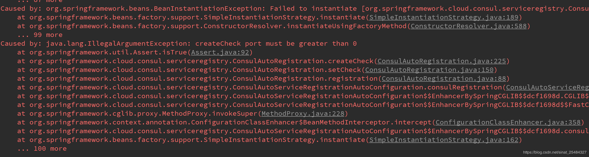

-  https://blog.csdn.net/sinat_25484327/article/details/89197830 

- ```java
  @SpringBootTest(webEnvironment = SpringBootTest.WebEnvironment.DEFINED_PORT)
  //要不然${server.port}读不到
  
  ```

- 

## consule核心组件 

### agent组件

- 每个consul agent维护它自己的服务集合以及检查注册和健康信息。agent负责执行自己的健康检查和更新本地状态，agent根据节点的性质，分为agent server和agent client
  - agent server：server保存client的注册信息，集群的配置信息，维护集群高可用，在局域网内与本地客户端通讯，通过广域网与其它数据中心通讯。每个数据中心的server数量推荐为3个或是5个，通过raft算法来保证一致性
  - agent client：client将HTTP和DNS接口请求转发给局域网内的服务端集群

### consul通信接口 

- RPC：用于内部通讯Gossip/日志分发/选主等
- HTTP API：服务发现/健康检查/KV存储等几乎所有功能，默认端口为8500
- Consul Commands（CLI）：consul命令行工具可以与consulagent进行连接，提供部分consul的功能。实际上consul CLI默认就是调用HTTP API来与consul集群进行通讯。
- DNS：仅用于服务查询

### consul去中心化思想实现 

### consul内部原理 

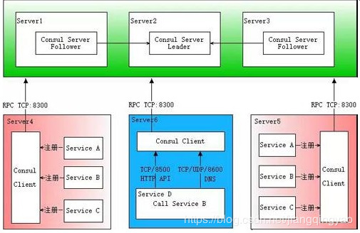

- 服务器server1、server2、server3上分别部署了consul server，组成了consule集群，通过raft选举算法，server2成为了leader节点
- 服务器server4和server5上通过consul client分别注册serviceA、B、C（服务A、B、C注册到consul可以通过HTTP API（8500端口）的方式，也可以通过consul配置文件的方式）
- consul client将注册信息通过RPC转发到consul server，服务信息保存在server的各个节点中，并且通过raft实现了强一致性。
- 服务器server6中program D要访问serviceB，此时program D要先访问本机consul client提供的HTTP API，consul Client会将请求转发到consul server。consul server查询到service B并返回，最终program D拿到了service B的所有部署的IP和端口，根据负载均衡策略，选择service B的其中一个并向其发起请求。
  - 如果服务发现采用的是DNS方式，则program D中使用service B的服务实现域名，域名解析请求首先到达本机DNS代理，然后转发到本机consul client，consul client会将请求转发到consul server。