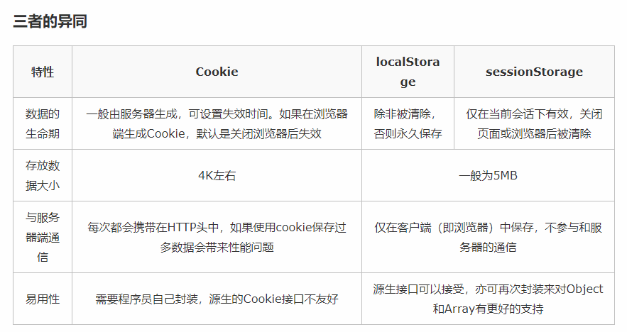

# Cookie、LocalStorage、SessionStorage

## Cookie 

- 大小限制4KB左右
- 保存登录信息

## LocalStorage 

- 除非被清除，否则永久保存

- ```javascript
  sessionStorage.setItem("key", "value"); localStorage.setItem("site", "js8.in");
  ```

- ```js
  var value = sessionStorage.getItem("key");  
  var site = localStorage.getItem("site");
  ```

- ```js
  sessionStorage.removeItem("key");     localStorage.removeItem("site");
  ```

- ```
  //清除所有的key/value
  sessionStorage.clear();     localStorage.clear();
  ```

## SessionStorage 

- SessionStorage与localStorage接口相似，但保存数据的生命周期不同。
  - 页面关闭或浏览器被清除后sessionStorage的数据会被清空



# ajax 

## 请求头 

- ```javascript
  beforeSend:function(xhr){
  			var authorication = localStorage.getItem("Authorication");
  			xhr.setRequestHeader("Authorication",authorication);
  		}
  ```

- ​