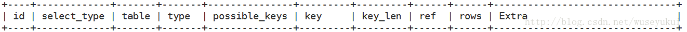

# 命令行操作mysql

- mysql -u root -p root：进入mysql

- show databases：显示所有数据库

- show tables：显示所有表

- use databasename：切换到对应的数据库

- select database()：查看当前使用的数据库

- ```mysql
  create table tb3(
  
  id int unsigned key,
  
  name varchar(32) not null unique key,
  
  sex enum('1','2','3') default '3'
  
  );
  ---约束条件
  primary key 主键约束
  unique key唯一约束
  default 默认约束
  not null 非空约束
  ```

- show columns from test;：查看表结构

- 复制表结构和数据

  - ```mysql
    create table 表名 【as】select * from 要复制的表名
    ```

- 复制表结构

  - ```mysql
    create table 表名 like 要复制的表名
    ```

  - 

- 权限相关

  - ```
    //查看mysql数据库中所有用户
    SELECT DISTINCT CONCAT('User: ''',user,'''@''',host,''';') AS query FROM mysql.user;
    //查看数据库中具体某个用户的权限
    show grants for 'wang'@'localhost';
    //赋予权限
    GRANT USAGE ON *.* TO 'cuz'@'localhost' IDENTIFIED BY PASSWORD '*4585fa1158f37e2c1d7e41e4e309714a3fdd7826';
    GRANT ALL PRIVILEGES ON `cuz`.* TO 'cuz'@'localhost';
    //刷新生效
    flush privileges 
    ```

- 查看事务隔离级别

  - ```mysql
    SHOW VARIABLES LIKE 'tx_isolation';
    ```

- 查看全局的事务隔离级别

  - ```mysql
    SHOW GLOBAL VARIABLES LIKE 'tx_isolation';
    ```

- 设置事务隔离级别

  - ```mysql
    SET GLOBAL tx_isolation='REPEATABLE-READ';
    SET SESSION tx_isolation='SERIALIZABLE';
    ```

# 遇到的坑 

- mysql连接报错：Mysql:Host is not allowed to connect to this MySQL server

  - ```mysql
    mysql -u root -p
    mysql>GRANT   ALL   PRIVILEGES   ON   *.*   TO   'root'@'%'   WITH   GRANT   OPTION;
    mysql> flush privileges;
    (这么设置后，登录不需要密码)
    ```

  - https://www.cnblogs.com/Bighua/p/7629082.html 

# mysql大表优化方案 

## 影响性能的几个方面 

- 硬件
  - 服务器硬件：cpu、内存、磁盘IO
  - 服务器操作系统
  - 数据库存储引擎
  - 数据库参数配置
- 软件
  - 数据库结构设计和SQL语句

## 性能优化顺序 

- 数据库结构设计和SQL语句的优化
- 数据库存储引擎的选择和参数配置
- 系统选择及优化
- 硬件升级

（晋阶学习计划文档有详细说明）

### 字段 

（当一个列可以选择多种数据类型时，应该优先考虑数字类型，其次是日期或二进制类型，最后是字符类型。对于相同级别的数据类型，应该优先选择占用空间小的数据类型，更节省硬件资源，如磁盘、内存和CPU）

- 尽量使用TINYINT（1）、SMALLINT（2）、MEDIUM_INT（3）作为整数类型而非INT（4），如果非负则加上UNSIGNED
- varchar的长度只分配真正需要的空间
- 使用枚举或整数代替字符串类型，（MySQL处理枚举时维护了一个“数字-字符串”表，使用枚举可以减少很多存储空间）
- 尽量使用TIMESTAMP（4个字节）而非DATETIME（8个字节的存储空间）
- 单表不要有太多字段，建议在20以内
- 避免使用NULL字段，很难查询优化且占用额外索引空间
- 用32位无符号整型来存IP

### 索引 

- 索引并不是越多越好，要根据查询有针对性的创建，考虑在where和order by命令上涉及的列建立索引，可根据explain来查看是否用了索引还是全表扫描

- 应尽量避免在where字句中对字段进行null值判断，否则将导致引擎放弃使用索引而进行全表扫描

- 值分布很稀少的字段不适合建索引，例如“性别”这种只有两三个值的字段

- 字符字段只建前缀索引

- 字符字段最好不要做主键

- 不用外键，由程序员保证约束

- 尽量不用unique，由程序保证约束

- 使用多列索引时注意顺序和查询条件保持一致，同时删除不必要的单列索引

  - 查询的使用应该尽量从左往右匹配，另外，如果左边列范围查找，右边列无法使用索引；还有就是不能隔列查询，否则后面的索引也无法使用到。

    https://juejin.im/post/5cd3e00bf265da03ac0d2525

    - SELECT * from people where NAME like '%B'？×
    - SELECT * from people where Name like 'Abel%'？√

#### 索引的概念 

- 索引是对数据库表中的一列或多列的值进行排序的一种结构

  - 索引是帮助mysql高效获取数据的数据结构。本质上就是**数据结构** ，单独存储在磁盘上，用它来提高数据查询的效率。（还节省内存）

  - > <https://my.oschina.net/lienson/blog/2987474> 
    >
    > 适合作为索引的结构应该是尽可能少的执行磁盘IO操作，因为执行磁盘IO操作非常耗时

- 索引是一个文件，它是要占据磁盘空间的

#### 索引的类型 

- 主键索引
- 唯一索引
- 普通索引
- 全文索引

#### 索引的算法 

- b-tree

  - 因为它不仅可以被用在=，>，>=，<=，和between，还可以用于like操作符，只要查询条件是一个不以通配符开头的常量

  - 例如：

    ```mysql
    select * from user where name like 'jack%';
    //如果一通配符开头，或者没有使用常量，则不会使用索引，例如：
    select * from user where name like '%jack';
    ```

    

- hash

  - hash 索引只能用于对等比较，例如=操作符。
  - 由于hash是一次定位数据，不像btree索引需要从根节点到枝节点，最后才能访问到页节点这样多次IO访问，所以检索效率远高于Btree索引

#### 联合索引的最左匹配原则

- 最左前缀匹配原则，MySQL会一直向右匹配直到遇到范围查询（>、<、between、like）就停止匹配，比如a=3 and b=4 and c>5 and d=6，如果建立(a,b,c,d)顺序索引，d是无法使用索引的，如果建立(a,b,d,c)的索引则都可以使用到，a、b、d的顺序可以任意调整。
- =和in可以乱序，比如a=1 and b=2 and c=3建立(a,b,c)索引可以任意顺序，MySQL的查询优化器会帮你优化成索引可以识别的形式。

### 查询SQL 

- 可通过开启慢查询日志来找出比较慢的SQL

  - slow_query_log：慢查询开启状态
  - slow_query_log_file：慢查询日志存放的位置
  - long_query_time：查询超过多少秒才记录

  - show variables like 'slow_query%'
  - https://www.cnblogs.com/luyucheng/p/6265594.html
- 不做列运算：select id where age+1 = 10，任何对列的操作都将导致表扫描，它包括数据库教程函数、计算表达式等等，查询时要尽可能将操作移至等号右边
- SQL语句尽可能简单：一条SQL只能在一个CPU运算；大语句拆小语句，减少锁时间；一条大SQL可以堵死整个库
- 不用select * 
- or改写成in：or的效率是n级别，in的效率是log(n)级别，in的个数建议控制在200以内
- 不用函数和触发器，在应用程序实现
- 避免%XXX式查询
- 少用join
- 使用同类型进行比较，比如用‘123’和‘123’比，123和123 比
- 尽量避免在where子句中使用!=或<>操作符，否则将引擎放弃使用索引而进行全表扫描
- 对于连续数值，使用between不用IN：select id from t where num between 1 and 5
- 列表数据不要拿全表，要使用limit来分页，每页数量也不要太大

#### 如何定位及优化SQL语句的性能问题 

- 使用explain关键字可以模拟优化器执行SQL查询语句

  - https://blog.csdn.net/wuseyukui/article/details/71512793

  - explain执行计划包含的信息
    - 

    - id：select查询的序列号，包含一组数字，表示查询中执行select子句或操作表的顺序

      - id值越大优先级越高，越先被执行

    - select _type：查询类型，主要用于区分普通查询、联合查询、子查询等复杂的查询

      - SIMPLE：简单的select查询，查询中不包含子查询或union
      - PRIMARY：查询中包含任何复杂的子部分，最外层查询则被标记位primary
      - SUBQUERY：在select或where列表中包含了子查询
      - DERIVED：在form列表中包含的子查询被标记位derived（衍生），mysql或递归执行这些子查询，把结果放在临时表里
      - union：若第二个select出现在UNicon之后，则被标记位UNicon；若union包含在from子句的子查询中，外层select将被标记位derived
      - union result：从union表获取结果的select

    - type：访问类型，SQL查询优化中有个很重要指标，结果值从好到坏依次是：

      system>const>eq_ref>ref>fulltext>ref_or_null>index_merge>unique_subquery>index_subquery>range>index>all

      (**一般，好的SQL查询至少达到range级别，最好能达到ref**)

      - system：表只有一行记录（等于系统表），这是const类型的特例，平时不会出现，可忽略
      - const：表示通过索引一次就找到了，const用于比较primary key或unique索引。因为只需匹配一行数据，所以很快。如果将主键置于where列表中，mysql就能将该查询转换为一个const
      - eq_ref：唯一性索引扫描，对于每个索引键，表中只有一条记录与之匹配。常见于主键或唯一索引扫描
      - ref：非唯一性索引扫描，返回匹配某个单独值的所有行。本质也是一种索引访问，它返回所有匹配某个单独值的行，然而可能会找到多个符合条件的行，所以它应该属于查找和扫描的混合体
      - range：只检索给定范围的行，使用一个索引来选择行。key列显示使用了哪个索引。一般就是在where语句中出现了between、<、>、in等的查询。这种索引列上的范围扫描比全索引扫描要好。只要开始于某个点，结束于另一个点，不用扫描全部索引
      - index：full index scan ,index与all区别为index类型只遍历索引树。这通常为all块，应为索引文件通常比数据文件小。（index与all虽然都是读全表，但index是从索引中读取，而all是从硬盘读取）00
      - all：full table scan，遍历全表以找到匹配的行

    - possible_keys：查询涉及到的字段上存在索引，则该索引将被列出，但不一定被查询实际使用

    - key：实际使用的索引，如果为null，则没有使用索引

      - 查询中如果使用了覆盖索引，则该索引仅出现在key列表中

    - key_len：表示索引中使用的字节数，查询中使用的索引的长度（最大可能长度），并非实际使用长度，理论上长度越短越好；key_len是根据表定义计算而得的，不是通过表内检索出的

    - ref：显示索引的那一列被使用了，如果可能，是一个常量const

    - rows：根据表统计信息及索引选用情况，估算出找到所需的记录读取的行数

    - extra：不适合在其他字段中显示，但是十分重要的额外信息

      - using index：使用覆盖索引
      - using where：使用了where子句来过滤结果集
      - using filesort：使用文件排序，使用非索引列进行排序时出现，非常消耗性能，尽量优化
      - using tmporary：使用了临时表


### 引擎 

|                  | MyISAM | INnodb                         |
| ---------------- | ------ | ------------------------------ |
| 行锁             | 不支持 | 支持行锁，采用MVCC来支持高并发 |
| 事务             | 不支持 | 支持事务                       |
| 外键             | 不支持 | 支持外键                       |
| 奔溃后的安全恢复 | 不支持 | 支持                           |

（myISAM适合select密集型的表，而Innodb适合insert和update密集型的表）

# mysql高可用 

- 如果数据库发生了宕机或意外中断等故障，能尽快恢复数据库的可用性，尽可能的减少停机时间，保证业务不会因为数据库的故障而中断
- 用作备份、只读副本等功能的非主节点的数据应该和主节点的数据实时或者最终保持一致
- 当业务发生数据库切换时，切换前后的数据库内容应当一致，不会因为数据缺失或者数据不一致而影响业务

## 如何实现高可用 

- 建立完善的监控及报警系统
- 对备份数据进行恢复测试
- 正确配置数据库环境
- 对不需要的数据进行归档和清理

## 高可用方案 

- （由于数据库数量较多，所以需要数据库管理软件来保证数据库的可维护性），可选择MMM、MHA、或者各个版本的proxy等

### MHA监控服务 （最终的高可用架构）

#### MHA提供了什么功能 

- 监控主数据库的服务器是否可用
- 当主DB不可用时，从多个从服务器中选举出新的主数据库服务器
- 提供了主从切换和故障转移功能
  - MHA可用与半同步复制结合起来

#### MHA优缺点 

##### MHA优点

- 同样是Perl语言开发的开源工具
- 可支持基于GTID的复制模式
- MHA在进行故障转移时更不易于产生数据丢失
- 同一个监控节点可监控多个集群

##### MHA缺点 

- 需编写脚本或利用第三方工具来实现VIP的配置
- MHA启动后只会对主数据库进行监控
- 需要基于SSH免认证配置，存在一定的安全隐患（会存在密码泄露等问题）
- 没有提供从服务器的读负载功能


# inner join 、left join、right join 

https://blog.csdn.net/w348399060/article/details/70158125

- inner join（内连接，或等值连接）：显式
  - select * from a inner join b on a.id = b.id
  - 
  - 隐式：select a.* ,b.* from a ,b where a.id = b.id 
  - （用时差不多）
- left join（左连接）
  - select * from a left join b on a.id = b.id
  - 
  - （左连接从左表a产生一套完整的记录，与匹配的记录右表b。如果匹配不到，右侧将包含null）
- right join（右连接）
  - select * from b right join a where a.id = b.id
  - 
  - 

## 总结 

- 尽量用inner join，里面left join 和null
- 尽量避免子查询，而用join
- where和on的区别
  - on是两者join形成新表时用到的匹配条件
  - where是对已经搜索出的结果的过滤条件

# SQL索引优化解决办法 

https://juejin.im/post/5d6e6d42518825103e54565c#heading-0

```
CREATE TABLE `employees` (
  `id` int(11) NOT NULL AUTO_INCREMENT,
  `name` varchar(24) NOT NULL DEFAULT '' COMMENT '姓名',
  `age` int(20) NOT NULL DEFAULT '0' COMMENT '年龄',
  `position` varchar(20) NOT NULL DEFAULT '' COMMENT '职位',
  `hire_time` timestamp NOT NULL DEFAULT CURRENT_TIMESTAMP ON UPDATE CURRENT_TIMESTAMP COMMENT '入职时间',
  PRIMARY KEY (`id`),
  KEY `idx_name_age_position` (`name`,`age`,`position`) USING BTREE
) ENGINE=InnoDB DEFAULT CHARSET=utf8 COMMENT='员工表';

insert into employees(name,age,position,hire_time) values('LiLei', 22, 'manager', NOW())
insert into employees(name,age,position,hire_time) values('HanMeimei', 23, 'dev', NOW())
insert into employees(name,age,position,hire_time) values('Lucy', 23, 'dev', NOW())
复制代码
```

#### 全值匹配

索引的字段类型是varchar(n)：2字节存储字符串长度，如果是utf-8， 则长度是3n+2

```
EXPLAIN select * from employees where name='LiLei';
复制代码
```


```
EXPLAIN select * from employees where name='LiLei' AND age = 22;
复制代码
```


```
EXPLAIN select * from employees where name='LiLei' AND age = 22 AND position = 'manager';
复制代码
```


#### 最左前缀法则

如果索引是多列，要最受最左前缀法则。指的是查询从索引的最左前列开始并且不跳过索引中的列。以下两条sql根据最左前缀法则，都不会走索引。

```
EXPLAIN select * from employees where age = 22 AND position='manager';
EXPLAIN select * from employees where position ='manager';
复制代码
```


#### 索引失效

不要在索引列上做任何操作（计算、函数、类型转换），会导致索引失效而转向全表扫描。

```
EXPLAIN select * from employees where name='LiLei';
复制代码
```


```
EXPLAIN select * from employees where left(name, 3)='LiLei';
复制代码
```


给hire_time增加一个普通索引：

```
alter table `employees` ADD INDEX `idx_hire_time`(`hire_time`) USING BTREE;
EXPLAIN select * from employees where date(hire_time) = '2019-08-25';
复制代码
```


还原最初索引状态

```
ALTER TABLE `employees` DROP INDEX `idx_hire_time`;
复制代码
```

#### 存储引擎不能使用索引中范围条件右边的列

```
-- EXPLAIN SELECT * FROM employees WHERE name ='LiLei' AND age=22 AND position ='manager';
EXPLAIN SELECT * FROM employees WHERE name ='LiLei' AND age>22 AND position ='manager';
复制代码
```


 看到key_len这个索引长度是78， 也就是只使用到了前两个字段name和age，postition没有使用到索引的。


#### 覆盖索引

尽量使用覆盖索引（只访问索引的查询（索引列包含查询列）），减少selelct * 语句。

```
EXPLAIN SELECT name,age,position FROM employees WHERE name ='LiLei' AND age=22 AND position ='manager';
复制代码
```


#### 条件判断

mysql在使用不等于（! = 或者 <>）的时候无法使用索引会导致全表扫描

```
EXPLAIN SELECT * FROM employees WHERE name !='LiLei' ;
复制代码
```


#### 空值判断

is null，is not null也无法使用索引

```
EXPLAIN SELECT * FROM employees WHERE name is null;
复制代码
```


#### like

like以通配符开头（‘$abc’）mysql索引失效会变成全表扫描操作

```
EXPLAIN SELECT * FROM employees WHERE name LIKE '%Lei';
复制代码
```


#### 字符串不加单引号索引失效

```
EXPLAIN SELECT * FROM employees WHERE name ='1000';
EXPLAIN SELECT * FROM employees WHERE name =1000;
复制代码
```


 不加单引号的字符串，mysql底层会使用cust函数将其转换为字符串，此时索引失效。


#### or&in少使用

少用or或in，用它查询时，mysql不一定使用索引，mysql内部优化器会根据索引比例、表大小等多个因素整体评估是否使用索引。

```
EXPLAIN SELECT * FROM employees WHERE name ='LiLei' or name='HanMeimei';
复制代码
```


#### 范围查询优化

给年龄添加单值索引

```
ALTER TABLE `employees`ADD INDEX `idx_age`(`age`) USING BTREE;
EXPLAIN select * from employees where age > 1 and age <= 2000;
复制代码
```


没有走索引原因：mysql内部优化器会根据检索比例、表大小等多个因素整体评估是否使用索引。 这个例子没有走索引可能是因为单次数据量查询过大导致优化器最终选择不走索引。 优化方法：可以将大的范围拆分成多个小范围。

# 三范式

第一范式（ 1NF）： 字段具有原子性,不可再分。 所有关系型数据库系统都满足第一范式）
数据库表中的字段都是单一属性的， 不可再分。 例如， 姓名字段， 其中的姓和名必须作为一
个整体， 无法区分哪部分是姓， 哪部分是名， 如果要区分出姓和名， 必须设计成两个独立的
字段。
第二范式（ 2NF）：
第二范式（ 2NF） 是在第一范式（ 1NF） 的基础上建立起来的， 即满足第二范式（ 2NF） 必
须先满足第一范式（ 1NF）。
要求数据库表中的每个实例或行必须可以被惟一地区分。 通常需要为表加上一个列， 以存储
各个实例的惟一标识。 这个惟一属性列被称为主关键字或主键。
第二范式（ 2NF） 要求实体的属性完全依赖于主关键字。 所谓完全依赖是指不能存在仅依赖
主关键字一部分的属性， 如果存在， 那么这个属性和主关键字的这一部分应该分离出来形成
一个新的实体， 新实体与原实体之间是一对多的关系。为实现区分通常需要为表加上一个列，
以存储各个实例的惟一标识。 简而言之， 第二范式就是非主属性非部分依赖于主关键字。
第三范式的要求如下：
满足第三范式（ 3NF） 必须先满足第二范式（ 2NF）。 简而言之， 第三范式（ 3NF） 要求一个
数据库表中不包含已在其它表中已包含的非主关键字信息。
所以第三范式具有如下特征：
1， 每一列只有一个值
2， 每一行都能区分。
3， 每一个表都不包含其他表已经包含的非主关键字信息。
例如， 帖子表中只能出现发帖人的 id， 而不能出现发帖人的 id， 还同时出现发帖人姓名，
否则， 只要出现同一发帖人 id 的所有记录， 它们中的姓名部分都必须严格保持一致， 这就
是数据冗余。

# 获取当前时间函数

**1** 获得当前日期+时间（date + time）函数：now()

 

 

**2** 获得当前日期+时间（date + time）函数：sysdate()

sysdate() 日期时间函数跟 now() 类似，不同之处在于：now() 在执行开始时值就得到了， sysdate() 在函数执行时动态得到值。

 

 

**3** 获得当前日期（date）函数：curdate()

等同于：current_date(),current_date

 

 

**4**获得当前时间（time）函数：curtime()

等同于：current_time(),current_time

 

 

**5** 获得当前 UTC 日期时间函数：utc_date(), utc_time(), utc_timestamp()

因为我国位于东八时区，所以本地时间 = UTC 时间 + 8 小时。


6 DATEDIFF ( datepart , startdate , enddate )释义：计算时间差；(DATEDIFF(date1,date2) 函数返回两个日期之间的天数。)
datepare值：year | quarter | month | week | day | hour | minute | second | millisecond
startdate：开始日期
enddate ：结束日期
getDate()：获取当前的系统日期

# select into from 与 insert into select用法详解


select into from 和 insert into select都被用来复制表结构和表中数据，
两者的主要区别为：
select into from 要求目标表不存在，因为在插入时会自动创建。
insert into select from 要求目标表已存在数据库中。

一、INSERT INTO SELECT语句


1、语句形式为：

Insert into Table2(field1,field2,...) select value1,value2,... from Table1;


2、注意点：

（1）要求目标表Table2必须存在，并且要复制的字段field,field2...也必须存在

（2）注意Table2的主键约束，如果Table2有主键且不为空，则 field1， field2...中必须包括主键

（3）注意区分 Insert into Table2(field1,field2,...) values (select value1,value2,... from Table1)；


二、SELECT INTO FROM语句

1、语句形式为：
SELECT vale1,value2 into Table2 from Table1;

 2、注意点：
要求目标表Table2不存在，因为在插入时会自动创建表Table2，并将Table1中指定字段数据复制到Table2中 。

3、应用实例：
SELECT name as iName, 0 as iAge,phone as iPhone
INTO table2
FROM table1;
上面的例子:将会复制表1的结构，而且会把name字段改成iName,phone字段改成IPhone并添加IAge字段(0对应int类型)到新表table2中，对于复制表结构的同时需要增加新的列并插入数据的情形很可以用此语句。

# mysql 修改表字段默认值

```sql
alter table 表名 alter column 字段名 drop default; (若本身存在默认值，则先删除)

alter table 表名 alter column 字段名 set default 默认值;(若本身不存在则可以直接设定)
```

