# 计算机基础 

- bit：二进制位（b）

- byte：字节(B)
  - 1B  = 8b

## 网络编程基础

- 网络编程就是使用IP地址或域名，和端口连接到另一台计算机上对应的程序，按照规定的协议（数据格式）来交换数据，实际编程中建立连接和发送、接收数据在语言级已经实现，做的更多的工作是设计协议，以及编写生成和解析数据的代码罢了，然后把数据转换成逻辑的结构显示或控制逻辑即可。

- 协议：传输数据的格式

# 数据结构：八大数据结构分类

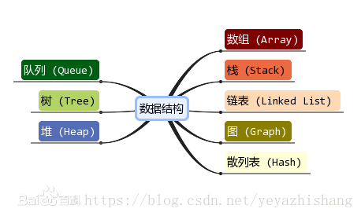


# 线性结构

- 顺序存储结构：用一段地址连续的存储单元依次存储线性表的数据元素
  - 不需要额外的存储空间，快速存取指向位置的元素
  - 在插入和删除的过程中，需要移动大量元素
  - 需要预先分配存储空间
- 链式存储结构：地址可以连续也可以不连续的存储单元存储数据元素（单链表、双向链表、循环链表）
  - 插入删除操作时间为O(1)
  - 用任意位置的存储单元存储元素

- 数组、队列、链表、栈

# 非线性结构

- 二维数组、多维数组、广义表、树结构、图结构


# 1. 线性结构——数组Array

<https://blog.csdn.net/zh_android/article/details/89068754>

- 数组就是可以在**内存中存储多个元素**的结构，其中的**元素类型必须相同**，而且在**内存中是连续的**，数组的元素是通过数组的**下标访问**，不是从1开始，而是从0开始。
- 因为数组在存储数据时是按顺序存储的，存储数据的内存也是连续的，所以他的特点就是读取数据比较容易，插入和删除比较困难。简单解释是：在读取数据时，只需要告诉数组要从哪个位置（下标）取数据就可以了，数组就会直接把对应位置（下标）的数据取出来。
- 插入和删除比较困难是因为这些存储数据的内存是连续的，要插入和删除就需要变更整个数组中的数据的位置。
- 优点：
  - 按照索引（下标）查询速度快，遍历数组方便
- 缺点：
  - 数组只能存储一种类型的元素
  - 数组大小定义完之后固定，无法扩容
  - 添加和删除的操作慢，因为数组内存地址是连续的，需要移动其它元素
- 数组适用于频繁查询，对存储空间要求不大，而且很少删除和增加元素的情况。

# 2. 线性结构——栈Stack

- 栈只允许在栈顶进行操作，栈底不允许操作。（相当于一个桶）
- 栈的特点是：先进后出，或后进先出。
- 在栈顶放入元素的操作时入栈，取出元素的操作时出栈
- 
- 栈常应用于实现递归功能方面的场景，例如斐波那契数列

# 3. 线性结构——链表Linked List

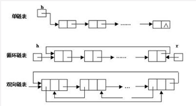

- 链表是存储单元上**不连续**的存储结构，数据元素的**逻辑顺序**是通过**链表的指针地址**来实现的。
- 每个元素包含两个节点。
  - 一个节点是存储元素的**数据域**
  - 一个节点是指向下一个节点的**指针域**。
- 所以根据指针的指向，可以形成不同的结构，例如：单链表、双向链表、循环链表
- 链表是由一系列的节点组成，这些节点不必在内存中连续，当添加和删除元素的时候，只需要改变相关节点的指针指向即可，效率很高。
- 优点：
  - 不需要初始化容量，可以任意增减元素
  - 添加或删除元素时，只需要改变前后两个元素的指针指向即可，删除和添加元素会很快
- 缺点：
  - 查找元素需要遍历链表来实现，很耗时
  - 链表存在大量的指针域，占用空间大

## 单链表

- 最后一个节点的指针域设置为空（NULL），作为链表的结束标志，表示它没有后继节点

### 栈

## 双向链表

- 每个节点的指针域都有两个指针，分别指向它的后继和前驱，所以，从任意节点开始，都能方便的访问它的前驱节点和后继节点。

### LinkedList 

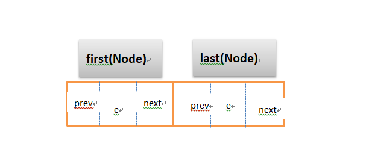


```java
public class LinkedList<E>
    extends AbstractSequentialList<E>
    implements List<E>, Deque<E>, Cloneable, java.io.Serializable
{
    transient int size = 0;

    /**
     * Pointer to first node.
     */
    transient Node<E> first;

    /**
     * Pointer to last node.
     */
    transient Node<E> last;

    /**
     * Constructs an empty list.
     */
    public LinkedList() {
    }
    
    /**
     * Links e as last element.
     */
    void linkLast(E e) {
        final Node<E> l = last;
        final Node<E> newNode = new Node<>(l, e, null);
        last = newNode;
        if (l == null)
            first = newNode;
        else
            l.next = newNode;
        size++;
        modCount++;
    }
    
    /**
     * Links e as first element.
     */
    private void linkFirst(E e) {
        final Node<E> f = first;
        final Node<E> newNode = new Node<>(null, e, f);
        first = newNode;
        if (f == null)
            last = newNode;
        else
            f.prev = newNode;
        size++;
        modCount++;
    }
}    
```


```java
private static class Node<E> {
        E item;
        Node<E> next;
        Node<E> prev;

        Node(Node<E> prev, E element, Node<E> next) {
            this.item = element;
            this.next = next;
            this.prev = prev;
        }
    }
```


### 可是为什么市场上单链表的使用多余双链表呢？

从存储结构来看，每个双链表的节点要比单链表的节点多一个指针，而长度为n就需要 n*length（这个指针的length在32位系统中是4字节，在64位系统中是8个字节） 的空间，这在一些追求时间效率不高应用下并不适应，因为它占用空间大于单链表所占用的空间；这时设计者就会采用以时间换空间的做法，这时一种工程总体上的衡量。
https://blog.csdn.net/kangxidagege/article/details/80211225

## 循环链表

- 从单链表可知，最后一个节点的指针域指向NULL，当我们将尾指针指向头节点，那么就形成了一个循环链表

# 4. 线性结构——队列Queue

- 队列类似于栈，不同的是队列是在一端增加元素，在另一端取出元素（相当于一根水管）
- 特点是：先入先出，后入后出
- 放入元素的操作被称为入队，取出元素的操作被称为出队

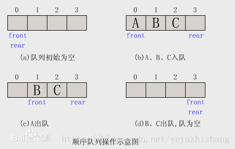

- 使用场景：因为队列先进先出的特点，在多线程阻塞队列管理中非常适用。

# 5. 非线性结构——树Tree

- 树是一种数据结构，它是由n(n>=1)个有限节点组成一个具有层次关系的集合。把它叫做“树”是因为它看起来像一颗倒挂的树，也就是说它是根朝上，而叶朝下。它具有以下特点：
  - 每个节点有零个或多个子节点
  - 没有父节点的节点称为根节点
  - 每一个非根节点有且只有一个父节点
  - 除了根节点外，每个子节点可以分为多个不相交的子树
- 名词理解：

  - 结点：指树中的一个元素；
  - 结点的度：指结点拥有的子树的个数，二叉树的度不大于2；
  - 数的度：指树中的最大结点度数；
  - 叶子：度为0的结点，也称为终端结点；
  - 高度：叶子节点的高度为1，根节点高度最高；
  - 层：根在第一层，以此类推；
- **高度与深度区别：**
  - **深度定义是从上往下的**
  - **高度定义是从下往上的**
  - **空数高度0**
  - **叶子结点高度1**

### 树的节点

- 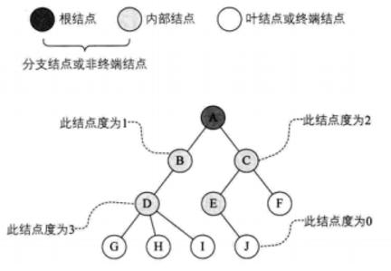
  - 树的结点包含一个数据元素及若干指向其子树的分支。**结点拥有的子树称为结点的度（Regree）。**度**为0的结点称为叶结点（Leaf）或终端结点**；**度不为0的结点称为非终端结点或分支节点**。**除根结点之外，分支节点也将称为内部结点**。**树的度是树内各结点的度的最大值。**如图所示，因为这棵树结点的度的最大值是结点D的度，为3，所以树的度也为3。
  - <https://www.cnblogs.com/TimVerion/p/11195603.html> 

### 树的深度

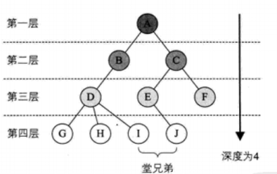

- **结点的层次（Level）从根开始定义起，根为第一层，根的孩子为第二层，若某结点在第一层，则其子树的根就在第l+1层。**其双亲在同一层的终点互为堂兄弟。显然图中的D、E、是堂兄弟，而G、H、I、J也是**。树中结点的最大层次称为树的深度（Deoth）或高度，当前树的深度为4** 

## （1）二叉树

- 二叉树是树的特殊一种
  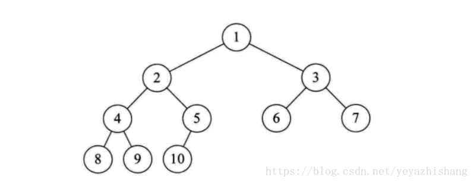
  - 每个节点最多有两颗子树，节点的度最大为2
  - 左子树和右子树是有顺序的，次序不能颠倒
  - 即使某节点只有一个子树，也要区分左右子树
- 二叉树性质
  - 二叉树中所有结点的度均不大于2
  - 若二叉树的层次从0开始，则在二叉树的第i层至多有2^i个结点(i>=0)
  - 高度为k的二叉树最多有2^(k+1) - 1个结点(k>=-1)(空树的高度为-1)**？**
  - 对任何一棵二叉树，如果其叶子结点(度为0)数为m, 度为2的结点数为n, 则m = n + 1
- 二叉树既有链表的好处，也有数组的好处，是两者的优化方案，在处理大批量的动态数据方面非常有用。
- 二叉树可分为5种形态
  - 
  - 

```java
//每一个二叉树的节点都可以用 Node 类表示
public class Node {

    /* * 一个二叉树包括 数据、左右孩子 三部分 */ 
    private int mData; 
    private Node mLeftChild; 
    private Node mRightChild; 

    public Node(int data, Node leftChild, Node rightChild) {
        mData = data;
        mLeftChild = leftChild;
        mRightChild = rightChild;
    }
}
```


### 二叉树遍历

- 二叉树是一种递归的结构，每个节点都可以有左右子树的结构，而二叉树的遍历也是个递归遍历的过程，使得每个节点有且只有被访问一次。

  按照遍历结构的顺序，一般将二叉树的遍历分为三种

  - 先序遍历
    - 先访问根节点
    - 再先序遍历左子树
    - 再先序遍历右子树
  - 中序遍历
    - 先中序遍历左子树
    - 再访问根节点
    - 再中序遍历右子树
  - 后序遍历
    - 先后序遍历左子树
    - 再后序遍历右子树
    - 最后访问根节点

#### 先序遍历

- 遍历方式

  - 先访问根节点
  - 再先序遍历左子树
  - 再先序遍历右子树

- ```java
  public void firstOrder(Node node){
      if (node == null){
          return;
      }
      showData(node);
      firstOrder(node.getLeftChild());
      firstOrder(node.getRightChild());
  }
  
  //输出节点数据
  public void showData(Node node){
      if (node == null){
          return;
      }
      System.out.println(node.getData());
  }
  ```

- 

#### 中序遍历

- 遍历方式

  - 先中序遍历左子树
  - 再访问根节点
  - 再中序遍历右子树

- ```java
  public void MediumOrder(Node node){
      if (node == null){
          return;
      }
      MediumOrder(node.getLeftChild());
      showData(node);
      MediumOrder(node.getRightChild());
  }
  ```

- 

#### 后序遍历

- 遍历方式

  - 先后序遍历左子树
  - 再后序遍历右子树
  - 最后访问根节点

- ```java
  public void LastOrder(Node node){
      if (node == null){
          return;
      }
      LastOrder(node.getLeftChild());
      LastOrder(node.getRightChild());
      showData(node);
  }
  ```


- 先序遍历： 1 2 4 5 7 3 6

  中序遍历： 4 2 7 5 1 3 6

  后序遍历： 4 7 5 2 6 3 1

## （2）完全二叉树

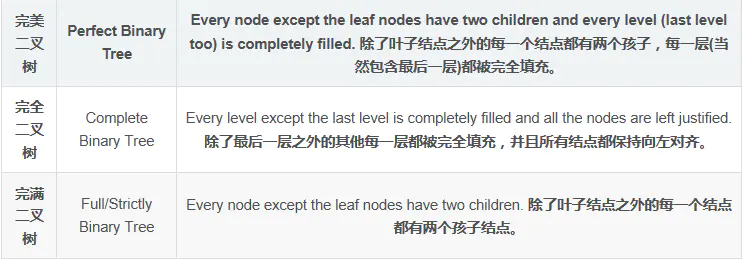

### 完美二叉树（满二叉树）

- 除了叶子节点（度（结点拥有的子树称为结点的度（Regree））为0的结点称为叶结点（Leaf））之外的每一个节点都有两个孩子，每一层（当然包含最后一层）都被完全填充

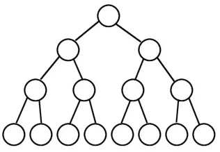

### 完全二叉树

- 除了最后一层之外的其它每一层都完全填充，并且所有结点都保持向左对齐

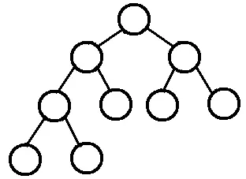

- **面试题**：如果一个完全二叉树的结点总数为768个，求叶子结点的个数。

由二叉树的性质知：n0=n2+1，将之带入768=n0+n1+n2中得：768=n1+2n2+1，因为完全二叉树度为1的结点个数要么为0，要么为1，那么就把n1=0或者1都代入公式中，很容易发现n1=1才符合条件。所以算出来n2=383，所以叶子结点个数n0=n2+1=384

**总结规律**：如果一棵完全二叉树的结点总数为n，那么叶子结点等于n/2（当n为偶数时）或者(n+1)/2（当n为奇数时）

### 完满二叉树 

- 除了叶子节点之外的每一个结点都有两个孩子结点

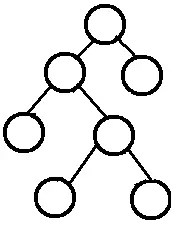

## （3）平衡二叉树（AVL树）

- AVL树是带有平衡条件的二叉查找树，和红黑树相比,它是严格的平衡二叉树,平衡条件必须满足(所有节点的左右子树高度差不超过1).不管我们是执行插入还是删除操作,只要不满足上面的条件,就要通过旋转来保持平衡,而旋转是非常耗时的
- 使用场景
  - **AVL树适合用于插入删除次数比较少，但查找多的情况。 也在Windows进程地址空间管理中得到了使用 **
  - **旋转的目的是为了降低树的高度，使其平衡** 
- AVL特点
  - **AVL树是一棵二叉搜索树**
  - **AVL树的左右子节点也是AVL树**
  - **AVL树拥有二叉搜索树的所有基本特点**
  - **每个节点的左右子节点的高度之差的绝对值最多为1，即平衡因子为范围为[-1,1]** 

## （4）二叉查找树（有序二叉查找树）

- 二叉查找树是一种特殊的二叉树，要求左子树的全部节点小于父亲节点，右子树的全部节点大于父亲节点，同时，左子树和右子树也为二叉查找树，中序遍历一个二叉查找树，会得到一个有序的元素集合。

<https://blog.csdn.net/weixin_43289569/article/details/104264783> 

```java
 //节点域
    public class Entry<T extends Comparable<T>> {
        private T data;//数据域
        private Entry<T> left;//左孩子域
        private Entry<T> right;//右孩子域

        public Entry() {
            this(null, null, null);
        }
        public Entry(T data,Entry<T> left,Entry<T> right){
            this.data=data;
            this.left=left;
            this.right=right;
        }
    }


 //根节点
    private Entry<T> root;

    //初始化
    public BSTDemo(){
        this.root=null;
    }
```

```java
//非递归查询
    public boolean non_search(T val){
        if(this.root==null){
            System.out.println("该树不存在，无法进行查询。");
            return false;
        }
        Entry<T> cur=this.root;
        while(cur!=null){
            if(cur.data.compareTo(val)>0){
                //插入元素比当前节点小，往左
                cur=cur.left;
            }else if(cur.data.compareTo(val)<0){
                cur=cur.right;
            }else {
                System.out.println("树中存在"+ val +"，查询成功。");
                return true;
            }
        }
        System.out.println("树中不存在"+ val +"，查询失败。");
        return false;
    }

```

```java
//递归查询
    public void search(T val){
       search(this.root, val);
    }
    private Entry<T> search(Entry<T> root,T val) {
        if (this.root == null) {
            return null;
        }
        while (root != null) {
            if (root.data.compareTo(val) < 0) {
                return search(root.right, val);
            } else if (root.data.compareTo(val) > 0) {
                return search(root.left, val);
            } else{
                System.out.println("树中存在"+val+"，查询成功。");
                return root;
            }
        }
        //没找到
        System.out.println("树中不存在"+val+"，查询失败。");
        return null;
    }

```


### 优缺点

- 优点：
  - 二叉查找树拥有良好的查找性能，查找次数最多为树的深度，这意味着二叉查找树的查找效率取决于树的深度
- 缺点：?
  - 二叉查找树在极端的情况下会大大降低他的查找性能，比如说，顺序插入节点时，二叉树就会像一个链表，查找的时间复杂度为O(N)

## (5)红黑树


> 为什么有红黑树
>
> https://zhuanlan.zhihu.com/p/97523789
>
> - 本质上都是为了解决排序二叉树在极端情况下退化成链表导致检索效率大大降低的问题。


https://blog.csdn.net/ThinkWon/article/details/102571535>

- 红黑树是一种自**平衡的二叉查找树**，是一种**高效的查找树**。

- 红黑树具有良好的效率，它可在O(logN)时间内完成查找、增加、删除等操作。

- 红黑树应用广泛：java中的TreeMap、jdk1.8中的HashMap

- 具体来说，红黑树是满足如下条件的二叉查找树
  - 1. 每个节点要么是红色，要么是黑色。
  - 2. 根节点必须是黑色
  - 3. 红色节点不能连续（也即是，红色节点的孩子和父亲都不能是红色）。
  - 4. 对于每个节点，从该点至`null`（树尾端）的任何路径，都含有相同个数的黑色节点。
  - 5. 所有的叶子节点都是空节点（即null），并且是
  - <https://blog.csdn.net/yeyazhishang/article/details/82561910> 
  - 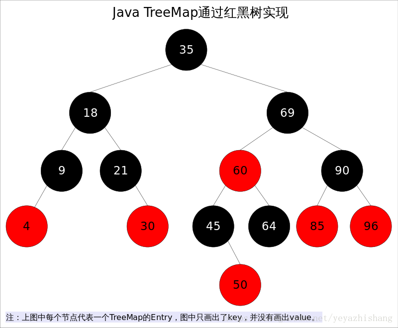
  - 在树的结构发生改变时（插入或者删除操作），往往会破坏上述条件3或条件4，需要通过调整使得查找树重新满足红黑树的条件。

- 预备知识
  - 当查找树的结构发生改变时，红黑树的条件可能被破坏，需要通过调整使得查找树重新满足红黑树的条件。调整可以分为两类：
  - 一类是颜色调整，即改变某个节点的颜色；
  - 另一类是结构调整，集改变检索树的结构关系。结构调整过程包含两个基本操作：**左旋（Rotate Left），右旋（RotateRight）**。

- ```java
  //红黑树的节点结构与一般的二叉树类似，但是多了一个标记颜色的变量
  class RBTreeNode<K, T> {
      K key;              // 键值，用于索引，可比较类型或是有相应的比较器
      T value;            // 存储的数据
      ColorType color;    // 节点颜色
      RBTreeNode parent;  // 父节点
      RBTreeNode left;    // 左子节点
      RBTreeNode right;   // 右子节点
  }
  
  enum ColorType {
      BLACK,
      RED,
  }
  //https://blog.csdn.net/dongzhong1990/article/details/80758256
  ```

### 红黑树性能

- 查找
  - avl树要比红黑树更平衡，因此AVL树的查找效率更高
  - （为什么要保证树的平衡性？）因为树的查询性能取决于树的高度，让树尽可能平衡，就是为了降低树的高度
- 插入
  - 不论是AVL树还是红黑树，旋转的时间复杂度都是O(1)
  - 对应AVL树，旋转的时候（左旋、右旋），需要找到第一个不平衡节点，这就需要我们维护一个平衡因子，每一次插入、旋转、删除等操作，都要更新从跟节点到被修改节点这个路径上的平衡因子。。最差情况下，需要O(logn)的时间复杂度
  - 而对于红黑树，除了旋转外，最差情况下也需要O(logn)的时间复杂度来调整平衡，注意这只是极端情况下，比如父节点和伯父节点都是红色，曾祖父节点也是红色，这个时候，就要递归的去平衡父节点，然而，采用自顶向下的方法（就是如果一个节点的两个子节点都是红色，就把这个节点变成红色，它的两个子节点变成黑色），减少了多次旋转操作，但也使得调整颜色的操作时间复杂度最差情况下是O(logn)，但这仅仅是很少的情况，所以红黑树的插入操作总体上比AVL树要好
- 删除
  - 对应AVL树，删除意味着某个子树深度减少，这个时候，我们找到第一个不平衡的点，像插入操作那样进行旋转，使得子树平衡，然后，递归的使它的祖先节点也平衡
  - 对应红黑树，也是只有个别情况才会递归平衡父节点，它发生在：兄弟节点都是黑色，两个侄儿也是黑色。当兄弟节点是红色的时候，转换为兄弟节点是黑色的情况处理，当两个侄儿有红色节点的时候，则在常数时间内就可以达到平衡。所以，删除操作红黑树的平均效率也比AVL树高。
- 任何不平衡都会在3次旋转之内解决。这一点是AVL所不具备的

#### 具体原理

##### 红黑树插入过程中情况

每次插入元素的时候会将 元素 着色为红色。其目的为了快的满足红黑树的4个条件

- 红黑树结构不会旋转变化情况：。
  1）当插入的节点为的父亲为黑色节点。【什么都不用做】
  2）被插入的节点是根节点。【直接把此节点涂为黑色】

- 红黑树结构发生旋转变化情况：
  1） 当前节点的父节点【60】是红色，且当前节点的祖父节点【40】的另一个子节点（叔叔节点）也是红色。
  2）当前插入的父节点是红色，当前叔叔节点的黑色，且当前节点为其父亲节点的左孩子。（进行左旋）
  3）当前插入的父节点是红色，当前叔叔节点的黑色，且当前节点为其父亲节点的右孩子。（进行右旋）
  https://blog.csdn.net/jjc120074203/article/details/78780221

- 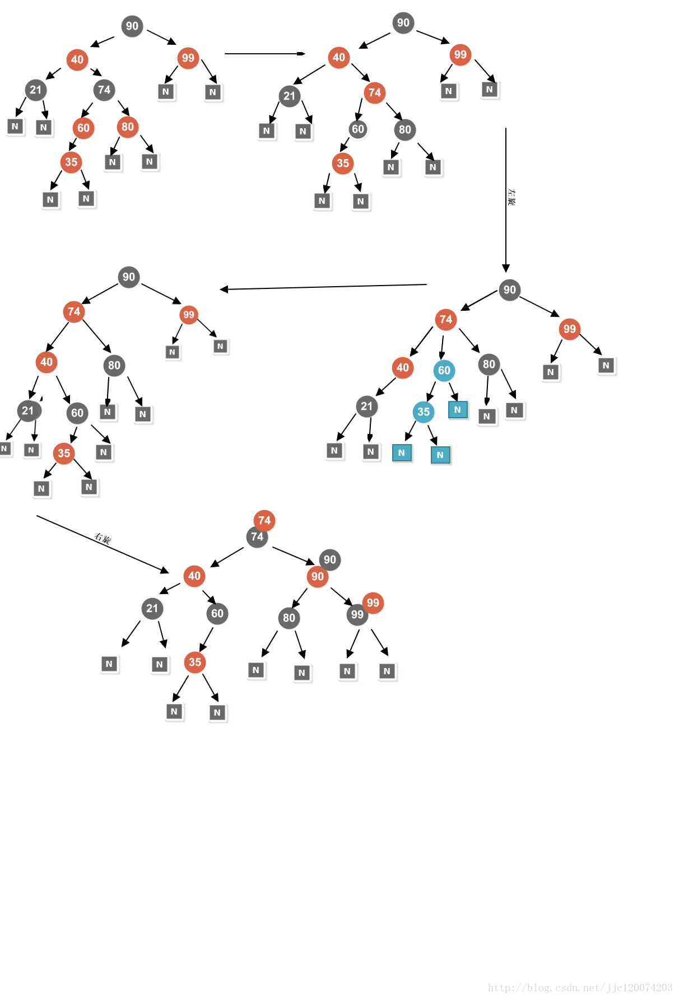

- **红黑树结构发生旋转变化情况已经对应的措施如下**

  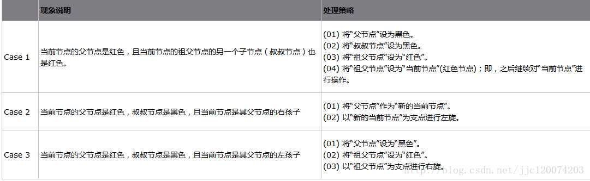

  **左旋 ： 右边过于臃肿**
  **右旋 ： 左边过于臃肿**
  **相对复杂的红黑树 旋转最大不超过3次**

- 

- ## 左旋

  左旋的过程是将`x`的右子树绕`x`逆时针旋转，使得`x`的右子树成为`x`的父亲，同时修改相关节点的引用。旋转之后，二叉查找树的属性仍然满足。

  

  

  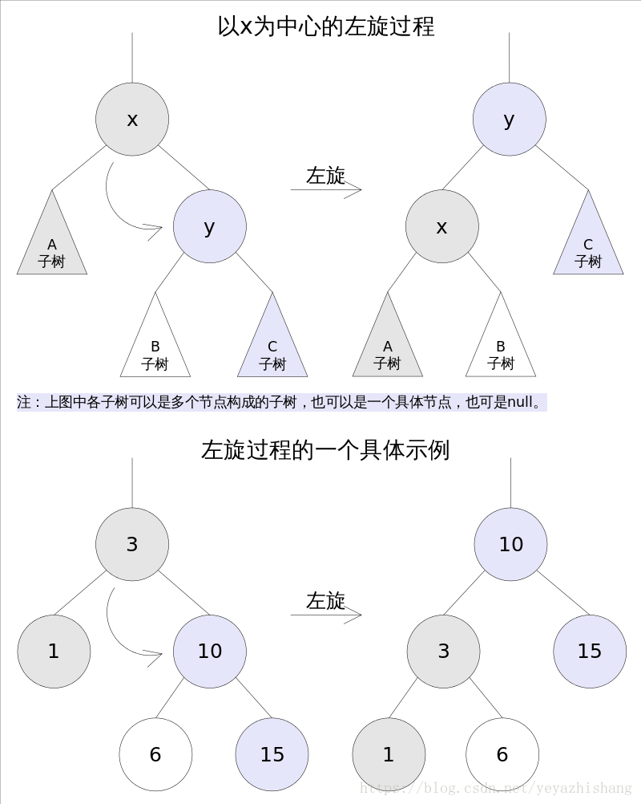

  ```java
  //Rotate Left
  private void rotateLeft(Entry<K,V> p) {
      if (p != null) {
          Entry<K,V> r = p.right;
          //第一步：p节点（上图的X节点）与其右节点的左子节点（上图的B节点）进行连接
          p.right = r.left;
          if (r.left != null)
              r.left.parent = p;
          //第二步：p节点的父节点与右子节点（上图的Y节点）进行连接
          r.parent = p.parent;
          if (p.parent == null)
              root = r;
          else if (p.parent.left == p)
              p.parent.left = r;
          else
              p.parent.right = r;
         //第三步：p节点(X 节点)与r节点（Y节点）父子关系互换
          r.left = p;
          p.parent = r;
      }
  }
  ```

- ## 右旋

  右旋的过程是将`x`的左子树绕`x`顺时针旋转，使得`x`的左子树成为`x`的父亲，同时修改相关节点的引用。旋转之后，二叉查找树的属性仍然满足。

  

  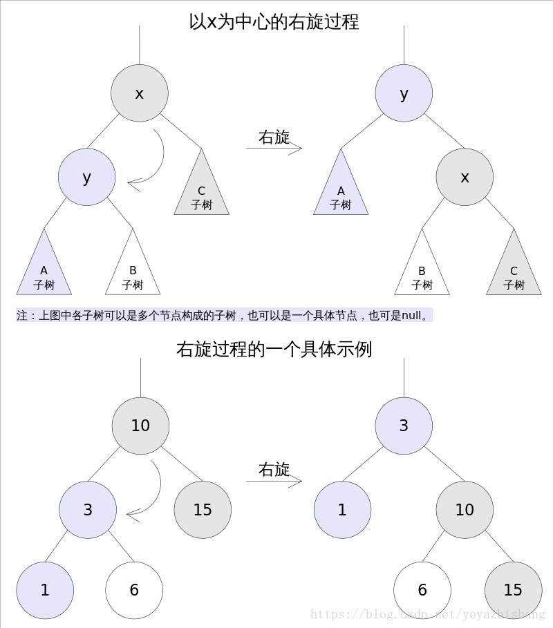

  ```java
  //Rotate Right
  private void rotateRight(Entry<K,V> p) {
      if (p != null) {
          Entry<K,V> l = p.left;
          p.left = l.right;
          if (l.right != null) l.right.parent = p;
          l.parent = p.parent;
          if (p.parent == null)
              root = l;
          else if (p.parent.right == p)
              p.parent.right = l;
          else p.parent.left = l;
          l.right = p;
          p.parent = l;
      }
  }
  ```

- 

### 方法剖析

**java中的红黑树实现类是TreeMap** 

```java
// TreeMap中使用Entry来描述每个节点
 static final class Entry<K,V> implements Map.Entry<K,V> {
        K key;
        V value;
        Entry<K,V> left;
        Entry<K,V> right;
        Entry<K,V> parent;
        boolean color = BLACK;
        ...
 }
```


#### get()

`get(Object key)`方法根据指定的`key`值返回对应的`value`，该方法调用了`getEntry(Object key)`得到相应的`entry`，然后返回`entry.value`。因此`getEntry()`是算法的核心。算法思想是根据`key`的自然顺序（或者比较器顺序）对二叉查找树进行查找，直到找到满足`k.compareTo(p.key) == 0`的`entry`。

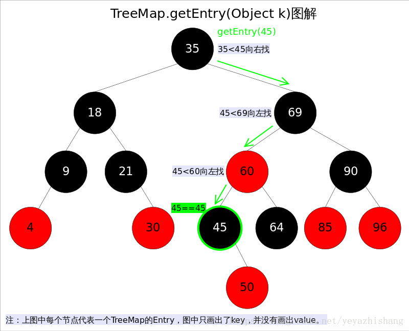

```java
//getEntry()方法
final Entry<K,V> getEntry(Object key) {
    ......
    if (key == null)//不允许key值为null
        throw new NullPointerException();
    Comparable<? super K> k = (Comparable<? super K>) key;//使用元素的自然顺序
    Entry<K,V> p = root;
    while (p != null) {
        int cmp = k.compareTo(p.key);
        if (cmp < 0)//向左找
            p = p.left;
        else if (cmp > 0)//向右找
            p = p.right;
        else
            return p;
    }
    return null;
}
```

#### put()

`put(K key, V value)`方法是将指定的`key`, `value`对添加到`map`里。该方法首先会对`map`做一次查找，看是否包含该元组，如果已经包含则直接返回，查找过程类似于`getEntry()`方法；如果没有找到则会在红黑树中插入新的`entry`，如果插入之后破坏了红黑树的约束，还需要进行调整（旋转，改变某些节点的颜色）。

```java
public V put(K key, V value) {
    ......
    int cmp;
    Entry<K,V> parent;
    if (key == null)
        throw new NullPointerException();
    Comparable<? super K> k = (Comparable<? super K>) key;//使用元素的自然顺序
    do {
        parent = t;
        cmp = k.compareTo(t.key);
        if (cmp < 0) t = t.left;//向左找
        else if (cmp > 0) t = t.right;//向右找
        else return t.setValue(value);
    } while (t != null);
    Entry<K,V> e = new Entry<>(key, value, parent);//创建并插入新的entry
    if (cmp < 0) parent.left = e;
    else parent.right = e;
    fixAfterInsertion(e);//调整
    size++;
    return null;
}
```

- 上述代码的插入部分并不难理解：首先在红黑树上找到合适的位置，然后创建新的`entry`并插入（当然，新插入的节点一定是树的叶子）。难点是调整函数`fixAfterInsertion()`，前面已经说过，调整往往需要：

  1.改变某些节点的颜色

  2.对某些节点进行旋转。

  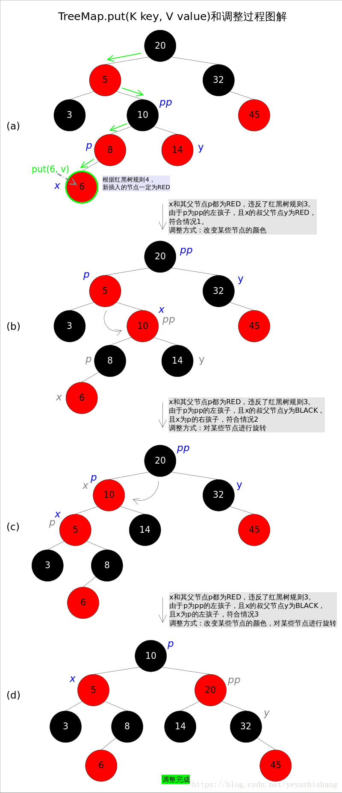

  调整函数`fixAfterInsertion()`的具体代码如下，其中用到了上文中提到的`rotateLeft()`和`rotateRight()`函数。通过代码我们能够看到，情况2其实是落在情况3内的。情况4～情况6跟前三种情况是对称的，因此图解中并没有画出后三种情况，读者可以参考代码自行理解。

  ```java
  //红黑树调整函数fixAfterInsertion()
  private void fixAfterInsertion(Entry<K,V> x) {
      x.color = RED;
      while (x != null && x != root && x.parent.color == RED) {
          if (parentOf(x) == leftOf(parentOf(parentOf(x)))) {
              Entry<K,V> y = rightOf(parentOf(parentOf(x)));
              if (colorOf(y) == RED) {//如果y为null，则视为BLACK
                  setColor(parentOf(x), BLACK);              // 情况1
                  setColor(y, BLACK);                        // 情况1
                  setColor(parentOf(parentOf(x)), RED);      // 情况1
                  x = parentOf(parentOf(x));                 // 情况1
              } else {
                  if (x == rightOf(parentOf(x))) {
                      x = parentOf(x);                       // 情况2
                      rotateLeft(x);                         // 情况2
                  }
                  setColor(parentOf(x), BLACK);              // 情况3
                  setColor(parentOf(parentOf(x)), RED);      // 情况3
                  rotateRight(parentOf(parentOf(x)));        // 情况3
              }
          } else {
              Entry<K,V> y = leftOf(parentOf(parentOf(x)));
              if (colorOf(y) == RED) {
                  setColor(parentOf(x), BLACK);              // 情况4
                  setColor(y, BLACK);                        // 情况4
                  setColor(parentOf(parentOf(x)), RED);      // 情况4
                  x = parentOf(parentOf(x));                 // 情况4
              } else {
                  if (x == leftOf(parentOf(x))) {
                      x = parentOf(x);                       // 情况5
                      rotateRight(x);                        // 情况5
                  }
                  setColor(parentOf(x), BLACK);              // 情况6
                  setColor(parentOf(parentOf(x)), RED);      // 情况6
                  rotateLeft(parentOf(parentOf(x)));         // 情况6
              }
          }
      }
      root.color = BLACK;
  }
  ```

  

#### remove()

<https://blog.csdn.net/yeyazhishang/article/details/82561922> 

`remove(Object key)`的作用是删除`key`值对应的`entry`，该方法首先通过上文中提到的`getEntry(Object key)`方法找到`key`值对应的`entry`，然后调用`deleteEntry(Entry<K,V> entry)`删除对应的`entry`。由于删除操作会改变红黑树的结构，有可能破坏红黑树的约束，因此有可能要进行调整。

`getEntry()`函数前面已经讲解过，这里重点放`deleteEntry()`上，该函数删除指定的`entry`并在红黑树的约束被破坏时进行调用`fixAfterDeletion(Entry<K,V> x)`进行调整。

**由于红黑树是一棵增强版的二叉查找树，红黑树的删除操作跟普通二叉查找树的删除操作也就非常相似，唯一的区别是红黑树在节点删除之后可能需要进行调整**。现在考虑一棵普通二叉查找树的删除过程，可以简单分为两种情况：

1. 删除点p的左右子树都为空，或者只有一棵子树非空。
2. 删除点p的左右子树都非空。

对于上述情况1，处理起来比较简单，直接将p删除（左右子树都为空时），或者用非空子树替代p（只有一棵子树非空时）；对于情况2，可以用p的后继s（树中大于x的最小的那个元素）代替p，然后使用情况1删除s（此时s一定满足情况1，可以画画看）。

## （6）B，B+，B*树

- 场景：

  - mysql的数据库索引结构用的就是B+树

- > - <https://www.cnblogs.com/qianjinyan/p/11195219.html> 
  > - B 树是一种多路搜索树，它的每个节点可以拥有多于两个孩子节点。M路的B树最多能拥有M个孩子节点
  > - 为啥要设计成多路呢？
  >   - 为了进一步降低树的高度，路数越多，树的高度越低
  >   - 但又不能设计成无限多路，要不然会退化成有序数组了
  > - 为什么文件系统、数据库的索引都喜欢用B树而不用红黑树或者有序数组呢？
  >   - 因为文件系统和数据库的索引都是存在硬盘上的，并且如果数据量大的话，不一定能一次性加载进内存中，这时B树的多路存储，每次加载B树的一个节点，然后一步步往下找。
  >   - 索引，如果在内存中，红黑树比B树效率更高，但涉及到磁盘操作，B树就更有力
  > - 既然Hash比B+树更快，为啥mysql还用B+树来存索引呢？
  >   - 这和业务场景有关。如果只选一个数据，那确实是hash更快。但是数据库中经常会选择多条，这时候由于B+树索引一般是在磁盘上，数据量大的情况可能无法一次装入内存，B+ 树的多路存储的设计就可以允许数据分批搜索

#### B树的特点

- 每个节点最多含有m个孩子
- 根节点含有[2,m]个孩子
- 非叶子节点含有[[m/2],m]个孩子节点（向上取整的意思）
- 一个节点如果含有k个关键字，那么它就有k+1个孩子
- 所有叶子节点都在同一层
- 每个节点的k个关键数把节点拆成了k+1段


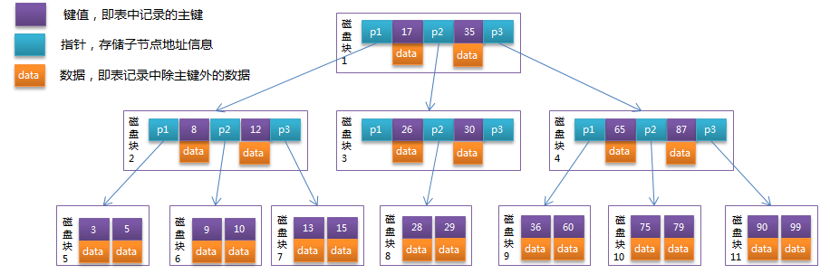

模拟查找关键字29的过程：

1. 根据根节点找到磁盘块1，读入内存。【磁盘I/O操作第1次】
2. 比较关键字29在区间（17,35），找到磁盘块1的指针P2。
3. 根据P2指针找到磁盘块3，读入内存。【磁盘I/O操作第2次】
4. 比较关键字29在区间（26,30），找到磁盘块3的指针P2。
5. 根据P2指针找到磁盘块8，读入内存。【磁盘I/O操作第3次】
6. 在磁盘块8中的关键字列表中找到关键字29

分析上面过程，发现需要3次磁盘I/O操作，和3次内存查找操作。由于内存中的关键字是一个有序表结构，可以利用二分法查找提高效率。而3次**磁盘I/O操作是影响整个B-Tree查找效率的决定因素**。

#### B +树的特点

> - InnoDB 存储引擎就是用B+树实现其索引结构

- 非叶子节点只存储键值信息
- 所有叶子节点之间都有一个链指针
- 数据记录都存放在叶子节点中


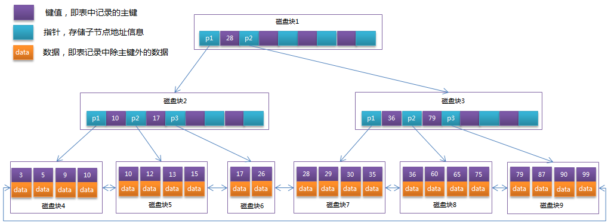


#### 为什么Mysql数据库要用B+树存储索引


## （7）LSM树

# 6. 散列表 Hash（哈希表）

- 是根据关键码和值（key和value）直接进行访问的数据结构，通过key和value来映射到集合中的一个位置，这样就可以很快找到集合中的对应元素

**记录的存储位置 = f(key)**

- f 称为散列函数，又称为哈希（hash函数）
- 而散列表就是把key通过一个固定的算法函数（既所谓的**哈希函数**）转换成一个**整型数字**，然后将该数字对数组长度进行取余，取余结果就当作**数组的下标**。
- 将value存储在以该数字为下标的数组空间里，这种存储空间可以充分利用数组的查找优势来查找元素，所以查找速度很快。


> 应用场景：
>
> - HashMap、HashTable

- 因为哈希表基于数组衍生的数据结构，在添加、删除元素方面是比较慢的，所以很多时候需要用到一种数组链表来做，也就是拉链法。**拉链法是数组结合链表的一种结构**，jdk1.8之前的HashMap底层的存储就是采用这种结构，jdk1.8之后，换成数组+红黑树的结构：

  

  - 从图中可以看出，左边很明显是个数组，数组的每个成员包括一个指针，指向一个链表的头，当然这个链表可能为空，也可能元素很多。我们根据元素的一些特征把元素分配到不同的链表中去，也是根据这些特征，找到正确的链表，再从链表中找出这个元素

### HashMap 

> <https://jingyan.baidu.com/article/ceb9fb10157a18ccac2ba05b.html>

- HashMap的实现原理即哈希表数据结构的实现原理

#### 数组+链表

```java
static class Entry<K,V> implements Map.Entry<K,V> {
        final K key;
        V value;
        Entry<K,V> next;//存储指向下一个Entry的引用，单链表结构
        int hash;//对key的hashcode值进行hash运算后得到的值，存储在Entry，避免重复计算

        /**
         * Creates new entry.
         */
        Entry(int h, K k, V v, Entry<K,V> n) {
            value = v;
            next = n;
            key = k;
            hash = h;
        }
//https://blog.csdn.net/samniwu/article/details/90550196
```


- **简单来说**，HashMap由数组+链表组成的，数组是HashMap的主体，链表则是主要为了解决哈希冲突而存在的，如果定位到的数组位置不含链表（即当前entry的next指向null），那么对于查找，添加等操作很快，仅需一次寻址即可；

  如果定位到的数组包含链表，对于添加操作，其时间复杂度为O(n)，

  - 首先遍历链表，存在key即覆盖，否则新增；
  - 对于查找操作来讲，扔需遍历链表，然后通过key对象的equals方法逐一比对查找。所以，性能考虑，HashMap的链表出现越少，性能才会越好。

##### hash表的存储原理

- hash表存储利用到了数组以及链表，当键值对数据传入时，系统先将key值取出，利用hash函数转换成hash值，再运用散列法（此处用除法散列法取余），得到需要存入数组的下标index；将key-value一起存入到数组Node<K,V>[] table中，数组的每个位置存放的是链表的表头。
- 当使用index进行存储键值对的时候，如果此下标已经有了数据，那么将通过equals方法比较两个hash值是否相同，如果相等，再比较两个键值对key是否相等，如果不等，则在此下标位置，以链表的方式，将新存储的数据放到表头；如果相等，将覆盖原先的value；
- 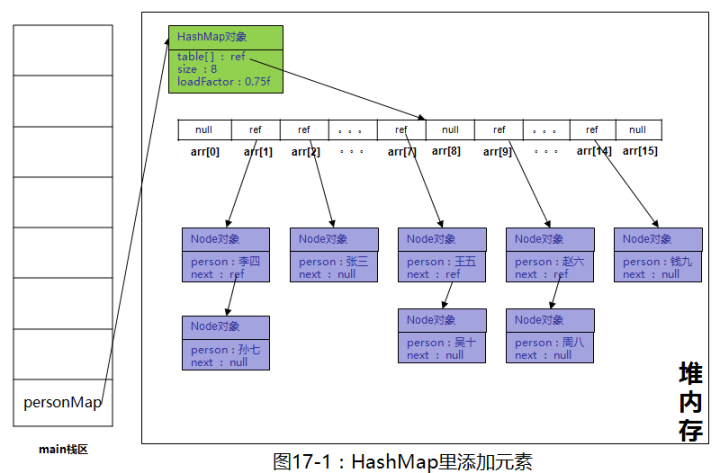
- 

##### hash表的查询原理

- 先将key值通过hash函数转换成指向内存地址的hash值；
- 通过equals方法，比较hash值查找对应的内存地址，然后再通过内存地址找到对应的链表，此时再通过equals方法，比较key值是否相等，若相等，取出键值对返回数据，如果不等，沿着链表继续向下寻找比较。

##### 总结

- hash表就是通过传入的键值对，通过hash算法指向一个连续的存储空间（数组存储），将键值对存入数组；
- 对于指向相同的存储空间的hash值，再以链表方式存储
- 这样hashmap不仅具有了数据查询快速的特性，同时有了链表方便插入、删除的特性；因此，hashmap对于数据的存储查询具有非常好的特性

##### 注意

- HashMap的默认长度为16，到达上限时自动扩容
- 由于自动扩容时hash表（数组）都需要重新扩容，会耗费性能，因此一般在知道数据量大小的时候，指定长度更加有利于hashmap运行效率，避免map进行频繁的扩容

#### 数组+链表+红黑树

- 当hash冲突时，jdk8之前采用链表来存储，当碰撞结点很多时，查询时间是O(n)
- 在jdk8中，HashMap处理hash冲突时增加了红黑树这种数据结构，当碰撞结点较少时，采用链表存储，当较大时（>8个），采用红黑树存储（TreeNode）（查询时间是O(lgN)）（有一个阈值控制，大于阈值（8个）），将链表存储转换成红黑树存储
- 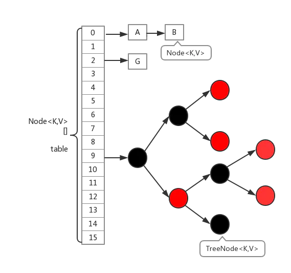 

```java
 //红黑树  
 2 static final class TreeNode<k,v> extends LinkedHashMap.Entry<k,v> {  
 3     TreeNode<k,v> parent;  // 父节点  
 4     TreeNode<k,v> left; //左子树  
 5     TreeNode<k,v> right;//右子树  
 6     TreeNode<k,v> prev;    // needed to unlink next upon deletion  
 7     boolean red;    //颜色属性  
 8     TreeNode(int hash, K key, V val, Node<k,v> next) {  
 9         super(hash, key, val, next);  
10     }  
11    
12     //返回当前节点的根节点  
13     final TreeNode<k,v> root() {  
14         for (TreeNode<k,v> r = this, p;;) {  
15             if ((p = r.parent) == null)  
16                 return r;  
17             r = p;  
18         }  
19     }  
```


### HashTable&ConcurrentHashMap 

- > - TreeMap是基于树的实现，
  > - HashMap、HashTable、ConcurrentHashMap是基于hash表的实现
  >
  > - HashMap和HashTable在代码实现上，基本上是一样的。一个线程不安全，一个线程安全

- ConcurrentHash：线程安全，性能也比HashTable好很多

  - 因为HashTable是锁整个Map对象
  - 而ConcurrentHashMap是锁Map的部分结构

# 7. 堆Heap

- 堆是一种比较特殊的数据结构，可以被看做一棵树的数组对象，具有以下性质
  - 堆中某个节点的值总是**不大于**或**不小于**其**父节点**的**值** 
    - 将根节点最大的堆叫做最大堆或大根堆
    - 根节点最小的堆叫做最小堆或小根堆
  - 堆总是一颗**完全二叉树**
  - 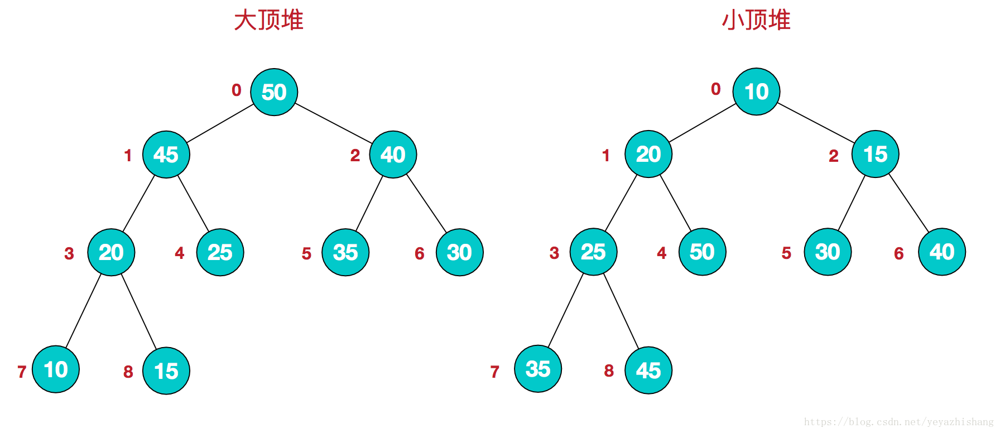
  - 堆的定义如下：n个元素的序列{k1,k2,ki,…,kn}当且仅当满足下关系时，称之为堆。
    (ki <= k2i,ki <= k2i+1)或者(ki >= k2i,ki >= k2i+1), (i = 1,2,3,4…n/2)，满足前者的表达式的成为小顶堆，满足后者表达式的为大顶堆，这两者的结构图可以用完全二叉树排列出来
- 因为堆有序的特点，一般用来做数组中的排序，称为堆排序

# 8. 图Graph

- 图是由结点的有穷集合V和边的集合E组成。其中，为了与树形结构加以区别，在图结构中常常将结点称为顶点，边是顶点的有序偶对，若两个顶点之间存在一条边，就表示这两个顶点具有相邻关系。

  按照顶点指向的方向可分为无向图和有向图：

  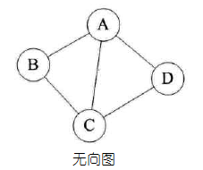

  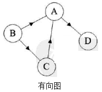

- 图是一种比较复杂的数据结构，在存储数据上有着比较复杂和高效的算法，分别有邻接矩阵 、邻接表、十字链表、邻接多重表、边集数组等存储结构，这里不做展开，读者有兴趣可以自己学习深入

# 各类数据结构比较


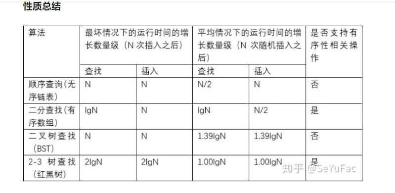


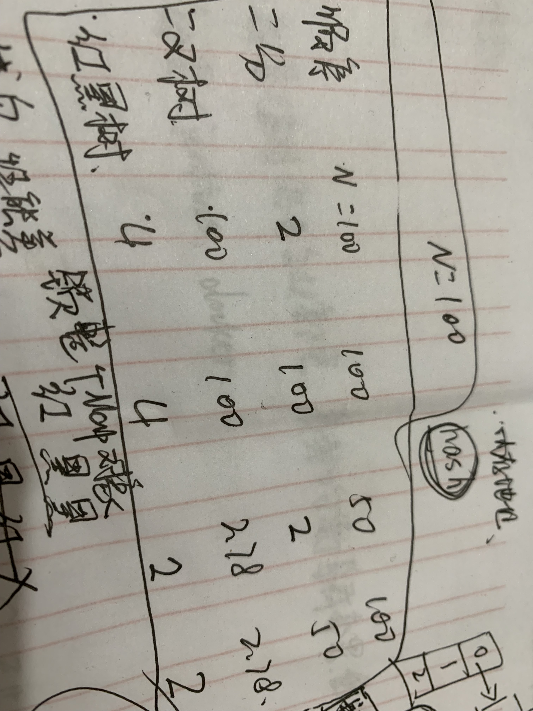

