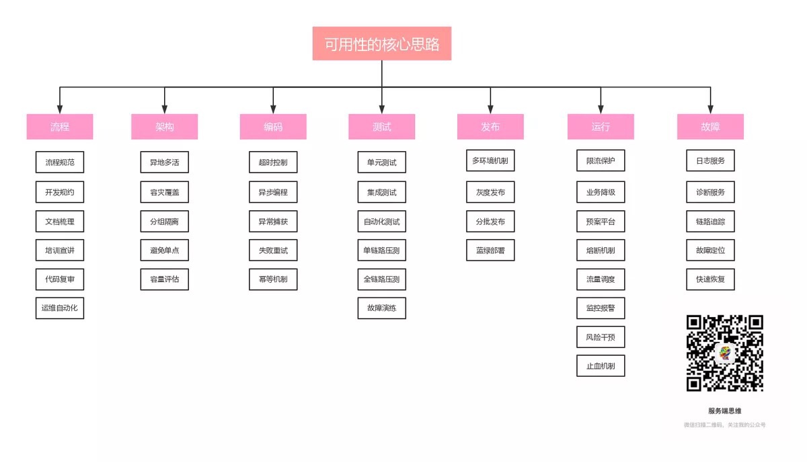
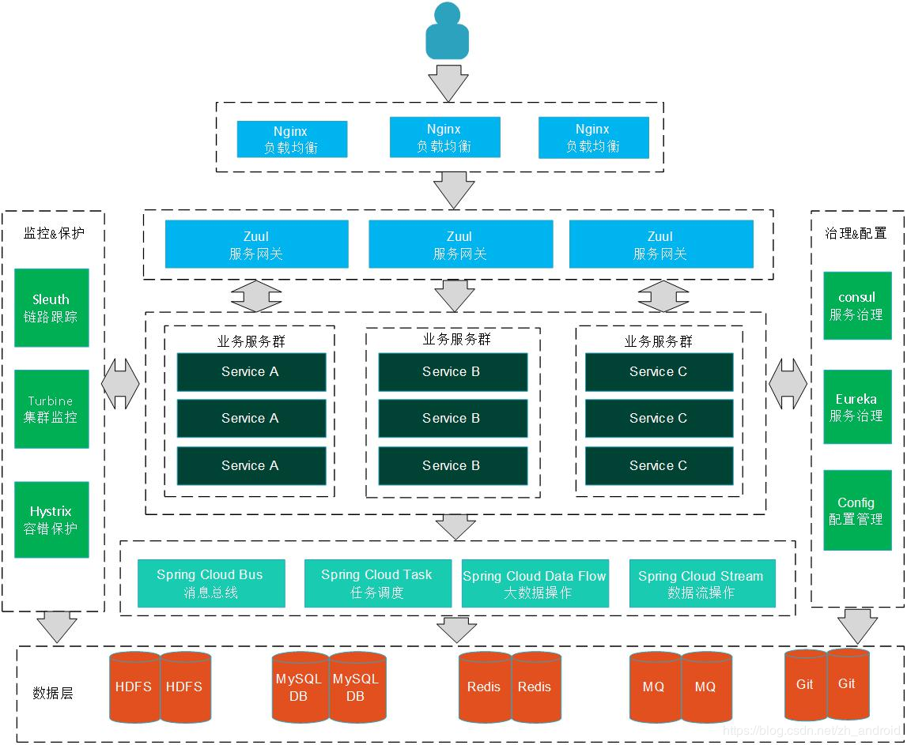
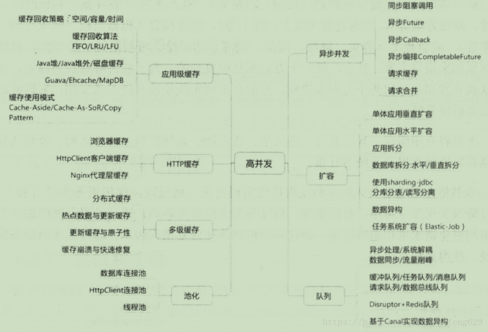
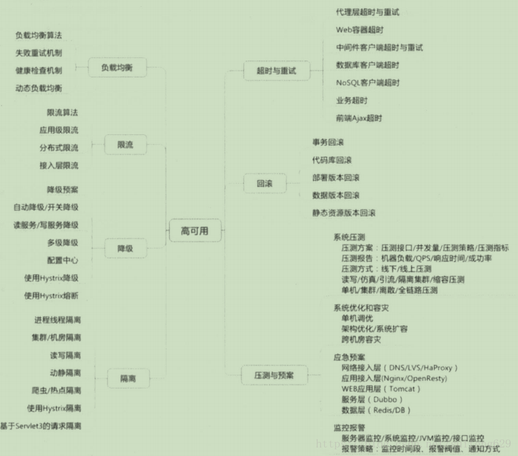
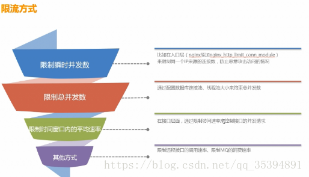
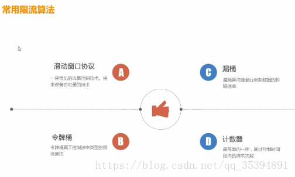
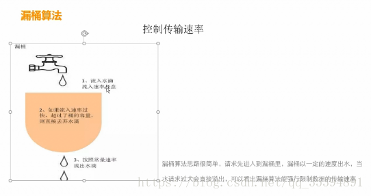
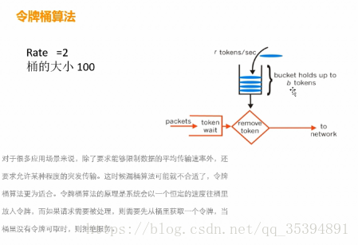
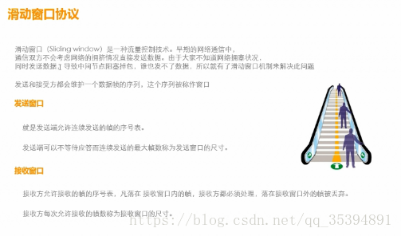
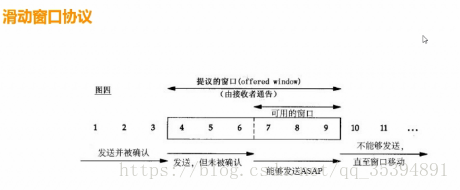

# 高并发

- >  并发：两个队列+一台咖啡机
  >
  > 并行：两个队列+两台咖啡机

- 高并发：服务器能同时处理很多请求；即同时并行处理很多请求

- （解决方案：缓存）

- > 磁盘缓存：文件缓存
  >
  > 内存缓存：（redis）

- > - 异步并发
  > - 磁盘缓存
  > - 分布式缓存
  > - 线程池、数据库连接池
  > - 服务扩容
  > - 队列
  >

# 高可用

- （解决方案：集群）

- > - 负载均衡
  > - 隔离
  > - 限流
  > - 降级
  > - 超时
  > - 回滚
  > - 压测

- > 服务主从部署（应用服务主从部署、应用服务负载均衡部署、数据库主从部署）
  >
  > 自动化部署（Jenkins、docker）

## 限流

### 限流方式 

### 限流算法

#### 漏桶算法 

#### 令牌桶算法

### 滑动窗口协议 

# 业务设计

- > - 幂等
  > - 防重
  > - 状态机
  >
  > 

