# 排序算法

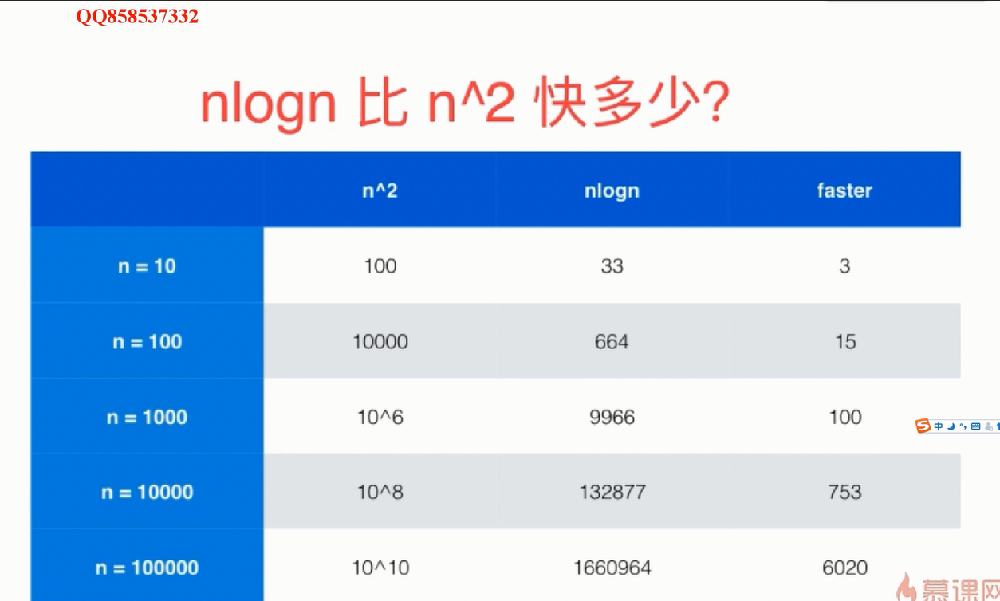  

## O（n^2）的排序算法

### 选择排序算法（selection sort）

- 每一次循环选出最小一位放到前面的位置，即如果有N个元素需要排序，那么首先先从N个元素中找到最小的那个元素与第0位置上的元素交换，然后再从剩下的N-1个元素中找到最小的元素与第1位置上的元素交换，。。。直到所有元素都排序好。

- ```java
  /**
   * @version 1.0
   * @author: zb
   * @date: 2020/01/07/11:48
   * @description: 选择排序
   */
  public class SelectSort {
  
      public static void main(String[] args) {
          int[] arr = new int[]{33,12,3,4,11,44,53};
          System.out.println(Arrays.toString(arr));
  //        int[] ints = selectSort(arr);
          SelectionSort(arr,arr.length);
      }
  
  
      /**
       * @Description: 选择排序思想：
       * @Param:
       * @return:
       * @Author: zb
       * @Date: 2020/1/7
       */
      public static int[] selectSort(int[] arr){
          int temp;
          for (int i = 0; i < arr.length-1; i++) {
              int k = i;
              for (int j = i+1; j < arr.length-1; j++) {
                  if(arr[k] > arr[j] ){
                      k = j;
                  }
              }
              temp = arr[i];
              arr[i] = arr[k];
              arr[k] = temp;
  //            temp = arr[k];
  //            arr[k] = arr[i];
  //            arr[i] = temp;
              System.out.println(Arrays.toString(arr));//6次
          }
          return arr;
      }
  ```

- 

算法的性能（执行时间）如下：

```java
	@Test
	public void test2() {
		selectSort(arr);
	}
	/**
	*选择算法排序 ：先选出最小的，然后填在对应的位置上,然后选出第二小的，放在第二个位置，依次类推
	*/
	private void selectSort(int[] arr) {
		for (int i = 0; i < arr.length - 1; i++) {
			for (int j = i + 1; j < arr.length; j++) {
				if (arr[i] > arr[j]) {
					int temp = 0;
					temp = arr[i];
					arr[i] = arr[j];
					arr[j] = temp;
				}
			}
		}
		// printArr(arr);
	}

/**
	 * 选择排序算法，对应数据所需要的时间
	 */
	@Test
	public void test3() { 
		int[] num = getNum(100000);
		long startTime = System.currentTimeMillis();
		selectSort(num);// 9 13 22 37 42 42 52 57 66 70
		// 1 25 27 29 42 46 57 58 67 98
		long endTime = System.currentTimeMillis();
		System.out.println(endTime - startTime);// 1000:5毫秒；10000：72毫秒 ；100000：2206毫秒
		// printArr(num);
	}

	@Test
	public void test4() {
		int[] num = getNum(1000);
		LocalDateTime startTime = LocalDateTime.now();
		selectSort(num);
		LocalDateTime endTime = LocalDateTime.now();
		System.out.println(Duration.between(startTime, endTime).toMillis());// 1000:7毫秒；10000：70毫秒 ；100000：2289毫秒
	}

```

### 插入排序算法（Insertion Sort）


- ```java
  /**
        * @Description: 插入排序思想：第0个和第1个对比，如果0>1,交换位置，然后第2位置和此时的第0位置对比，0>2 ，那就第0,1位置后移，把2插入到0位置。。。。
        * @Param: 
        * @return: 
        * @Author: zb
        * @Date: 2020/1/7
      */    
      public static int[] insertSort(int[] arr){
          int tmp  = 0;
          for (int i = 1; i < arr.length; i++) {
              tmp = arr[i];
              int j = i;
              while(j>0 && arr[j] >= tmp){
                  arr[j] = arr[j-1];
                  j--;
              }
              arr[j] = tmp;
          }
          return arr;
      }
  ```

- 

**核心：内循环满足条件可提前终止** 

所以对于大部分有序的数据，插入排序算法效率快很多

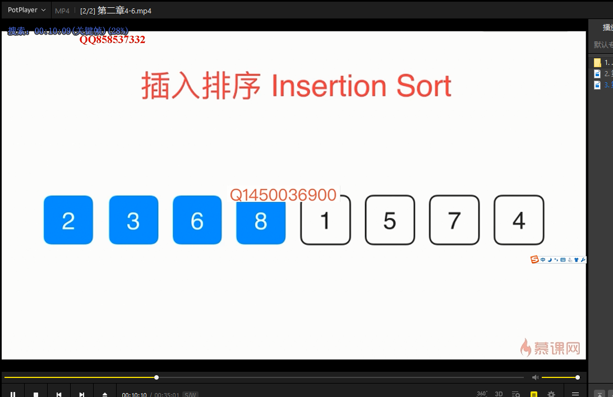


```java
/**
	 * 插入排序：第一个位置不动，前一个位置与第一个位置对比，找到适合位置，然后后面一个在和前面的对比，直到找到合适位置，然后终止循环（类似扑克牌理牌一样）
	 * 
	 * @param arr
	 */
	private void insertionSort(int[] arr) {
		for (int i = 1; i < arr.length; i++) {
			for (int j = i; j > 0; j--) {
				if (arr[j] < arr[j - 1])
					swap(arr, j, j - 1);
				else
					break;
			}
		}
	}

	@Test
	public void test6() {
		insertionSort(arr);// 2 3 4 5 6 9 11 12
		printArr(arr);
	}

	@Test
	public void test5() {
		int[] num = getNum(NUM);
		LocalDateTime startTime = LocalDateTime.now();
		insertionSort(num);
		LocalDateTime endTime = LocalDateTime.now();
		System.out.println(Duration.between(startTime, endTime).toMillis());// 1000:4毫秒；10000：55毫秒 ；100000：4838 毫秒
	}
```

由上例子可知，100000数量的排序，选择排序算法的速度比插入排序算法快（原因是：插入排序算法，在遍历的同时也在交换位置，交换操作比较耗时）

优化策略：（一次交换变成三次赋值）

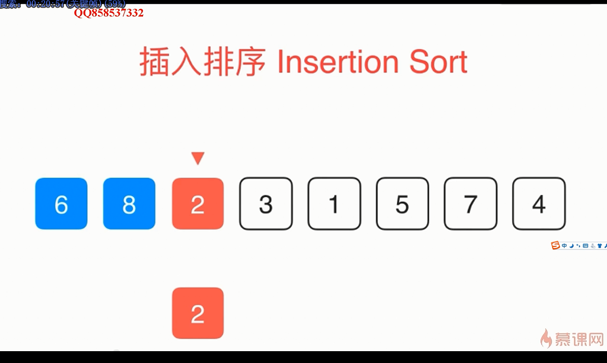

```java
@Test
	public void test7() {
		int[] num = getNum(NUM);
		LocalDateTime startTime = LocalDateTime.now();
		insertionSort2(num);
		LocalDateTime endTime = LocalDateTime.now();
		System.out.println(Duration.between(startTime, endTime).toMillis());// 1000:4毫秒；10000：31毫秒 ；100000：2349 毫秒
	}

	/**
	 * 优化插入排序算法
	 */
	private void insertionSort2(int[] arr) {
		for (int i = 1; i < arr.length; i++) {
			int temp = arr[i];
			int j;
			for (j = i; j > 0; j--) {
				if (temp < arr[j - 1]) {
					arr[j] = arr[j - 1];
				} else
					break;
			}
			arr[j] = temp;
		}
	}
```

```java
	@Test
	public void test8() {
		int[] num = getNum(NUM);
		int[] num1 = new int[NUM];
		int[] num2 = new int[NUM];
		for (int i = 0; i < num.length; i++) {
			num1[i] = num[i];
			num2[i] = num[i];
		}
		LocalDateTime startTime2 = LocalDateTime.now();
		insertionSort2(num2);
		LocalDateTime endTime2 = LocalDateTime.now();
		System.out.println("优化后插入算法insertionSort2:" + Duration.between(startTime2, endTime2).toMillis());// 1000:5毫秒；10000：26毫秒
		// ；100000：2727 毫秒

		LocalDateTime startTime1 = LocalDateTime.now();
		selectSort(num1);
		LocalDateTime endTime1 = LocalDateTime.now();
		System.out.println("选择算法selectSort:" + Duration.between(startTime1, endTime1).toMillis());// 1000:8毫秒；10000：75毫秒
		// ；100000：5953 毫秒

		LocalDateTime startTime = LocalDateTime.now();
		insertionSort(num);
		LocalDateTime endTime = LocalDateTime.now();
		System.out.println("插入算法insertionSort:" + Duration.between(startTime, endTime).toMillis());// 1000:5毫秒；10000：53毫秒
		// ；100000：4582 毫秒
	}
```


### 冒泡排序算法（Bubble Sort）

- 通过无序区中相邻记录的关键字间的比较和位置的交换，使关键字最小的记录像气泡一样逐渐向上漂至水面。即：整个算法使从最下面的记录开始，对每两个相邻的关键字进行比较，把关键字较小的记录放到关键字较大的记录上面，经过一趟排序后，关键字最小的记录达到最上面，接着再在剩下的记录中找关键字次小的记录，把它放在第二个位置上，依次类推，一直到所有记录有序为止。

- ```java
  package com.zhangbin.cloud.algorithm;
  
  import java.util.Arrays;
  
  /**
   * @version 1.0
   * @author: zb
   * @date: 2020/01/07/11:47
   * @description: 冒泡排序
   */
  public class BubbleSort {
  
      public static void main(String[] args) {
          int[] arr = new int[]{12,32,34,1,3,88,23};
          int[] ints = bubbleSort(arr);
          System.out.println(Arrays.toString(ints));
      }
      
      /**
        * @Description: 冒泡排序：整个算法是从最下面的记录开始，对每两个相邻的关键字进行比较，把关键字较小的记录放到关键字较大的记录的上面，经过一趟排序后，关键字最小的记录到达最上面，接着再在剩下的记录中找关键字次小的记录，把它放在第二个位置上，依次类推，一直到所有记录有序为止
        * @Param: 
        * @return: 
        * @Author: zb
        * @Date: 2020/1/7
      */    
      public static int[] bubbleSort(int[] arr){
          int temp;
          for (int i = 0; i < arr.length-1; i++) {
              for (int j = arr.length-1; j >i ; j--) {
                  if(arr[j] < arr[j-1]){
                      temp = arr[j];
                      arr[j] = arr[j-1];
                      arr[j-1] = temp;
                  }
              }
          }
          return arr;
      }
  }
  //[1, 3, 12, 23, 32, 34, 88]
  ```

- 

### 希尔排序算法（Shell Sort）

插入排序算法的延伸（思想差不多）


## O（n*log n）的排序算法

### 归并排序

核心：递归排序的过程


#### 使用递归实现自顶向下的归并排序

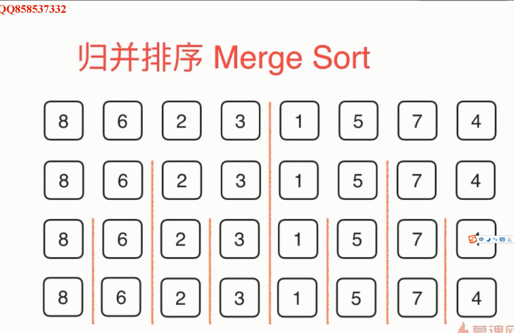 


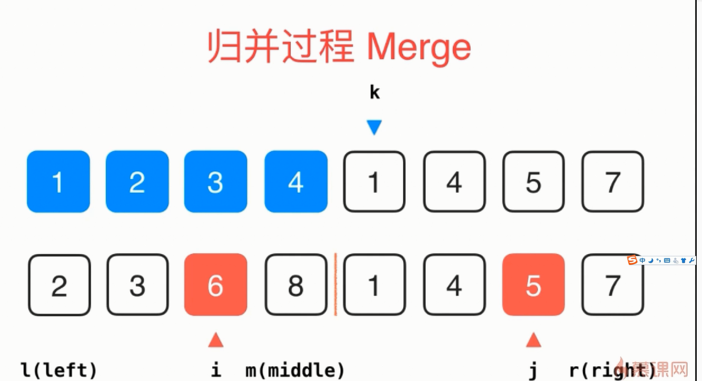


```java
/**
	 * 归并算法 递归使用归并排序，对arr[l...r]的范围进行排序
	 * （注意边界问题，l为开始位置，r为最后一个位置，前闭后闭）
	 * @param arr
	 */
	public void mergeSort(int[] arr, int l, int r) {
		if (l >= r)
			return;
		int mid = (l + r) / 2;
		mergeSort(arr, l, mid);//递归排序
		mergeSort(arr, mid + 1, r);
		if (arr[mid] > arr[mid + 1]) {// 判断是否是有序数据的排序，无序时才继续合并（优化1）
			merge(arr, l, mid, r);//合并排序
		}
      //对于小数据的排序可以用插入算法来排序（优化2）
  	 /** if(r-l<=15){
        insertionSort2(arr,l,r);
        return;
      }
      */
	}

	private void merge(int[] arr, int l, int mid, int r) {
		int[] aux = new int[r - l + 1];//临时复制出来的变量存放原来的数组
		for (int i = l; i <= r; i++)
			aux[i - l] = arr[i];//l是偏移量，而aux是要从0位置开始赋值
		int i = l, j = mid + 1;
		for (int k = l; k <= r; k++) {
			if (i > mid) {//判断i和j的范围是否满足
				arr[k] = aux[j - l];
				j++;
			} else if (j > r) { 
				arr[k] = aux[i - l];
				i++;
			} else if (aux[i - l] < aux[j - l]) {//判断左边右边那个数据比较小，小的填到对应的位置
				arr[k] = aux[i - l];
				i++;
			} else {
				arr[k] = aux[j - l];
				j++;
			}
		}
	}
```


 ```java
/**
	 * 归并算法mergeSort:24 
	 * 优化后插入算法insertionSort2:2820
	 * 选择算法selectSort:6741
	 * 插入算法insertionSort:5039
	 * 
	 */
	@Test
	public void test8() {
		int[] num = getNum(NUM);
		int[] num1 = new int[NUM];
		int[] num2 = new int[NUM];
		int[] num3 = new int[NUM];
		for (int i = 0; i < num.length; i++) {
			num1[i] = num[i];
			num2[i] = num[i];
			num3[i] = num[i];
		}
		LocalDateTime startTime3 = LocalDateTime.now();
		mergeSort(num3, 0, num3.length - 1);
		LocalDateTime endTime3 = LocalDateTime.now();
		System.out.println("归并算法mergeSort:" + Duration.between(startTime3, endTime3).toMillis());// 1000:1毫秒；10000：5毫秒
		// ；100000：25 毫秒

		LocalDateTime startTime2 = LocalDateTime.now();
		insertionSort2(num2);
		LocalDateTime endTime2 = LocalDateTime.now();
		System.out.println("优化后插入算法insertionSort2:" + Duration.between(startTime2, endTime2).toMillis());// 1000:5毫秒；10000：26毫秒
		// ；100000：2727 毫秒

		LocalDateTime startTime1 = LocalDateTime.now();
		selectSort(num1);
		LocalDateTime endTime1 = LocalDateTime.now();
		System.out.println("选择算法selectSort:" + Duration.between(startTime1, endTime1).toMillis());// 1000:8毫秒；10000：75毫秒
		// ；100000：5953 毫秒

		LocalDateTime startTime = LocalDateTime.now();
		insertionSort(num);
		LocalDateTime endTime = LocalDateTime.now();
		System.out.println("插入算法insertionSort:" + Duration.between(startTime, endTime).toMillis());// 1000:5毫秒；10000：53毫秒
		// ；100000：4582 毫秒
	}

 ```


#### 自底向上归并排序

```java
/**
	 * 自底向上归并排序
	 * 
	 * @param arr
	 */
	public void mergeSortBu(int[] arr) {
		int n = arr.length;
		for (int sz = 1; sz <= n; sz += sz) {
			for (int i = 0; i + sz < n; i += sz + sz) {
				merge(arr, i, i + sz - 1, (i + sz + sz - 1) < (n - 1) ? (i + sz + sz - 1) : (n - 1));
			}
		}
	}
```

```java
/**
	 * 归并算法mergeSort:24 优化后插入算法insertionSort2:2820 选择算法selectSort:6741
	 * 插入算法insertionSort:5039
	 * 
	 */
	@Test
	public void test8() {
		int[] num = getNum(NUM);
		int[] num1 = new int[NUM];
		int[] num2 = new int[NUM];
		int[] num3 = new int[NUM];
		int[] num4 = new int[NUM];
		for (int i = 0; i < num.length; i++) {
			num1[i] = num[i];
			num2[i] = num[i];
			num3[i] = num[i];
			num4[i] = num[i];
		}
		LocalDateTime startTime3 = LocalDateTime.now();
		mergeSort(num3, 0, num3.length - 1);
		LocalDateTime endTime3 = LocalDateTime.now();
		System.out.println("自顶向下归并算法mergeSort:" + Duration.between(startTime3, endTime3).toMillis());// 1000:1毫秒；10000：5毫秒
		// ；100000：25 毫秒

		LocalDateTime startTime2 = LocalDateTime.now();
		insertionSort2(num2);
		LocalDateTime endTime2 = LocalDateTime.now();
		System.out.println("优化后插入算法insertionSort2:" + Duration.between(startTime2, endTime2).toMillis());// 1000:5毫秒；10000：26毫秒
		// ；100000：2727 毫秒

		LocalDateTime startTime1 = LocalDateTime.now();
		selectSort(num1);
		LocalDateTime endTime1 = LocalDateTime.now();
		System.out.println("选择算法selectSort:" + Duration.between(startTime1, endTime1).toMillis());// 1000:8毫秒；10000：75毫秒
		// ；100000：5953 毫秒

		LocalDateTime startTime = LocalDateTime.now();
		insertionSort(num);
		LocalDateTime endTime = LocalDateTime.now();
		System.out.println("插入算法insertionSort:" + Duration.between(startTime, endTime).toMillis());// 1000:5毫秒；10000：53毫秒
		// ；100000：4582 毫秒

		LocalDateTime startTime4 = LocalDateTime.now();
		mergeSortBu(num4);
		LocalDateTime endTime4 = LocalDateTime.now();
		System.out.println("自底向上归并算法mergeSortBu:" + Duration.between(startTime4, endTime4).toMillis());// 1000:0毫秒；10000：2毫秒
		// ；100000：23 毫秒
	}
```

### 快速排序


 


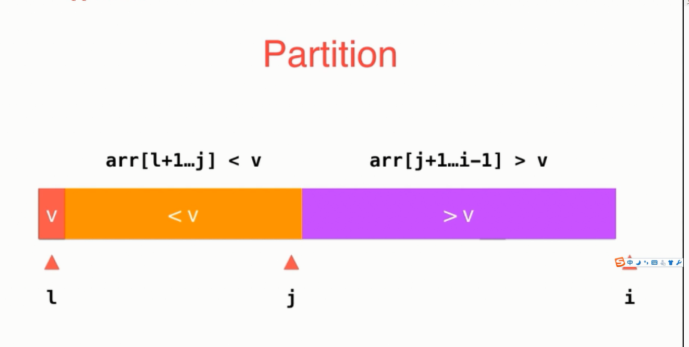


```java
/**
	 * 快速排序算法:利用递归，对arr[l...r]部分进行快速排序
	 * 
	 * @param arr
	 */
	public void quickSort(int[] arr, int l, int r) {
		if (l >= r)
			return;
		int p = partition(arr, l, r);//1 2 3 4 6 5 7 8 p=3
		quickSort(arr, l, p - 1);//1 2 3
		quickSort(arr, p + 1, r); //6 5 7 8

	}

	/**
	 * 对arr[l,r]部分进行partition操作
	 * 
	 * @param arr
	 * @param l
	 * @param r
	 * @return 返回p ,使得arr[l...p-1]<arr[p];arr[p+1...r]>arr[p]
	 */
	private int partition(int[] arr, int l, int r) {
		int v = arr[l];
		// arr[l+1...j]<v;arr[j+1...i)>v
		int j = l;
		for (int i = l + 1; i <= r; i++) {
			if (arr[i] < v) {
				swap(arr, j + 1, i);
				j++;
			}
		}
		swap(arr, l, j);
		return j;
	}
```

```java
/**
	 * 快速算法quickSort:18
*自顶向下归并算法mergeSort:31
*优化后插入算法insertionSort2:3627
*选择算法selectSort:2864
*插入算法insertionSort:5559
*自底向上归并算法mergeSortBu:23
	 * 
	 */
@Test
public void test8() {
  int[] num = getNum(NUM);
  int[] num1 = new int[NUM];
  int[] num2 = new int[NUM];
  int[] num3 = new int[NUM];
  int[] num4 = new int[NUM];
  int[] num5 = new int[NUM];
  for (int i = 0; i < num.length; i++) {
    num1[i] = num[i];
    num2[i] = num[i];
    num3[i] = num[i];
    num4[i] = num[i];
    num5[i] = num[i];
  }
  LocalDateTime startTime5 = LocalDateTime.now();
  quickSort(num5, 0, num5.length - 1);
  LocalDateTime endTime5 = LocalDateTime.now();
  System.out.println("快速算法quickSort:" + Duration.between(startTime5, endTime5).toMillis());// 1000:1毫秒；10000：7毫秒
  // ；100000：18 毫秒
  LocalDateTime startTime3 = LocalDateTime.now();
  mergeSort(num3, 0, num3.length - 1);
  LocalDateTime endTime3 = LocalDateTime.now();
  System.out.println("自顶向下归并算法mergeSort:" + Duration.between(startTime3, endTime3).toMillis());// 1000:1毫秒；10000：8毫秒
  // ；100000：25 毫秒

  LocalDateTime startTime2 = LocalDateTime.now();
  insertionSort2(num2);
  LocalDateTime endTime2 = LocalDateTime.now();
  System.out.println("优化后插入算法insertionSort2:" + Duration.between(startTime2, endTime2).toMillis());// 1000:5毫秒；10000：26毫秒
  // ；100000：2727 毫秒

  LocalDateTime startTime1 = LocalDateTime.now();
  selectSort(num1);
  LocalDateTime endTime1 = LocalDateTime.now();
  System.out.println("选择算法selectSort:" + Duration.between(startTime1, endTime1).toMillis());// 1000:8毫秒；10000：75毫秒
  // ；100000：5953 毫秒

  LocalDateTime startTime = LocalDateTime.now();
  insertionSort(num);
  LocalDateTime endTime = LocalDateTime.now();
  System.out.println("插入算法insertionSort:" + Duration.between(startTime, endTime).toMillis());// 1000:5毫秒；10000：53毫秒
  // ；100000：4582 毫秒

  LocalDateTime startTime4 = LocalDateTime.now();
  mergeSortBu(num4);
  LocalDateTime endTime4 = LocalDateTime.now();
  System.out.println("自底向上归并算法mergeSortBu:" + Duration.between(startTime4, endTime4).toMillis());// 1000:0毫秒；10000：2毫秒
  // ；100000：23 毫秒

}
```


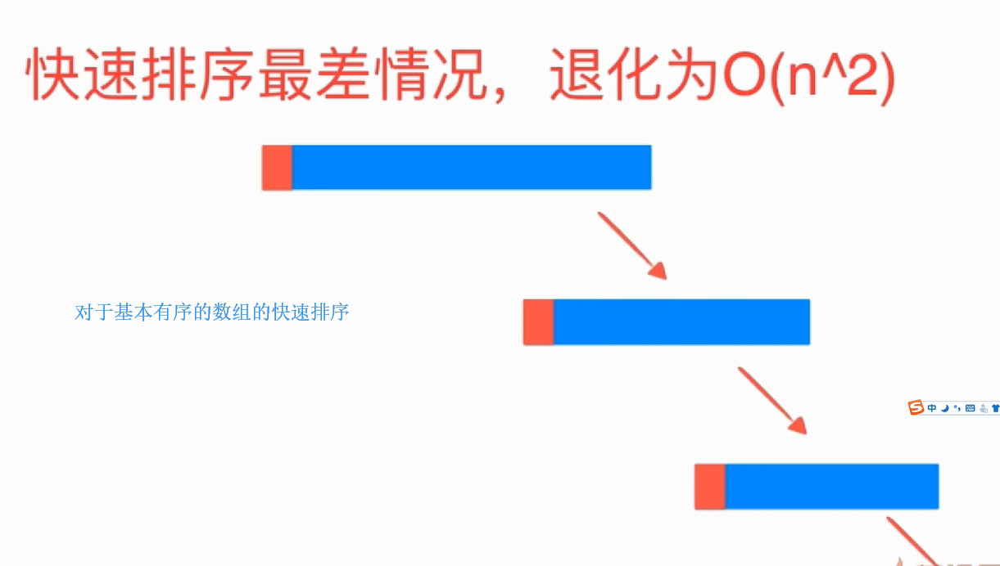


优化1：对于数量小的数组可做判断，然后用插入排序算法

#### 随机化快速排序

优化2：（可随机选择一个，而不是选择第一个，然后交换位置，原来代码不变 ）

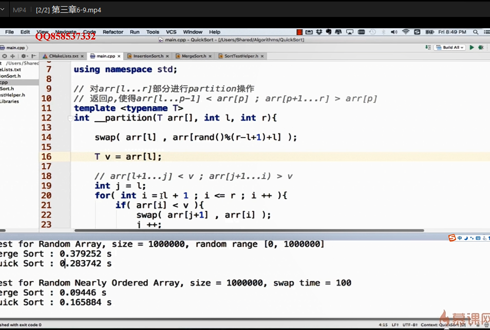


#### 双路快速排序法

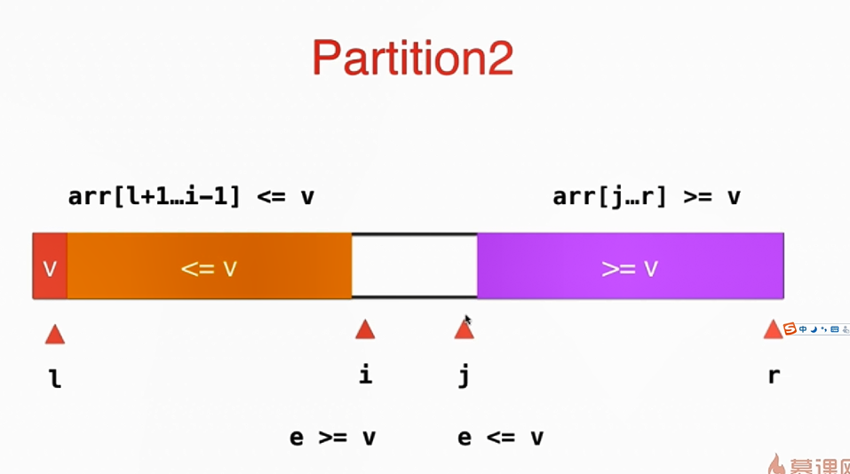


```java
	private int partition2(int[] arr, int l, int r) {
		int v = arr[l];
		// arr[l+1...i)<=v;arr(j...r]>=v
		int i = l + 1, j = r;
		while (true) {
			while (i <= r && arr[i] < v)
				i++;
			while (j >= l + 1 && arr[j] > v)
				j--;
			if (i > j)
				break;
			swap(arr, i, j);
			i++;
			j--;
		}
		swap(arr, l, j);
		return j;
	}
```


#### 三路快速排序法

 

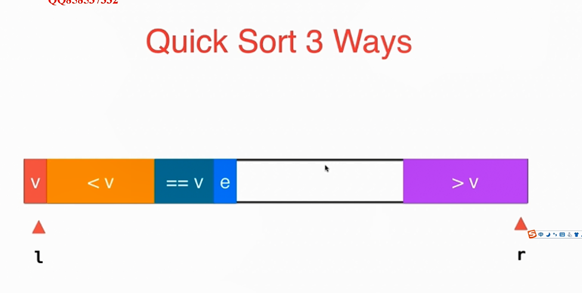


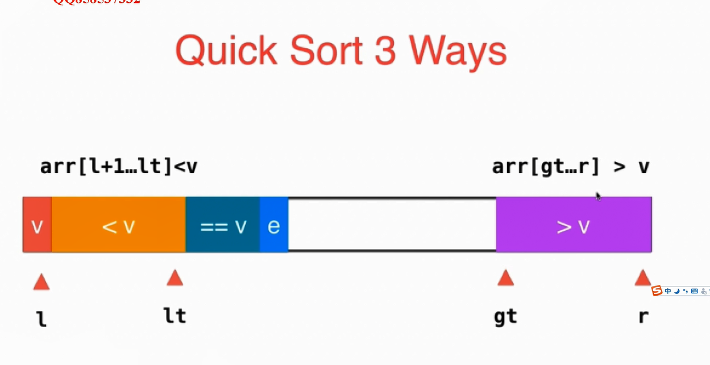


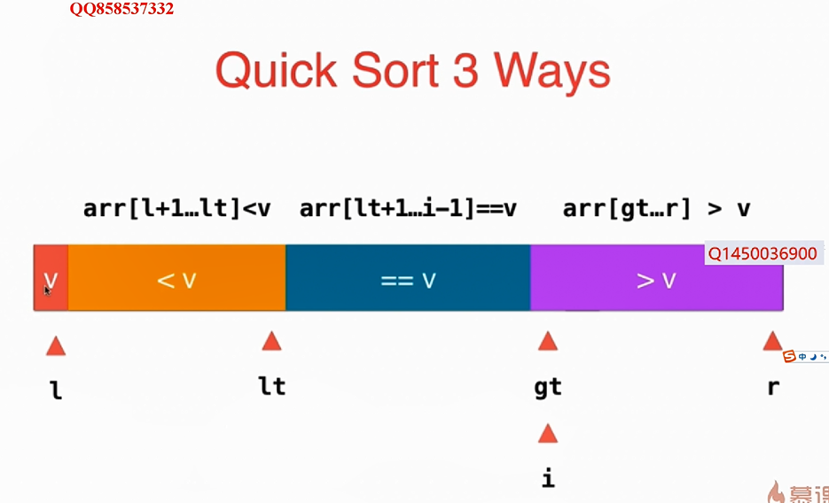


### 二叉树 

- 二叉树整合了有序数组和链表的优点。在一个有序数组中，查找的时间复杂度为O(logN)，但是插入和添加操作的比较慢。在链表中，插入和删除操作的时间复杂度比较快，为O(1)，但是查找比较慢，时间复杂度为O(N)。
  - 二叉树结合了有序数组的查找块和链表的添加、删除快的优点
- 

# 二分查找（折半查找）

## 思想 

- 使用条件：查找序列是顺序结构，有序的
- 每次都是以序列的中间位置的数来与待查找的关键字进行比较，每次缩小一半的查找范围，直到匹配成功。

## 优缺点

- 优点：比较次数少，查找速度快，平均性能好
- 缺点：要求待查表为有序表，且插入删除困难
- 因此：折半查找方法适用于不经常变动而查找频繁的**有序列表** 

## 代码实现

### 递归&非递归

```java
/**
      * @Description: 输入: nums = [-1,0,3,5,9,12], target = 9 输出: 4
      *      解释: 9 出现在 nums 中并且下标为 4，用递归与非递归方法
     *      二分非递归查找
      * @Param:
      * @return:
      * @Author: zb
      * @Date: 2019/12/20
    */
    public static int unrecursionSearch(int[] nums,int target){
        int min = 0 ;
        int max = nums.length-1;
        int mid = (max - min)/2 + min;
        while (min < max){
            if(nums[mid]>target){
                max = mid ;
            }else if (nums[mid]<target){
                min = mid+1;
            }else {
                return mid;
            }
        }
        return -1;
    }
    /**
      * @Description: 递归二分查找
      * @Param: 
      * @return: 
      * @Author: zb
      * @Date: 2019/12/20
    */    
    private static int recursionSearch(int[] nums, int target, int min,int max) {
        int mid = (max-min )/2+min ;
        if(nums[mid] > target){
            max = mid ;
            return recursionSearch(nums, target,min,max);
        }else if(nums[mid] < target){
            min = mid+1;
           return recursionSearch(nums, target,min,max);
        }else{
            return mid;
        }
    }

    public static void main(String[] args) {
        int[] nums = new int[]{-1,0,3,5,9,12,16};
        int target = 5;
        System.out.println(Arrays.toString(nums));
        int i2 = recursionSearch(nums, target, 0, nums.length-1);
        System.out.println("递归二分查找，下标为："+i2);
        int i3 = unrecursionSearch(nums, target);
        System.out.println("非递归二分查找，下标为："+i3);

    }
    
```

# 二叉树

## 概念

- 满足以下两个条件的树就是二叉树
  - 本身是有序树
  - 树中包含的各个节点的度不能超过2，即只能是0、1或者2；
- 二叉树的性质
  - 二叉树中，第i层最多有2i-1个结点
  - 如果二叉树的深度为k，那么此二叉树最多有2K-1个结点
  - 二叉树中，终端结点数（叶子结点数）为n0，度为2的结点数为n2， 则 n0=n2+1 

- 二叉树的遍历：是指从根结点出发，按照某种次序依次访问二叉树中所有结点，使得每个结点被访问一次且仅被访问一次
  - 三种遍历方式：前序遍历、中序遍历、后序遍历

## 代码实现 


