#  信息化和信息系统

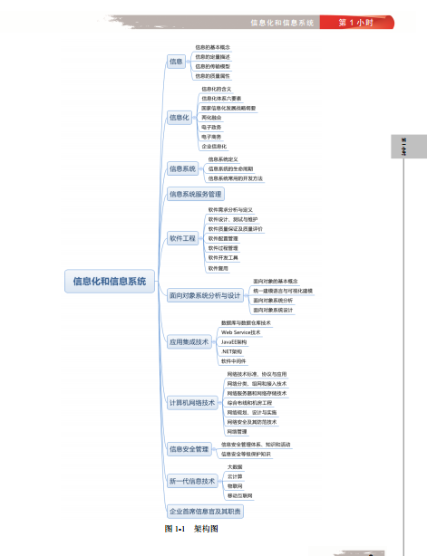

## 信息 

- 控制论的创始人**维纳**认为：信息就是信息，它既不是物质也不是能量
- 信息化的奠基者**香农**认为：信息是能够用来消除不确定性的东西。（不可预测的）
- 经济管理学家认为：信息是提供决策的有效数据
- 信息是客观事物状态和运动特征的一种普遍形式

> **信息技术的核心： 信息的传输技术（通常指通信、网络等）**  
>
> 信息的传输模型：
>
> 信源、信道、信宿、编码、解码、噪声（噪声影响的是信道）

> 人通过获得、识别不同信息来区别不同事物，得以认识和改造世界。以下关于信息的叙述中，不正确的是（ ）。 
> A．信息的载体是数据 
> B．信息是事物的运动状态和状态变化方式的自我表述 
> C．信息是按照特定方式组织在一起的数据的集合 
> D．信息通过载体进行传播 
>
> 答案：C
>
> 信息是按特定方式组织在一起的客体属性的集合，它具有超出这些客体属性本身之外的价值

信息的质量属性：

- 可靠性：指信息的来源、采集方法、传输过程是可以信任的，符合预期
- 可验证性：指信息的主要质量属性可以被证实或证伪的程度
- 安全性：信息可以被非授权访问的可能性，可能性越低，安全性越高
- 完整性：对事物状态描述的全面程度，完整信息应包括所有重要事实
- 精确性：对事物状态描述的精确程度
- 及时性：指获得信息的时刻与事件发生时刻的间隔长短
- 经济性：指信息获取、传输带来的成本在可以接受的范围之内

## 信息化 

信息化从小到大分为5个层次：（产企业国社）

- 产品信息化：如集成了车载计算机系统的小汽车、智能电视、智能灯具
- 企业信息化：如CRM、ERP、SCM
- 产业信息化：如交通运输业
- 国民经济信息化
- 社会生活信息化：如智慧城市，互联网金融

> 信息化的**主体**是**全体社会成员** 
>
> 空域是政治、经济、文化、军事和社会生活的一切领域
>
> **时域是一个长期的过程** 

### **<u>信息化体系6要素：</u>**

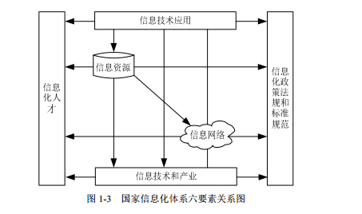

- 信息资源是核心，也是我国信息化薄弱环节
- 信息技术应用是龙头，主阵地
- 信息网络是基础，必要手段
- 信息技术和产业是国家信息化建设的基础
- 信息化人才是关键，成功之本，决定性影响
- 信息化政策法规和标准规范是保障

### <u>两化融合</u> 

**两化（工业化和信息化）深度融合的主攻方向是：智能制造** 

- 信息化与工业化发展战略的融合
- 信息资源与材料、能源等工业资源的融合
- 虚拟经济与工业实体经济融合
- 信息技术与工业技术、IT设备与工业装备的融合

### <u>电子政务</u> 

- G2G：政府间
- G2B：政府对企业
- G2C：政府对公众
- G2E：政府对公务员

国家电子政务总体框架构成包括：

- 服务与应用
- 信息资源
- 基础设施
- 法律法规与标准化体系
- 管理体制

零碎知识点：

> 某法院将罚没的物品通过某拍卖网站对社会公开拍卖，成交后买方通过网络支付将款项直接支付当地财政系统，该活动属于（）的范畴。 
> A．电子政务 
> B．行政管理 
> C．电子商务 
> D．电子交易 
>
> 答案：A

> “十二五”期间，电子政务促进行政体制改革和服务型政府建设的作用更加显著，其发展目标不包括（）。 
> A．电子政务统筹协调发展不断深化 
> B．应用发展取得重大进展 
> C．初步形成电子政务网络与信息安全保障体系 
> D．政府公共服务和管理应用成效明显
>
> 答案：C
>
> 初步形成电子政务网络与信息安全保障体系是“十五”期间的目标，而不是“十二五”期间的电子政务目标。

> “十二五”期间，电子政务全面支撑政务部门履行职责，满足公共服务、社会管理、市场监管和宏观调控各项政务目标的需要，其促进行政体制改革和服务型政策。建设的作用更加显著。其发展目标不包括（）。
> A. 逐步完善与电子政务相关的法规和标准
> B. 电子政务信息安全保障能力持续提升
> C. 电子政务技术服务能力明显加强
> D. 电子政务信息共享和业务协同取得重大突破
>
> 答案：A
>
> 

### <u>电子商务</u> 

- **电子数据交换（EDI）**是连接原始电子商务和现代电子商务的手段。

- 电子商务类型
  - B2B：企业间
  - B2C：企业与消费者，如京东、当当
  - C2C：消费者与消费者，如淘宝、易趣
  - O2O：线上购买线下的商品和服务，如外卖、院线、会所等服务连锁企业

  

  零碎知识点：

  - 电子钱包是电子商务购物活动中的一种**支付工具** 

  - 电子钱包有两种：
    - 一种是纯粹的软件，用于网上消费、账户管理，通常与银行账户连接一起
    - 二是小额支付的智能储值卡，持卡人预先在卡中存入一定的金额

  - 电子商务物流柔性化：物流配送中心要根据消费需求“多品种、小批量、多批次、短周期”的特色，灵活组织和实施物流作业。

  - 电子商务安全要求的四个方面：
    - 传输的安全性
    - 数据的完整性
    - 交易各方的身份认证
    - 交易的不可抵赖性

  - **电子商务吃撑体系的五方面：**

    - **信用、认证、支付、现代物流、标准**

  - **C2C电子商务模式中，常用的在线支付方式为：第三方支付**

  - **SSL**：通信协议用于保护电子商务交易中的敏感数据

    - SSL主要利用数据加密技术，以确保数据在网络传输过程中不会被截取及窃听。
    - **该协议运行在网络的传输层与应用层之间**

  - 电子商务物流模式可分为：

    - 自营物流模式、物流联盟模式、第三方物流模式、第四方物流和物流一体化

  - VPN 虚拟专用网，主要是提供一个安全的传输通道，并没有提供压缩技术。是在共享的基础公共网络上建立一个临时的、安全的连接，是一条穿过混乱的公用网络的安全、稳定的隧道，向用户提供等同于专用网络的通信结果。VPN能够抗拒非法入侵、防范网络阻塞、安全及时地交付用户的重要数据。

  - SET：安全电子交易协议，是一种应用于因特网环境下，以**信用卡**为基础的安全电子交付协议，它给出了一套电子交易的过程规范。通过SET协议可以实现电子商务交易中的加密、认证、秘钥管理机制等，保证了再因特网上使用信用卡进行在线购物的安全。

  - **物流供应商的主要因素包括：**

    - **价格、运输时间、运输质量** 

  - 电子商务系统的结构：

    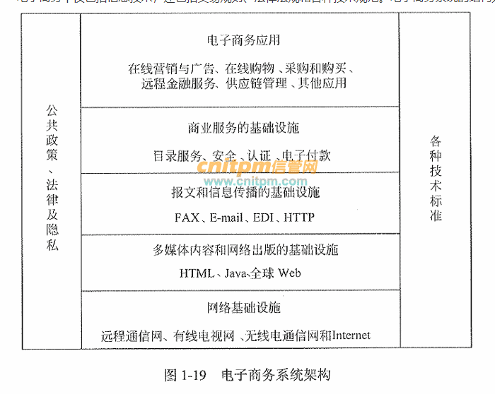 

    - 网络基础设施
    - 多媒体内容和网络出版的基础设施：文字、语音、图像、视频等
    - 报文和信息传播的基础设施：电子邮件系统、在线交流系统、基于HTTP或HTTPS的信息传输系统、流媒体播放系统等
    - 商业服务的基础设施：商品目录和价格目录、电子支付网关、安全认证等
    - 技术标准：用户接口、传输协议、信息发布标准、安全协议等技术细节
    - 政策和法律：电子商务税收制度、信用管理及收费、隐私问题等由政府制定的规章或制度

> 随着互联网的普及，电子商务已经进入到人们日常生活，下列（ ）业务全部属于电子商务的范畴。 
> ①网上客服 ②电视购物 ③网上营销 ④电话交易 ⑤商场广播 ⑥网上调查 
> A、①②③④⑤⑥ 
> B、①②③④⑤ 
> C、①②③④⑥ 
> D、①③④⑤⑥
>
> 答案：A
>
> （⑤商场广播属于原始的电子商务，其它都是现代电子商务的范畴）

> 目前，在电子商务交易过程中支付方式很多，按照支付的流程不同，主要存在四种电子商务支付模式：支付网关模式、网上银行模式、第三方支付模式和手机支付模式。（）不属于第三方支付模式。 
> A．拉卡拉 
> B．支付宝 
> C．余额宝 
> D．财付通
>
> 答案：C
>
> 解析：第三方支付就是支付网关或系统是由第三方机构建设的，而不是由银行或银行联合体建设。换言之，网上支付服务是由第三方机构提供的，而不是商业银行或传统支付系统的运营者。
>
> 余额宝只是支付宝推出的一个理财服务，而不是支付渠道

### 商业智能 BI

将企业中现有的数据转化为知识，帮助企业做出明智的业务经营决策的工具。

- 核心技术：
  - 数据仓库（DW）：用于决策分析

    - 数据的存储与管理：是整个数据仓库系统的核心
    - 是一个面向主题、集成的相对稳定的、反映历史变化（时变性）的数据集合

  - 数据挖掘（DM）：用于从数据库中发现知识

    - 数据挖掘技术：
      - 描述型：数据总结、聚类、关联分析
      - 预测型：分类、回归、时间序列化分析

  - 联机事务处理工具（OLAP）
- BI实现有3个层次
  - 数据报表
  - 多维数据分析
  - 数据挖掘

### 企业信息化 

- **ERP**企业资源计划：**是以财务会计为核心的信息系统**；

  - 是在MRP（物料采购）中引入质量管理、设备管理、财务管理和人力资源管理
  - 零碎知识点：
    - 财务管理强调的是事后核算，实际发生原则是财务管理的首要原则
    - **ERP强调的是“事前计划、事中控制、事后分析”的管理理念和及时调整**
    - ERP的功能包括支持、为处于不同行业的企业提供有针对性的IT解决方案和从企业内部的供应链发展为全行业和跨行业的供应链。**它的关键是事前规划管理**。
    - ERP可保证信息的集成性、定时性、统一性
  - ERP特点
    - 集成性
    - 统一性
    - 实时性

- **CRM**：客户关系管理（80，,20原则）

  - **CRM在注重提高用户满意度的同时，定要把帮助提升企业获取利润的能力作为重要目标** 
  - **CRM由两部分构成：触发中心和挖掘中心** 
  - CRM的基本功能：
    - 自动化销售
    - 客户服务
    - 市场营销
  - 客户数据分类：
    - 促销性数据：企业曾经为客户提供的产品和服务的历史数据，主要包括：用户产品使用情况调查的数据、促销活动记录数据、客服人员的建议数据、广告数据
    - 交易性数据：与客户发生了交易行为后产生的回馈数据，包括历史购买记录数据、投诉数据、咨询及其他服务的相关数据、客户建议数据等
    - 描述性数据：客户的基本信息
  - 设计特点
    - 可伸缩性
    - 可移植性
  - （CRM系统可看成ERP系统的一部分，两者间可形成一定的闭环反馈结构）

- **SCM**：供应链管理；

  - 是一种集成的管理思想和方法，将供应商、制造商、仓库和商店有效结合成一体来生成商品，有效地控制和管理各种**信息流、资金流、物流、商流**。

    **信息流是最基本的、必不可少的**  

  - SCM不仅是一条连接供应商到用户的**物流链、信息链、资金链，而且是一条增值链** 

  - **衡量SCM管理绩效最重要的指标：客户满意度** ，核心：客户管理

  - 降低SCM成本，提高供应链响应速度等，都要以**满足客户需求为前提**

- 企业信息化过程3个重要影响因素：经营战略、业务流程与组织、信息架构

> 建立企业信息系统必须遵循一定的原则，因为支持企业需求的信息系统规模都比较大，**这样大的系统应该是自上自下地规划，和自下而上地分布实现。**
>
> 企业信息系统的一个明显特点是：企业**从依靠信息**进行管理向**知识管理**转换。

> **企业信息系统的重要目标：信息共享和业务协同** 

> 企业信息战略规划的七点是将**企业战略目标**与企业的信息需求转换成信息系统目标。**信息系统必须坚持为业务服务的原则，必须以应用为中心。** 

> 项目管理方法的核心是**目标管理与风险管理**相结合

> 企业信息化的结构：
>
> - 产业（服务）层
> - 作业层
> - 管理层
> - 决策层

> 企业信息化建设内容：企业技术、管理、应用系统的采购

> 在企业战略规划上，**以企业管理模式为依据**，将**技术和业务**融合。从企业战略层面、业务运作层面、管理运行层面来实现

- EAI
  - “界平数应过”
  - 数据集成
    - 在中间件，属于白盒集成
  - 控制集成
    - 业务逻辑层对应用系统进行黑盒集成
  - 表示集成
    - 页面上的集成，属于黑盒集成
  - 业务流程集成

### 十二金 工

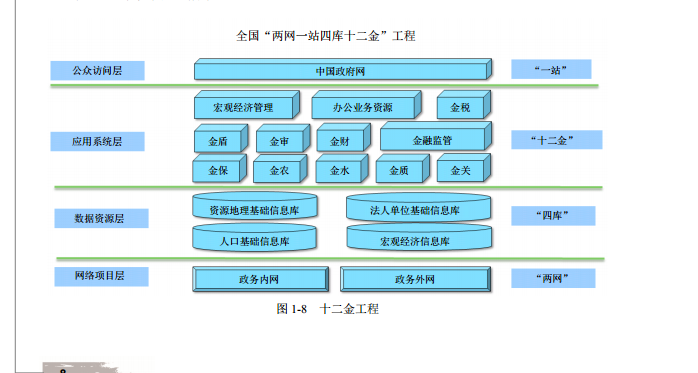

- 两网
  - 政府内网
    - 政务内网主要是**副省级**以上政务部门的办公网，与其下属政务部门的办公网物理隔离
  - 政府外网
- 一站
  - 政府门户网站
- 四库
  - 人口基础信息库
  - 资源地理基础信息库
  - 法人单位基础信息库
  - 宏观经济信息库

## 信息系统

- 是一种以处理信息为目的的专门的系统类型
- 对信息的收集、传递、存贮、加工、维护和使用的 系统

> ● 在信息系统中，信息的处理不包括 （5） 。
>
> A．信息的输入	B．信息的删除	C．信息的修改	D．信息的统计
>
> 答案：A
>
> 信息系统包括三项活动：
>
> - 输入活动：从组织或外部环境中获取或收集原始数据
> - 处理活动：将输入的原始数据转换为更有意义的形式
> - 输出活动：将处理后形成的信息传递给人或需要此信息的活动
>
>

- 信息系统的特点
  - 健壮性：系统具有能够抵御出现非预期状态的特性（鲁棒性）
- 软件度量
  - 项目度量
  - 过程度量
  - 产品度量

### 信息系统的生命周期

- 立项：概念阶段或需求阶段。立项阶段结束的里程碑应该是形成《需求规格说明书》。

- 开发：

  - 总体规划阶段->可行性研究报告、
  - 系统分析->系统说明书
    - 确定新系统的基本目标和逻辑功能要求，即提出新系统的逻辑模型
    - （整个系统建设的关键阶段）
  - 系统设计->系统设计说明书
    - 设计新系统的物理模型
  - 实施（工作量最大的一个阶段，占50%）
    - 这阶段任务包括计算机等设备的购置、安装和调试、程序的编写和调试、人员培训、数据文件交换、系统调试与转换等
  - 验收(系统测试、系统试运行、系统验收、验收报告)）

  **（最关键、最重要阶段）** 

- 运维：

- 消亡：

### 信息系统开发方法

- 结构化方法：要求在开发之初全面认识系统的信息需求
  - 主要思想：自顶向下、逐步分解。
  - 它是一种面向数据流的开发方法（如数据流图与数据字典、实体-关系图、决策树等）
  - 基本原则：功能的分解与抽象
  - 开发目标清晰、工作阶段程序化、文档规范化、设计方法结构化
- 原型化方法：适用于用户需求开始时定义不清、管理决策方法结构化程度不高的系统开发
- 面向对象方法：关键点在于能否建立一个全面、合理、统一的模型
- 面向服务方法：（新的系统开发思想，已成为大趋势）
- 敏捷开发方法：是一种一人为核心，迭代、循序渐进的开发方法
  - **适用于一开始并没有或不能完整地确定出需求和范围的项目**
  - **在于应对大量变更，获取干系人的持续参与** 

### 信息系统服务管理  

- 2个面向单位的资质管理
  - 信息系统集成单位资质管理
  - 信息系统工程监理单位资质管理
- 2个面向个人的资质管理
  - 信息系统项目经理
  - 信息系统监理人员

#### 信息系统工程监理

- 信息系统工程监理：**四控三管一协调**

  四控：质量、进度、投资、变更

  三管：合同管理、安全管理、信息管理

  一协调：沟通

  

  - 监理单位需具备相应的资质
  - **要受业主单位的委托**
  - 工作的依据是**法律法规、技术标准和合同（建设合同、监理合同）**
  - **工作性质是监督管理** 

  

- 信息系统工程监理单位资质管理分三个级别：

  - **甲**：被监理项目没有投资规模限制

  - **乙**： 1500万元以下

  - **丙**： 500万元以下 

  - **评审和审批分离**

  - **资质证书有效期为4年**

  - 不同级别申报的条件要求不同

    422	（监理工作经验）

    500		300		100（注册资金）

    不受限	1500	500（投资规模限制）

- ITSS 信息技术服务构成

  - 人员、过程（将输入化为输出）、资源、技术
  - 前提：产品服务化
  - 保障：服务标准化
  - 趋势：服务产品化

  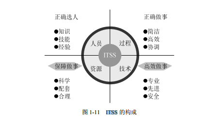

- 信息系统工程监理人员

  - 高级监理工程师、监理工程师、监理员

- 利用财政性质资金建设的信息化工程，用于购买软件产品和服务的资金原则上不得低于总投资的30%

- 评构机构分为

  - A级：全国各地区开展资质评审
  - B级：本地区开展资质评审

#### 信息系统集成单位 

- 信息系统集成单位资质管理分四级：

  **实行评审与审判相分离** ，**资质评定先要进行评审，再进行审批**

  一级、二级由省级人民政府信息产业主管部门初审，报**工业和信息化部**审批（国家级）

  三级、四级由省级人民政府信息产业主管部门审批（省级、自治区）

- **集成单位资质证书有效期为3年**

- 不同级别申报的条件要求不同

  4322（高管工作经验）	

  25、8		15、3		6、1	3、无 （项目经理、高级项目经理）

  2000	1000	200		30 （注册资本）

- 信息系统项目经理资格管理

  资深项目经理、高级项目经理、项目经理

## <u>面向对象系统分析与设计</u>

### 统一建模语言与可视化建模

UML 用关系把事物结合在一起，主要有下列四种关系：

- 依赖
- 关联
- 泛化
- 实现

UML的5种视图：

1. 用例视图：定义系统的外部行为，定义了系统的需求，是描述系统设计和构建的其它视图的基础。又叫用户模型视图
2. 逻辑视图：描述逻辑结构，该逻辑结构支持用例视图描述的功能，它描述了问题空间中的概念以及实现系统功能的机制，如类、包、子系统等。又叫结构模型视图或静态视图
3. 实现视图：用于组建系统的物理组建，如可执行文件、代码库和数据库等系统程序员所看到是软件产物，是和配置管理以及系统集成相关的信息。也叫组件视图
4. 过程视图：描述将系统分解为过程和任务，以及这些并发元素之间的通信与同步。也叫并发视图、动态视图、协作视图
5. 部署视图：描述系统的物理网络布局，是系统工程师和网络工程师所感兴趣的。也叫物理视图

UML提供了9种不同的图。

1. 静态图：用例图、类图、对象图、组件图、配置图

   > 用例图：**描述了系统与用户的交互**；描述系统的功能，由系统、用例、角色三种元素组成。
   >
   > 类图：用来表示系统中的类以及类与 类之间的关系，描述系统的静态结构，用于逻辑视图中。
   >
   > 对象图：是类图的示例，表示在某一时刻这些类的具体实例以及这些实例之间的具体连接关系，对象图常用于用例视图和逻辑视图中。
   >
   > 组件图：反映代码的物理结构，组件可以是源代码、二进制文件、可执行文件，包含逻辑类的实现信息。实现视图由组件图构成。
   >
   > 配置图：用来显示系统中软件和硬件的物理架构

   

   用例：**描述了活动与用户的交互**

   > 用例：将系统的功能范围分解成许多小的系统功能陈述；
   >
   > 一个用例代表了系统的一个单一的目标；
   >
   > 用例是一个行为上相关的步骤序列

   > 用例之间的关系包括：
   >
   > 关联关系：一个参与者与一个用例发生交互的关系
   >
   > 扩展关系：将复杂的步骤提取成专门的用例，它扩展了原始用例的功能
   >
   > 抽象用例：如果几个用例执行了同样的步骤，最好把这些公共步骤提取成独立的用例
   >
   > 使用（包含）关系：抽象用例和使用它的用例之间的关系就是包含关系
   >
   > 依赖关系：依赖性
   >
   > 继承关系：继承性

2. 动态图：序列图、状态图、协作图、活动图

   > 状态图：描述对象、子系统、系统的生命周期。状态图是对类描述的事物的补充说明，用在逻辑视图中描述类的行为。
   >
   > 序列图：（时间顺序）面向对象系统中对象之间的交互表现为消息的发送和接收。序列图反映若干个对象之间的动态协作关系，重点反映对象之间发送消息的先后次序，常用在逻辑视图中。
   >
   > 协作图：（空间关系）描述协作对象之间的交互和连接。重点描述交换消息的对象之间的关系，强调的是空间关系非时间顺序。
   >
   > 活动图：显示动作及其结果，描述操作实现中所完成的工作及用例实例或对象中的活动。反映了一个连续的活动流，常用于描述一个操作执行过程中所完成的工作。

## 软件工程

- 软件工程国家标准
  - GB（GB/T）中华人民共和国国家标准
  - GB/2指南类国家标准（推荐性标准）
- CMMI（能力成熟度模型）
  - CMMI 1   初始化
  - CMMI 2   已管理级
  - CMMI 3   已定义级
  - CMMI 4   量化管理级
  - CMMI 5   优化级

### 软件需求

需求必须可被验证

需求分析的目标：检测和解决需求之间的冲突、发现系统的边界及软件及其环境如何交互、详细描述出系统需求，及导出软件需求

### 软件测试与维护

#### 软件维护类型

1. 更正性维护：
   - 更正交付后发现的错误；
   - 或为了诊断和更正一些程序在使用过程中还可能发生错误的过程
   - （检修）
2. 适应性维护：使软件产品能够在变化后或变化中的环境中继续使用（升级）
3. 完善性维护：改进交付后产品的性能和可维护性（提升功能，工作量大）
4. 预防性维护：为了给未来的改进提供更好的基础；或在软件产品的潜在错误成为实际错误前，检测并更正它们（将要发生的，工作量小）

#### 软件测试 

- 动态测试

  （动态测试指通过运行程序发现错误）

  分为：

  - 黑盒测试
    - （功能测试）：依据需求说明书，检查程序是否满足功能要求
  - 白盒测试
    - （结构测试）：检查内部控制结构和数据结构是否有错（开发人员）
    - 
  - 灰盒测试
    - 关注输出，对于输入的正确性，同时关注内部不像白盒测试那样详细且完整，而只是通过一些表征性现象、事迹、标志判断程序内部运行状态

- 静态测试

  （被测试的程序不在机器上运行）

  - 对文档的静态测试
    - 以检查单的形式进行
  - 对代码的静态测试
    - 桌面检查、代码走查、代码审查

  > 审计：是不是符合要求
  >
  > 评审：提出改进意见
  >
  > 走查：查代码

- 按测试阶段

  - 单元测试
    - 粒度最小，一般由开发小组采用白盒方式来测试，主要测试单元是否符合设计要求
  - 集成测试
    - 起到“桥梁”作用，一般由开发小组采用白盒+黑盒方式来测试，主要验证设计，和需求
  - 系统测试
    - 粒度最大，一般由独立测试小组采用黑盒方式来测试，主要测试系统是否满足需求规格说明书
  - 验收测试
    - α测试：用于开发环境下
    - β测试：真实用户在实际使用环境下（除程序员或测试员不能去完成）

### 软件设计

软件设计是定义系统或组件的架构、组件、接口和其它特征的过程，并得到这个过程的结果。

软件设计包括软件架构设计和软件详细设计。架构设计属于高层设计，主要描述软件的结构和组织，标识各种不同的组件。

#### 软件架构设计 

- 架构风格
  - 数据流风格
    - 包括批处理序列和管道/过滤器两种风格
  - 调用/返回风格
    - 包括主程序/子查询、数据抽象和面向对象，以及层次结构
  - 独立构件风格
    - 包括进程通信和事件驱动的系统
  - 虚拟机风格
    - 解释器
  - 仓库风格
    - 数据库系统、黑板系统和超文本系统

### 软件质量保证 

**质量只要满足用户需求就够** 

- 原则：信息隐蔽与模块独立性
- 模块独立性比较强的模块是：高内聚（模块内）、低耦合（模块间）

软件质量包括：

- 内部质量：开发阶段的非执行软件
- 外部质量：执行文件（用户）（可靠性）
- 使用质量：测试使用情况

技术评审：目的是评价软件产品，以确定其对使用意图的适合性，目标是**识别规范说明与标准的差异**，并向管理提供证据，以表明产品是否满足规范说明并遵从标准，而且可以控制变更。

软件审计：目的是提供软件产品和过程对于可应用的规则、标准、指南、计划和流程的遵从性的独立评价。

走查：是审评过程中采用的一种方法。走查时，软件设计者或程序开发人员指导一名或多名其它参加评审的成员，通读已书写的设计文档或编码，其它成员负责提出问题，并对有关技术、风格、可能的错误、是否有违背评审标准的地方进行评论。

>  审核（审计）：为评估工作产品或工作产品集是否符合软件需求、规格说明、基线、标准、过程、指令、代码及合同和特殊要求而进行的一种独立的检查
>
>  认证：一个系统、部件或计算机程序符合其规定的需求，对操作使用是可接受的一种书面保证。
>
>  鉴定：一个正式的过程，通过这个过程确定系统或部件是否符合它的规格说明，是否可在目标环境中适合于操作使用

## 应用集成技术 

数据仓库是一个面向主题的、集成的、相对稳定的、反映历史变化的数据集合、用于支持管理决策。

### web Service 技术 

用于传递信息的简单对象**访问协议SOAP**，用于描述服务的web服务**描述语言WSDL**，用于web服务注册的统一描述、发现及**集成规范UDDI**，用于**数据交换的XML**。

适用于web service的情况：跨越防火墙、应用程序集成、软件重用

**Web Service 是目前实现 SOA 的主要技术。**

> UDDI、 SOAP、 WSDL、 XML 等是构成 Web Service 的重要技术，在 CORBA 体系中与
> SOAP 对应的是（  ）。
> A． ORPC B． IIOP C． SOA D． EJB
> 解析：互联网内部对象请求代理协议 IIOP 是一个实现互操作性的协议，它使得由不同语言编
> 写的分布式程序在 Internet 中可以实现彼此的交流沟通。它是行业战略性标准，也是公用对象请求
> 代理程序结构中至关重要的一个部分。
> 答案： B
> 1 8． 形成 Web Service 架构基础的协议主要包括（  ）。
> A． SOAP、 HTTP、 UdbDI 
>
> B． WSDL、 SOAP、 DHCP
>
> C． SOAP、 DHCP、 WSDL 
>
> D． WSDL、 SOAP、 UDDI
>
> 答案 ：D

- web 2.0 主要包括：
  - 博客、rss、百科全书、wiki、网摘、社会网络、p2p、即时信息、相册

### java EE 结构 

- 运行环境包括：组件、容器、服务

  （组件是代码、容器是环境、服务是接口）

- 跨平台能力强

- EJB在java EE中用于封装中间层的业务功能

### .NET 

- 不具备跨平台能力
- 仅支持Windows系统
- 支持C++、C# 、java 、VB

### 软件中间件 

中间件解决了分布系统的异构问题，具有标准的程序接口和协议。

分类：

- 数据库访问中间件，典型技术Windows平台的ODBC和java平台的JDBC
- 远程过程调用中间件（RPC），从效果上来看和执行本地调用相同
- 面向消息中间件（MOM），进行平台无关的数据传递，如IBM的MQseries
- 分布式对象中间件，如OMG的CORBA、java的RMI/EJB
- 事务中间件：完成事务管理与协调、负载平衡、失效恢复等任务

## 计算机网络技术

- 总线争用技术：以太网的标识
- ATM：异步传输模式
- ISDN：综合业务数据网

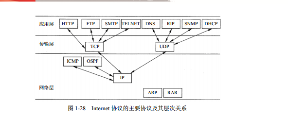

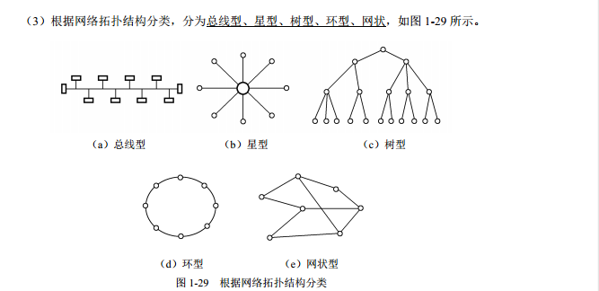

- 按分布范围分类
  - 局域网
  - 城域网
  - 广域网
- 802.11（无线局域网WLAN标准协议）
  - 速率2Mbp/s
- 802.11b
  - wifi
  - 2.4GHz
  - 11mbit/s
- 802.3  （重要的局域网协议）

  - 标准以太网
  - 10Mb/s
  - 同轴电缆
- 802.3u

  - 快速以太网
  - 100mb/s
  - 双绞线
- 广域网连接与远程访问设计

  - 有WWW、Email等具有Internet功能的服务器，采用DDN（或EI）专线连接，ATM交换及永久虚电路连接外网
  - 无WWW，采用ISDN或ADSL等技术连接外网
- TCP/IP 协议是Internet的核心
- 应用层协议：

  - FTP（文件传输协议）：传送控制信息（使用21号端口）、传送文件内容（使用20号端口）
  - TFTP（简单的文件传输协议）：一个用来在客户端与服务器之间进行简单文件传输的协议，提供不负责
  - SMTP（简单邮件传输协议）：是一种提供可靠且有效的电子邮件传输协议
  - Telnet（远程登录协议）：登录和仿真程序
  - HTTP（抄文本传输协议）：用于从WWW服务器传输超文本到本地浏览器的传送协议。
  - DNS（域名系统）：实现域名解析
    - 大部分应用服务器都要用到DNS服务器
  - SNMP（简单网络管理协议）
  - DHCP（动态主机配置协议）：实现自动分配IP地址的
  - POP3：收发邮件（离线协议）
- 传输层协议：

  - TCP

    - 面向连接，一般用于传输数据量比较少，且对可靠性要求高的场合

  - UDP

    - 不可靠、无连接的协议。一般用于传输数据量大、对可靠性要求不是很高，但要求速度快的场合
    - QQ、DNS、微信都是用UDP协议

- 网络层协议：

  - IP：无连接、不可靠
  - ARP：动态完成IP地址向物理地址MAC地址的转换
  - ICMP：用于发送差错报文的协议
  - IGMP：多播

> - 物理层
>   - 数据单位：比特，传输方式一般为串行
> - 数据链路层
>   - 数据单位：帧，（交换机），相邻节点可靠传输
> - 网络层
>   - 数据单位：分组
>   - 分组传输和路由选择（路由器、三层交换机），提供点对点连接
>   - 处理与寻址，传输有关管理问题、路由选择
> - 传输层
>   - 数据单位：报文
>   - （端到端连接），并进行流量控制和差错控制，确保数据可靠
> - 会话层
>   - 进程间会话
> - 表示层
>   - 数据格式与表达、压缩、加密（统一网络数据表示）
> - 应用层
>   - 交互工作（具体应用功能）

网络中的数据交换分为：

- 电路交换
- 分组交换
- ATM交换
- 全光交换
- 标记交换

网络存储技术：

- DAS：直连式存储
- NAS：真正可以即插即用
  - 采用直接与网络介质相连的特殊设备实现数据存储机制
- SAN

磁盘阵列区分:

- RAID 0 ：利用率100%
- RAID 1：利用率50%

### 综合布线和机房工程 

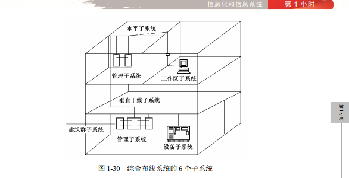

- 连接建筑群的主干网一般以光缆做传输介质

- 主机房内通道与设备间的距离应符合以下规定：
  - 两相对机柜正面之间的距离不应小于1.5m

  - 机柜侧面（或不用面）距墙不应小于0.5m，当需要维修测试时，机柜距墙不应小于1.2m

  - 走道净宽不应小于1.2m

  - 机房照明一般采用无眩光多隔栅灯

  - 机房供电系统应采用双回路供电，并选择三相五线制供电

  - 机房应采用四种接地方式

    - 交流工作接地，接地电阻不应大于4Ω
    - 安全工作接地，接地电阻不应大于4Ω
    - 直流工作接地，接地电阻应按计算机系统具体要求确定
    - 防雷接地，应按《建筑防雷设计规范》执行

  - RJ45接头需求量的计算公式：

    m = n* 4+n*4 * 15%  = 4.6n	(n为信息接点数量)

  - 信息模块的需求量计算公式：

    m = n+n * 3% = 1.03n

  - 每层楼用线量

    C = [0.55 * (L + S ) +6 ] * n

    L ：本楼层离管理最远距离	0.55 备用系数

    S：本楼层离管理最近距离

    n：本楼层的信息点总数

  - 综合布线标准遵循：EIA/TIA，568A

  - 适用范围不超过3000米，建筑总面积不超过100万平方米

- 机房建设内容

  - 机房装饰
    - 抗静电地板建设
    - 微孔天花
    - 机房墙板装修、天棚及地面防尘处理
    - 防火门窗等
  - 供配电系统
    - 供电系统
    - 配电系统
    - 照明
    - 应急照明
    - UPS电源灯
  - 空调新风系统
    - 机房精密空调
    - 新风换气系统
  - 消防报警系统
    - 消防报警
    - 手提式灭火器
  - 防盗报警系统
  - 防雷接地系统
  - 安防系统
  - 机房动力环境监测系统

零碎知识点：

- 帧中继
  - 是一种宽带分组交换、使用复用技术时，其传输速率可达44.6mbps

### 网络规划、设计与实施 

- 局域网技术主要是**交换以太网技术**

- 汇聚层的存在与否，取决于网络规模的大小

- 接入层：允许终端用户连接到网络（工作组服务器放置在接入层）（设备，例如：集线器）

- 汇聚层：（访问控制列表）完成网络访问策略控制、数据包处理、过滤、寻址及其他数据处理

- 核心层：（数据交换），提供最优区间传输，尽快转发分组，高可靠性、性能和吞吐量

    （提高可靠性的手段有：冗余设计）

    **核心->交换	接入->设备	汇聚->其它**  

- 网络攻击步骤
  - 信息收集
  - 试探寻找突破口
  - 实施攻击
  - 消除记录
  - 保留访问权限

## 信息安全管理 

### 加密技术 

- 对称加密：DES、IDEA
- 非对称加密：RSA、DSA
- PKI/CA
  - CA ：认证中心
  - 由最终用户、认证中心、注册机构组成

### 数字签名 

发送方A用自己的私钥进行数字签名，接收方B用发送方A的公钥进行验证。这是因为A的私钥只有A才拥有，发送者无法抵赖自己的签名

数字签名的特点：

- 签名者不能抵赖自己的签名
- 任何其他人不能伪造签名

### 认证 

- 认证：用于确保发送/接收者的真实性与数据的完整性，防止主动攻击，且认证是安全保护的第一道设防
- 加密：用于保证数据的保密性，防止被动攻击

认证与数字签名的区别：

- 数字签名允许第三者验证，有不可抵赖性，而认证不具备

### 网页防篡改技术

- 时间轮询技术
- 核心内嵌技术
- 事件触发技术
- 文件过滤驱动技术

> GB：强制性国家标准代号
>
> GB/T：推荐性国家标准代号
>
> GB/Z：国家标准指导性技术文件代号
>
> GJB：国军标代号

> 计算机信息系统安全保护等级划分准则：
>
> - 第一级：用户自主保护级，该级适用于普通内联网用户
> - 第二级：系统审计保护级，该级适用于通过内联网或国际网进行商务活动，需要保密的非重要单位
> - 第三极：安全标记保护级，该级适用于地方各级国家机关、金融机构、邮电通信、能源与水源供给部分、交通运输、大型工商与信息技术企业、重点工程建设等单位
> - 第四级：机构化保护级，该级适用于中央级国家机关、广播电视部门、重要物资、储备单位、社会应急服务部门、尖端科技企业集团、国家重点科研机构和国防建设等部门
> - 第五级：访问验证保护级，该级适用于国防关键部门和依法需要对计算机信息系统实施特殊隔离的单位

## <u>新一代信息技术</u> 

### 人工智能 

- 智能的特点
  - 感知能力
    - 能够感知外部世界，获取外部信息的能力，这是产生智能活动的前提条件和必要条件
  - 记忆和思维能力
    - 能够存储感知到的外部信息及由思维产生的知识，同时能够利用已有的知识对信息进行分析、计算比较、判断、联想、决策
  - 学习和自适应能力
    - 通过与环境的相互作用，不断学习积累知识，使自己能够适应环境变化
  - 行为决策能力
    - 即对外界的刺激做出反应，形成决策并传达相应的信息

### 区块链 

区块链是**分布式数据存储、点对点传输、共识机制、加密算法**等计算机技术的新型应用模式。

所谓**共识机制是区块链系统中实现不同节点之间建立信任、获取权益的数学算法**。

区块链系统组成：

- 数据层
  - 封装了底层数据区块以及相关的**数据加密和时间戳**等基础数据和基本算法
- 网络层
  - **分布式组网机制、数据传播机制、数据验证机制** 
- 共识层
  - 主要封装网络节点的各类**共识算法**
- 激励层
  - 将经济因素继承到区块链技术体系中来，主要包括**经济激励的发行机制和分配机制**等
- 合约层
  - 主要封装各类**脚本、算法和智能合约**，是**区块链可编程特性的基础**
- 应用层
  - 封装了区块链的**各种应用场景和案例** 

### 大数据 

- 5V：大量（volume）（数据的大小决定数据的价值和潜在的信息）、高速（velocity）、多样（variety）、价值（value）（低成本创造高价值）、真实性（veracity）
- 大数据出来系统需经过5个环节：数据准备、存储管理、计算处理、数据分析、只是展现
- 大数据关键技术
  - 存储管理技术
  - 并行分析技术
  - 分析技术

### 云计算 

- 云计算是一种按使用量付费的模式

  （资源包括：网络、服务器、存储、应用软件、服务）

- **云计算核心：虚拟化**

- 云计算架构包括

  - 资源池
  - 云操作系统
  - 云平台接口

- 云计算服务类型

  - IaaS （基础设施即服务）（面向管理员）
    - 基础的计算、存储设备的服务，如服务器
  - PaaS（平台即服务）：平台或开发环境（面向开发人员）
    - 装有各类应用软件的云主机
  - SaaS（软件即服务）：软件（面向用户）
    - 分享销客类的销售管理软件

- 云计算技术架构4层

  - 设施层、资源层、资源控制层、服务层

### 物联网 

感知层作为物联网架构的基础层面，主要技术包括：传感器（条码、RFID、传感器）、无线传输技术（WLAN、ZigBee）、自组织组网技术、中间件技术

### 移动互联网 

- 架构技术SOA：面向服务的架构，不涉及底层编程接口和通信模型，Web Service 是目前实现 SOA 的主要技术。
- 页面展示技术Web2.0：严格来说不是一种技术，而是互联网思维模式
- 移动互联网三层
  - 移动终端
  - 接入网络
  - 应用服务

### 智慧城市

- 5层模型

  - 物联感知层
  - 网络通信层
  - 计算与存储层
  - 数据及服务支撑层
  - 智慧应用层

- 3个体系

  - 安全保障体系
  - 运营管理体系
  - 标准规范体系

- 实质

  - 利用先进的信息技术，实现城市智慧式管理和运行

    （例如：红绿灯、感应式控制）

### 互联网+ 

- 就是：互联网 + "各个传统行业" 

# 计算题

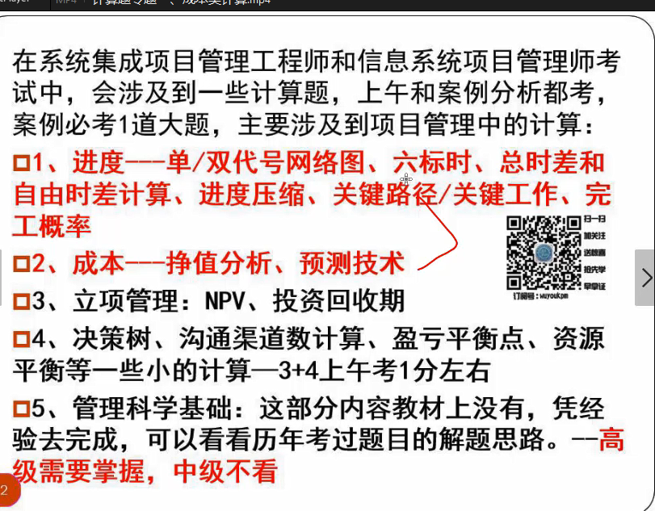

## 成本类计算 

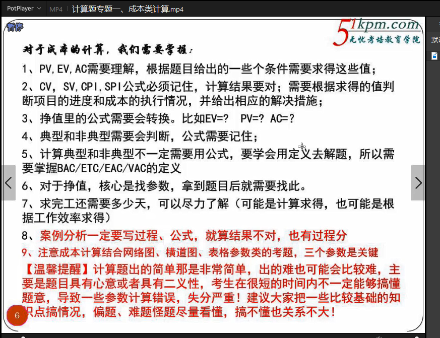

> 挣值技术：是将已经完成工作的预算成本（挣值），按原先分配的预算值进行累加获得的累加值，与计划工作的预算成本（计划值）和已完成的工作的实际成本（实际值）进行比较

- **PV**：预算值；应该完成多少工作，（按照计划截止目前应该花费的预算）；**要干的活**
- **EV**：已完成任务的预算值；完成了多少预算的工作（实际完成的工作，按照预算标准应该有的花费）；**干完的活**
- *AC**：已完成任务的实际值；完成工作的实际成本是多少（截止目前实际的花费）；**实际花费**
- **进度偏差：SV = EV - PV        进度执行指数：SPI = EV / PV** 
- **成本偏差：CV = EV- AC          成本执行指数：CPI = EV / AC**
- **SV >0  ; SPI >1 进度超前；SV<0 ; SPI<1进度落后**
- **CV>0 ; CPI>1成本节约；CV<0; CPI<1成本超支**
- **BAC：完工预算；（全部预算总和）；（项目的成本基准）**
- **ETC：完工尚需估算；（完成所有剩余项目工作的预计成本）**
- **EAC：完工估算；（完成所有工作所需的预期总成本，等于截至目前的实际成本加上完工尚需估算：ETC+ AC）**(EAC = BAC/CPI)
- VAC：完工偏差；（对预算亏空量或盈余量的一种预测，是完工预算与完工估算之差）；VAC= BAC-EAC
- TCPI：完工尚需绩效指数；TCPI = （BAC-EV）/（BAC-AV）
- 完工工期估算 = 预算工期/SPI

### **出现各种情况需采取的措施：** 

- 进度落后，成本超支：
  - 赶工或加班在预防风险的情况下并行施工
  - 用高效人员代替低效人员
  - 提高资源利用率
  - 增强优质资源
  - 尽可能一次性把事情做对，减少返工
  - 加强、改进沟通，提高效率
  - 外包和缩小项目范围
- 进度落后，成本节约：
  - 赶工（例如全体加班方式）加快进度
  - 使用高效资源来替换低效资源加快进度
  - 改进方法，提高工作效率
- 进度超前，成本超支：
  - 整个项目需要抽出部分人员以放慢工作进度
  - 需要采取控制成本措施
  - 项目中区分不同的任务，采取不同的成本及进度控制措施
  - 必要时调整成本基准
  - 优化施工方案，提高效率，加强质量管理减少返工，加强沟通，以降低成本
  - 在确保进度按期完成的基础上，可以降低进度以节约成本
  - 总结项目进度“提前”的经验，并经历下来，把和经验传播到项目的其它班组，甚至其它项目或未来项目
- 进度超前，成本节约：
  - 抽调部分人员用于其它项目
  - 加强质量控制、密切监控项目
  - 必要时调整计划或基准等方法改进，或者改变相关计划

### 完工预测： 

关键在于掌握典型偏差和非典型偏差

- 非典型（当前的偏差被视为一种特例，并且项目团队认为将来不会发生类似的偏差，需要纠偏）： **非典：坏东西，需要根本解决**

  ETC = BAC-截止到目前的累加EV

- 典型（当前出现的偏差被视为具有典型性，可以代表未来的偏差）

  ETC = （BAC-截止到目前的累加EV）/ 累加CPI 

> 例子：
>
> 例题1：某系统集成项目包含了三个软件模块，现在估算项目成本时，项目经理考虑到其中的模块A技术成熟，已在以前类似项目中多次使用并成功交付，所以项目经理忽略了A的开发成本，只给A预留了5万元，以防意外发生。然后估算了B的成本为50万元，C的成本为30万元，应急储备为10万元，三者集成成本为5万元，并预留了项目的10万元管理储备。如果你是项目组成员，该项目的成本基准是（58）万元，项目预算是（59）万元，项目开始执行后，当项目的进度绩效指数SPI为0.6时，项目实际花费70万元，超出预算10万元，如果不加以纠偏，请根据当前项目进展，估算该项目的完工估算值（EAC）为（60）万元
>
> （58）A、90 B、95 C、100 D、110
> （59）A、90 B、95 C、100 D、110
> （60）A、64 B、134 C、194.4 D、124.4
>
> 解析：
>
> 应急储备是包含在成本基准内的一部分预算，用来应对已经接受的已识别风险，以及已经制定应急或减轻措施的已识别风险。应急储备通常是预算的一部分，用来应对那些会影响项目的“已知-未知”风险。
>
> 管理储备不包括在成本基准中，但属于项目总预算和资金需求的一部分，使用前需要得到高层管理者审批。管理储备不计入挣值
>
> 所以成本基准=5+50+30+5+10=100万元（管理储备不计入）
>
> 总预算=5+50+30+5+10+10=110万元（管理储备计入）
>
> SPI =0.6,AC =70,PV=70-10=60,BAC=100（管理储备不计入挣值），则EV= 36
>
> 根据当前项目进展，也就是不纠偏，那就是典型：则EAC=BAC/CPI =100（36/70）=194.4
>
> 
>
> 例题2：某项目包含A、B、C三项主要活动，项目经理在成本估算时采用自下而上的估算方法，分别估算出三项活动的成本分别为13万元，23万元和8万元，同时为了应对未来可能遇到的不确定因素，预留了10万元的管理储备，同时为每个活动预留了2万元的准备金，该项目的总预算为（ 1 ）万元。项目进行到第二个月时，实际花费为20万元，完成总工作量的30%。如果项目按照当前的绩效继续进行下去，预测项目的完工尚需成本ETC约为（ 2 ）万元
> (1)A、44 B、54 C、60 D、50
> (2)A、46.7 B、40.7 C、45 D、46
>
> 解析：
>
> 总预算直接相加：13+23+8+10+6=60
>
> 管理储备是项目预算的一部分，但不是成本基准的一部分，所以不纳入挣值计算
>
> EV = 50*30%=15 AC=20
>
> 典型情况下：ETC= （BAC- EV）/CPI = (50-15)/(15/20) = 46.7
>
> 
>
> 例题3：假设某项目任务已进行了充分细化分解，任务安排及完成情况如下图，已获价值适用50/50规则（活动开始执行即获得一半价值），则下图中项目监控点的Pv、EV、BAC分别为（  ）。
>
>   
>
> A.PV=4200. EV=3000. BAC=5200
>
> B.PV=4200. EV=3300. BAC=4600
>
> C.PV=3600. EV=3300. BAC=5200
>
> D.PV=3600. .EV=3600. BAC=4600
>
> 解析：C
>
> 
>
> 例题4：某大楼布线工程基本情况为：一层到四层，必须在低层完成后才能进行高层布线。每层工作量完全相同。项目经理根据现有人员和工作任务，预计每层布线需要一天完成。项目经理编制了该项目的进度计划，并在3月18号工作时间结束后对工作进展情况进行了绩效评估，如下表所示：
> 
> **【问题1****】（5****分）**
> ​      请计算2011年3月18 日时对应的PV、EV、AC、CPI和SPI。
> **【问题2****】（4****分）**
> 根据当前绩效，在下图中划出AC和EV曲线。（2分）
> 
> 分析当前的绩效，并指出绩效改进的具体措施（2分）。
> **【问题3****】**
> 如果在2011年3月18 日绩效评估后，找到了影响绩效的原因并予以纠正，请预测此种情况下的ETC、EAC和完工日期（3分)。
> 如果在2011年3月18 日绩效评估后，未进行原因分析和采取相关措施，仍按目前状态开展工作，请预测此种情况下的ETC、EAC和完工日期（3分）。
>
> 解析：
>
> 【问题1】 
> PV=10000+10000=20000元 
> AC=8000元 
> EV=10000元 
> CPI = EV/AC =10000/8000=1.25 
> SPI = EV/PV = 10000/20000 = 0.5 
> 【问题2】（4分） 
> （1）根据当前绩效,划出的AC和EV曲线如下图所示。 
> 
> （2）状态：成本节省、进度滞后 
> 改进方法 
> a) 因当前成本是节约的,可以采用加班的方式来加快进度。 
> b) 可以采用增加资源的方式来提高效率。 
> c) 可以使用高效率资源来替换低效率资源的方式来加快进度 
> d) 改进方法,提高工作效率 
> e) 增加人员、赶工、调整基准计划 
> 【问题3】 
> （1）第1小问 
> ETC=BAC-EV = 40000 – 10000 =30000元 
> EAC=AC+ETC=8000+30000=38000元 
> 预测完工日期,原计划一天完成一层的工作,到3月18日为止,项目进度滞后一天,所以项目的完成日期为3月21日。 
> （2）第2小问 
> ETC=(40000-10000)/CPI =30000/1.25 =24000元 
> EAC=AC+ETC =8000+24000 =32000元 
> 预测完工日期,后面所需要的施工天数=所剩工作量原计划天数/当前的进度绩效。完成后面所剩工作还需6天,表示完成后面的工作还需要6天才能完成,总工期为8天,所以项目的完成日期为3月24日。
>
> 例题5：
>
> 某系统集成公司项目经理老王在其负责的一个信息系统集成项目中采用绩效衡量分析技术进行成本控制，该项目计划历时10个月，总预算50万元。目前项目已经实施到第6个月末。为了让公司管理层了解项目进展情况，老王根据项目实施过程中的绩效测量数据编制了一份成本执行绩效统计报告，截止第6个月末，项目成本绩效统计数据如下表所示 
> 
> 【问题】（5分） 
> 请计算该项目截止:到笫6个月末的计划成本（PV）、实际成本（AC）、挣值（EV）、 成本偏差（SV）、进度偏差（SV）. 
> 【问题2】（4分） 
> 请计算该项目截止到第6个月末的成本执行指数（CPI）和进度执行指数（SPI）。, 并根据计算结果分析项目的成本执行情况和进度执行情况。 
> 【问题3】（3分） 
> 根据所给数据资料说明该项目表现出来的问题和可能的原因。 
> 【问题4】（6分） 
> 假设该项目现在解决了导致偏差的各种问题，后续工作可以按原计划继续实施，项目的最终完工成本是多少？
>
> 解析：
>
> 【问题1】5分
>
> ​    PV=37 AC=23 EV=23.8 CV=EV-AC=0.8 SV=EV-PV=-13.2
>
> ​    【问题2】4分
>
> ​    CPI=EV/AC=103.5%SPI=EV/PV=64.3% 成本节省，进度滞后
>
> ​    【问题3】3分
>
> ​    表现出问题及原因
>
> ​    1.进度滞后的问题，可能原因：
>
> ​    (1)进度计划不周(2)资源分配问题，导致某些工作因缺少资源展开缓慢(3)历时估算不准(4)进度执行的监控不力，未及时发现变更或发现后未及时管理纠偏
>
> ​    2.成本节省可能带来质量风险
>
> ​    (1)成本的节省可能带来工作或产品质量下降(2)工作范围可能未得到确认，部分工作遗漏从而形成的成本节省。
>
> ​    【问题4】6分
>
> ​    由于解决了导致偏差的问题，后续工作按原计划执行，所以ETC=BAC-EV=50-23.8=26.2EAC=AC+ETC=23+26.2=49.2
>
>  
>
> 例题6:
>
> 某项目6个月的预算如下表所示。表中按照月份和活动给出了相应的PV值，当项目进行到3月底时，项目经理组织相关人项目进行了绩效考评，考评结果是完成计划进度的90%。 
> 
> 【问题1】（7分）
> 请计算3月底时项目的SPI、、CPI、CV、SV、值，以及表中1、2处的值（注：表中1处代表“编制计划”活动的EV的值，表中2处代表“概要设计“活动的EV值）。
> 【问题2】（7分）
> （1）如果项目按照当前的绩效继续进行，请预测项目的ETC（完成时尚需估算）和EAC（完成时估算）。
> （2）请评价项目前3月的进度和成本绩效并提出调整措施。
> 【问题3】（6分）
> 假设项目按照当前的绩效进行直至项目结束，请在下图中画出从项目开始直到结束时的EV和AC的曲线，并在图中用相应的线段表明项目完成时间与计划时间的差(用“t”标注)、计划成本与实际成本的差（用“c”标注）。
>
> 
>
> 解析：
>
> 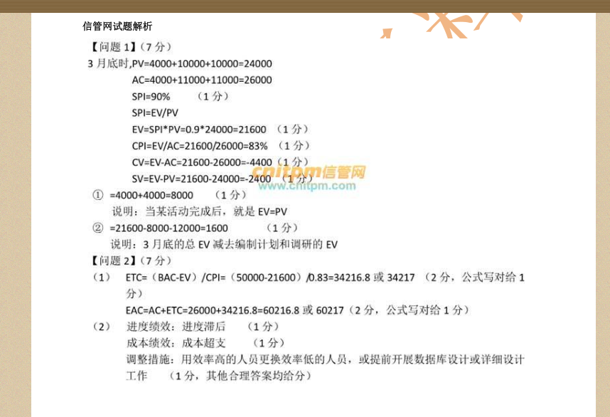
>
> 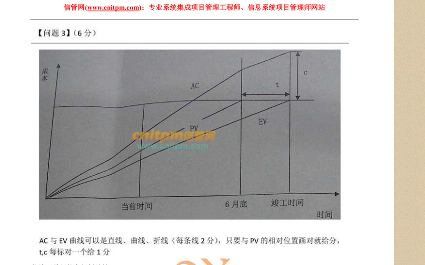
>
> 
>
> 例题7：
>
> 项目组成员小张根据项目经理的要求绘制了项目A的WBS图（图1），并根据工作量对项目的成本进行了分配，见表1。
>
> 
>
> 【问题1】（3分）
>
> 如果小张采取自下而上的估算方法。请计算A1、A2、A的估算值分别是多少？
>
> 【问题2】（10分）
>
> 在进行项目预算审批时，财务总监之处在2012年初公司实施过一个类似项目，当时的决算金额是50万元，考虑到物价因素增加10%也是可接受的，财务总监要求据此更改预算，请根据财务总监的建议列出A1、A2、A1.1、A2.1的估算值以及项目的总预算
>
> 【问题3】（3分）
>
> 项目经理认为该项目与公司2012年初实施的一个类似项目还是有一定区别的，为稳妥起见，就项目预算事宜1，项目经理可以向公司财务总监提出何种建议
>
> 【问题4】（9分）
>
> 除了自下而上的估算方法，本案例还应用了哪些成本估算方法？成本估算的工具和技术还有那些？
>
> **信管网考友参考答案：**
> 【问题1参考答案】
>
> A1=12+14=26 A2=18+16=34 A=A1+A2=60
>
> 【问题2参考答案】
>
> 物价增加10%，则总预算最高为50*（1+10%）=55万元；A1.1占原来的1/5，A2.1占原来的0.3,A1占原来的13/30,A2 占原来的17/30,则： 
> ​    各个估算值如下：
> ​    A1=55*(13/30)=23.8 A2=55*(17/30)=31.2 A1.1=55*0.2=11 A2.1=55*0.3=16.5 
> ​    项目的总估算为55万
>
> 【问题3参考答案】
> 项目预算建议： 
> （1）项目成本预算要以项目需求为基础 
> （2）项目成本预算要与项目目标相联系，必须考虑项目的质量目标和进度目标 
> （3）项目成本预算应当留有弹性
>
> 【问题4参考答案】
>
> 本案例中还采用了类比估算、参数估计，成本估算的工具和技术还有确定资源费率、项目管理软件、供应商投标分析、准备金分析、质量成本；

##  进度类计算 

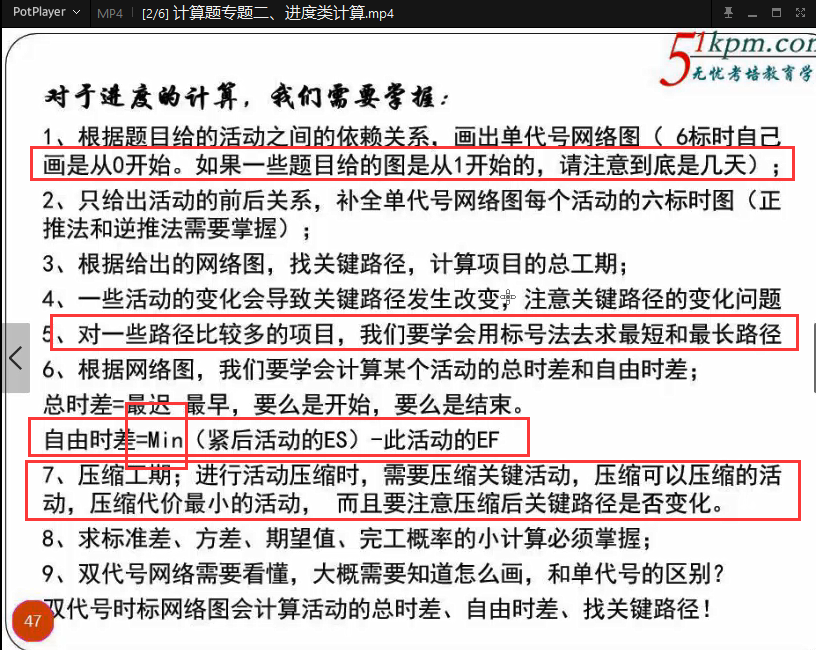

 

### 三点估算

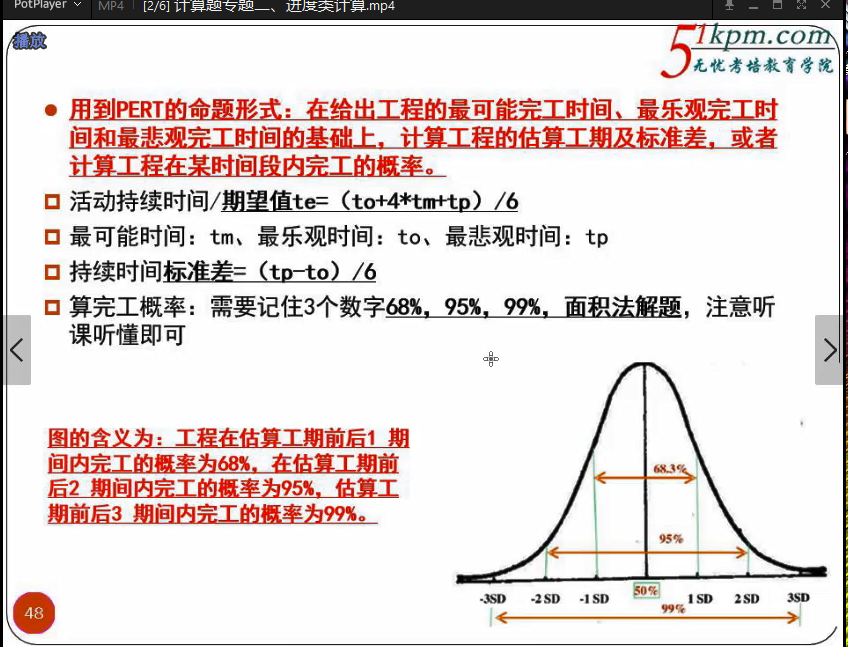

###   网络图 

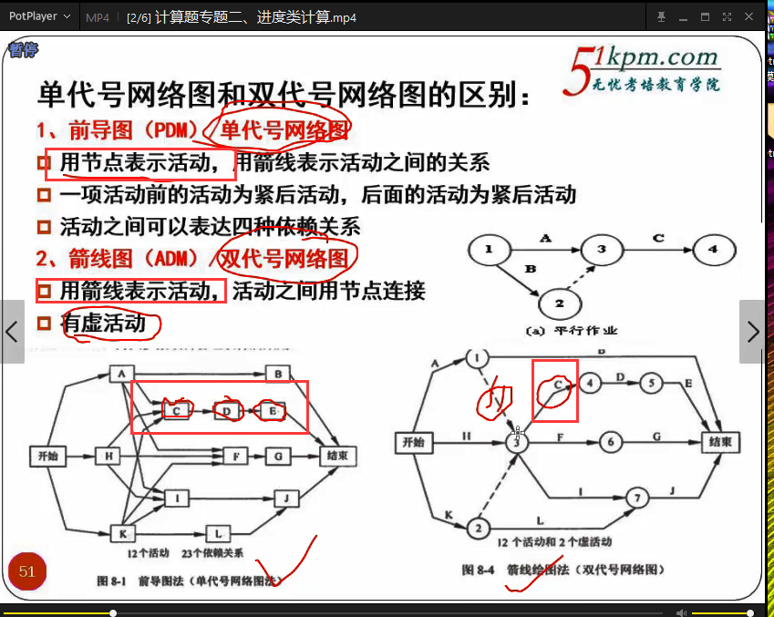

#### 单代号网络图 （前导图PDM）

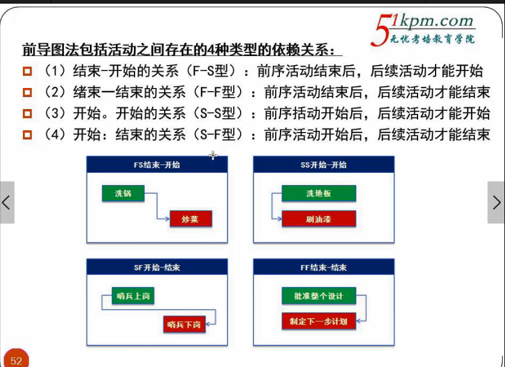

**重点：**

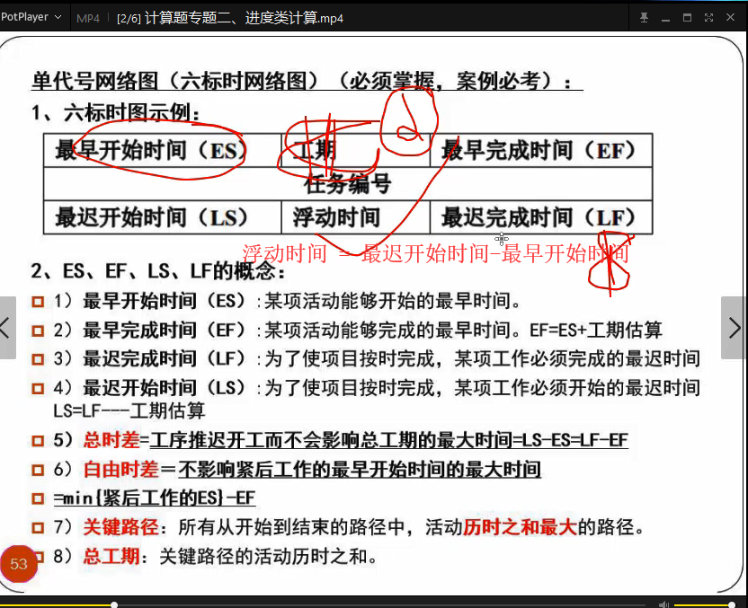

**(总时差 = 浮动时间)**

**关键路径上的总时差、自由时差为0**

关键路径上的总时差总是为0或者负数，如果出现负数应该尽快解决，使之等于0

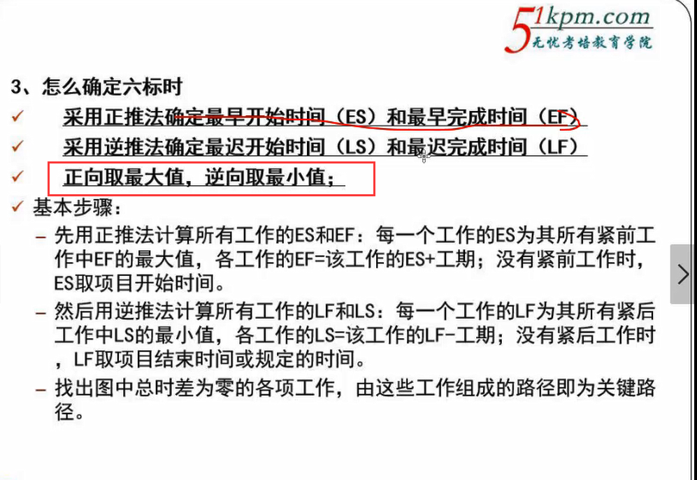

#### 双代号网络图 （箭线图ADM）

(虚活动不占用时间和资源)

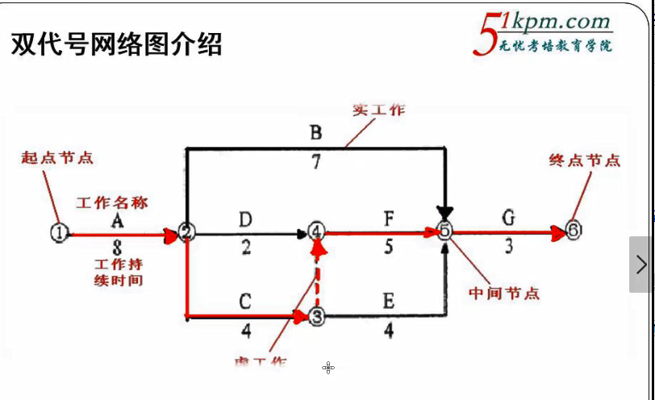

**计算技巧：**

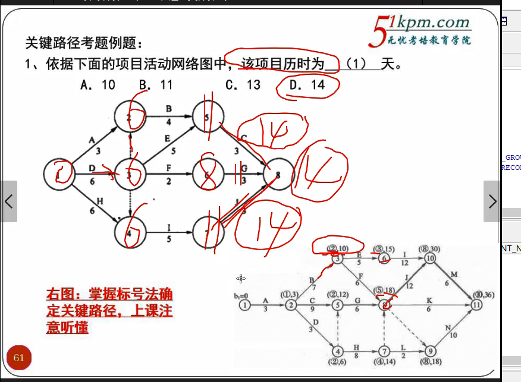

> 例题：
>
> 66、67、下图中从A到E的最短路线是（1），其长度是（2） 
> 
> （1）A. A—B1—C1—D2—E 
> B.A—B2—C1—D1—E 
> C.A—B3—C2—D2—E 
> D.A—B2—C2—D3—E 
> （2）A.70 
> B.80 
> C.90 
> D.100
>
> **信管网参考答案和解析：B、B**
>
> 求最短路线：从后面往前推
>
> 求最长路线：从前往后推
>
> 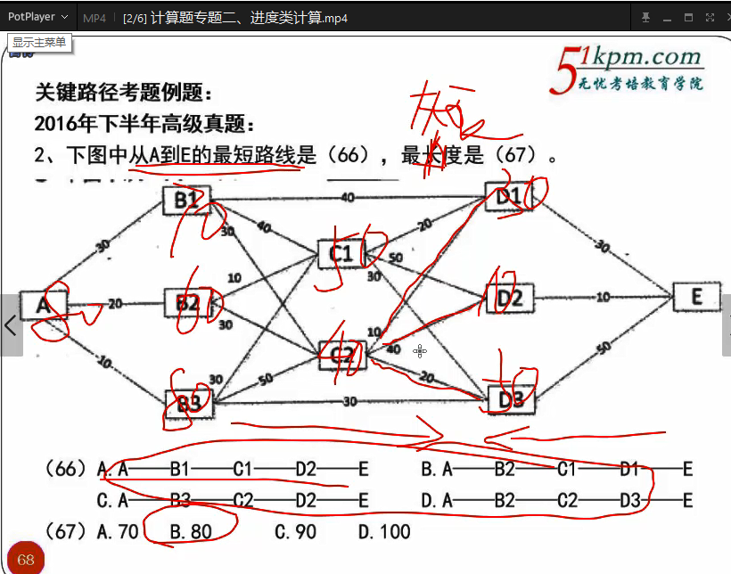

> 例题2：
>
> 某项目最初网络图如下，为了压缩进度，项目经理根据实际情况使用了快速跟进方法：在任务A 已经开始一天后开始实施任务C，从而使任务C 与任务A 并行3 天。这种做法将使项目（ ）。
> 
> A.完工日期不变    
> B.提前4 天完成   
> C.提前3天完成    
> D.提前2天完成
>
> **信管网解析：网络图相关知识是考试重点，必须要掌握。 **依该项目最初的网络图，其关键路径为A→C→F，项目的工期为20天。使用快速跟进的方法压缩进度后，该项目的关键路径改为B→D→G，项目的工期为　18天。因此，项目提前2天完成。 （关键路径改变了）
> **信管网参考答案：D**

**波行线题目：**

（一般全部为实线构成的路线为关键路径）（即无波浪线的就是关键路径）

自由时差：当前活动的波形线长度

总时差：指本工作各条波形线长度之和或时间间隔之和中的最小值

（例如图中的B的总时差为3，自由时差为1）

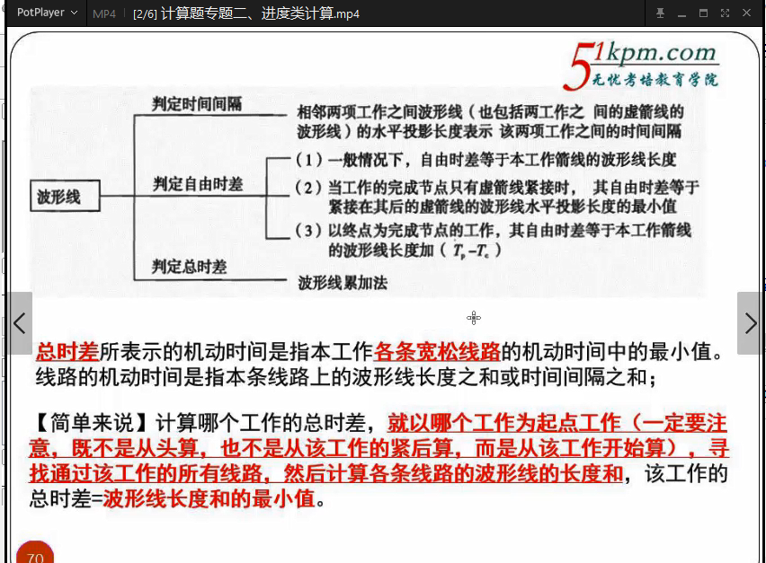

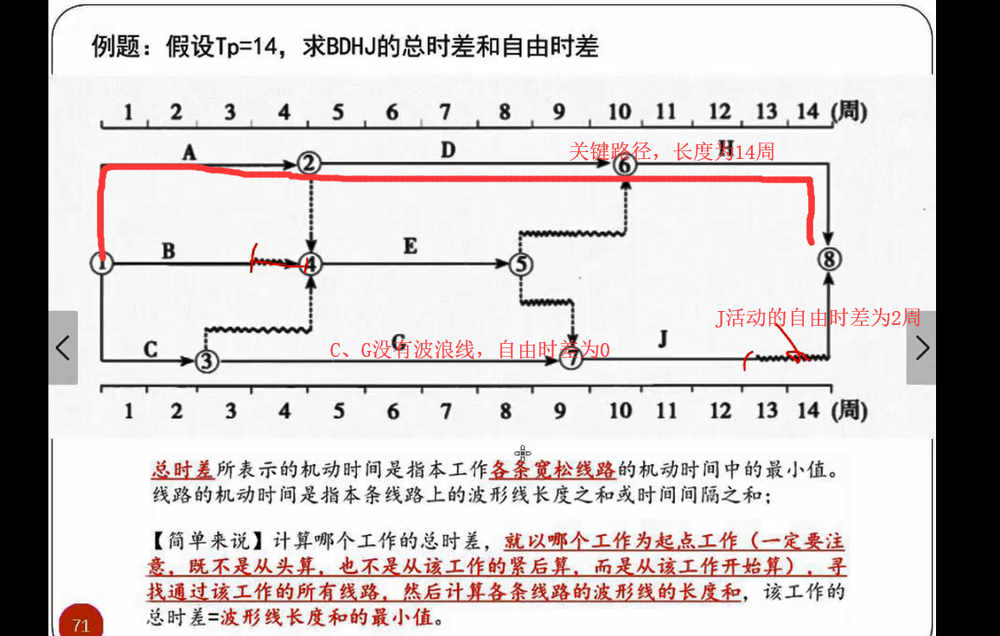

> 例题1：
>
> 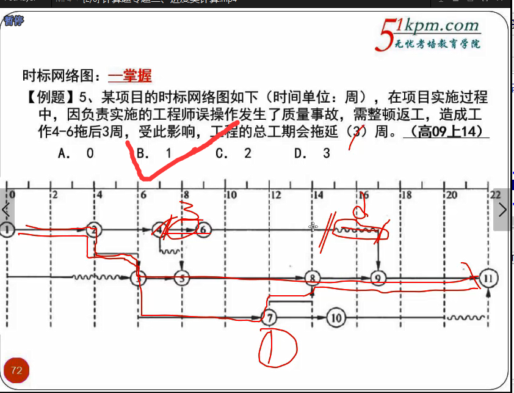

> 例题2：
>
> 某信息系统工程项目由ABCDEFG七个任务构成，项目组根据不同任务的特点，人员情况等，对各项任务进行了历时估算并排序，并给出了进度计划，如下图：
>
> 
>
> 项目中各项任务的预算（方框中，单位是万元）、从财务部获取的监控点处各项目任务的实际费用（括号中，单位为万元），及各项任务在监控点时的完成情况如下图：
>
> 
>
> [问题1]（10分）
>
> （1）请指出该项目的关键路径、工期。
>
> （2）本例给出的进度计划图叫什么图？还有哪几种图可以表示进度计划？
>
> （3）请计算任务A、D和F的总时差和自由时差
>
> （4）若任务C拖延1周，对项目的进度有无影响？为什么？
>
> 解析：
>
> 【问题1】 
> 1、项目的关键路径是B、D、E、G，工期是24周 
> 2、叫双代号时标网络图，还有横道图、甘特图、单代号网络图等可以表示进度计划！ 
> 3、A工作自由时差2天，总时差3天 
> D工作自由时差0天，总时差0天 
> F工作总时差和自由时差都为7天 
> 4、因为C在非关键路径上，且有1周自由时差，所以推迟1周没有影 

> 例题3：
>
> 已知某信息工程项目由ABCDEGHI八个活动构成，项目工期要求为100天。项目组根据初步历时估算、各活动间逻辑关系得出的初步进度计划网络图如下图所示（箭线下方为活动历时）。 
> 
> 【问题1】（7分）
> （1）请给出该项目初步进度计划的关键路径和工期。
> （2）该项目进度计划需要压缩多少天才能满足工期要求？可能需要压缩的活动都有哪些？
> （3）若项目组将B和H均压缩至30天，是否可满足工期要求？压缩后项目的关键路径有多少条？关键路径上的活动是什么？
>
> 解析：
>
> （1）关键路径是BGI，项目工期为120天。
>
> （2）需要压缩20天，可能需要压缩的活动时：A、B、D、G、H、I。
>
> （3）可以满足工期要求。关键路径有3条，分别是：ADH、ADI和BGI。

**压缩进度技巧：**

- 要在关键路径上压缩
- 要压缩可压缩的活动
- 要压缩每压缩一天，所消耗资源最小的
- 关键路径变化问题

> 例题3：
>
> 信管网某信息系统项目包含A、B、C、D、E、F、G、H、I、J十个活动。各活动的历时、成本估算值、活动逻辑关系如下表所示：
>
> 
>
> ［问题1］（10分）
>
> （1）请计算活动H、G的总浮动时间和自由浮动时间。
>
> （2）请指出该项目的关键路径。
>
> （3）请计算该项目的总工期。
>
> ［问题2］（3分）
>
> 项目经理在第9天结束时对项目进度进行统计，发现活动C完成了50%，活动E完成了50%，活动G完成了100%，请判断该项目工期是否会受到影响？为什么？
>
> ［问题3］（10分）
>
> 结合问题2，项目经理在第9天结束时对项目成本进行了估算，发现活动B的实际花费比预估多了1000元，活动D的实际花费比预估少了500元，活动C的实际花费为2000元，活动E的实际花费为1000元，其他活动的实际花费与预估一致。
>
> （1）请计算该项目的完工预算BAC。
>
> （2）请计算该时点计划值PV、挣值EV、成本绩效指数CPI、进度绩效指数SPI。
>
> ［问题4］（3分）
>
> 项目经理对项目进度、成本与计划不一致的原因进行了详细分析，并制定了改进措施。假设该改进措施是有效的，能确保项目后续过程中不会再发生类似问题，请计算该项目的完工估算EAC。
>
> 
>
> 解析：
>
> **试题二信管网参考答案：**
>
> ****
>
> 【问题1】
>
> （1）H的总浮动时间和自由浮动时间都是0；G的总浮动时间和自由浮动时间都为3
>
> （2）关键路径为：ABCIJ    ADEHIJ
>
> （3）总工期为17天
>
> 【问题2】
>
> 项目工期会受到影响
>
> 因为按计划E要完成100%，而现在只完成了50%，而E活动又是关键活动，所以将影响工期。
>
> 【问题3】
>
> 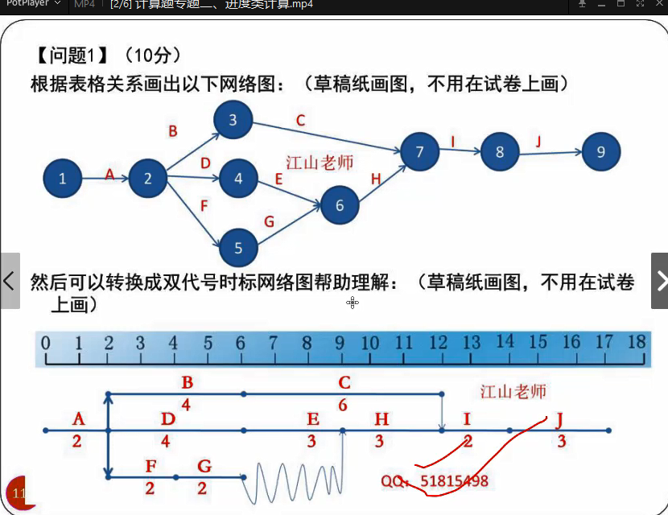
>
> 
>
> （1）
>
> BAC=27000元
>
> （2）
>
> PV=2000+3000+5000*0.5+3000+2000+2000+2000=16500元
>
> EV=2000+3000+5000*0.5+3000+2000*0.5+2000+2000=15500元
>
> AC=2000+4000+2000+2500+1000+2000+2000=15500元
>
> CPI=EV/AC=15500/15500=1
>
> SPI=EV/PV=15500/16500=0.94
>
> 【问题4】
>
> 采用非典型偏差公式计算
>
> EAC=AC+ETC=15500+(27000-15500)=27000元

### 成本+进度类练习题：

技巧：要画网络图

然后将网络图转换成双代号时标网络图

> 例题1：
>
> 已知某信息工程由A、B、C、D、E、F、G、H八个活动构成，项目的活动历时，活动所需人数、费用及活动逻辑关系如下表所示 
> 
> 【问题1】（4分） 
> 请给出该项目的关键路径和工期 
> 【问题2】（12分） 
> 第14天晚的监控数据显示活动E、G均完成一半，F尚未开始，项目实际成本支出为12000元。 
> （1）请计算此时项目的计划值（PV）和挣值（EV） 
> （2）请判断次时项目的成本偏差（CV）和进度偏差（SV），以及成本和进度执行情况 
> 【问题3】（3分） 
> 若后续不作调整，项目工期是否有影响？为什么？ 
> 【问题4】（6分） 
> （1）请给出总预算（BAC）、完工尚需估算（ETC）和完工估算（EAC）的值。 
> （2）请预测是否会超出总预算(BAC)？完工偏差（VAC）是多少？
>
> **信管网参考答案：**
>
> 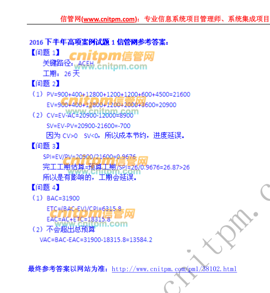
>
> **注意：完工工期估算 = 预期工期/SPI**

> 例题2：
>
> 已知某信息工程项目由A到I共9个活动组成，项目组根据项目目标，特别是工期要求，经过分析、定义及评审，给出了该项目的活动历时。活动所需资源及活动逻辑关系列表，如下表所示：
>
> 
>
> 【问题1】（2分）
>
> 请指出该项目的关键路径和工期
>
> 【问题2】（6分）
>
> 请给出活动C、E、G的总时差和自由时差
>
> 【问题3】（6分）
>
> 项目经理以工期紧、项目难度高为由，向高层领导汇报申请组建12人的项目团队，但领导没有批准。
>
> （1）领导为什么没有同意该项目经理的要求？若不考虑人员能力差异，该项目所需人数最少是多少个人？
>
> （2）由于资源有限，利用总时差、自由时差，调整项目人员安排而不改变项目关键路径和工期的技术是什么？
>
> （3）活动C、E、G各自最迟从第几天开始执行才能满足（1）中项目所需人数最少值？
>
> 【问题4】（6分）
>
> 在（1）~（6）中填写内容
>
> 为了配合甲方公司成立庆典，甲方要求该项目提前10天完工，并同意支付额外费用。承建单位经过论证，同意了甲方要求并按规范执行了审批流程。为了保质保量按期完工，在进度控制及人力资源管理方面可以采取的措施包括：
>
> ① 向（1）要时间，向（2）要资源
>
> ② 压缩（3）上的工期
>
> ③ 加强项目人员的质量意识，及时（4），避免后期返工
>
> ④ 采取压缩工期的方法：尽量（5）安排项目活动，组织大家加班加点进行（6）
>
> （1）~（6）供选择的答案
>
> A、评审 B、激励 C、关键路径 D、非关键路径
>
> E、赶工 F、并行 G、关键任务 H、串行
>
> 解析：
>
> 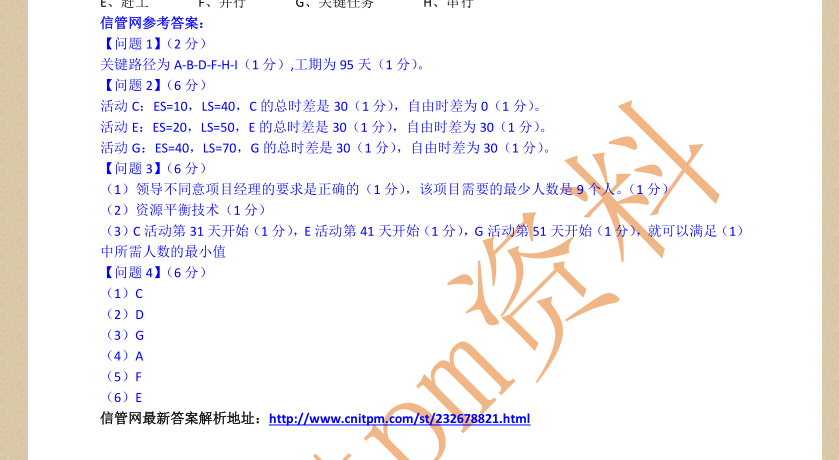
>
> 问题3中的第一问解题技巧：
>
> 将网络图转换成双代号时标网络图：
>
> 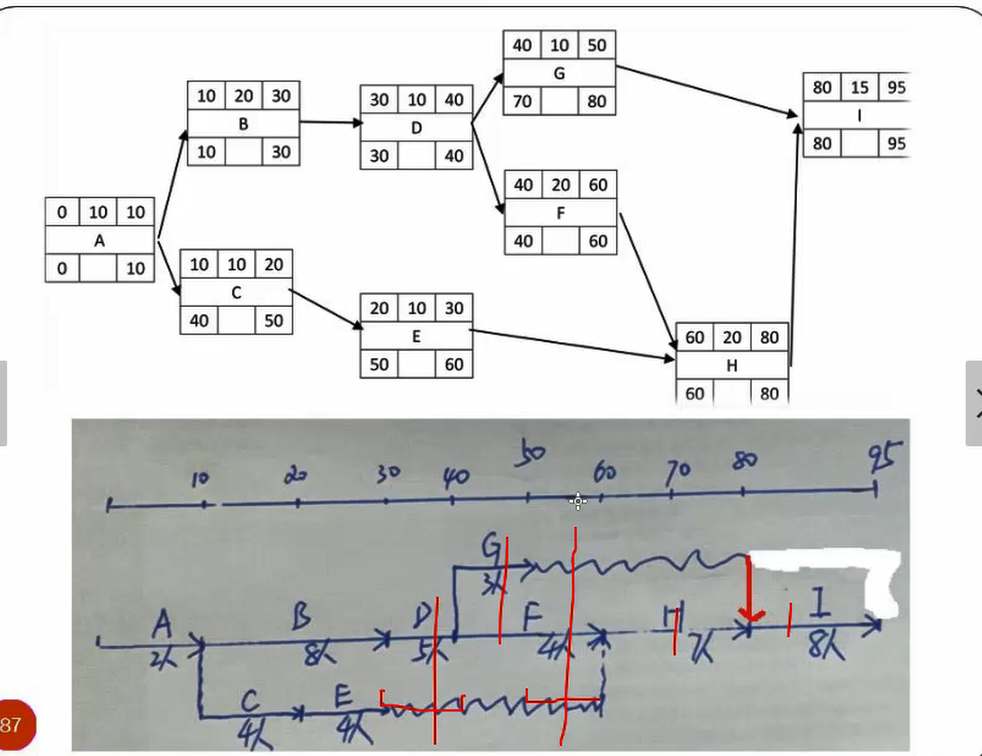
>
> 
>
> 然后竖着算人数：得出该项目需要的最少人数是9个人

### 成本+进度类的上午题计算练习

> 66、67、某项工程的活动明细如下表（时间：周：费用：万元）：
> 
> 项目总预算由原先的60万元增加到63万元，根据上表，在预算约束下该工程最快能完成时间为（66）周，所需项目总费用为（67）万元。
> （66）a、9 
> b、8 
> c、14 
> d、12
> （67）a、60 
> b、64 
> c、56 
> d、45
> **信管网解析：**
> 赶工情况下最短时间为8周，所需成本为直接费用56万+间接费用8万=64万
> 由于超过了预算63万，所以最快能完成时间肯定是要大于8周的。
> a压缩一周需要5万，b压缩1周需要1万，c压缩1周需要1万，d压缩1周需要1.5万。
> 所以a的压缩成本最高，我们尽量选择a不压缩，这样可以使成本最低。
> a不压缩，bcd都压缩，则所需时间为9周，成本为10+17+13+11+9=60万。是满足题意的，因为其他时间都是大于9周的。
> **信管网参考答案：a、a** 

#### 盈亏平衡点的计算 

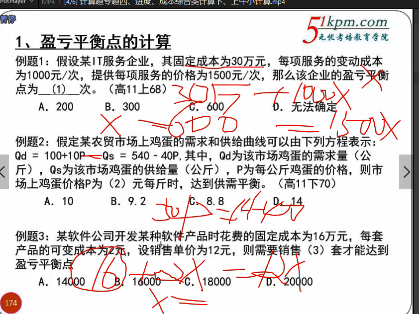

#### 决策树的计算 

 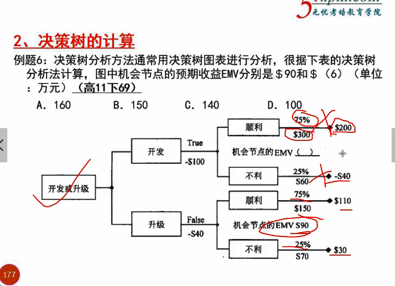

  

#### 资源平衡的问题 

 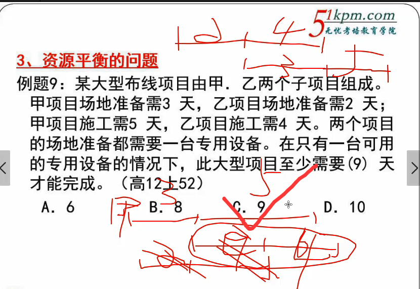

#### 统计抽样的问题 

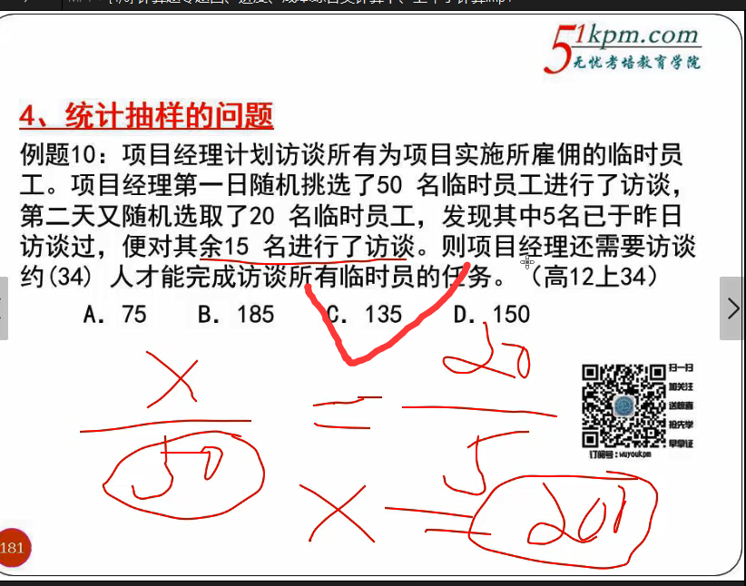

#### 自制\外购分析的问题 

####  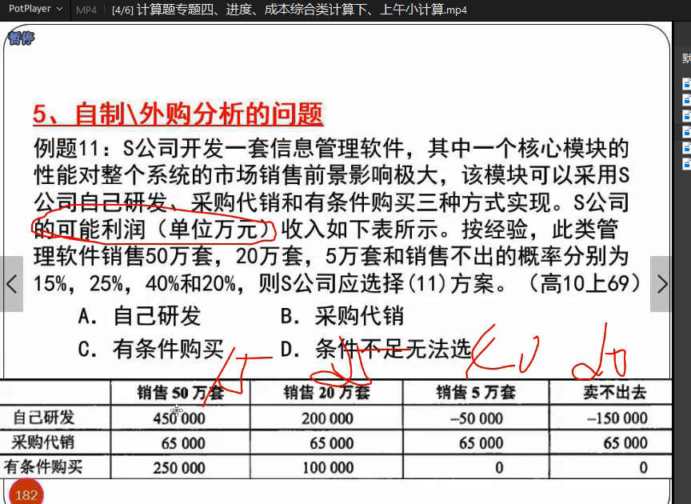 

#### 风险曝光度的计算 

 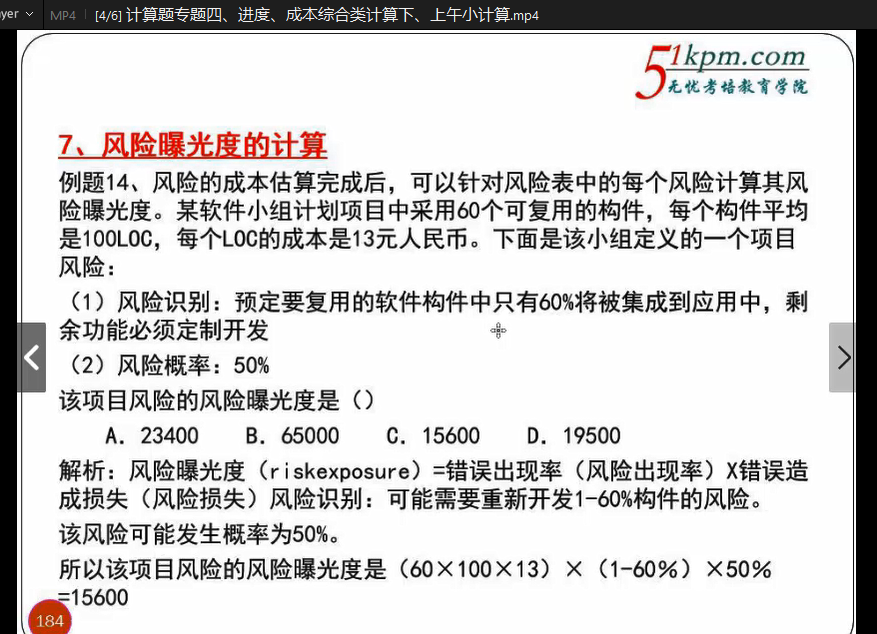

风险曝光率 = 错误出现率（风险出现率） * 错误造成损失（风险损失）

期望货币值（EMV） = 风险事件概率 * 风险事件货币值

EMV > 0 ：机会（选机会值最大的）

EMV < 0：风险（选风险影响最小的）

#### 概率题

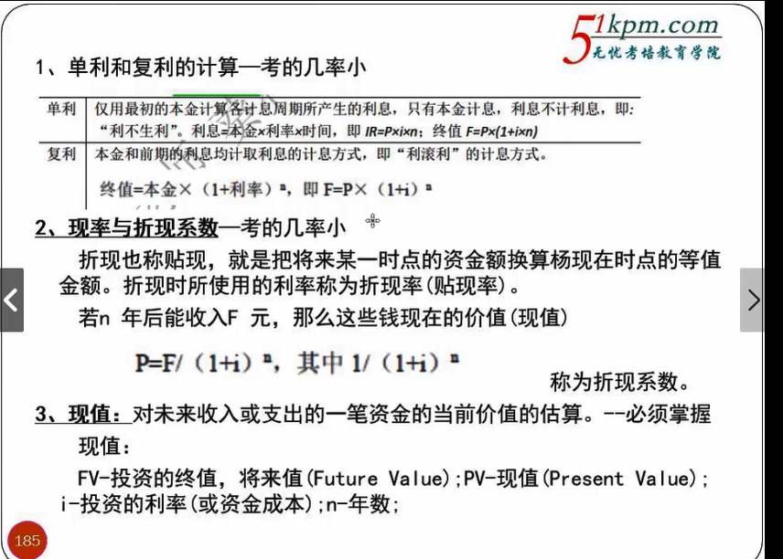

## 投资回收期

PVn = Fn/(1+i)^n

投资回收率 = 动态回收期的倒数（ROI）

净现值NPV = 净现金/[（1+折现率）的N次方]

（净现值NPV = 净现金* 1/[（1+折现率）的N次方]）（计算简单一点）

（净现金 = 收入-成本）(净现金又名为现金流)

净现值NPV > 0 ：项目可行

NPV < 0 ：项目不可行

动态投资回收期 = 净现值NPV相加>0

> 已知某拟建项目财务净现金流量如下表所示，则该项目的静态投资回收期是（1）年，进行该项目财务评价时，如果动态投资回收期Pt小于计算期n,则财务净现值（2）
> 
> （1）A、8.4    
> B、8.6    
> C、7.4     
> D、7.6
> （2）A、<0,项目不可行 
> B、>0,项目可行 
> C、<0,项目可行 
> D、>0,项目不可行
>
> 解析：
>
> D 、 B
>
> 
>
> 某一项目，初始投资为2000万元，该项目从投产年开始每年的净效益如下表所示，则该项目的静态投资回收期约为（ ）年 
> 
> A、2.9 
> B、3.9 
> C、2.7 
> D、3.8
>
> **信管网参考答案：A** 

> 一个信息系统集成项目有A、B、C、D、E、F、G共7个活动。各个活动的顺序关系、计划进度和成本预算如下图所示，大写字母为活动名称，其后面括号中的第一个数字是该活动计划进度持续的周数，第二个数字是该活动的成本预算，单位是万元。该项目资金分三次投入，分别在第1周初、第10周初和第15周初投入资金。
>
> 
>
> 项目进行的前9周，由于第3周时因公司有个临时活动停工1周。为赶进度。从其他项目组中临时抽调4名开发人员到本项目组。第9周末时，活动A、B和C的信息如下，其他活动均未进行。
>
> 活动A：实际用时8周，实际成本100万元，已完成100%
>
> 活动B：实际用时4周，实际成本55万元，已完成100%
>
> 活动C：实际用时5周，实际成本35万元，已完成100%
>
> 从第10周开始，抽调的4名开发人员离开本项目组，这样项目进行到第14周末的情况如下，其中由于对活动F的难度估计不足，导致了进度和成本的偏差。
>
> 活动D：实际用时2周，实际成本30万元，已完成100%；
>
> 活动E：实际用时0周，实际成本0万元，已完成0%
>
> 活动F：实际用时3周，实际成本40万元，已完成20%
>
> 活动G：实际用时0周，实际成本0万元，已完成0%
>
> [问题1]（10分）
>
> 在不影响项目总体工期的前提下，制定能使资金成本最优化的资金投入计划。请计算三个资金投入点分别要投入的资金量并写出在此投入计划下项目各个活动的执行顺序。
>
> [问题2]（5分）
>
> 请计算项目进行到第9周末时的成本偏差（CV）和进度偏差（SV）,并分析项目的进展情况
>
> [问题3]（5分）
>
> 请计算项目进行到第15周时的成本偏差（CV）和进度偏差（SV），并分析项目的进展情况
>
> [问题4]（5分）
>
> 若需要项目第15周计算完工尚需成本（ETC）和完工估算成本（EAC），采用哪种方式计算更适合？写出计算公式
>
> 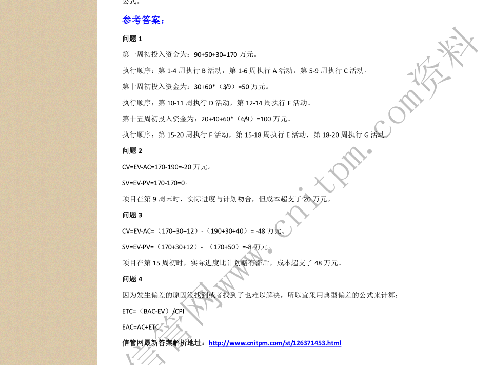
>
> 

## 沟通渠道计算 

n(n-1)/2

(n为干系人数量)

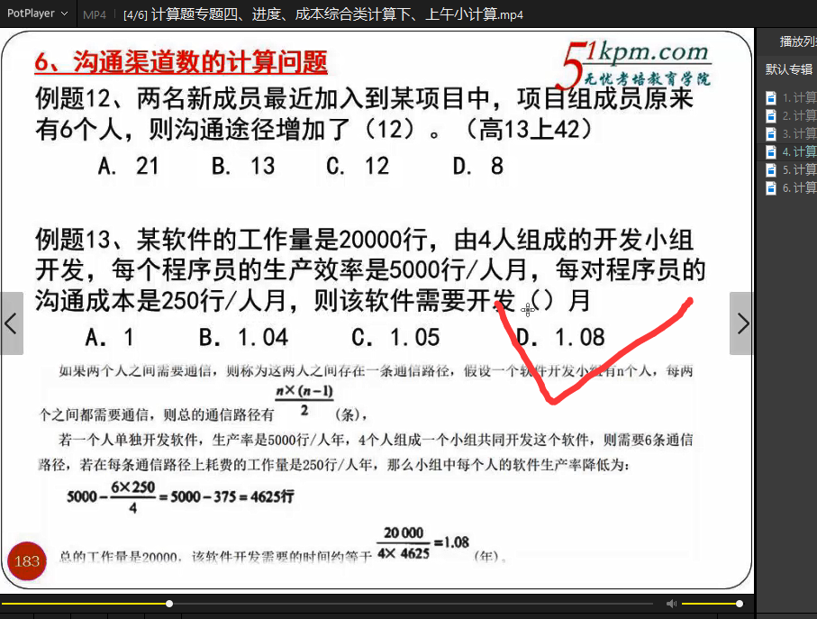

## 运筹学 

规划论

- 线性规划、非线性规划
- 整数规划、目标规划、动态规划

图论与网络

存储论

排队论

对策论

计算机仿真

### 类型1：求最短和最长路径

答题技巧：求最短：从后往前推

求最长：从前往后推 

> 下图中，从A到E的最短长度是（70）（图中每条边旁的数字为该条边的长度）。
>
> A．17 	B．18	C．19	D．20 
>
> 答案：B
>
> 
>
> 如图27-4所示，有一批货物要从城市s发送到城市t，线条上的数字代表通过这条路的费用（单位为万元）。那么，运送这批货物，至少需要花费多少元？
>
> 
>
> 答案：81万元
>
>  
>
> 如图27-16的网络图表示从城市A到城市B运煤的各种路线。各线段上的数字表示该线段运煤所需的费用（百元／车）。城市A有3个装货点，城市B有3个卸货点，各点旁标注的数字表示装／卸煤所需的费用（百元／车）。根据该图，从城市A的一个装卸点经过一条路线到城市B的一个卸货点所需的装、运、卸总费用至少为（百元，车）。
> 
> A.19           
> B.20          
> C.21             
> D.22
>
> 答案：A
>
> 
>
> A、B、C、D、E、F、G代表七个村落，村落之间的道路连通情况如下图所示（边上的数据为距离，单位为公里）。这七个村落拟合建一所小学，已知A村有小学生50人、B村有小学生40人、C村有小学生60人、D村有小学生20人、E村有小学生70人、F村有小学生80、G村有小学生100人。则拟合建小学应建在（70）村落，才能使学生上学所走的总路程最短。 
> 
> （70）A．C      B．A C．F D．E 
> **信管网参考答案：D **
>
> （解答技巧：从选项答案代入法来计算，选最小值那个为答案）

### 类型2：线性规划的问题 

>  某工厂生产两种产品S和K，受到原材料供应和设备加工工时的限制。单件产品 的利润、原材料消耗及加工工时如下表。为获得最大利润，S应生产（68）件。
>  
>  A.  7              
>  B.  8        
>  C.  9       
>  D.  10
>
>  **信管网试题解析： **该问题用线性规划模型求解。设利润为z，为了获得最大利润，s应生产X1件，K 应生产x2件。对该问题求解最优方案可以由下列数学模型描述： 
>  
>  **信管网参考答案：(68)B **

### 类型3：投资收益最大的问题

> 某公司现有400 万元用于投资甲、乙、丙三个项目，投资额以百万元为单位，已知甲、乙、丙三项投资的可能方案及相应获得的收益如下表所示：
> 
> 则该公司能够获得的最大收益值是（67）百万元。
> A、17                    B、18                    C、20                       D、21
>
> **信管网解析：**
>
> 每百万元收益最大的计算技巧： 
>
> 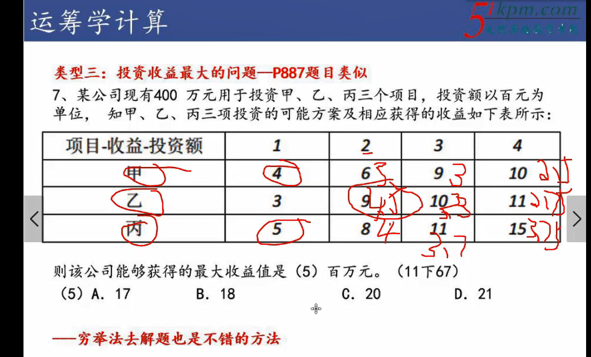 
>
> **信管网参考答案：B**

### 类型4：对策论、博弈的问题 

> 某公司需要根据下一年度宏观经济的增长趋势预测决定投资策略。宏观经济增长趋势有不景气、不变和景气3 种，投资策略有积极、稳健和保守3 种，各种状态收益如下表所示。基于maxmin 悲观准则的最佳决策是（ ）。
> 
> A.积极投资
> B.稳健投资 
> C.保守投资
> D.不投资
>
> 答案：C
>
> **maxmin悲观准则：最大最小：小中取大**
>
> 
>
> 某企业开发了一种新产品，拟定的价格方案有三种:较高价、中等价、较低价，估计这种产品的销售状态也有二种：销路较好、销路一般、销路较差。根据以往的销售经验，他们算出。这二种价格方案在三种销路状态下的收益值如表3所示:
> 
> 企业一旦选择了某种决策方案，在同样的销路状态下，可能会产生后悔值(即所选决策方案产生的收益与最佳决策收益值的差值)。例如，如果选择较低价决策，在销路较好时，后悔值就为8万元。因此，可以根据上述收益值表制作后悔值如表4所示(空缺部分有待计算):
> 
> 企业做定价决策前，首先需要选择决策标准。该企业决定采用最小-最大后悔值决策标准(坏中求好的保守策略)，为此，该企业应选择决策方案（  ）。
> A、较高价
> B、中等价
> C、较低价
> D、中等价或较低价
>
> 答案：B
>
> **后悔值：最小最大：大中取小** 
>
> 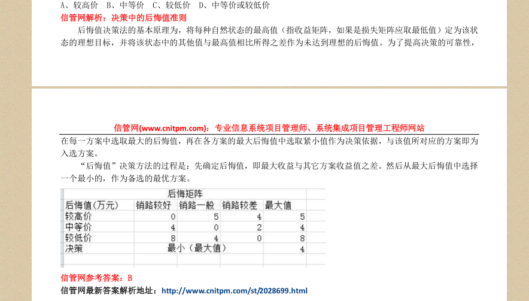
>
> 

### 类型5：流量问题 

> 下图标出了某产品从产地Vs到销地Vt的运输网，剪线上的数字表示这条输线的最大通过能力（流量）（单位：万吨/小时）。产品经过该运输网从Vs到Vt的最大运输能力可以达到（）万吨/小时。
> 
> A、5
> B、6
> C、7
> D、8
>
> 答案：A
>
> 2+3 = 5
>
> 解题思路：
>
> 解题时，每找出一条路径算出流量后，该路径上个段线路上的流量应扣除已经算过的流量，形成剩余流量。剩余流量为0的线路应将其删除（断开）
>
> 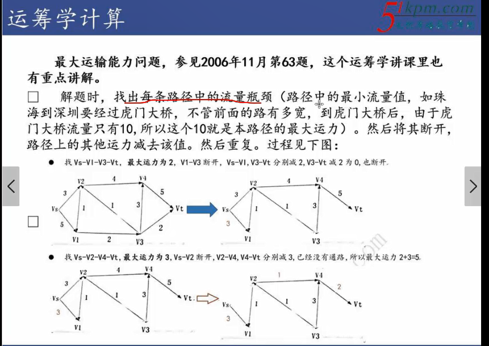

### 类型6：伏格尔方法解传输运输学问题 

伏格尔方法主旨：最大差额处，优先按最小运价进行调运

> 某公司从三个产地A1,A2,A3将物品运送地个销地B1,B2,B3,B4各产地的产量,各销地的销量和各产地运往各销地每件物品的运费如表所示.
> 问：应如何调运,可使得总运输费最小?
> 销地 B1 B2 B3 B4 产量产地
> A1 3 11 3 10 7
> A2 1 9 2 8 4
> A3 7 4 10 5 9
> 销量 3 6 5 6 20
>
> 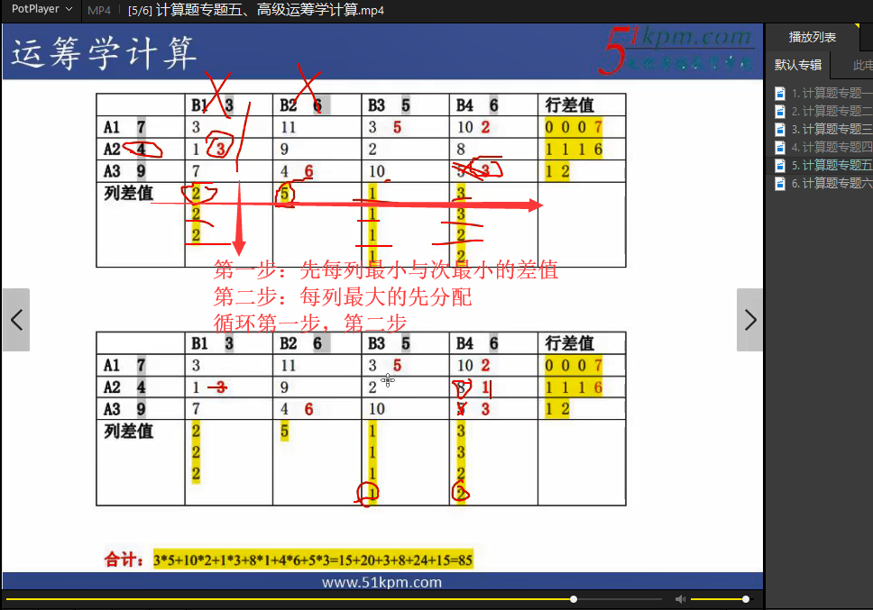
>
>  
>
> 两家工厂A1和A2向三个零售店B1、B2和B3供应某种商品。A1和A2可供应的商品件数是200和300，而B1、B2和B3的需求量是100件、200件和50件。各工厂和零售店之间可以进行转运。如果运输的单位成本如下所示(例如:表中第4列第3行的数字“5”表示将一件商品从A2运到B1的成本):
>
> 
>
> 在最优的转运安排中，满足各零售商品需求的运输总成本是（67）
> A、1750     
> B、1550    
> C、1350     
> D、850
>
> 试题答案：B
>
> 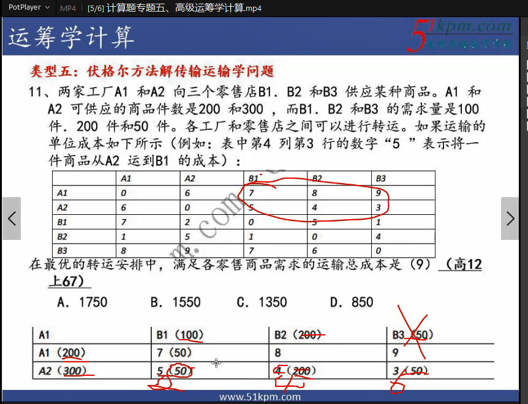
>
> 
>
> 某部门有3个生产同类产品的工厂（产地），生产的产品由4个销售点（销地）出售，各工厂的生产量（单位：吨）、各销售点的销售量（单位：吨）以及各工厂到各销售点的单位运价（百元/吨）示于表4中。
> 
> 适当安排调运方案，最小总运费为（ ）
> A、450
> B、455
> C、460
> D、465
>
> 答案：C

### 类型7：车床铣床最短时间安排 

> 某车间需要用一台车床和一台铣床加工A、B、C、D4个零件。每个零件都需要先用车床加工，再用铣床加工。车床与铣床加工每个零件所需的工时(包括加工前的准备时间及加工后的处理时间)如表5-3所示。
>
> .jpg)
>
> 若以A、B、C、D零件顺序安排加工，则共需29小时。适当调整零件加/12JK匝序，可产生不同实施方案。在各种实施方案中，完成4个零件加工至少共需(69)小时。
>
> A．25
>
> B．26
>
> C．27
>
> D．28
>
> 答案：B
>
>  解题思路：
>
> 第一步：将车床耗时最短的活动放在车床工作的第一位
>
> 第二步：将铣床耗时最短的活动放在铣床工作的倒数一位
>
> 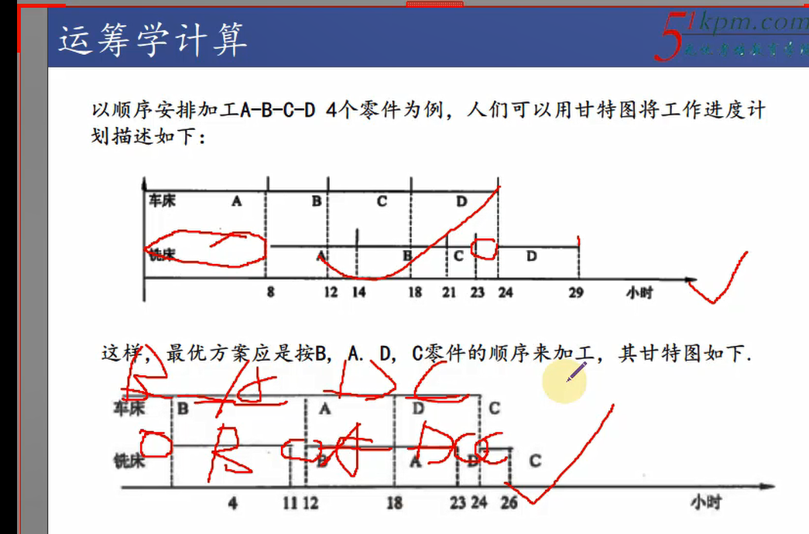
>
> 
>
> 某企业计划研发甲、乙、丙、丁四种产品。每种产品必须依次由设计部门、制造部门和检验部门进行设计、制造和检验，而每个部门必须按同样的顺序处理这几种产品。各种产品各项工作所需的时间如下表： 
> 
> 只要适当安排好产品研究顺序，企业最快可以在（）天全部完成这四种产品的研发
> A、84
> B、86
> C、91
> D、93
>
> 答案：A
>
> 第一步：设计中最短的是丁
>
> 第二步：最后一个处理流程检验中最短的是丙
>
> 那么就是丁、甲、乙、丙
>
> 或者丁、乙、甲、丙
>
> 第三步：画图
>
> 取最小值

### 类型8：人员分配问题 

> 某项目有Ⅰ、Ⅱ、Ⅲ、Ⅳ四项不同任务，恰有甲、乙、丙、丁四个人去完成各项不同的任务．由于任务性质及每人的技术水平不同，他们完成各项任务所需时间也不同，具体如下表所示
> 
> 项目要求每个人只能完成一项任务，为了使项目花费的总时间最短，应该指派丁完成（67）任务。
> A．Ⅰ         
> B．Ⅱ         
> C．Ⅲ          
> D．Ⅳ
>
> 答案：C
>
> 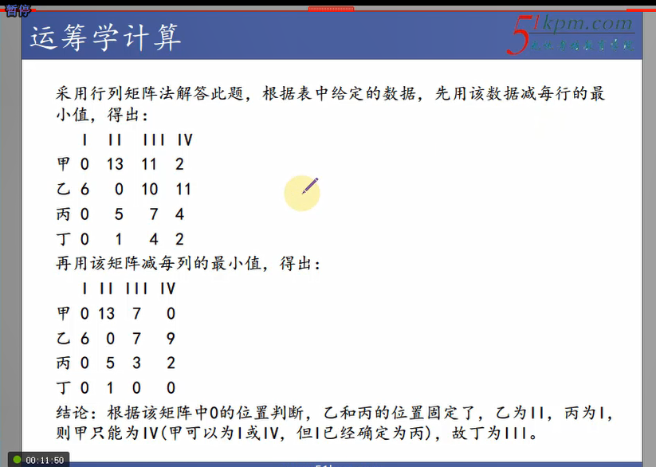

> 某省6个城市(A-F)之间的网络通信线路(每条通信线路旁标注了其长度公里数)如图1-4所示。如果要将部分千兆通信线路改造成万兆通信线路，以提升各个城市网络之间的通信容量，则至少要改造总计(1)公里的通信线路，这种总公里数最少的改造方案共有(2)个。
>
> 
> (1)A.1000
> ​     B.1300
> ​     C.1600
> ​     D.2000
> (2)A.1
> ​     B.2
> ​     C.3
> ​     D.4
>
> 答案：B、C
>
> （2）AB、BF、AF，3选2，所以有3种方案
>
> 解答技巧：
>
> 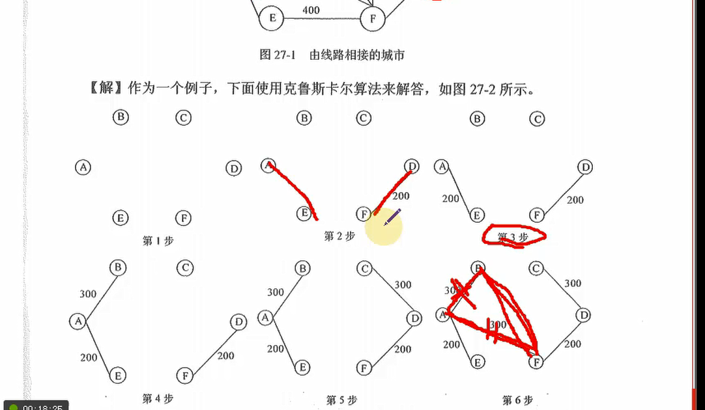
>
> 

### 类型9：概率题 

> 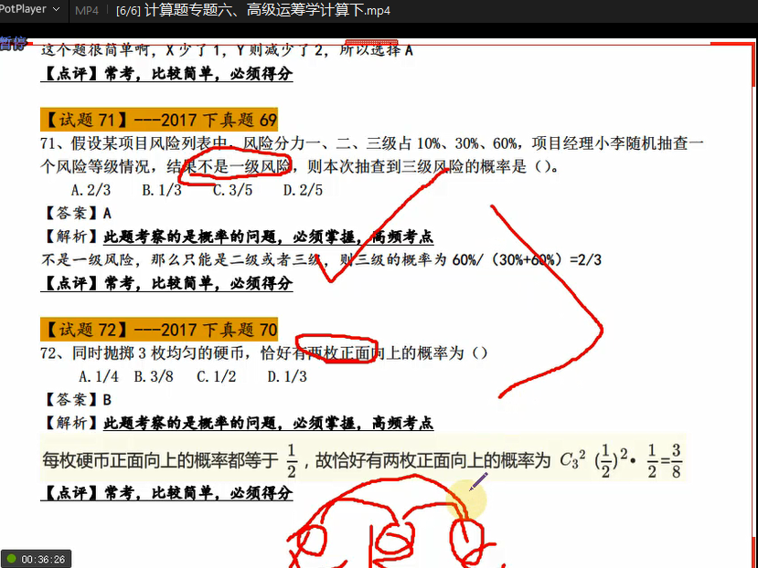
>
> 

# 项目管理基础 

项目的具体特点：

- 临时性
- 独特性
- 渐进明细

项目目标需遵循smart原则：

- 目标明确
- 目标可度量
- 目标可实现
- 目标与工作相关
- 有时间限制

## 软件开发模型 

- 瀑布模型
  - 适用于需求比较稳定，很少需变更的项目
  - 采用的是结构化分析与设计方法
  - 优点
    - 阶段划分清晰
    - 各阶段人员职责规范、明确
    - 便于前后活动的衔接，有利于活动的重用和管理
  - 缺点
    - 缺乏灵活性或风险分析
    - 无法解决需求不明确或不准确问题
- 快速原型
  - 用于解决需求不明确情况
- 螺旋模型
  - 是瀑布模型和快速原型的结合，每次迭代的活动依次为制定计划、风险分析、实施工程、客户评估
  - 适用于大型复杂系统
- 演化模型

  - 适用于对软件需求缺乏准确认识情况
- 增量模型

  - 引入了增量包
- 喷泉模型

  - 用于描述面向对象的软件开发过程
- V模型
  - 适用于需求明确，变更不频繁的项目

## 项目流程 

### 甲方 

- 初步需求
- 编写项目申请书
- 可行性研究
- 项目论证
- 项目评估
- 获得批复
- 发布招标文件

### 乙方 

- 看到招标文件
- 做识别、可行性研究、论证、评估
- 决定投标
- 中标
- 甲乙双方鉴定合同

## 项目管理过程组

（5个过程组、9个项目管理领域、44个项目管理过程）

- 5个过程组
  - 启动过程组（2个）
    - 制定项目章程（并确定项目经理）
    - （制定初步项目范围说明书）（识别干系人）
  - 规划过程组（21个）
    - 制定项目管理计划
    - 编制项目范围管理计划
    - 范围定义
    - 创建工作分解结构
    - 活动定义
    - 活动排序
    - 活动资源估算
    - 活动历时估算
    - 制定进度计划
    - 成本估算
    - 成本预算
    - 制定项目质量管理计划
    - 制定人力资源管理计划
    - 制定沟通管理计划
    - 制定风险管理计划
    - 风险识别
    - 风险定性分析
    - 风险定量分析
    - 制定风险应对计划
    - 制定采购管理计划
    - 编制合同
  - 执行过程组（7个）
    - 指导与管理项目执行
    - 执行质量保证
    - 团队组建
    - 信息发布
    - 团队建设
    - 询价
    - 供方选择
  - 监督过程组（12个）
    - 监督和控制工作
    - 整体变更控制
    - 范围确认
    - 范围变更控制
    - 进度控制
    - 成本控制
    - 质量控制
    - 管理项目团队
    - 绩效报告
    - 管理项目干系人
    - 风险监督和控制
    - 合同管理
  - 收尾过程组（2个）
    - 项目收尾
    - 合同收尾
- 9个项目管理领域
  - 核心：质量、成本、范围、进度
  - 辅助：风险、人力、采购、沟通
  - 贯穿：整体管理

# 项目立项管理

（项目可行性分析是立项前的重要工作）

## 可行性研究

### 初步可行性研究

可行性研究报告可作为正式的文献供决策参考；

也可根据项目的初步可行性研究报告形成项目建议书，通过审查项目建议书决定项目的取舍，即通常所称的“立项”决策。

### 详细可行性研究

投资前时间有四个阶段：机会研究、初步可行性研究、**详细可行性研究**（必不可缺的）、评估与决策。

详细可行性研究的方法：

- 经济评价法
- 市场预测法
- 投资估算法（包括：指数估算法、因子估算法、单位能力投资估算法）
- 增量净效益法

详细可行性研究的内容：（9个内容）

- 概述：提出项目开发的背景、必要性、经济意义等
- 需求确定：调查客户需求，技术分析，确定项目规模、目标、产品、方案、发展方向等
- 现有资源、设施情况分析
- 设计（初步）技术方案
- 项目实施进度计划建议
- 投资估算和资金筹措计划
- 项目组织、人力资源、技术培训计划
- 经济和社会效益分析（效果评价）
- 合作/协作方式

### 效益的预测与评估

> 直接效益和间接效益
>
> 经济效益和社会效益
>
> 近期效益和远期效益
>
> 显性效益和隐形效益
>
> 微观效益和宏观效益

> 效益量化及计算的六种方法：
>
> 函数求解法、相关关系法、模糊数字法、专家意见法（德尔菲法）、成本降低法、利润增加法

## 项目评估与论证

### 项目论证

“先论证，后决策”。项目论证应该围绕市场需求、开发技术、财务经济三个方面展开调查和分析。市场是前提，技术是手段，财务经济是核心。

项目论证的作用：

- **是确定项目是否实施的依据**
- **是筹措资金、向银行贷款的依据**
- **是编制计划、设计、采购、施工以及机构设备、资源配置的依据**
- **是防范风险、提高项目效率的重要保证**
- 项目论证一般分为以下三个阶段：机会研究、初步可行性研究、详细可行性研究。

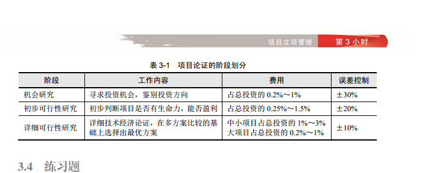

> 项目论证的七个主要步骤：
>
> - 明确项目范围和业主目标
> - 收集并分析相关资料
> - 拟定多种可行的、能够相互替代的实施方案
> - 多方案分析、比较。
> - 选择最优方案，进一步详细全面地论证
> - 编制项目论证报告、环境影响报告书和采购方式审批报告
> - 编制资金筹措计划和项目实施进度计划

### 项目评估

项目评估指在项目可行性研究的基础上，由**第三方（国家、银行或有关机构）**进行的评估过程。其目的是审查项目可行性研究的可靠性、真实性和客观性，**为银行的贷款决策或行政主管部门的审批决策提供科学依据。**

> 评估依据：
>
> - 项目建议书及其批准文件
> - 项目可行性研究报告
> - 报送单位的申请报告及主管部门的初审意见
> - 有关资源、配件、燃料、水、电、资金等方面的协议文件
> - 必须的其它文件和资料

## 立项管理内容

### 项目建议书（又称立项申请）

是**项目建设单位向上级主管部门**提交项目申请时所必须的文件，是该**项目建设单位或项目法人**，提出的某一具体项目的建议文件，是对拟建项目提出的框架性的总体设想。

**项目建议书的内容：**（4个内容）

- 项目必要性
- 项目的市场预测
- 产品方案或服务的市场预测
- 项目建设必需条件

### 可行性研究的内容（7个内容）

- 投资必要性
- 技术可行性
- 财务可行性
- 组织可行性
- 经济可行性
- 社会可行性
- 风险因素及对策

### 项目招投标

#### 招标（公开招标、邀请招标、议标等）

- 公开招标：指招标人以**招标公告**的方式邀请**不特定**的法人或者其它组织投标。
- 邀请招标：指招标人以**投标邀请书**的方式邀请**特定**的法人或者其它组织投标

在招标文件要求提交投标文件截止时间**至少15日前**，招标人可以**以书面形式**对已发出的招标文件进行必要的澄清或者修改。该澄清或者修改的内容是招标文件的组成部分。

依法必须进行招标的项目，自招标文件开始发出之日起至提交投标文件截止之日止，**最短不得少于20日**。

##### **政府采购**

- 采购方式
  - **公开招标（主要采购方式）**
  - 邀请招标
  - 竞争性谈判
  - 单一来源

- 政府采购实行集中采购和分散采购相结合
- 国务院政府采购监督管理部门认定的其它采购方式采购、询价

#### 投标

**招标文件是要约邀请；投标文件是要约；中标通知书是承诺**

> 为防止投标人在投标后撤标或在中标后拒不签订合同，招标人通常要求投标人提供一定比例或金额的投标保证金
>
> 投标保证金 ≤ 2%；履约保证金 ≤ 10**%**

**投标人少于三个的，招标人应当依照本法重新招标**

> 在招标文件要求提交投标文件的截止时间后送达的投标文件， 招标人应当拒收。
>
> 以邮寄方式送达的， 投标人必须留出邮寄时间， 保证投标文件能够在截止日期之前送达招标人指定的地点，而不是以邮戳为准。
>
>  在截止时间后送达的投标文件， 即已经过了招标有效期的， 招标人应当原封退回， 不得进入开标阶段

#### 开标 

- 开标应当在招标文件确定的提交招标文件截止时间同一时间公开进行
- 开标由招标人支持、邀请所有投标人参加

#### 评标

评标委员会由具有高级职称或同等专业水平的技术、经济等相关领域**专家、招标人和招标机构代表**等**5人以上单数**组成。其中**技术、经济等方面专家人数不得少于成员总数的三分之二**。

评标委员会成员名单在评标结束公示前必须保密。

#### 选定承建方

中标人的投标应当符合下列条件之一：

- **能最大限度地满足招标文件中规定的各项综合评价标准**
- **能满足招标文件的实质性要求，并且经评审的投标价格最低；但是投标价格低于成本的除外**。

招标人和中标人应当自中标通知书发出之日起**30日内**，按照招标文件和中标人的投标文件**订立书面合同**。招标人和中标人不得再订立背离合同实质性内容的其它协议。

依法必须进行招标的项目，**招标人应当自确定中标人之日起15天内**，向有关行政监督部门提交招标情况的书面报告（政府采购法规定，政府采购规定自签订后7日内）

# 项目整体管理

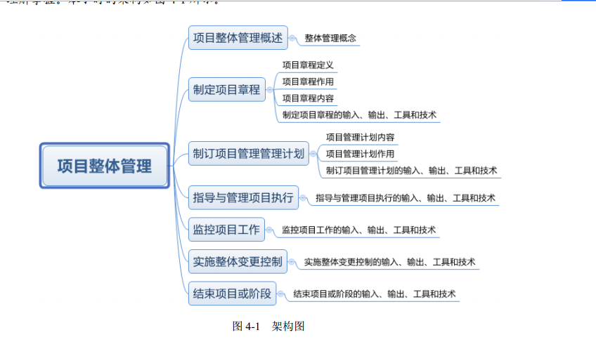

## 制定项目章程

项目章程是正式批准项目的文件。项目经理最好是在制定项目章程时被委派。项目经理应该参与制定项目章程。（以一般在开始制定项目计划前任命项目经理）

项目章程的批准，标志着项目的正式启动。

项目由项目以外的人员批准，如发起人、项目管理办公室或项目组合指导委员会。

项目章程的内容：（10个内容）

- 项目目的或批准项目的原因
- 可测量的项目目标和相关的成功标准
- 项目的总体要求
- 概括性的项目描述
- 项目的主要风险
- 总体里程碑进度计划
- 总体预算
- 项目审批要求（用什么标准评价项目成功，由谁对项目成功下结论，由谁来签署项目结束）
- 委派的项目经理及其职责和职权
- 发起人或其他批准项目章程的人员姓名和职权

工作说明书：是对应由项目提供的产品或服务的文字说明。（对于内部项目，项目发起人或赞助人根据业务需求、产品或服务要求提供一份工作说明书。对于外部项目，工作说明书属于顾客招标文件的一部分，如建议邀请书、信息请求、招标邀请书或合同中的一部分）

工作说明书指明如下事项：

- 业务需求：组织的业务需求可能基于培训需求、市场需求、技术进步、法律要求或政府标准

- 产品范围说明书：是项目创造的产品或服务要求与特征的文件

- 战略计划：所有的项目都应支持组织的战略目标

  

协议：合同、意向书、邮件、协议书等

事业环境因素：组织结构、行业标准、基础设施、现有的人力资源、人事管理、公司制度、市场情况、商业数据库（如标准的成本估算数据、行业风险研究信息与风险数据库）、项目管理信息系统

组织过程资产：组织过程资产反映了组织从以前项目中吸取是教训和学习到的知识，如完成的进度表，风险数据和实现价值数据。可以归纳为两类：①组织进行工作的过程与程序；②组织整体信息存储检索知识库。

引导技术：头脑风暴、冲突管理、问题解决、会议管理

项目财务价值评价方法：

- 净现值分析：把所有预期的未来现金流入和流出都折算成现值，以计算一个项目预期的净货币收益与损失。

- 投资收益率分析（ROI）：是将净收入除以投资额的所得值。ROI越大越好。

  投资收益率 = （总的折现收益 - 总的折现成本）/ 折现成本

- 投资回收期分析：就是以净现金流入补偿净投资所用的时间。投资回收期越短越好。

项目启动会议是一个项目的开始，一般由项目经理负责组织和召开。

项目目标包括**成果性目标和约束性目标** 。具有如下特性：项目的目标有不同的优先级；项目目标具有层次性；

## 制订项目管理计划

一份项目管理计划一般包括项目范围管理计划、进度管理计划、成本管理计划、质量管理计划、过程改进计划、人员配备管理计划、沟通管理计划、风险管理计划、采购管理计划等。

项目管理计划记录了计划过程组的各个计划子过程的全部成果。

配置管理系统和变更控制系统是项目管理信息系统的子系统。

项目计划编制工作流程：（8个流程）

- 明确目标
- 成立初步的项目团队
- 工作准备与信息收集
- 根据模板、标准编写初步的概要的项目计划
- 把上述计划纳入项目计划，然后对项目计划进行综合平衡、优化
- 项目经理负责组织编写项目计划
- 评审与批准项目计划
- 获得批准后的项目计划就是项目的基准计划

## 指导与管理项目执行

指导与管理项目执行过程要求项目经理和项目团队采取多种行动执行项目管理计划，完成
项目范围说明书中明确的工作。

需要更新的项目文件可能有：需求文件、项目日志、风险登记册、干系人登记册等。

## 监控项目工作

## 实施整体变更控制

## 结束项目或阶段

项目收尾包括：合同收尾和管理收尾

# 项目范围管理

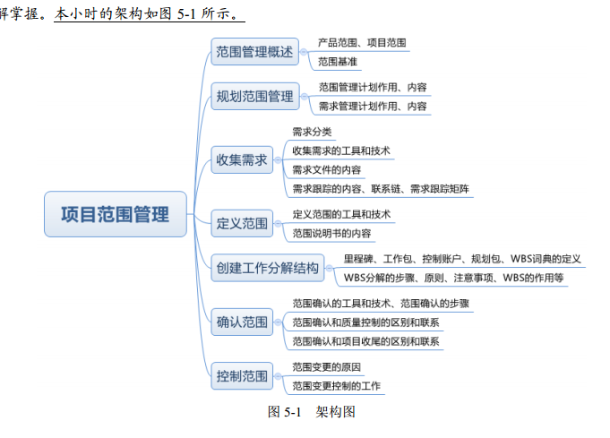

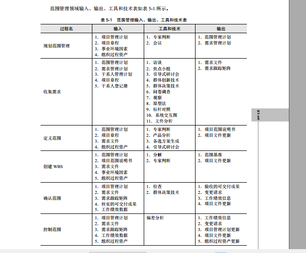

> 项目范围管理就是要做范围内的事，而且只做范围内的事，既不少做也不多做。项目范围管理需要做的工作：明确项目边界；对项目执行工作进行监控；防止项目范围发生蔓延。
>
> 产品范围是指产品或服务所应包含的功能，项目范围是指为了能够交付产品，项目所必须做的工作。
>
> 判断项目范围是否完成，要以范围基准来衡量；
>
> 而产品范围是否完成，则根据产品是否满足了产品描述来判断。
>
> **项目的范围基准是经过批准的项目范围说明书、WBS、WBS词典**

## 规划范围管理

范围管理计划是制定项目管理计划过程和其它范围管理过程的主要输入，内容：

- 如何制定项目范围说明书
- 如何根据范围说明书创建WBS
- 如何维护和批准WBS
- 如何确认和正式验收已完成的项目可交付成果
- 如何处理项目范围说明书的变更，该工作与实施整体变更控制过程直接相联

## 收集需求

>  德尔菲技术：经过多次综合各专家的观点，最终形成一个各专家都认可的方案。

> 收集需求过程的主要输出：需求文件、需求跟踪矩阵
>
> 需求文件描述各种单一的需求将如何满足于项目相关的业务需求。

> 需求管理的主要目的是确保各方对需求的一致理解、管理和控制需求的变更，从需求到最终产品的双向跟踪。对待变更的态度是将变更置于合理、规范的管理之下，而不是一味地减少变更。

> 需求跟踪矩阵可以跟踪一个需求使用期限的全过程，即从需求源到实现的前后生存期。

>需求工程的活动的5个独立阶段：
>
>- 需求获取：通过与用户的交流，对现有系统的观察及对任务进行分析，从而开发、捕获、修订用户的需求
>- 需求建模：为最终用户所看到的系统建立一个概念模型，作为对需求的抽象描述，并尽可能多捕获现实世界的语义
>- 形成需求规格：生成需求模型构件的精确的形式化的描述，作为用户和开发者之间的一个协约
>- 需求验证：以需求规格说明为输入，通过符号执行，模拟或快速原型等途径，分析需求规格的正确性和可执行性
>- 需求管理：支持系统的需求演进，如需求变化和可跟踪性问题。

- 业务需求
  - 组织或客户对系统、产品高层次的目标
- 用户需求
  - 用户的目标，或用户要求系统必须要完成的任务
- 功能需求
  - 开发人员必须完成的软件功能
- 系统需求
  - 包含多个子系统的产品的顶级需求

## 定义范围

项目范围说明书内容：

- 产品范围描述
- 验收标准。定义可交付成果通过验收前必须满足的一系列条件，及验收的过程
- 可交付成果
- 项目的除外责任。通常需要识别出什么是被排除在项目之外的，明确说明哪些内容不属于项目范围，有助于管理干系人的期望
- 制约因素。列出并说明与项目范围有关且限制项目团队选择的具体项目制约因素
- 假设条件

项目范围说明书作用：

- 确定范围
- 沟通基础
- 规划和控制依据
- 变更基础
- 规划基础

## 创建工作分解结构（WBS）

创建WBS是将项目可交付成果和项目工作分解成较小的，更易于管理的组件的过程，其主要作用是对所要交付的内容提供一个结构化的视图。

里程碑标志着某个可交付成果或者阶段的正式完成。重要的检查点是里程碑、重要的里程碑是基线。

工作包是位于WBS每条分支最底层的可交付成果或项目工作组成部分，工作包应该非常具体，以便承担者能明确自己的任务、努力的目标和承担的责任。工作包的大小需要遵循8/80原则。

创建WBS过程的工具和技术主要有分解和专家判断，要将整个项目工作分解为工作包，通常开展以下活动：

* 识别和分析可交付成果及相关工作
* 确定WBS的结构和编排方法（WBS只能一个人负责）
* 自上而下逐层细化分解
* 为WBS组件制定和分配标识编码
* 核实可交付成果分解的程度是适当的

在进行WBS分解时，可有如下三种方式：

- 将项目生命周期的各阶段作为分解的第二层
- 主要可交付成果作为分解的第二层
- 子项目作为分解的第二层

WBS表示形式：

- 分级的树型结构（适用于中小型项目）
- 表格形式（适用于大型项目）

## 确认范围

确认范围是正式验收项目已完成的可交付成果的过程，其主要作用是使验收过程具有客观性，同时，通过验收每个可交付成果，提高最终产品、服务或成果获得验收的可能性。确认范围包括与客户或发起人一起审查可交付成果，确保可交付成果已圆满完成，并获得客户或发起人的正式验收。

确认范围的主要工具和技术：检查和群体决策技术。

**确认范围强调验收项目可交付成果，项目收尾强调验收产品。**

## 控制范围

> 范围变更控制的主要工作：
>
> - 影响导致范围变更的因素，并尽量使这些因素向有利的方面发展
> - 判断范围变更是否已经发生
> - 范围变更发生时管理实际的变更，确保所有被请求的变更按照项目整体变更控制过程处理

# 项目进度管理

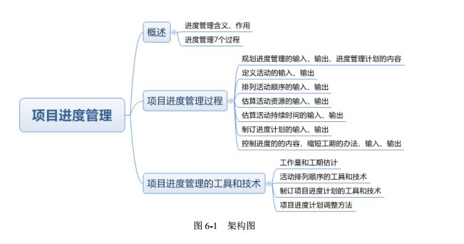

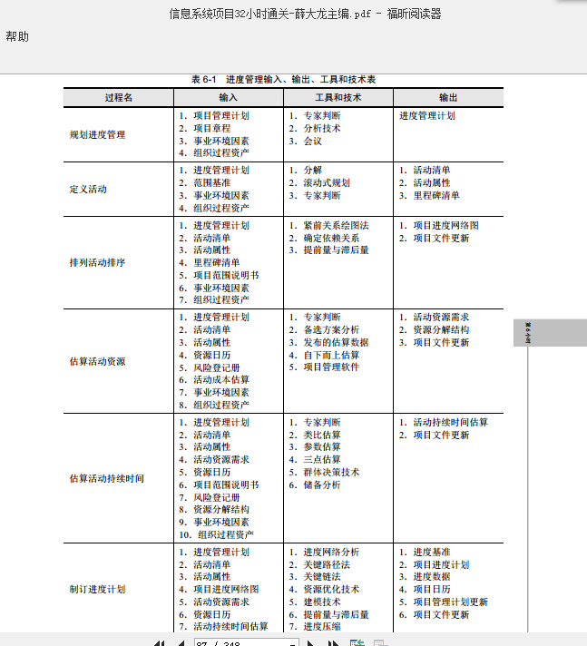

## 规划进度管理

## 定义活动

## 排序活动

## 估算活动资源

## 估算活动持续时间

## 制定进度计划

## 控制进度

**缩短活动的工期方法：（6个方法）**

- 赶工，投入更多的资源或增加工作时间，以缩短关键活动的工期
- 快速跟进，并行施工，以缩短关键路径的长度
- 使用高素质的资源或经验更丰富的人员
- 减小活动范围或降低活动要求
- 改进方法或技术，以提高生产效率
- 加强质量管理，及时发现问题，减少返工，从而缩短工期

> 储备分析：在进行工作量或工期估算时，需考虑应急储备，并将其纳入项目进度计划中，用来应对进度方面的不确定性。
>
> **应急储备：应对“已知--未知”风险（包括在进度基准中）**（项目经理可自由使用）
>
> **管理储备：应对“未知--未知”风险（不包括在进度基准中）** （使用需批准）

> 前导图：用于编制项目进度网络图的一种方法。包括活动之间存在的4种类型的依赖关系：
>
> - 结束-开始（F-S）
> - 结束-结束（F-F）
> - 开始-开始（S-S）
> - 开始-结束（S-F）
>
> 每个结点的活动会有如下几个时间：
>
> - 最早开始时间（ES）
> - 最早结束时间（EF）
>
> EF = ES+工期
>
> - 最迟结束时间（LF）
> - 最迟开始时间（LS）
>
> LS = LF - 工期
>
> 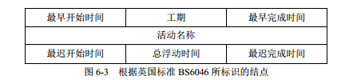

>箭线图：用箭线表示活动、结点表示事件的一种网络图绘制方法（又叫双代号网络图）
>
>虚活动：虚活动不消耗时间，也不消耗资源，只是为了弥补箭线图在表达活动依赖关系方面的不足。

> 关键链法：是一种进度规划方法，允许项目团队在任何项目进度路径上设置缓冲，以应对资源限度和项目的不确定性。
>
> 项目缓冲：放置在关键链末端的缓冲，用来保证项目不因关键链的延误而延误
>
> 接驳缓冲：放置非关键链与关键链的接合点，用来保护关键链不受非关键链延误的影响
>
> 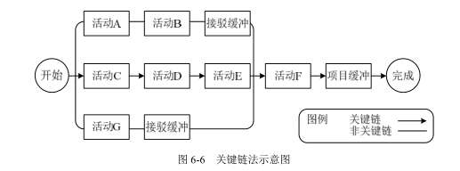
>
> 

> 资源优化技术：根据资源供需情况，来调整进度模型的技术，包括：
>
> - 资源平衡（可能关键路径延长）
> - 资源平滑（可能无法实现所有资源的优化）（不能够改变关键路径）

**进度压缩技术：**

指在不缩减项目范围的前提下缩短进度工期，以满足进度制约因素、强制日期或其他进度目标。技术包括：

- 赶工。通过增加资源，以最小的成本增加来压缩进度工期的一种方法
- 快速跟进。将正常情况下按顺序进行的活动或阶段改为至少是部分并行开展。快速跟进可能造成返工和风险增加。它只适用于能够通过并行活动来缩短项目工期的情况。

**计划评审技术（PERT），又称为三点估算** ：（常用于评价项目进度风险）

- 乐观时间T1：任何事情都按顺序的情况下，完成某项工作的时间
- 最可能时间T2：正常情况下，完成某项工作的时间
- 悲观时间T3：最不利的情况下，完成某项工作的时间
- 期望时间T4 ：我们期望的时间

**期望时间 = （乐观时间+4 x 最可能时间+悲观时间）/6**

标准差 = （悲观时间-乐观时间）/ 6

还要会算在某一个时间段内工作（活动）完成的概率，面积法：

±1 个 δ 的面积为 68%（图中-1SD～1SD 区域面积）；
±2 个 δ 的面积为 95%（图中-2SD～2SD 区域面积）；
±3 个 δ 的面积为 99%（图中-3SD～3SD 区域面积）；

另外，在期望时间内完成的概率为 50%。

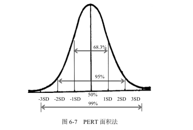

> 例子：
>
> 4．完成某信息系统集成项目中的一个最基本的工作单元 A 所需的时间，乐观的估计需 8 天，
> 悲观的估计需 38 天，最可能的估计需 20 天，按照 PERT 方法进行估算，项目的工期应该为 （1） ，
> 在 26 天以后完成的概率大致为 （2） 。
> （1）A．20  B．21 C．22 D．23
> （2）A．8.9%  B．15.9%  C．22.2% D．28.6%
>
> 解析：用 PERT 法，估算活动的工期=（乐观估算+4×最可能估算+悲观估算）/6=21
> 标准差=（悲观估算-乐观估算）/6=5
> 21 到 26 之间为 1 个标准差，16 到 26 之间为±1 个标准差。按正态分布规律，±1 个标准差的
> 分布概率为 68.26%，也就是说，16 天到 26 天之间完成的概率为 68.26%，21 天到 26 天之间完成
> 的概率为 68.26%的一半也就是 34.13%，则 26 天之后完成的概率=1-50%-34.13%=15.87%
>
> 答案：B B

> 易错题：
>
> 9．某项目包括的活动情况如下表所示。
> 活动  持续时间/天  活动  持续时间/天  活动  持续时间/天
> A  4  B  3  C  4
> D  2  E  3  F  4
> 活动 D 和活动 F 只能在活动 C 结束后开始，活动 A 和活动 B 可以在活动 C 开始后的任何时间
> 开始，但是必须在项目结束前完成。活动 E 只能在活动 D 完成后开始，活动 B 是在活动 C 开始 1
> 天后才开始的，在活动 B 的过程中发生了意外事件，导致活动 B 延期 2 天，为了确保项目按时完
> 成应（ ）
> A．为活动 B 添加更多资源  B．不需要采取任何措施
> C．为关键路径上的任务重新分配资源  D．为活动 D 添加更多的资源
>
> 解析：B 只要在项目结束前完成就可以，D 要 C 结束才能开始，而 E 要 D 结束才能开始，也
> 就是工期至少需要 9 天，而 B 工期是 3 天，即使延期 2 天，算工期 5 天，C 开始 1 天后开始 B，这
> 样 B 也可以在第 6 天完成，对工期没有影响，可不采取任何措施。
> 答案：B

# 项目成本管理 

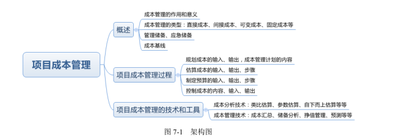

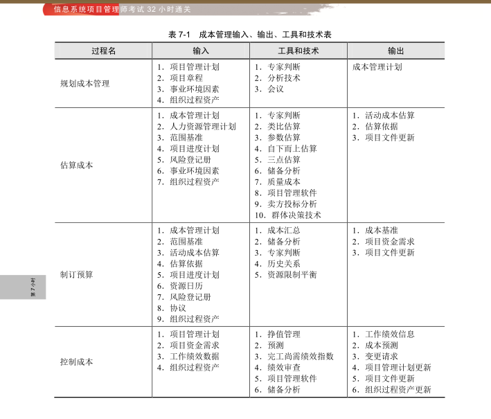

成本的类型：

- **直接成本**：直接可以归属于项目工作的成本为直接成本。如**项目团队差率费、工资、项目使用的物料及设备使用费等（项目经理可控制）** 
- **间接成本**：来自一般管理费用科目或几个项目共同担负的项目成本所分摊给本项目的费用。**如税金、额外福利和保卫费用等（项目经理不可控制）** 
- 可变成本：随着生产量、工作量或时间而变的成本为可变成本。又称为变动成本
- 固定成本：不随生产量、工作量或时间而变的非重复成本为固定成本
- 机会成本：是利用一定的时间或资源生产一种商品时，而失去的利用这些资源生产其他最佳替代品的机会。泛指做出选择后其中一个最大的损失
- 沉没成本：是由于过去的决策已经发生了，而不能由现在或将来的任何决策改变的成本。沉没成本是一种历史成本，对现有决策而言是不可控成本，在投资决策时应排除沉没成本的干扰（过去已经花掉了的钱）

**应急储备和管理储备**

- **应急储备：应对“已知--未知”风险（包括在成本基准中）（使用前不需要得到高层管理者审批）** 

- **管理储备：应对“未知--未知”风险（不包括在成本基准中）（使用前需要得到高层管理者审批）** 

  最大资金需求和成本基本末端值的差异就是管理储备

  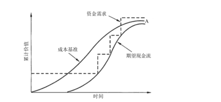

  

  

## 规划成本

## 估算成本 

## 控制预算 

项目预算包括经批准用于项目的全部资金。

成本基准是经过批准且按时间段分配的项目预算，**但不包括管理储备** （成本基准是不同进度活动经批准的预算的总和）（一个项目只有一个成本基准，当然，随着项目的实施，该基准可能被更新）

## 控制成本 

### 成本分析技术 

- 类比估算：在项目详细信息不足时（准确性较低，耗时较少、成本较低）

- 参数估算：利用历史数据之间的统计关系和其他变量（如建筑施工中的平方英尺）进行项目工作的成本估算。（参数估算的准确性取决于参数模型的成熟度和基础数据的可靠性）

- 自下而上估算：（首先对单个工作包或活动的成本进行最具体、细致的估算，然后把这些细节性成本向上汇总或“滚动”到更高层次，用于后续报告和跟踪）（准确性取决于单个活动或工作包的规模和复杂程度）

  > 例子：
  >
  > 5．为了加强预算控制，成本估算建设在 WBS 的（ ）层进行。
  > A．最高  B．最底
  > C．核心  D．第三
  >
  > 解析：成本估算最准确的方法是采用自下而上成本估算法，所以要从 WBS 的最底层开始进行。
  > 最底层就是工作包。

- 三点估算：通过考虑估算中的不确定性与风险。

  - 最乐观成本Co
  - 最可能成本Cm
  - 最悲观成本Cp
  - 贝塔分布： C E = (C o +4 Cm +C p ) /6
  - 三角分布： C E = (C o + C m +C p ) /3 

### 成本管理技术 

- 成本汇总

- 储备分析

- 挣值管理

  - PV（计划值）

  - EV（挣值）

  - AC（实际成本）

  - SV（进度偏差）SV = EV-PV。SV>0，进度超前；SV<0，进度滞后

  - CV（成本偏差）CV = EV-AV。CV>0，成本节约；CV<0，成本超支

  - SPI（进度绩效指数）

  - CPI（成本绩效指数）

  - EAC

  - BAC

    > 例子：
    >
    > 4．某信息系统集成项目的预算为 5050000 元，工期 6 周。某时间点，该项目花费 1550000 元
    > 完成了预计花费 1690000 元的工作，而计划成本是 2110000 元。则该项目的实际成本（ ）。
    > A．低于预算  B．超出预算
    > C．符合预算  D．提供的信息不足，无法判断
    >
    > 解析：AC=1550000，EV=1690000，PV=2110000，CV（成本偏差）=EV-AC＞0，表示成本节约。
    > 答案：A

- 预测

> 自制或外购的决定需要考虑直接成本和间接成本
>
> 成本预算的步骤：
>
> - 将项目总成本分摊到项目工作分解结构的各个工作包。分解按照自顶向下，根据占用资源数量多少而设置不同的分解权重
> - 将各个工作包成本再分配到该工作包所包含的各项活动上
> - 确定各项成本预算支出的时间计划及项目成本预算计划
>
> 成本预算=成本基准+管理储备
>
> （成本基准包含应急储备）

# 项目质量管理 

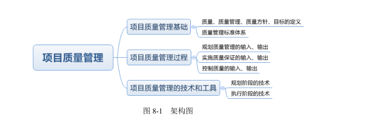

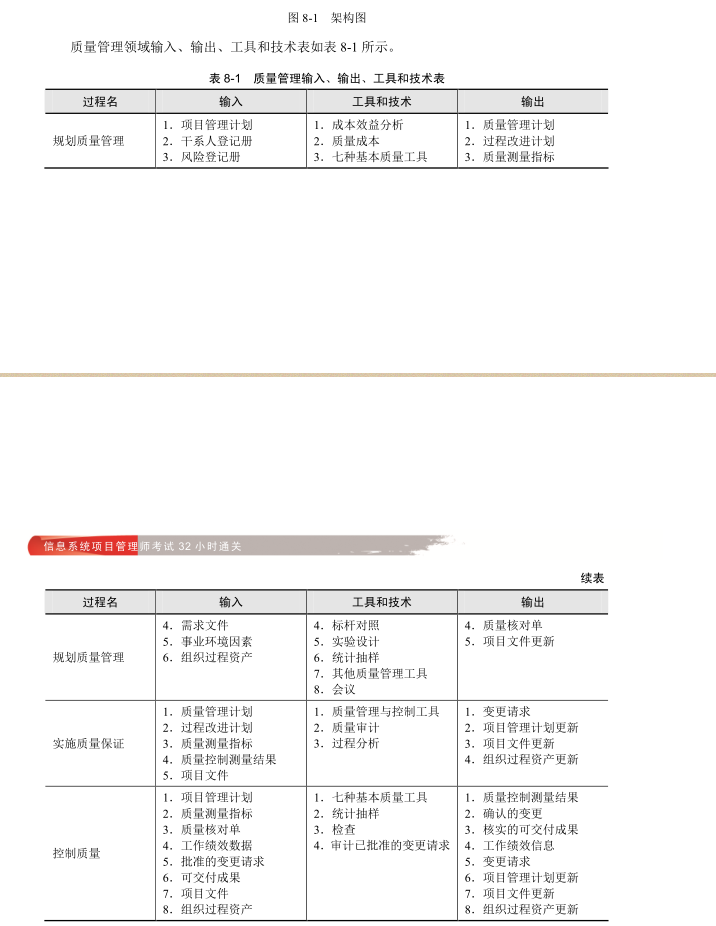

质量方针：“由组织的最高管理者正式发布的该组织总的质量宗旨和方向”

质量目标：“在质量方面所追求的目的”，它是落实质量方针的具体要求

> ISO 9000系列的8项基本原则如下：
>
> - 以顾客为中心
> - 领导作用
> - 全员参与
> - 过程方法
> - 管理的系统方法
> - 持续改进
> - 基于事实的决策方法
> - 与供方互利的关系

> 产品质量可靠性的特征
>
> - 成熟性、容错性、可恢复性

> 管理的技术和工具：
>
> - 成本收益分析法：对每个质量活动进行成本收益分析，就是要比较其可能的成本与预期的收益。
> - 质量成本法：在产品生命周期中发生的所有成本，包括为预防不符合要求、为评价产品或服务是否符合要求，以及因未达到要求而发生的所有成本
> - 标杆对照：将实际或计划的项目实践与可比项目的实践进行对照，以便识别最佳实践，形成改进意见，并为绩效考核提供依据
> - **实验设计：是一种统计方法，用来识别哪些因素会对正在生产的产品或正在开发的流程的特定变量产生影响**
>
>
>
> 1. 头脑风暴
> 2. 力场分析：显示变更的推力和阻力的图形
> 3. 名义小组技术
>
>
>
> - 质量审计（质量保证体系审核）：是对具体质量管理活动的结构性的评审。（对质量保证进行的事后评价）

老七种工具：

- 因果图（鱼骨图、石川图）：用来追溯问题来源，回推到可行动的根本原因
- 帕累托图：用来识别造成大多数问题的少数重要原因。（80/20）
- 核查表：用来收集数据的查对清单
- 流程图：是指任何显示与某系统相关的各要素之间相互关系的示意图
- 直方图
- 控制图：通过上限和下限来进行控制。超过了上下限则说明发生了异常
- 散点图：可以显示两个变量之间是否有关系，两个点越接近对角线，两者关系越紧密

> 例子：
>
> 8． 项目出现了严重的缺陷，项目经理将项目团队和质量工程师召集在一起分析问题，查找原因，大家就此提出了三种不同的看法。此时宜采用 （  ） 工具或方法来确定问题的根本原因。
> A． 流程图 B． 检查 C． 控制图 D． 差异试验
>
> 解析： 流程图：是指任何显示与某系统相关的各要素之间相互关系的示意图。流程图是流经一
> 个系统的信息流、观点流或部件流的图形代表。在企业中，流程图主要用来说明某一过程，这种过
> 程既可以是生产线上的工艺流程，也可以是完成一项任务所必需的管理过程。
> 答案： A
>
> 9． 质量控制的方法、技术和工具有很多，其中（  ） 可以用来分析过程是否稳定，是否发生
> 了异常情况； （  ） 直观地反映了项目中可能出现的问题与各种潜在原因之间的关系。
> （ 1 ） A． 因果图 B． 控制图 C． 散点图 D． 帕累托图
> （ 2） A． 散点图 B． 帕累托图 C． 控制图 D． 鱼骨图
>
> 解析： 控制图是通过上限和下限来进行控制。 在上下限之间是符合要求的，超过了上下限则说明发生了异常现象。鱼骨图可以直观地反映项目中可能出现的问题与各种潜在原因之间的关系。
> 答案： B D
>
> 10． 在项目质量计划编制过程常用的工具和技术中，（  ） 是将实际实施过程中或计划之中的项目做法同其他类似项目的实际做法进行比较，改善与调高项目的质量。
> A． 成本/效益分析 B． 试验设计 C． 质量成本 D． 基准分析
>
> 解析： 基准分析：在项目实际实施过程中或计划之中，以其他类似项目的实际做法作为基准，将二者进行比较，就是基准分析。通过这样的比较来改善与提高目前项目的质量管理，以达到项目作为基准的其他项目可以是执行组织内部的项目，也可以是外部的项目 ；可以是同一个应用领域的项目，也可以是其他应用领域的项目。
> 答案： D

新七种工具：

- 亲和图：主要用事实说话，靠“灵感”，发现新思想，解决新问题
- 过程决策程序图
- 关联图
- 树型图
- 优先矩阵
- 活动网络图
- 矩阵图

## 规划质量管理 

## 实施质量保证 

## 控制质量 

步骤：

- 选择控制对象
- 为控制对象确定标准或目标
- 制定实施计划，确定保证措施
- 按计划执行
- 对项目实施情况进行跟踪监测、检查，并将监测的结果与计划或标准相比较
- 发现并分析偏差
- 根据偏差采取相应对策

# 项目人力资源管理 

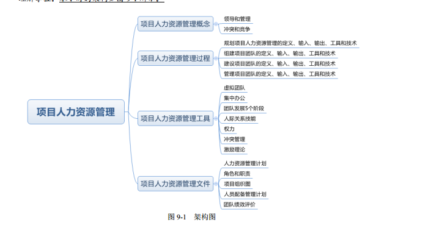

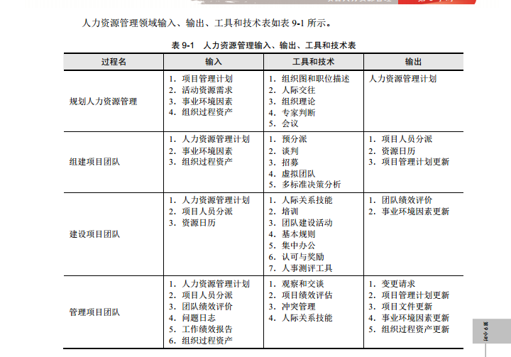

> 虚拟团队：可定义为具有共同目标，在完成角色任务的过程中很少或没有时间面对面工作的一群人。
>
> 优秀团队的5个阶段：
>
> - 形成阶段
> - 震荡阶段
> - 规范阶段
> - 发挥阶段
> - 解散阶段
>
> （不管目前处于什么阶段，增加一个人或减少一个人都要从形成阶段重新开始）

> 人际关系技能有时称为“软技能”，是因富有情商，并熟练掌握沟通技巧、冲突解决方法、谈判技巧、影响技能、团队建设技能和团队引导技能，而具备的行为能力。

> 项目经理的权力有5种来源：
>
> 组织的授权：职位权力、奖罚权力、奖励权力
>
> 管理者自身：专家权力、参照权力

5种冲突解决办法：

- 撤退/回避
- 求同存异/缓和/包容
- 妥协/调解
- 强迫/命令
- 合作/解决问题（最好的解决办法）

**马斯洛需求理论：**

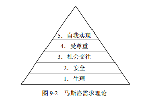

**赫茨伯格双因素理论：**

- 保健因素
- 激励因素（类似于马斯洛的需求层次理论中的**尊重和自我实现**）

**X理论：**

（人天性好逸恶劳）（消极）

**Y理论：**

（人天生并不是好逸恶劳）（积极）

期望理论：

- 目标效价
- 期望值

三类记录团队成员的角色和职责的格式：

- 层级型（可用于规定高层级角色）

  - 工作分解结构
  - 组织分解结构
  - 资源分解结构

- 矩阵型

  - 责任分配矩阵：用来显示分配给每个工作包的项目资源的表格（最直观的表示职责分配的方法）

- 文本型（更适合用于记录详细职责）

  

## 规划人力资源管理 

## 组建项目团队 

## 建设项目团队 

## 管理项目团队 

- 团队管理的方法
  - 观察和交谈
  - 项目绩效报告
  - 冲突管理
  - 问题清单

# 项目沟通管理和干系人管理 

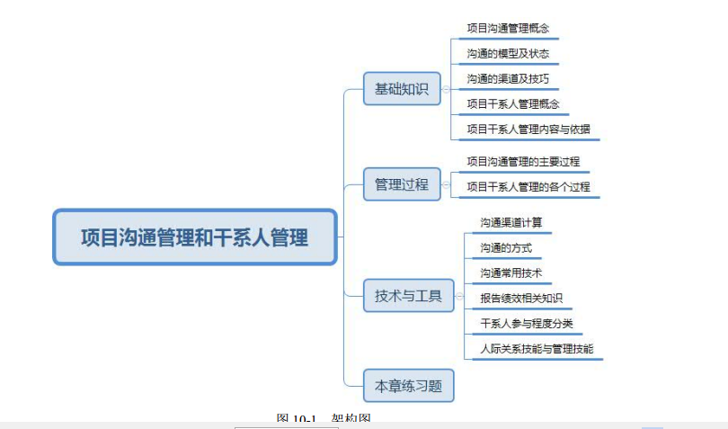

## 项目干系人管理 

项目干系人是指与项目发生利益关系的个人或团队，项目干系人从项目中获利或受损，对项目的开展会有推进或阻碍的影响。

- 项目干系人管理则指对项目干系人需求、希望和期望的识别，并通过沟通上的管理来满足其需要、解决其问题的过程。

- 项目干系人管理的各个过程：

  - 应该把**干系人满意度** 作为一个关键的项目目标来进行管理
  - 管理干系人期望的主要目的是**防止干系人之间产生严重的分歧**
  - 发布信息过程旨在使项目干系人得到相关信息，**会议是重要的沟通方式**

  （从便于管理和节约资源的角度，一个公司的各个项目应该采取统一格式记录信息及传递信息）

- 报告绩效：指收集和发布绩效信息，包括状态报告、进展测量结果和预测结果

  （绩效报告通常需要提供有关范围、进度计划、成本和质量的信息）

  > 例子：
  >
  > 10． 绩效报告一般不包括（  ） 方面的内容。
  > A．项目的进展情况 B．成本支出情况
  > C．项目存在的问题及解决方案 D．感谢沟通需求
  >
  > 解析： 本题考查的是绩效报告的内容。 绩效报告通常需要提供有关范围、进度计划、成本和质量
  > 的信息。很多项目也要求有风险和采购方面的信息。提交的报告需要与进度计划或其他依据相一致。
  > 答案： D

- 权力/利益方格：是根据干系人权力的大小及利益对其分类。

  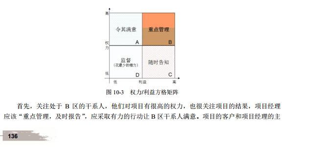

  B：项目的客户和项目经理的主管领导

  A：（争取A区干系人的支持，对项目的成功至关重要）

  C：随时告知，保持及时沟通

  D：（发挥间接作用，争取支持，降低敌意）

- 影响和作用：是根据干系人主动参与（影响）项目的程度及改变项目计划或执行的能力进行分类

## 项目沟通管理

沟通模型：发送方、接收方、消息、媒介

- 项目沟通管理主要过程包括：
  - 规划沟通管理
  - 管理沟通
  - 控制沟通

- 沟通方式：

  - 推拉与交互

  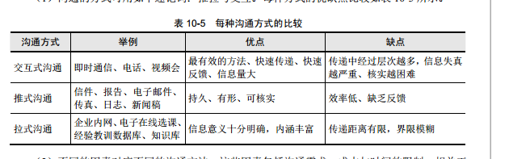

  - 垂直与水平
    - 垂直：从下到上或上到下：沟通信息传播速度快，准确程度高
    - 水平：复杂程度高，往往不受当事人的控制

- 沟通渠道的选择：

  - 从两个维度考虑：
    - 即时性维度
    - 表达方式维度

- 沟通关注的要点：

  - 效果和效率

# 项目风险管理 

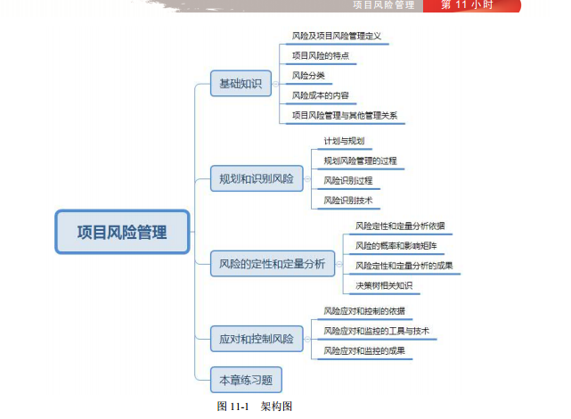

风险是指与项目相关的若干不确定性事件或条件，一旦发生，将会对项目目标的

实现产生正面或负面的影响。

项目风险的特点：

- 由于某一具体风险发生的偶然性和大量风险发生的必然性体现出风险**随机性**的特点；相对于项目主体而言，风险具有**相对性**；因风险的性质和后果的变化，加之出现新风险，构成风险的**可变性**。除此之外，风险还有普遍性和客观性的特点。

  （风险的3个属性：随机性、相对性、可变性）

  相对性体现3个方面：

  - 收益越大，风险承受能力越大
  - 投入越多，风险承受能力越小
  - 地位越高、资源越多，风险承受能力越大

- 人们所能承受项目风险的能力受到**收益和投入大小**、**项目活动主体地位**和**拥有资源**等因素影响。

- 风险按风险后果划分：

  - 纯粹风险和投机风险

- 按风险来源划分：

  - 自然风险和人为风险

- 按风险管理划分：

  - 可管理和不可管理风险

- 按可预测型划分：

  - 已知风险、可预测风险、不可预测风险

## 规划和识别风险 

- 规划风险管理是在项目正式启动前或启动初期，项目风险控制中最关键的内容

- 识别风险：确定哪些风险会影响项目，并将其特性加载成文。参加识别风险的人员通常包括：项目经理、项目团队成员、风险管理团队（如有）、项目团队之外的相关领域专家、顾客、最终用户、其它项目经理、利害关心者和风险管理专家

  （风险识别是一项反复过程）

- 识别风险方法：文档审查、信息收集技术（德尔菲技术、头脑风暴、访谈、根本原因识别）、核对表分析、假设分析、SWOT技术（优势、劣势、机会、威胁）、专家判断和图解技术（因果图、系统或过程流程图、影响图）

- 风险类别：提供了一种结构化方法，以便使风险识别的过程系统化、全面化，保证组织能够在一个统一的框架下进行风险识别，目的是提高风险识别的质量和有效性。

## 风险的定性和定量分析 

- 定性风险分析：对已识别风险进行优先级排序，以便进一步措施，如进行风险量化分析或风险应对。

  - 成果：项目文件更新（风险登记册、假设条件日志）
  - 分析工具：概率和影响矩阵、紧迫性评估等

- 定量风险分析：就识别的风险对项目总体目标的影响进行定量分析

  - 成果：风险登记册更新（项目概率分析、实现成本和时间目标的概率、量化风险优先级清单、定量风险分析结果趋势）
  - 分析工具：期望货币值、PERT、蒙特卡洛、灵敏度分析、决策树分析和建模仿真

- 敏感性分析：有助于确定哪些风险对项目具有最大的潜在影响

- 决策树分析：指借助树型分析图，根据各种类型风险出现的概率及预期损益，计算与比较各方案的损益期望值，从而抉择最优方案的方法

  决策树构成的四要素：决策结点、方案枝、状态结点、概率枝

- 风险值 = 概率x影响

## 应对和控制风险 

- 风险应对：
  - 消极风险或威胁的应对策略：回避、转嫁、减轻、接受
  - 积极风险或机会的应对策略：开拓、分享、提高、接受

> 没看懂？
>
> 7． 某公司为适应市场的需要，准备扩大生产能力，有两种方案可供选择：第一种方案是建大厂；第二种方案是先建小厂，后考虑扩建。如建大厂，需投资 700 万元，在市场销路好时，每年收益 210 万元，销路差时，每年亏损 40 万元。在第二种方案中，先建小厂，如销路好， 3 年后进行扩建。建小厂的投资为 300 万元，在市场销路好时，每年收益 90 万元，销路差时，每年收益 60万元，如果 3 年后再扩建，扩建投资为 400 万元，收益情况同第一种方案一致。未来市场销路好的概率为 0.7，销路差的概率为 0.3；如果前 3 年销路好，则后 7 年销路好的概率为 0.9，销路差的概率为 0.1 。如前 3 年销路差，则后 7 年的销路差为 100%。无论选用何种方案，使用期均为 10 年。
> 试通过决策树法分析出 应选哪个方案。
>
> 解析： 先画决策树，如图 11 -7 所示。
> 决策树
>
> 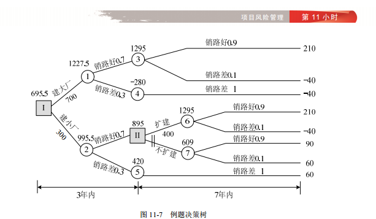
>
> 
>
> 然后从右向左计算各点的期望收益值。点 6： 210× 0.9× 7-40× 0.1 × 7-400=895（万元）
> 点 7： 90× 0.9× 7+60× 0.1× 7=609（万元）
> 点Ⅱ是个决策点，比较点 6 和点 7 的期望值，选择扩建。
> 点 3： 210× 0.9× 7-40× 0.1× 7=1295（万元）；点 4： -40× 1 × 7=-280（万元）
> 点 5： 60× 1 × 7=420（万元）；
> 点 1 ： 1295× 0.7+210× 0.7× 3-280× 0.3)-40× 0.3× 3=1227.5（万元）
> 1227.5-700=527.5（ 万元）
> 点 2： 895× 0.7+90× 0.7× 3+420× 0.3+60× 0.3× 3=995.5（万元）
> 995.5-300=695.5（ 万元）
> 最后，进行决策，因为 695.5＞527.5。 所以，建小厂方案最优。

# 项目采购管理 

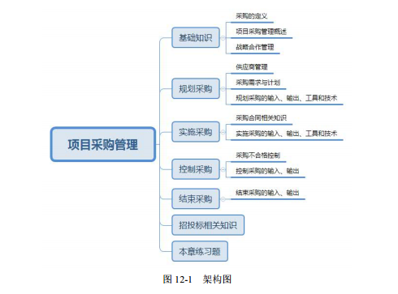

采购：从项目团队外部获得产品、服务或成果的完整的购买过程。

项目采购管理：从执行组织之外获取货物和服务的过程：

- 编制采购计划

  > 9． 采购计划编制完成时， （  ） 也应编制完成。
  > A．合同 B．工作说明书
  > C．招标文件 D．评标标准
  >
  > 解析： 本题考查的是编制采购计划的输出，在采购管理流程中，题目中涉及到的文件产生顺序应为：采购计划和工作说明书（采购计划编制过程的输出）；采购合同（合同编制过程的输出）；招标文件和评标标准（招标过程的输出）。
  > 答案： B

- 实施采购

- 控制采购

- 结束采购

战略合作的管理本质是供应链管理。

> 外包也是一种采购。
>
> 外包需要注意几点：
>
> - 慎重选择合格的外包商
> - 相互同意对方的承诺
> - 需要经常保持交流
> - 根据合同的承诺跟踪承包商实际完成的情况和成果

- 采购审计
  - 是从采购计划编制到合同管理的采购过程中的一种结构性审查。
  - 目标是：找出采购过程中的失败和成功之处，以保证成功的对项目或其他项目的采购合同进行准备和管理
  - 属合同收尾
- 加权系统：采购管理中“供方选择”的工具和技术

## 规划采购 

定价常见有**竞争性报价和谈判**两种

> 下面情况适用竞争性报价：
>
> - 采购量足够大
> - 供应商有能力准确估计生产所需的成本
> - 有足够多的合格竞争者
> - 买方只向技术合格的供应商发出竞标
> - 买方没有优先考虑的供应商

> 下面情况适合谈判：
>
> - 任何竞争性报价的标准都不存在时
> - 当采购要求诸多绩效因素必须达成一致时
> - 当买方要求供应商的早期参与时
> - 当供应商需要很长时间来开发和生产采购方采购的物品时

供应商选择指标体系设置的三大主要因素：

- 供应商的产品价格
- 质量
- 服务

供应商评估方法有三种方法：

- 供应商走访
- 招标法
- 协商法

识别需求是采购过程的起点。信息系统建设的采购需求通常在招标阶段得到初步确定。

采购需求通常包括标的物的配置、性能、数量、服务等，其中**配置、性能**等技术性内容最为关键。

编制采购计划过程的主要成果之一是**采购计划**，具体的采购活动将依据采购计划进行。采购计划描述从形成采购文件到合同收尾的采购过程。

采购工作说明书：对所购买的产品、成果或服务来说，采购工作说明书定义了与合同相关的那部分项目范围。每份采购工作说明书来自于**项目范围基准**。

采购文件：采购文件用来得到潜在卖方的报价建议书。

- 不同情况采购文件有不同的书面名称
  - 信息索取书（RFI）：获得所需产品/服务/供应商的信息
  - 请求方案建议书（RFP）：要求供应商对问题提出最好解决方案的建议
  - 请求**报价**邀请书（RFQ）：要求供应商报价，作为招标底价及比价的参考
  - 投标邀标书（IFB）：为所有供应商报价提供他们最佳方案的平等的机会

> 3． 在组织准备进行采购时，应准备的采购文件中不包括（  ）。
> A．标书 B．建议书
> C．工作说明书 D．评估标准
>
> 解析： 本题考查的是采购文件的内容， 在项目中准备进行采购时，应组织制定的采购文件包括采购管理计划、工作说明书、标书（ RFP） 和评估标准等内容。而建议书是卖方准备的文件，用来说明卖方提供所需产品或服务的能力和意愿。建议书应该与相关的采购文件的要求相一致，并能反映合同中所定义的原则。卖方的建议书应该应买方的要求提供正式合法的报价。某些情况下，卖方可以回应买方的要求对建议书中涉及到的人员、技术等进行口头说明，以便买方进行进一步评估。
> 答案： B

**“自制/外购”分析、市场调研、专家判断、会议是规划采购常用的方法和技术。**

> 采购工作说明书与项目范围说明书的区别：
>
> - 采购工作说明书是对项目所要提供的产品或服务的叙述性描述
> - 项目范围说明书则通过明确项目应该完成的工作而确定了项目的范围

## 实施采购 

（采购计划记录了买什么、不买什么、什么时间买等信息，为了整个采购过程做了安排，提供了指南）

## 控制采购 

合同管理的关键是管理买方和卖方间的接口，以及多个卖方间的接口。

**采购合同管理：在采购合同签订后5个工作日内**，将采购合同原件及相应附件进行归档。归档时，需标明采购合同名称、归档采购合同所在的项目编号。

## 结束采购 

**项目收尾或阶段收尾**过程的一部分，把合同和相关文件归档以备将来参考。

合同、合同收尾程序、项目管理计划、采购文件构成了结束采购的内容。

结束采购的输出包括：**合同收尾和组织过程资产更新**。

**审计**作为结束采购的方法和技术。

# 项目合同管理 

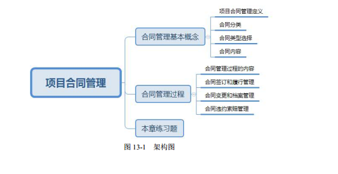

合同是工程建设项目的基本依据，也是监理工作的主要依据。

广义合同：指以确定各种权利和义务为内容的协议，即只要是当事人之间达成的确定权利义务的协议均为合同。

狭义合同：专指民法上的合同，是当事人之间确定、变更、终止民事权利义务关系意思表示一致的法律行为。

合同分类：

- 按项目范围划分：

  - 总承包合同

  - 项目单项承包合同

  - 项目分包合同

    > 4．某项目在招标时被分成若干个项目包，分别发包给不同的承包人。承包人中标后应与招标
    > 人签订的合同属于（ ）。
    > A．单项项目承包合同  B．分包合同
    > C．单价合同  D．成本激励合同
    >
    > 解析：本题考查的是合同的分类，就是定义题。可以按照项目范围划分，可以按照付款方
    > 式划分。
    > 答案：A

- 按项目付款方式划分：

  - 总价合同（固定价格合同）

  - 成本补偿类合同（业主方的成本风险最大）

  - 单价合同（工时和材料合同）

    > 1．在项目中经常会利用外包的手段，以提高项目的盈利能力，对于工作规模或产品规定不是
    > 特别清楚的项目，外包时一般应采用（ ）
    > A．成本补偿合同  B．采购单形式的合同
    > C．工时材料合同  D．固定总价合同
    >
    > 解析：本题考查的是合同的类型，时间和材料合同是包含成本补偿合同和固定总价合同的混合
    > 类型。当不能迅速确定准确的工作量时，时间和材料合同适用于动态增加人员、专家或其他外部支
    > 持人员等情况。由于合同具有可扩展性，买方成本可能增加，这些类型的合同类似于成本补偿合同。
    > 合同的总额和合同应交付产品的确切数量在买方签订合同时还不能确定。因而，如果是成本补偿合
    > 同，时间和材料合同的合同额可以随着时间和材料而增加。许多组织要求在所有时间和材料合同中
    > 注明不能超出预期合同额和期限限制，防止无限度的成本增加。
    > 相反，若某些参数在合同中明确后，时间和材料合同类似于固定总价合同。当双方在具体资源
    > 价格上达成一致时，劳动力单位时间的价格或材料价格可以由买方和卖方预先确定，例如高级工程
    > 帅每小时多少工资，或者每个计量单位材料的价格。
    > 答案：C

>  合同内容：
>
> - 项目的质量要求
> - 技术情报和资料的保密
> - 技术成果的归属
> - 验收的标准和方法
> - 技术支持服务

## 合同管理

- 合同签订管理
- 合同履行管理
- 合同变更管理
- 合同档案管理
- 合同违约索赔管理
  - 索赔分类：
    - 按索赔的目的分类：工期索赔和费用索赔
    - 按索赔业务性质分类：工程索赔和商务索赔
    - 按索赔处理方式分类：单项索赔和总索赔
  - 项目发生索赔事件后，一般先由监理工程师调解，若调解不成，由政府建设主管机构进行调解，若扔调解不成，由经济合同仲裁委员会调解或仲裁。
  - 索赔具体流程如下
    - 提出索赔要求（28天内以书面的索赔通知书形式，向监理工程师正式提出索赔意向通知）
    - 报送索赔资料
    - 监理工程师答复
    - 监理工程师逾期答复后果
    - 持续索赔
    - 仲裁与诉讼
  - 对违约责任的承担方式：
    - 继续履行
    - 采取补救措施
    - 支付违约金或者定金

>9．某软件开发企业在平面媒体上刊登了其开发的财务软件销售商业广告，简要介绍了产品的
>功能。按照合同法规定，该商业广告属于（ ）。
>A．要约  B．承诺  C．要约邀请  D．承诺邀请
>
>解析：本题考查相关名词概念。商业广告一般为要约邀请，在其内容符合要约规定的情况下，
>视为要约。
>商业广告原则上属于要约邀请，是因为一般情况下它不含有可能订立的合同的全部必要条款，
>收到广告者也就无法进行承诺；另外，收到广告者人数众多，若都能据此承诺，并要求收到广告者
>受同样的履行约束，则有可能出现广告发出者难以履行情况的现象。
>答案：C
>
>
>
>10．某承诺文件超过要约规定时间到达要约人。依据邮寄文件收函邮局戳记标明的时间，受要
>约人是在要求的时间内投邮，由于邮局错递而错过了规定时间。对此情况，该承诺文件（ ）。
>A．因迟到而自然无效
>B．必须经要约人发出接受通知后才有效
>C．必须经要约人发出拒绝通知后才无效
>D．因非受要约人的原因迟到，要约人必须接受该承诺
>
>解析：本题考查合同法相关内容，《中华人民共和国合同法》第二十六条规定：承诺通知到达
>要约人时生效。承诺不需要通知的，根据交易习惯或者要约的要求作出承诺的行为时生效。虽然是
>由于邮局错递而延误了到达时间，但是毕竟过了邀约规定的时间，有可能造成要约人接受了别人的
>承诺，所以这个时候由要约人来决定是否接受是恰当的。
>答案：C

- 要约：提出合同条件，希望对方当事人接受
- 要约邀请：希望他人向自己发出要约的意思

# 项目文档管理与配置管理

## 项目文档管理 

**软件文档分类：**

- 开发文档：描述开发过程本身
  - 可行性研究和项目任务书
  - 需求规格说明书
  - 功能规格说明
  - 设计规格说明（包括程序和数据规格说明）
  - 开发计划
  - 软件集成
  - 测试计划
  - 质量保证计划
  - 安全和测试信息
- 产品文档：描述开发过程的产物
  - 培训手册
  - 参考手册
  - 用户指南
  - 软件支持手册
  - 产品手册
  - 信息广告
- 管理文档：记录项目管理的信息
  - 变更记录
  - 职责定义
  - 判断记录

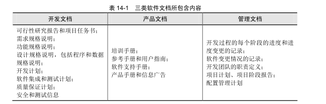

从重要性和质量要求方面可分为：

- 非正式文档
- 正式文档

> 文档质量可按文档的形式和列出的要求划分为四级：（数字越小，级别越低：一个二内三多四正）
>
> 1级：适合开发工作量低于一个人的开发者自用程序
>
> 2级：程序清单内足够的注释以帮助用户安装和使用程序
>
> 3级：同单位若干人联合开发的程序，或可被其他单位使用的程序
>
> 4级：要正式发行供普遍使用的软件产品

## 配置管理 

配置管理是为了系统地控制配置变更，在系统的整个生命周期中维持配置的完整性和可跟踪性，而标识系统在不同时间点上配置的学科。

配置管理包括6个主要活动：

- 制定配置管理计划
- 配置标识
- 配置控制
- 配置状态报告
- 配置审计
  - 功能配置审核
  - 物理配置审核  
- 发布管理和交付

**配置管理的三种基线**

- 功能
- 分配
- 产品

**配置项分类：**

- 基线配置项：可能包括所有的设计文档和源程序
- 非基线配置项：可能包括项目的各类计划和报告

>4．在项目配置项中有基线配置项和非基线配置项，（ ）一般属于非基线配置项。
>A．详细设计  B．概要设计  C．进度计划  D．源代码
>
>解析：本题考查的是基线配置项和非基线配置项的内容。配置项分为基线配置项和非基线配置
>项两类，基线配置项可能包括所有的设计文档和源程序等；非基线配置项可能包括项目的各类计划
>和报告等。
>答案：C

所有配置项的操作权限应**由CMO严格管理**，基本原则是：**基线配置项**向**开发人员**开放读取权限；**非基线配置项**向**PM、CCB及相关人员开放**。

**配置项的状态可分为：**

- 草稿：0.YZ

- 正式：X.Y
- 修改：X.YZ

配置项版本控制流程：

- 创建配置项
- 修改处于“草稿”状态的配置项
- 技术评审或领导审批
- 正式发布
- 变更

配置基线（简称为基线、里程碑）：由一组配置项组成，这些配置项构成一个相对稳定的逻辑实体。（配置管理委员会审查、批准的范围或工作产品）

创建基线或发行基线的主要步骤：

- 配置管理员识别配置项
- 为配置项分配标识
- 为项目创建配置库，并给每个项目成员分配权限
- 各项目团队成员根据自己的权限操作配置库
- 创建基线或发行基线，并获得CCB的授权
- 形成文件
- 使基线可用

> 8．创建基线是项目配置管理的一项重要内容，创建基线或发行基线的主要步骤是（ ）。
> A．获取 CCB 的授权、创建构造基线或发行基线、形成文件、使基线可用
> B．形成文件、获取 CCB 的授权、创建构造基线或发现基线、使基线可用
> C．使基线可用、获取 CCB 的授权、形成文件、创建构造基线或发行基线
> D．获取 CCB 的授权、创建构造基线或发行基线、使基线可用、形成文件
>
> 解析：本题考查创建、发行基线的步骤，创建基线或发行基线的主要步骤如下：①配置管理员
> 识别配置项；②为配置项分配标识；③为项目创建配置库，并给每个项目成员分配权限；④各项目
> 团队成员根据自己的权限操作配置库；⑤创建基线或发行基线，并获得变更管理委员会（CCB）的
> 授权；⑥形成文件；⑦使基线可用等。
> 答案：A

发行基线：交付给外部顾客的基线

构造基线：内部开发使用的基线

**配置库：**

- 开发库（动态库、程序员库、工作库）（可任意修改）

- 受控库（主库）（可修改，需要走变更流程）：用于管理当前基线和控制对基线的变更

- 产品库（静态库、发行库、软件仓库）

  （信息系统项目完成后，最终产品或项目成果应置于**产品库**内，当需要在此基础上进行后续
  开发时，应将其转移到**受控库**后进行）
  
  （在开发的信息系统产品完成系统测试之后，作为最终产品存入产品库内，等待交付）

配置库的建库模式有两种：按配置项类型建库；按任务建库

>  全部测试工具、被测软件、测试支持软件和评审结果都纳入配置管理

# 高级项目管理知识 

## 大型、复杂项目管理 

大型、复杂项目管理都属于**组织级**的项目管理，特征：

- 分级管理与分工管理
  - 项目经理一般采用间接管理方式
- 强化协调机制
  - 有效协调机制是整个项目成败的关键
- 规模巨大、投资巨大、建设时间长
  - 大型复杂项目与一般项目只有在管理范围上有不同

## 组织级项目管理、项目集管理、项目组合管理、项目成熟度模型

- 多项目管理以**组织战略目标**为导向，保证整个组织在大方向上的一致性

### 组织级项目管理

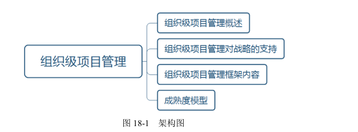

组织级项目管理框架由三部分内容组成：

- 最佳实践
- 能力
- 成果（关键绩效指标KPI）

### 项目集管理

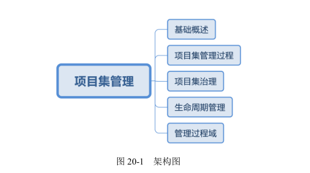

**具有协调收益交付的管理特点是项目集的核心构要素** 

**项目集指导委员会**是项目集的决策机构，负责为项目集的管理方式提供支持，通常由**决策层干系人**组成

项目集管理重点关注的是：**项目间的依赖关系** 

项目集管理过程：

- 评估项目集与组织战略一致性
- 制定项目集远景和计划
- 规划项目集路线

项目集生命周期：

- 项目集定义
- 项目集收益交付
- 项目集结尾

### 项目成熟度模型 

- CMM
- OPM3
  - 成熟度的四个梯级：
    - 标准化的
    - 可测量的
    - 可控制的
    - 持续改进
  - 第二维：
    - 项目管理的9大领域和5个基本阶段
  - 组织项目管理的三个版图是：
    - 单个项目管理
    - 项目组合管理
    - 项目投资组合管理
- K-PMMM
  - 具体梯级
    - 通用术语
    - 通用过程
    - 单一方法
    - 基准比较
    - 持续改进

## 知识管理 

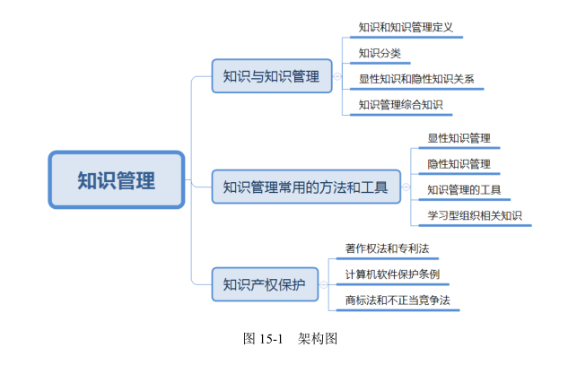

知识分类：

- 显性知识：凡是能以文字与数字来表达，而且以资料、科学法则、特定规格及手册等形式展现的皆属显性知识
- 隐形知识：个人技能的基础，如经验、风俗、组织文化

> 2．现代企业信息系统的一个明显特点是，企业从依靠信息进行管理向（ ）转化。
> A．知识管理  B．管理信息  C．管理数据  D．决策管理
>
> 解析：本题考查现代企业信息系统的特点，知识管理的定义为，在组织中建构一个量化与质化
> 的知识系统，让组织中的资讯与知识，透过获得、创造、分享、整合、记录、存取、更新、创新等
> 过程，不断地回馈到知识系统内，形成永不间断的累积个人与组织的知识，成为组织智慧的循环，
> 在企业组织中成为管理与应用的智慧资本，有助于企业作出正确的决策，以适应市场的变迁。21
> 世纪企业的成功越来越依赖于其所拥有知识的质量，企业从依靠信息进行管理向知识管理转化。
> 答案：A
>
> 3．下列措施中不利于企业构建知识管理制度平台的是（ ）。
> A．建立知识库
> B．要求员工按组织规定参与知识管理
> C．用经济利益手段驱动员工参与知识管理
> D．建立金字塔型组织结构
>
> 解析：本题考查的是知识管理基础知识，可以从三个方面加强员工的交流机会：公司物理环境
> 的改造；组织结构扁平化；设立虚拟网络社区。
> 答案：D

- 重点
  - 计划
  - 组织
  - 人事
  - 指挥和控制
- 知识管理系统包括：
  - 概念系统
  - 实体系统

### 知识产权保护

知识产权具有专有性、地域性、时间性

- 地域性：按照一国法律获得承认和保护的知识产权，只能在该国发生法律效力，而不具有域外效力

- 著作权法：

  ​	**软件著作权保护期50年。** 

  ​		-  著作权属个人，期限死后50年

  ​		- 著作权属单位，期限50年

  - 著作权法有客体和主体之分。

    客体：指受保护的作品，包括文学、艺术、自然科学、社会科学和工程技术领域内具有独创性并能以某种有形形式复制的智力成果。

    主体：指著作权关系人，通常包括著作权人和受让者两种

  - 为完成单位工作任务所创作的作品，称为职务作品。在两年内，未经单位同意，作者不能许可其他个人或单位使用该作品

  - 如果在创作订单过程中有多人参与，则该作品的著作权由合作的作者共同享有。合作的作品是可以分割使用的，作者对各自创作的部分可以单独享有著作权，但不能再侵犯合作作品整体著作权的情况下行使。

  - 著作权人对作品享有**发表权、署名权、修改权、保护作品完整权、使用权**

  - 如果作品是委托创作的话，著作权的归属应通过委托人和受托人之间的合同来确定。如果没有明确约定，或没有签订相关合同，则著作权仍属于受托人（作者本人）

  

- 专利法：

  - 专利法的客体是**发明创造**， 这里的发明创造是指**发明、实用新型、外观设计**

  - 授予专利权的发明和使用新型应当具备**新颖性、创造性、实用性**三个条件。

  - 同样的发明申请专利，则**按照申请时间的先后**决定授予给谁

  - **发明专利权保护期限为20年，实用新型和外观设计专利权的期限为10年，均从申请日开始计算。** 

    （此处的申请日：指向国务院专利行政主管部门提出专利申请之日）

  - 专利权权力：独占实施权、转让权、实施许可权

- 商标法
  - **注册商标的有限期限为10年**，自核准注册之日起计算。注册商标有效期满，需要继续使用的，应当在期满前**6个月内**申请续展注册；在此期间未能提出申请的，可以给予**6个月的宽展期**。宽展期满仍未提出申请的，注销其注册商标。**每次续展注册的有效期为10年**。
  - 商标权内容
    - 使用权
    - 禁止权
    - 许可权
    - 转让权
- 合同法
  - 合同形式
    - 书面形式
    - 口头形式
    - 其它形式
  - 合同内容
    - 当事人名称、姓名、住所
    - 标的、数量、质量
    - 价款或报酬
    - 履行期限
    - 地点方式
    - 违约责任
    - 解决争议的方法

  > 履行支付的时候，合同中就成交地方没有明确的，应该在接收货币方进行
  >
  > 履行费用的负担不明确的，由履行义务方负担
  >
  > 价款或报酬不明确的，按照订立合同时履行地的市场价格履行
  >
  > 履行方式不明确时，按照有利于合同目的的方式履行

## 项目变更管理 

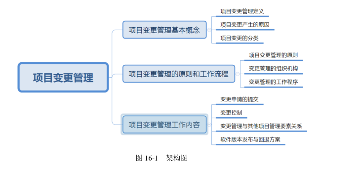

- 变更管理的组织机构

  - 项目控制委员会或配置控制委员会或变更控制委员会（CCB）：是项目的所有者权益的代表，负责裁定接受哪些变更

  - CCB由项目所涉及的多方人员共同组成，通常包括用户和实施方的决策人员

  - **CCB是决策机构，不是作业机构** （通常CCB的工作是通过评审手段来决定项目基准是否能变更，但不提出变更方案）

    > 4．某大型项目的变更策略规定：把变更分为重大、紧急、一般和标准变更，并规定了不同级
    > 别的审批权限，比如重大变更由 CCB 审批，并规定标准变更属于预授权变更，可不用再走审批流
    > 程。此项目变更策略（ ）。
    > A．可行
    > B．不可行，主要是变更不能分级别，应统一管理
    > C．不可行，分四级可以，但审批都应由 CCB 批准
    > D．不可行，标准变更规定有问题
    >
    > 解析：本题考查的是变更的流程，变更必须由 CCB 批准。
    > 答案：C

  - 项目经理在变更中的作用是响应变更提出者的需求，评估变更对项目的影响及应对方案，将需求由技术要求转化为资源需求，供授权人决策，并据评审记过实施，即调整基准，确保项目基准反映项目实施情况

    > 6．项目经理在综合变更中主要负责（ ）。
    > A．评估变更对项目的影响  B．评估变更的应对方案
    > C．将变更由技术要求转换为资源要求  D．批准可否使用储备资源
    > ​
    > 解析：本题考查的是变更基础知识，项目经理在变更中的作用是：响应变更提出者的要求，评
    > 估变更对项目的影响及应对方案，将需求由技术要求转化为资源需求，供授权人决策；并据评审结
    > 果实施，即调整项目基准，确保项目基准反映项目实施情况。
    > 答案：A

  - 变更管理步骤：

    - 提出与接受变更申请
    - 对变更的初审
    - 变更方案论证
    - 项目管理委员会审查
    - 发出变更通知并组织实施
    - 变更实施的监控
    - 变更效果的评估
    - 判断发生变更后的项目是否已纳入正常轨道

    > 8．变更管理首要完成的任务是（ ）。
    > A．分析变更的必要性和合理性，确定是否实施变更
    > B．记录变更信息，填写变更控制单
    > C．作出变更，并交上级审批
    > D．修改相应的软件配置项（基线），确立新的版本
    >
    > 解析：本题考查的是变更管理的任务，变更管理的主要任务包括：分析变更的必要性和合理性，
    > 确定是否实施变更；记录变更信息，填写变更控制单；作出更改，并交上级审批；修改相应的软件
    > 配置项（基线），确立新的版本；评审后发布新版本。
    > 答案：A

- 变更控制

  - 变更控制内容：

    - 进度变更控制
    - 成本变更控制
    - 合同变更控制

    > 10．一般来说，变更控制流程的作用不包括（ ）。
    > A．列出要求变更的手续  B．记录要求变更的事项
    > C．描述管理层对变更的影响  D．确定要批准还是否决变更请求
    >
    > 解析：本题考查的是变更控制流程作用，包括：指出怎样提交变更的手续、记录变更的状况、
    > 列出管理层对变更的影响、记录变更的批准情况、说明能够批准变更的权限级别。变更控制流程的
    > 作用不包括“确定要批准还是否决变更请求”，这是变更控制委员会（CCB）的责任。
    > 答案：D

- 需求变更

  当不得不作出变更时，应该**按从高级到低级**的顺序对被影响的需求文档进行处理

- 根据变更的迫切性，变更分为：

  - 紧急变更
  - 非紧急变更

- 变更管理过程设计的角色主要包括：

  - 项目经理
  - 团队成员
  - 监理工程师
  - CCB
  - 建设方

## 战略管理 

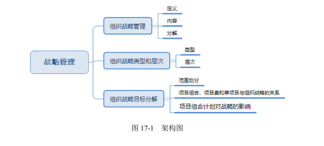

战略目标：是依据和出发点

战略方针：是指导组织的纲领和制定组织战略计划的依据

组织战略是一个自上而下的动态管理过程。

自上而下指战略目标达成后，从高层向中下层传达，逐层分解和落实

战略管理的三个阶段：

- 战略制定
  - 战略梳理
    - 战略层次
      - 企业
      - 业务
      - 职能
    - 综合战略
      - 加强
      - 防御
      - 扩张
    - 竞争战略
      - 差异化
      - 领先
      - 目标集中
- 战略执行
- 战略评估

## 流程管理 

企业业务流程的整体目标是：**为顾客创造价值，以员工为中心，以及以效率和效益为中心是业务流程的核心** 

业务流程的管理不是在流程规划出来之后才进行的，而是在流程规划之前就要进行管理。

#### 价值链分析 

企业价值活动课分为5种主要活动和4种辅助活动

（投产出销服，采技人基）

- 投入性、生产、产出性、销售、服务
- 采购、技术开发、人力资源、基础实施

#### 供应链分析

#### 客户关系分析 

#### 基于企业资源计划的划分

企业流程管理的层次：

- 生成流程层
- 运作层
- 计划层
- 战略层

基于业务流程重构的信息系统规划的主要步骤是：

- 系统战略规划阶段
- 系统流程规划阶段
- 系统数据规划阶段
- 系统功能规划阶段
- 系统实施规划阶段

#### BAM法 

（业务活动图示）

主要功能：-

- 工作活动
- 业务流程

#### 管理咨询

- 综合性咨询服务
- 专项咨询服务

#### 业务流程建模

- DEMO5种模型
  - 接口模型
  - 业务流程模型
  - 行为模型
  - 信息模型
  - 事实模型
- petri 特性
  - 依赖于初始状态
  - 独立于初始状态
- IDEF1X
  - IDEF0：功能建模
  - IDEF1：信息建模
  - IDEF1X：数据建模
  - IDEF4：面向对象设计

#### 业务流程再造 

- 是对企业的业务流程进行根本性的再思考和彻底性的再设计，从而获得诸如成本、质量、服务和速度等方面的业绩来衡量显著性的成就。
- 强调的四个核心内容：
  - 根本性
  - 彻底性
  - 显著性
  - 流程

遵循的原则：以流程为中心的原则、团队管理原则、以客户为导向的原则

## 项目监理 

- 3个主要监理文档
  - 监理大纲
    - 总监理工程师主持编写，经技术负责人审核，由单位法人代表批准
  - 监理规划
    - 总监理工程师主持编写，经监理单位技术负责人审批批准，由建设单位批准
  - 监理实施细则
    - 总监理工程师主持下，由监理工程师分别编写，经总监理工程师批准

### CIO （首席信息官）

- 职责
  - 战略层面
  - 执行层面
  - 变革层面
  - 沟通层面

### PMO （项目管理办公室）

## 项目绩效考核与绩效管理 

- 整体绩效评估方法分类
  - 定性
    - 同行评议法
    - 回溯分析法
    - 德尔菲法
  - 定量
    - 投资回收期
    - 内部收益率法
    - 现值法
  - 定性定量相结合
    - 功效系数法
    - 平衡记分法

# 项目收尾管理 

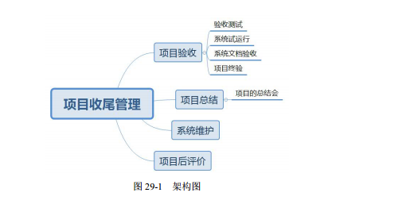

## 项目验收工作 

**项目验收是项目收尾管理中的首要环节**，只有完成项目验收工作，才能进入后续的项目总结、系统维护及项目后评价工作。

**项目验收工作需要完成正式的验收报告**，对于系统集成项目，一般需要执行正式的验收测试工作。

验收工作的四个方面：

- 验收测试

- 系统试运行

- 系统文档验收

  在最终交付系统前，所有的文档都应验收合格并经双方签字认可

  **系统集成项目包含的文档有：**（6）

  - 系统集成项目介绍
  - 系统集成项目最终报告
  - 信息系统说明手册
  - 维护手册
  - 软硬件产品说明书
  - 质量保证书

- 项目终验

## 项目总结工作 

项目总结属于项目收尾的管理收尾（行政管理）。

意义：

- 了解项目全过程的工作情况及相关的团队或成员的绩效状况
- 了解出现问题并进行改进措施总结
- 了解项目全过程中出现的值得吸取的经验并进行总结

项目总结会需要**全体项目成员共同参与**，并由全体讨论形成文件，文件要经过所有人确认。

**项目总结讨论的内容：**（7）

- 项目绩效
- 技术绩效
- 成本绩效
- 进度计划绩效
- 项目沟通
- 识别问题和解决问题
- 意见和建议

## 系统维护工作 

## 项目后评价工作 

**主要内容：**（4）

- 目标评价
- 过程评价
- 效益评价
- 可持续性评价

# 案例题预测

2018年上半年试题：质量管理、计算：成本、人力资源+沟通

（先做其它问答题，再做计算题）

预测：

- 计算：成本/成本+时间/时间
- 变更
- 整体

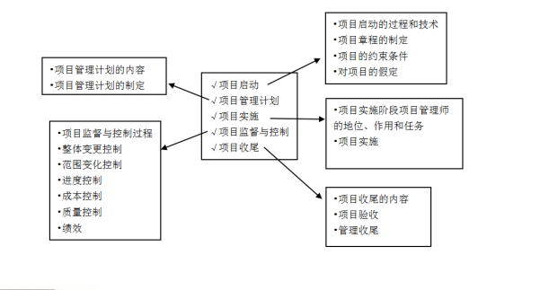

# 论文预测 

进度管理

风险管理 

沟通管理

范围管理

- 摘要（300字）
- 背景（2段，500字+150字过渡段）
  - 项目背景、名称、投资规模、周期、参与方、建设内容、特点、我的角色、团队
  - （为何要做这个项目，解决什么问题）
- 正文论点（3个论点，1300字）
  - 控制类论文
    - 编制XX管理计划
      - 计划的理论（100字）
      - 计划的实践（200字）-->要有具体的计划
    - XX计划的监控
      - 计划的理论（100字）
      - 计划实践（1000字）
        - 写问题：描述问题、分析问题（分析问题时，要结合前文的计划分析）
        - 解决问题
  - 过程类论文
    - 按照“XX管理的过程”顺序写，但一定要注意突出实践
- 收尾（300字）
  - 本研究结果说明了什么问题，得出了什么规律性的东西，解决了什么理论或实际问题

